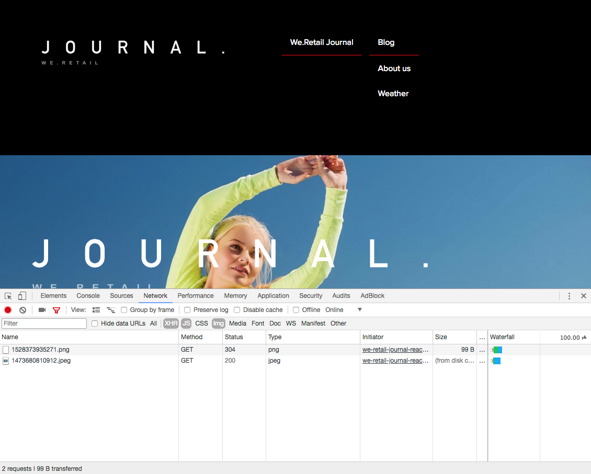

# SPA の概要およびガイド{#spa-introduction-and-walkthrough}

単一ページアプリケーション（SPA）により、Web サイトのユーザーに魅力的なエクスペリエンスを提供することができます。開発者は SPA フレームワークを使用してサイトを構築したいと考え、作成者はそうして構築されたサイトのコンテンツを AEM 内でシームレスに編集したいと考えています。

SPA エディターには、AEM 内で SPA をサポートするための包括的なソリューションが用意されています。この記事では、基本的な SPA アプリケーションを使用したオーサリングの手順を説明し、基礎となる AEM SPA エディターとの関連を示します。

>[!NOTE]
>
>シングルページアプリケーション(SPA)エディタ機能には、AEM 6.4 service pack 2以降が必要です。
>
>SPAフレームワークベースのクライアント側レンダリング（ReactやAngularなど）を必要とするプロジェクトには、SPA Editorが推奨されるソリューションです。

## 概要 {#introduction}

### 記事の目的 {#article-objective}

この記事では、SPA エディターのガイドに進む前に、簡単な SPA アプリケーションを使用して基本的なコンテンツ編集のデモをおこなうことで、SPA の基本的な概念について説明します。次に、ページの構築、SPA アプリケーションと AEM SPA エディターとの関連とやり取りの仕組みについて説明します。

この概要とガイドの目標は、SPA が注目される理由、その一般的な動作、AEM エディターでの SPA の処理方法、標準の AEM アプリケーションとの違いを AEM 開発者に示すことです。

チュートリアルは、標準的なAEM機能とサンプルのWeb.Retailジャーナルアプリに基づいています。 以下の要件を満たす必要があります。

* [AEMバージョン6.4（Service Pack 2以降）](/help/release-notes/sp-release-notes.md)
* [GitHubにあるサンプルのWe.Retailジャーナルアプリをここにインストールします。](https://github.com/Adobe-Marketing-Cloud/aem-sample-we-retail-journal)

>[!CAUTION]
>
>このドキュメントでは、[We.Retailジャーナルアプリ](https://github.com/Adobe-Marketing-Cloud/aem-sample-we-retail-journal)は、デモ目的でのみ使用します。 どのプロジェクト作業にも使用しないでください。
>
>AEM プロジェクトでは、 [AEM プロジェクトアーキタイプ](https://docs.adobe.com/content/help/ja-JP/experience-manager-core-components/using/developing/archetype/overview.html)を活用します。このアーキタイプは、React または Angular を使用する SPA プロジェクトをサポートし、SPA SDK を活用します。

### SPA について {#what-is-a-spa}

単一ページアプリケーション（SPA）は、クライアントサイドでレンダリングされ、主に JavaScript 主導であり、Ajax 呼び出しに依存してデータを読み込み、ページを動的に更新する点で、従来のページとは異なります。ほぼすべてのコンテンツは、1 回のページ読み込みで 1 回取得され、ユーザーによるページとのやり取りに基づいて、必要に応じて追加のリソースが非同期に読み込まれます。

これにより、ページを更新する必要が減り、シームレスで高速な、ネイティブアプリのエクスペリエンスに近いものををユーザーに提供できます。

AEM SPA エディターを使用すると、フロントエンド開発者は AEM のサイトに統合できる SPA を作成でき、コンテンツ作成者は SPA コンテンツを他の AEM コンテンツと同様に簡単に編集できます。

### SPA が注目される理由 {#why-a-spa}

より速く、流動的で、よりネイティブアプリケーションに近い SPA は、Web ページの訪問者だけでなく、SPA の仕組みの性質上、マーケターや開発者にとっても非常に魅力的なエクスペリエンスとなります。


**訪問者数**

* 訪問者は、コンテンツとのやり取りでネイティブなエクスペリエンスを求めています。
* ページが速くなればなるほど、コンバージョンが発生する可能性が高いという明確なデータがあります。

**マーケター**

* マーケターは、リッチでネイティブに近いエクスペリエンスをオファーして、訪問者のコンテンツに対する十分なエンゲージを獲得したいと考えています。
* パーソナライゼーションは、これらのエクスペリエンスをさらに魅力的にします。

**開発者向け**

* 開発者は、コンテンツとプレゼンテーションの間の懸念事項を明確に分けておきたいと考えています。
* 明確に分離することにより、システムの拡張性が向上し、フロントエンドの独立開発も可能になります。

### SPA の仕組み {#how-does-a-spa-work}

SPAの主な概念は、SPAがネイティブアプリケーションの応答性に近づくように、サーバー呼び出しに伴う遅延を最小限に抑えるために、サーバーの呼び出しと依存関係が低下するということです。

従来のシーケンシャルな Web ページでは、そのページに必要なデータのみが読み込まれます。つまり、訪問者が別のページに移動すると、サーバーが追加のリソースを呼び出します。訪問者がページ上の要素とやり取りする際に、追加の呼び出しが必要になる場合があります。 これらの複数の呼び出しでは、ページが訪問者のリクエストに追いつく必要があるので、遅いという感覚を与える可能性があります。


より流動的なエクスペリエンスを実現するために、SPAは、モバイルやネイティブのアプリから訪問者が期待する動作に近いものとして、最初の読み込み時に訪問者に必要なすべてのデータを読み込みます。 最初は少し時間がかかる場合がありますが、その後はサーバーコールを追加する必要はありません。

クライアント側でレンダリングすると、ページ要素の反応が速くなり、訪問者によるページとのやり取りが即時に行われます。 ページの速度を最大化するために、必要になる可能性のある追加データはすべて非同期に呼び出されます。

>[!NOTE]
>
>AEMでのSPAの動作方法に関する技術的な詳細については、AEM](/help/sites-developing/spa-getting-started-react.md)の「SPA使用の手引き」を参照してください。[
>
>SPAエディタのデザイン、アーキテクチャ、および技術的なワークフローについて詳しくは、「[SPAエディタの概要](/help/sites-developing/spa-overview.md)」を参照してください。

## SPA でのコンテンツ編集エクスペリエンス {#content-editing-experience-with-spa}

AEM SPA Editorを利用するSPAが構築されている場合、コンテンツの編集と作成の際に、コンテンツ作成者は何の違いも認識しません。 共通の AEM 機能を利用でき、作成者のワークフローに変更を加える必要はありません。

>[!NOTE]
>
>チュートリアルは、標準的なAEM機能とサンプルのWeb.Retailジャーナルアプリに基づいています。 以下の要件を満たす必要があります。
>
>* [AEMバージョン6.4(Service Pack 2)](/help/release-notes/sp-release-notes.md)
>* [GitHubにあるサンプルのWe.Retailジャーナルアプリをここにインストールします。](https://github.com/Adobe-Marketing-Cloud/aem-sample-we-retail-journal)

>


1. AEMでWe.Retailジャーナルアプリを編集します。

   `http://localhost:4502/editor.html/content/we-retail-journal/react.html`

   

1. 見出しコンポーネントを選択すると、ツールバーが他のコンポーネントと同様に表示されます。 「**[!UICONTROL 編集]**」を選択します。

   

1. AEM 内でコンテンツを通常どおりに編集します。変更内容が保持されることに注意してください。

   

   >[!NOTE]
   >インプレーステキストエディタとSPAの詳細については、[SPAエディタの概要](spa-overview.md#requirements-limitations)を参照してください。

1. アセットブラウザーを使用して、新しい画像を画像コンポーネントにドラッグ＆ドロップします。

   

1. 変更が保持されます。

   

追加のコンポーネントをページにドラッグ＆ドロップしたり、コンポーネントを並べ替えたり、レイアウトを変更したりするなどのオーサリングツールは、SPA 以外のどの アプリケーションでもサポートされます。

>[!NOTE]
>
>SPA エディターは、アプリケーションの DOM を変更しません。SPA 自体が DOM を管理します。
>
>この機能を確認するには、この記事の次の節、[SPA アプリと AEM SPA エディター](/help/sites-developing/spa-walkthrough.md#spa-apps-and-the-aem-spa-editor)に進みます。

## SPA アプリと AEM SPA エディター {#spa-apps-and-the-aem-spa-editor}

エンドユーザーがSPAを動作させ、SPAページを検査すると、SAPアプリがAEMのSPA Editorと連携する方法をより深く理解できます。

### SPA アプリケーションの使用 {#using-an-spa-application}

1. Web.Retailジャーナルアプリをパブリッシュサーバーで読み込むか、ページエディターの&#x200B;**ページ情報**&#x200B;メニューから&#x200B;**[!UICONTROL 表示を発行済み]**&#x200B;として読み込みます。

   `/content/we-retail-journal/react.html`

   

   子ページへのナビゲーション、天気予報ウィジェット、記事など、ページ構造に注意してください。

1. メニューを使用して子ページに移動し、ページが読み込まれるのを確認します。更新は必要ありません。

   

1. ブラウザーに組み込まれている開発者ツールを開き、子ページを移動しながらネットワークアクティビティを監視します。

   

   アプリ内でページ間を移動する際のトラフィック量は非常に少なくなります。ページのリロードはおこなわれず、新しい画像のみが要求されます。

   SPA はコンテンツとルーティングを完全にクライアントサイドで管理します。

子ページをナビゲートする際にページがリロードされないとすると、どのように読み込まれるのでしょうか。

次のセクション[SPAアプリケーションの読み込み](/help/sites-developing/spa-walkthrough.md#loading-an-spa-application)では、SPAの読み込みの仕組みと、コンテンツの同期および非同期での読み込み方法を詳しく調べます。

### SPA アプリケーションの読み込み {#loading-an-spa-application}

1. 読み込みがまだの場合は、Web.Retai ジャーナルアプリケーションを公開サーバーに読み込むか、ページエディターの&#x200B;**[!UICONTROL ページ情報]**&#x200B;メニューから「**公開済みとして表示**」オプションを使用して読み込みます。

   `/content/we-retail-journal/react.html`

   

1. ブラウザーの組み込みツールを使用して、ページのソースを表示します。
1. ソースのコンテンツは非常に限られていることに注意してください。

   ```
   <!DOCTYPE HTML>
   <html lang="en-CH">
       <head>
       <meta charset="UTF-8">
       <title>We.Retail Journal</title>
   
       <meta name="template" content="we-retail-react-template"/>
   
   <link rel="stylesheet" href="/etc.clientlibs/we-retail-journal/react/clientlibs/we-retail-journal-react.css" type="text/css">
   
   <link rel="stylesheet" href="/libs/wcm/foundation/components/page/responsive.css" type="text/css">
   
   </head>
       <body class="page basicpage">
   
   <div id="page"></div>
   
   <script type="text/javascript" src="/etc.clientlibs/we-retail-journal/react/clientlibs/we-retail-journal-react.js"></script>
   
       </body>
   </html>
   ```

   ページの本文にはコンテンツが含まれていません。主にスタイルシートとReactスクリプト`we-retail-journal-react.js`の呼び出しで構成されます。

   このReactスクリプトは、このアプリケーションの主なドライバーであり、すべてのコンテンツのレンダリングを担当します。

1. ブラウザーに組み込まれているツールを使用して、ページを調べます。完全に読み込まれた DOM のコンテンツを表示します。

   

1. インスペクターの「ネットワーク」タブに切り替えて、ページを再読み込みします。

   イメージリクエストを無視した場合、ページに対して読み込まれるプライマリリソースは、ページ、CSS、React Javascript、その依存関係、およびページの JSON データです。

   

1. `react.model.json` を新しいタブに読み込みます。

   `/content/we-retail-journal/react.model.json`

   

   AEM SPA エディターは、[AEM コンテンツサービス](/help/assets/content-fragments.md)を利用して、ページのコンテンツ全体を JSON モデルとして配信します。

   特定のインターフェイスを実装することで、Sling Model は SPA に必要な情報を提供します。JSON データの配信は、各コンポーネント（ページから段落、コンポーネントなど）に下方向に委任されます。

   各コンポーネントは、そのコンポーネントが何を公開し、どのようにレンダリングされるかを選択します（HTLを使用するサーバー側またはReactを使用するクライアント側）。 もちろん、この記事では、Reactを使用したクライアント側のレンダリングに重点を置いています。

1. このモデルでは、ページを同期して読み込むように複数のページをグループ化できるので、必要なページ再読み込み数を減らせます。

   We.Retailジャーナルの例では、訪問者は一般的にこれらのすべてのページを訪問するので、`home`、`blog`、および`aboutus`の各ページは同期的に読み込まれます。 ただし、`weather`ページは非同期で読み込まれます。訪問者がこのページを訪問する可能性は低いからです。

   この動作は必須ではなく、完全に定義可能です。

   

1. この動作の違いを表示するには、 ページを再読み込みし、インスペクターのネットワークアクティビティをクリアします。ページメニューでブログや会社のページに移動し、ネットワークアクティビティが報告されていないことを確認します。

   天気予報ページに移動し、`weather.model.json`が非同期で呼び出されることを確認します。

   

### SPA エディターとのインタラクション {#interaction-with-the-spa-editor}

サンプルのWeb.Retailジャーナルアプリケーションを使用すると、JSONコンテンツ配信のコンテンツサービスやリソースの非同期的な読み込みを利用し、アプリケーションの動作と公開時の読み込み方法が明確になります。

また、コンテンツ作成者は、SPA エディターを使用したコンテンツを AEM 内でシームレスに作成できます。

次の節では、SPA エディターが SPA 内のコンポーネントを AEM コンポーネントに関連付け、このシームレスな編集操作を実現できるようにする契約を検討します。

1. エディターでWe.Retailジャーナルアプリケーションを読み込み、**プレビュー**&#x200B;モードに切り替えます。

   `http://localhost:4502/editor.html/content/we-retail-journal/react.html`

1. ブラウザーに組み込まれている開発者ツールを使用して、ページのコンテンツを調べます。選択ツールを使用して、ページ上の編集可能なコンポーネントを選択し、表示の詳細を要素に選択します。

   コンポーネントには新しいデータ属性 `data-cq-data-path` があります。

   

   例：

   `data-cq-data-path="root/responsivegrid/paragraph_1`

   このパスにより、各コンポーネントの編集コンテキスト設定オブジェクトの取得と関連付けが可能になります。

   これは、SPA 内の編集可能なコンポーネントとして、エディターが認識するために必要なマークアップ属性です。この属性に基づいて、SPA エディターは、どの編集可能な設定がコンポーネントに関連付けられているかを判断し、正しいフレームやツールバーなどが読み込まれます。

   また、プレースホルダのマーキングやアセットのドラッグ＆ドロップ機能用に、いくつかの特定のクラス名が追加されています。

   >[!NOTE]
   >
   >これは、AEMのサーバー側でレンダリングされたページでの動作の変更です。編集可能な各コンポーネントに対して`cq`要素が挿入されます。
   >
   >SPAでのこのアプローチは、カスタム要素を挿入する必要がなくなり、追加のデータ属性に依存するだけで、フロントエンド開発者にとってマークアップが簡単になります。

## 次の手順 {#next-steps}

AEM での SPA の編集エクスペリエンスと、SPA と SPA エディターとの関係を理解したら、SPA の構築方法を深く掘り下げます。

* [SPA使用の手引き(](/help/sites-developing/spa-getting-started-react.md) AEM)では、AEMのSPAエディタで動作する基本的なSPAの構築方法を示します。
* 「[SPA エディターの概要](/help/sites-developing/spa-overview.md)」では、AEM と SPA 間の通信モデルをより深く分析しています。
* [AEM 向け SPA の開発](/help/sites-developing/spa-architecture.md)では、フロントエンド開発者を AEM 向け SPA の開発に関与させる方法、および SPA と AEM アーキテクチャとのやり取りについて説明しています。