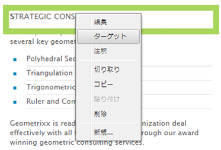

# ターゲットコンテンツの作成{#developing-for-targeted-content}

ここでは、コンテンツターゲティングで使用するコンポーネントの作成に関するトピックを取り上げます。

* Adobe Target との統合については、[Adobe Target との統合](/help/sites-administering/target.md)を参照してください。
* ターゲットコンテンツのオーサリングについては、[ターゲット設定モードを使用したターゲットコンテンツのオーサリング](/help/sites-authoring/content-targeting-touch.md)を参照してください。

>[!NOTE]
>
>AEM オーサーインスタンスでコンポーネントをターゲット設定すると、そのコンポーネントが、キャンペーンの登録、オファーの設定、Adobe Target セグメントの取得（設定されている場合）をおこなうために、Adobe Target に対して一連のサーバー側呼び出しを実行します。AEM パブリッシュインスタンスから Adobe Target へのサーバー側呼び出しはおこなわれません。

## ページ上での Adobe Target によるターゲット設定の有効化 {#enabling-targeting-with-adobe-target-on-your-pages}

To use targeted components in your pages that interact with Adobe Target, include specific client-side code in the `<head>` element.

### head セクション {#the-head-section}

ページの &lt;head> セクションに次の両方のコードブロックを追加します。

```xml
<!--/* Include Context Hub */-->
<sly data-sly-resource="${'contexthub' @ resourceType='granite/contexthub/components/contexthub'}"/>
```

```xml
<cq:include script="/libs/cq/cloudserviceconfigs/components/servicelibs/servicelibs.jsp"/>
```

このコードによって、必要な分析用 Javascript オブジェクトが追加され、Web サイトに関連付けられているクラウドサービスライブラリが読み込まれます。For Target service, the libraries are loaded via `/libs/cq/analytics/components/testandtarget/headlibs.jsp`

読み込まれるライブラリのセットは、Target の設定で使用されているターゲットクライアントライブラリのタイプ（mbox.js または at.js）によって異なります。

**デフォルトの mbox.js の場合**

```
<script type="text/javascript" src="/etc/clientlibs/foundation/testandtarget/parameters.js"></script>
 <script type="text/javascript" src="/etc/clientlibs/foundation/testandtarget/mbox.js"></script>
 <script type="text/javascript" src="/etc/clientlibs/foundation/personalization/integrations/commons.js"></script>
 <script type="text/javascript" src="/etc/clientlibs/foundation/testandtarget/util.js"></script>
 <script type="text/javascript" src="/etc/clientlibs/foundation/testandtarget/init.js"></script>
```

**カスタムの mbox.js の場合**

```
<script type="text/javascript" src="/etc/cloudservices/testandtarget/<CLIENT-CODE>/_jcr_content/public/mbox.js"></script>
        <script type="text/javascript" src="/etc/clientlibs/foundation/testandtarget/parameters.js"></script>
 <script type="text/javascript" src="/etc/clientlibs/foundation/personalization/integrations/commons.js"></script>
 <script type="text/javascript" src="/etc/clientlibs/foundation/testandtarget/util.js"></script>
 <script type="text/javascript" src="/etc/clientlibs/foundation/testandtarget/init.js"></script>
```

**at.js の場合**

```
<script type="text/javascript" src="/etc/clientlibs/foundation/testandtarget/parameters.js"></script>
 <script type="text/javascript" src="/etc/clientlibs/foundation/testandtarget/atjs-integration.js"></script>
 <script type="text/javascript" src="/etc/clientlibs/foundation/testandtarget/atjs.js"></script>
```

>[!NOTE]
>
>製品に付属の `at.js` 出荷済みバージョンのみがサポートされます。 製品と共に `at.js` 出荷されたのバージョンは、 `at.js` ファイルを場所で確認することで取得でき `/etc/clientlibs/foundation/testandtarget/atjs/source/at.js`ます。

**カスタムの at.js の場合**

```
<script type="text/javascript" src="/etc/cloudservices/testandtarget/<CLIENT-CODE>/_jcr_content/public/at.js"></script>
    <script type="text/javascript" src="/etc/clientlibs/foundation/testandtarget/parameters.js"></script>
 <script type="text/javascript" src="/etc/clientlibs/foundation/testandtarget/atjs-integration.js"></script>
```

The Target functionality on the client side is managed by the `CQ_Analytics.TestTarget` object. そのため、ページには次の例のような init コードが含まれます。

```
<script type="text/javascript">
            if ( !window.CQ_Analytics ) {
                window.CQ_Analytics = {};
            }
            if ( !CQ_Analytics.TestTarget ) {
                CQ_Analytics.TestTarget = {};
            }
            CQ_Analytics.TestTarget.clientCode = 'my_client_code';
        </script>
      ...
  
    <div class="cloudservice testandtarget">
  <script type="text/javascript">
  CQ_Analytics.TestTarget.maxProfileParams = 11;

  if (CQ_Analytics.CCM) {
   if (CQ_Analytics.CCM.areStoresInitialized) {
    CQ_Analytics.TestTarget.registerMboxUpdateCalls();
   } else {
    CQ_Analytics.CCM.addListener("storesinitialize", function (e) {
     CQ_Analytics.TestTarget.registerMboxUpdateCalls();
    });
   }
  } else {
   // client context not there, still register calls
   CQ_Analytics.TestTarget.registerMboxUpdateCalls();
  }
  </script>
 </div>
```

この JSP によって、必要な分析 JavaScript オブジェクトと参照がクライアント側の JavaScript ライブラリに追加されます。The `testandtarget.js` file contains the `mbox.js` functions. このスクリプトが生成する HTML は、次の例のようになります。

```xml
<script type="text/javascript">
        if ( !window.CQ_Analytics ) {
            window.CQ_Analytics = {};
        }
        if ( !CQ_Analytics.TestTarget ) {
            CQ_Analytics.TestTarget = {};
        }
        CQ_Analytics.TestTarget.clientCode = 'MyClientCode';
</script>
<link rel="stylesheet" href="/etc/clientlibs/foundation/testandtarget/testandtarget.css" type="text/css">
<script type="text/javascript" src="/etc/clientlibs/foundation/testandtarget/testandtarget.js"></script>
<script type="text/javascript" src="/etc/clientlibs/foundation/testandtarget/init.js"></script>
```

#### body セクション（開始） {#the-body-section-start}

Add the following code immediately following the `<body>` tag to add the client context features to the page:

```xml
<cq:include path="clientcontext" resourceType="cq/personalization/components/clientcontext"/>
```

#### The body Section (end) {#the-body-section-end}

Add the following code immediately before the `</body>` end tag:

```xml
<cq:include path="cloudservices" resourceType="cq/cloudserviceconfigs/components/servicecomponents"/>
```

このコンポーネントの JSP スクリプトは、Target JavaScript API への呼び出しを生成し、その他の必要な設定を実装します。このスクリプトが生成する HTML は、次の例のようになります。

```xml
<div class="servicecomponents cloudservices">
  <div class="cloudservice testandtarget">
    <script type="text/javascript">
      CQ_Analytics.TestTarget.maxProfileParams = 11;
      CQ_Analytics.CCM.addListener("storesinitialize", function(e) {
        CQ_Analytics.TestTarget.registerMboxUpdateCalls();
      });
    </script>
    <div id="cq-analytics-texthint" style="background:white; padding:0 10px; display:none;">
      <h3 class="cq-texthint-placeholder">Component clientcontext is missing or misplaced.</h3>
    </div>
    <script type="text/javascript">
      $CQ(function(){
      if( CQ_Analytics &&
          CQ_Analytics.ClientContextMgr &&
          !CQ_Analytics.ClientContextMgr.isConfigLoaded ) 
        { 
          $CQ("#cq-analytics-texthint").show();
        }
      });
    </script>
  </div>
</div>
```

### カスタムターゲットライブラリファイルの使用 {#using-a-custom-target-library-file}

>[!NOTE]
>
>DTM または別のターゲットマーケティングシステムを使用していない場合は、カスタムターゲットライブラリファイルを使用できます。

>[!NOTE]
>
>デフォルトでは mbox は非表示です。この設定は、mboxDefault クラスによって決まります。mbox が非表示の場合は、入れ替えられる前にデフォルトコンテンツが訪問者に表示されません。ただし、体感パフォーマンスに影響が生じます。

The default mbox.js file that is used to create mboxes is located at `/etc/clientlibs/foundation/testandtarget/mbox/source/mbox.js`. カスタムの mbox.js ファイルを使用するには、このファイルを Target クラウド設定に追加します。To add the file, the `mbox.js` file must be available on the file system.

For example, if you want to use the [Marketing Cloud ID service](https://docs.adobe.com/content/help/en/id-service/using/home.html) you need to download mbox.js so that it contains the correct value for the `imsOrgID` variable, which is based on your tenant. この変数は、Marketing Cloud ID サービスとの統合に必須です。For information, see [Adobe Analytics as the Reporting Source for Adobe Target](https://docs.adobe.com/content/help/en/target/using/integrate/a4t/a4t.html) and [Before You Implement](https://docs.adobe.com/content/help/en/target/using/integrate/a4t/before-implement.html).

>[!NOTE]
>
>Target 設定でカスタム mbox が定義されている場合は、すべてのユーザーにパブリッシュサーバー上の **/etc/cloudservices** への読み取りアクセス権限が必要です。このアクセス権限がないと、発行 Web サイト上の mbox.js ファイルの読み込みが 404 エラーになります。

1. Go to the CQ **Tools** page and select **Cloud Services**. （[http://localhost:4502/libs/cq/core/content/tools/cloudservices.html](http://localhost:4502/libs/cq/core/content/tools/cloudservices.html)）。
1. ツリーで「Adobe Target」を選択し、設定リストの中から目的の Target 設定をダブルクリックします。
1. 設定ページで「編集」をクリックします。
1. カスタム mbox.js プロパティの場合は、「参照」をクリックし、ファイルを選択します。
1. 変更を適用するには、Adobe Target アカウントのパスワードを入力し、「Adobe Target に再接続」をクリックして、接続が成功したら「OK」をクリックします。次に、コンポーネントを編集ダイアログボックスで「OK」をクリックします。

Target 設定にカスタム mbox.js ファイルが含まれます。これはページの [head セクション内に必要なコード](/help/sites-developing/target.md#the-head-section)で、testandtarget.js ライブラリへの参照の代わりに、クライアントライブラリフレームワークにファイルを追加するものです。

## コンポーネントに対する「ターゲット」コマンドの無効化 {#disabling-the-target-command-for-components}

大部分のコンポーネントは、コンテキストメニューで「ターゲット」コマンドを使用して、ターゲットコンポーネントに変換することができます。



コンテキストメニューから「ターゲット」コマンドを削除するには、コンポーネントの cq:editConfig ノードに次のプロパティを追加します。

* 名前：`cq:disableTargeting`
* 型：`Boolean`
* 値：`True`

For example, to disable targeting for the title components of the Geometrixx Demo Site pages, add the property to the `/apps/geometrixx/components/title/cq:editConfig` node.


## Adobe Target への注文確認情報の送信 {#sending-order-confirmation-information-to-adobe-target}

>[!NOTE]
>
>DTM を使用していない場合は、注文確認を Adobe Target に送信します。

Web サイトのパフォーマンスを追跡するには、注文確認ページから Adobe Target に購入情報を送信します（Adobe Target ドキュメントの [orderConfirmPage mbox の作成](https://docs.adobe.com/content/help/en/dtm/implementing/target/configure-target/mboxes/order-confirmation-mbox.html)を参照）。mbox が `orderConfirmPage` という名前を持ち、以下の特定のパラメーター名を使用している場合は、Adobe Target が mbox データを注文確認データとして認識します。

* productPurchasedId：購入された商品を識別する ID のリスト。
* orderId：注文の ID。
* orderTotal：購入の合計金額。

レンダリングされた HTML ページ上の mbox を作成するコードは、次の例のようになります。

```xml
<script type="text/javascript">
     mboxCreate('orderConfirmPage',
     'productPurchasedId=product1 product2 product3',
     'orderId=order1234',
     'orderTotal=24.54');
</script>
```

各パラメーターの値は注文ごとに異なります。そのため、購入のプロパティに基づいてコードを生成するコンポーネントが必要です。The CQ [eCommerce Integration Framework](/help/sites-administering/ecommerce.md) enables you to integrate with your product catalogue and implement a shopping cart and checkout page.

Geometrixx Outdoors のサンプルでは、訪問者が商品を購入すると、以下の確認ページが表示されます。


以下に示すコードは、買い物かごのプロパティにアクセスして、mbox を作成するためのコードを出力するコンポーネントの JSP スクリプトです。

```java
<%--

  confirmationmbox component.

--%><%
%><%@include file="/libs/foundation/global.jsp"%><%
%><%@page session="false"
          import="com.adobe.cq.commerce.api.CommerceService,
                  com.adobe.cq.commerce.api.CommerceSession,
                  com.adobe.cq.commerce.common.PriceFilter,
                  com.adobe.cq.commerce.api.Product, 
                  java.util.List, java.util.Iterator"%><%

/* obtain the CommerceSession object */                     
CommerceService commerceservice = resource.adaptTo(CommerceService.class);
CommerceSession session = commerceservice.login(slingRequest, slingResponse);

/* obtain the cart items */
List<CommerceSession.CartEntry> entries = session.getCartEntries();
Iterator<CommerceSession.CartEntry> cartiterator = entries.iterator();

/* iterate the items and get the product IDs */
String productIDs = new String();
while(cartiterator.hasNext()){
 CommerceSession.CartEntry entry = cartiterator.next();
 productIDs = productIDs + entry.getProduct().getSKU();
    if (cartiterator.hasNext()) productIDs = productIDs + ", ";
}

/* get the cart price and orderID */
String total = session.getCartPrice(new PriceFilter("CART", "PRE_TAX"));
String orderID = session.getOrderId();

%><div class="mboxDefault"></div>
<script type="text/javascript">
     mboxCreate('orderConfirmPage',
     'productPurchasedId=<%= productIDs %>',
     'orderId=<%= orderID %>',
     'orderTotal=<%= total %>');
</script>
```

このコンポーネントが前述の例のチェックアウトページに含まれている場合、ページのソースには、mbox を作成する以下のスクリプトが含まれます。

```
<div class="mboxDefault"></div>
<script type="text/javascript">
  
     mboxCreate('orderConfirmPage',
     'productPurchasedId=47638-S, 46587',
     'orderId=d03cb015-c30f-4bae-ab12-1d62b4d105ca',
     'orderTotal=US$677.00');

</script>
```

## Target コンポーネントについて {#understanding-the-target-component}

Target コンポーネントを使用すると、CQ コンテンツコンポーネントから動的 mbox を作成できます（[コンテンツのターゲティング](/help/sites-authoring/content-targeting-touch.md)を参照）。ターゲットコンポーネントは、/libs/cq/personalization/components/ターゲットにあります。

target.jsp スクリプトは、ページのプロパティにアクセスして、コンポーネントに使用するターゲティングエンジンを決定し、適切なスクリプトを実行します。

* Adobe Target: `/libs/cq/personalization/components/target/engine_tnt.jsp`
* [Adobe TargetとAT.JS](/help/sites-administering/target.md): `/libs/cq/personalization/components/target/engine_atjs.jsp`
* [Adobe Campaign](/help/sites-authoring/target-adobe-campaign.md): `/libs/cq/personalization/components/target/engine_cq_campaign.jsp`
* クライアント側のルール/ContextHub: `/libs/cq/personalization/components/target/engine_cq.jsp`

### mbox の作成 {#the-creation-of-mboxes}

>[!NOTE]
>
>デフォルトでは mbox は非表示です。この設定は、mboxDefault クラスによって決まります。mbox が非表示の場合は、入れ替えられる前にデフォルトコンテンツが訪問者に表示されません。ただし、体感パフォーマンスに影響が生じます。

Adobe Target がコンテンツターゲティングをおこなうときには、engine_tnt.jsp スクリプトが、ターゲット設定されたエクスペリエンスのコンテンツを格納する mbox を作成します。

* Adds a `div` element with the class of `mboxDefault`, as required by the Adobe Target API.

* `div` 要素の内側に mbox コンテンツ（ターゲット設定されたエクスペリエンスのコンテンツ）を追加します。

`mboxDefault` div 要素の後に、mbox を作成する JavaScript が挿入されます。

* mbox 名、ID および場所は、コンポーネントのリポジトリパスに基づきます。
* スクリプトが ClientContext のパラメーター名と値を取得します。
* mbox を作成するために、mbox.js および他のクライアントライブラリが定義する関数への呼び出しがおこなわれます。

### コンテンツターゲティングのためのクライアントライブラリ {#client-libraries-for-content-targeting}

利用できる clientlib カテゴリは次のとおりです。

* `testandtarget.mbox`
* `testandtarget.init`
* `testandtarget.util`
* `testandtarget.atjs`
* `testandtarget.atjs-integration`