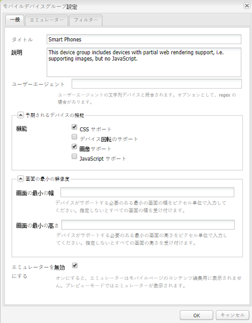
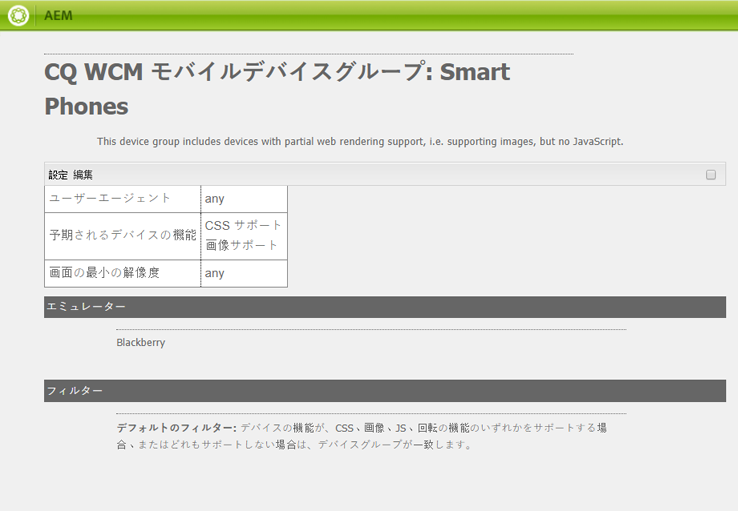
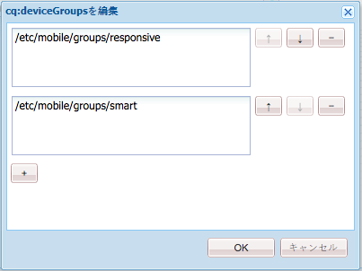
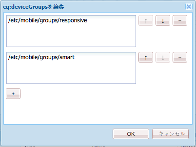
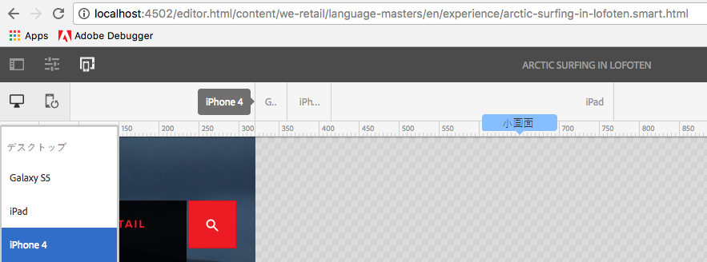

# アダプティブテンプレートレンダリング{#adaptive-template-rendering}

>[!CAUTION]
>
>AEM 6.4 の拡張サポートは終了し、このドキュメントは更新されなくなりました。 詳細は、 [技術サポート期間](https://helpx.adobe.com/jp/support/programs/eol-matrix.html). サポートされているバージョンを見つける [ここ](https://experienceleague.adobe.com/docs/?lang=ja).

アダプティブテンプレートのレンダリングを使用すると、バリエーションを含むページを管理できます。 元々は、モバイルHTML向けの様々なHTML出力（機能電話、スマートフォンなど）の配信に役立ちました。この機能は、マークアップやマークアップ出力が異なる様々なデバイスにエクスペリエンスを配信する必要がある場合に役立ちます。

## 概要 {#overview}

テンプレートは一般にレスポンシブグリッドを中心に構築されます。これらのテンプレートをベースに作成されたページは完全にレスポンシブとなり、クライアントデバイスのビューポートに合わせて自動的に調整されます。作成者は、ページエディターのエミュレーターツールバーを使用して、レイアウトを特定のデバイスに設定できます。

また、アダプティブレンダリングをサポートするようにテンプレートを設定することもできます。 デバイスグループが適切に設定されている場合、エミュレーターモードでデバイスを選択する際に、URL 内で別のセレクターを使用してページがレンダリングされます。 セレクターを使用すると、特定のページレンダリングを URL 経由で直接呼び出すことができます。

デバイスグループを設定する際には注意が必要です。

* 各デバイスは、少なくとも 1 つのデバイスグループに属している必要があります。
* 1 つのデバイスが複数のデバイスグループに属する場合があります。
* デバイスは複数のデバイスグループに属することができるので、セレクターを組み合わせることができます。
* セレクターの組み合わせは、リポジトリ内に保持されるので、上から下へと評価されます。

>[!NOTE]
>
>デバイスグループ **レスポンシブデバイス** レスポンシブデザインをサポートすると認識されるデバイスはアダプティブレイアウトを必要としないと見なされるので、にセレクターは付きません

## 設定 {#configuration}

アダプティブレンダリングセレクターは、既存のデバイスグループに対して、または [自分で作成したグループ。](/help/sites-developing/mobile.md#device-groups)

この例では、既存のデバイスグループを設定します **スマートフォン** アダプティブレンダリングセレクターを **エクスペリエンスページ** We.Retail 内のテンプレート

1. `http://localhost:4502/miscadmin#/etc/mobile/groups` で、アダプティブセレクターを必要とするデバイスグループを編集します。

   「**エミュレーターを無効にする**」オプションを設定して保存します。

   

1. 以降の手順でテンプレート構造およびページ構造にデバイスグループ&#x200B;**スマートフォン**&#x200B;を追加すると、**Blackberry** および **iPhone 4** でセレクターが使用できるようになります。

   

1. CRXDE Lite を使用し、テンプレートの構造で複数値文字列プロパティ `cq:deviceGroups` にデバイスグループを追加します。これにより、テンプレートでデバイスグループを使用できるようになります。

   `/conf/<your-site>/settings/wcm/templates/<your-template>/structure/jcr:content`

   例えば、スマートフォンデバイスグループを追加する場合は、以下のようになります。

   `/conf/we-retail/settings/wcm/templates/experience-page/structure/jcr:content`

   

1. CRXDE Lite を使用し、サイトの構造で複数値文字列プロパティ `cq:deviceGroups` にデバイスグループを追加します。これにより、サイトでデバイスグループを使用できるようになります。

   `/content/<your-site>/jcr:content`

   例えば、**スマートフォン**&#x200B;デバイスグループを使用できるようにする場合は、以下のようになります。

   `/content/we-retail/jcr:content`

   

これで、ページエディターで[エミュレーター](/help/sites-authoring/responsive-layout.md#layout-definitions-device-emulation-and-breakpoints)を使用する際（[レイアウトを変更する](/help/sites-authoring/responsive-layout.md)場合など）、設定済みのデバイスグループのデバイスを選択すると、URL の一部としてセレクターを持つページがレンダリングされるようになります。

この例では、**エクスペリエンスページ**&#x200B;テンプレートをベースとするページを編集するときに、エミュレーターで iPhone 4 を選択すると、ページにセレクターが含められ、`arctic-surfing-in-lofoten.html` の代わりに `arctic-surfing-in-lofoten.smart.html` としてレンダリングされます。

このセレクターを使用してページを直接呼び出すこともできます。

