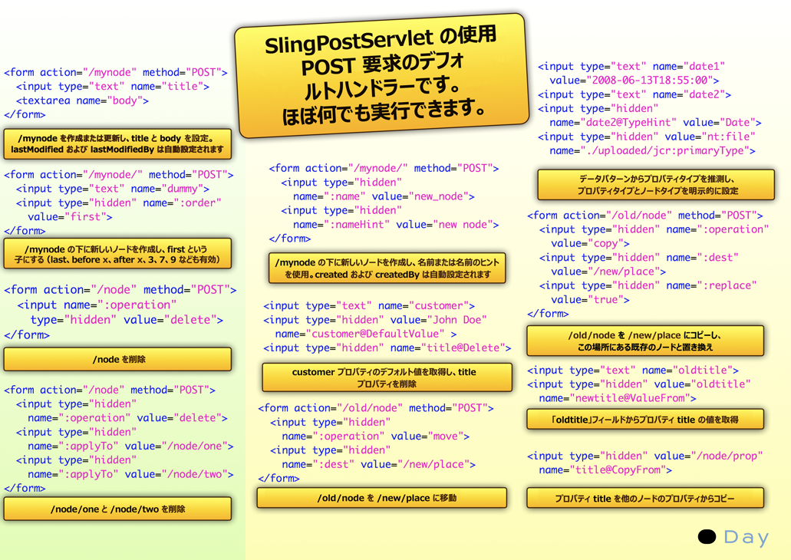

# AEM の中心概念 {#aem-core-concepts}

>[!CAUTION]
>
>AEM 6.4 の拡張サポートは終了し、このドキュメントは更新されなくなりました。 詳細は、 [技術サポート期間](https://helpx.adobe.com/jp/support/programs/eol-matrix.html). サポートされているバージョンを見つける [ここ](https://experienceleague.adobe.com/docs/?lang=ja).

>[!NOTE]
>
>AEM の中心概念の詳細に入る前に、[AEM Sites の開発の手引き](/help/sites-developing/getting-started.md) のドキュメントで WKND チュートリアルを済ませ、AEM の開発プロセスと中心概念の概要を確認しておくことをお勧めします。

## AEMでの開発の前提条件 {#prerequisites-for-developing-on-aem}

AEM上での開発には、次のスキルが必要になります。

* 以下を含む、Web アプリケーションの技術に関する基本的な知識

   * リクエスト — レスポンス (XMLHttpRequest / XMLHttpResponse) サイクル
   * HTML
   * CSS
   * JavaScript

* Content Explorer を含む、Experience Server(CRX) の実務知識
* クラシック UI での開発には、単純な JSP の例を理解し、変更する機能を含む、JSP(JavaServer Pages) の基本的な知識も必要です。

[ガイドラインおよびベストプラクティス](/help/sites-developing/dev-guidelines-bestpractices.md) を読み、手順に従うこともお勧めします。

## Java コンテンツリポジトリー {#java-content-repository}

Java コンテンツリポジトリー（JCR）の規格である [JSR 283](https://www.adobe.io/experience-manager/reference-materials/spec/jcr/2.0/index.html) では、コンテンツリポジトリー内で、任意の精度レベルでコンテンツに双方向アクセスするための、ベンダーにも実装にも依存しない方法が指定されています。

仕様を主導しているのは、Adobe Research（スイス）AG です。

[JCR API 2.0](https://www.adobe.io/experience-manager/reference-materials/spec/javax.jcr/javadocs/jcr-2.0/index.html) パッケージ、javax.jcr。「&amp;ast;」は、リポジトリコンテンツの直接アクセスと操作に使用されます。

## Experience Server(CRX) と Jackrabbit {#experience-server-crx-and-jackrabbit}

Experience Server は、AEMが構築され、カスタムアプリケーションの構築に利用できる Experience Services を提供し、Jackrabbit に基づいてコンテンツリポジトリを埋め込みます。

[Apache Jackrabbit](https://jackrabbit.apache.org/) は、JCR API 2.0 の完全準拠のオープンソース実装です。

## Sling のリクエスト処理 {#sling-request-processing}

### Sling の概要 {#introduction-to-sling}

AEM の構築には [Sling](https://sling.apache.org/site/index.html) が使用されています。これは、REST の原則に基づき、コンテンツ指向のアプリケーションを容易に開発できる Web アプリケーションフレームワークです。Sling は、データストアとして、Apache Jackrabbit のような JCR リポジトリー、または AEM の場合は CRX Content Repository を使用します。Sling は Apache Software Foundation に寄贈されました。詳細に関しては Apache をご覧ください。

Sling を使用する場合、レンダリングされるコンテンツのタイプは、処理に関する第一の考慮事項ではありません。主な考慮事項は、URL を解決して得られるコンテンツオブジェクト用に、レンダリングを実行するためのスクリプトが見つかるかどうかです。このことは、要件に合わせて簡単にカスタマイズ可能なページを Web コンテンツ作成者が構築する際に非常に役立ちます。

この柔軟性の利点は、様々なコンテンツ要素を持つアプリ、または容易にカスタマイズできるページが必要な場合に明らかです。特に、WCM などの Web コンテンツ管理システムをAEMソリューションに実装する場合。

Sling を使用した開発の概要について詳しくは、『[15 分間でわかる Sling](https://sling.apache.org/documentation/getting-started/discover-sling-in-15-minutes.html)』を参照してください。

次の図は、Sling のスクリプト解決の説明です。HTTP リクエストからコンテンツノード、コンテンツノードからリソースタイプ、リソースタイプからスクリプトを得る方法と、使用可能なスクリプト変数を示しています。


次の図は、SlingPostServlet を扱う際に使用できる、非表示ながらも強力なリクエストパラメータをすべて説明しています。これは、すべての POST リクエストのデフォルトハンドラで、リポジトリー内のノードの作成、変更、削除、コピー、移動に無限のオプションを提供します。



### Sling はコンテンツ中心型 {#sling-is-content-centric}

Sling は *コンテンツ中心型* です。これは、各（HTTP）リクエストが JCR リソース（リポジトリーノード）の形でコンテンツにマッピングされるため、コンテンツに焦点を当てた処理が行われることを意味します。

* 最初のターゲットは、コンテンツを保持するリソース（JCR ノード）です
* 第 2 に、表現（スクリプト）は、リソースプロパティから、リクエストの特定の部分（セレクターや拡張子など）と組み合わせて配置されます

### RESTful Sling {#restful-sling}

コンテンツ中心の考え方により、Sling は REST 指向のサーバーを実装するので、Web アプリケーションフレームワークに新しい概念を備えています。 メリットは次のとおりです。

* 表面だけでなく、非常に RESTful。リソースと表示域は、サーバー内で正しくモデル化されます
* 1 つ以上のデータモデルを削除

   * 以前は、次のものが必要でした。URL 構造、ビジネスオブジェクト、DB スキーマ
   * これは次のように短縮されました。URL = resource = JCR 構造

### URL の分解 {#url-decomposition}

Sling では、処理はユーザーリクエストの URL によって駆動されます。これにより、適切なスクリプトによって表示されるコンテンツが定義されます。これを行うために、URL から情報が抽出されます。

次の URL を分析する場合：

```xml
https://myhost/tools/spy.printable.a4.html/a/b?x=12
```

次のような複合部品に分割できます。

| プロトコル | ホスト | コンテンツのパス | セレクター | 拡張 |  | サフィックス |  | パラメーター |
|---|---|---|---|---|---|---|---|---|
| https:// | myhost | tools/spy | .printable.a4. | html | / | a/b | ? | x=12 |

**プロトコル** - HTTP

**ホスト** - web サイトの名前。

**コンテンツのパス** - レンダリングされるコンテンツを指定するパス。拡張機能と組み合わせて使用します。この例では、tools/spy.html に変換します。

**セレクター** - コンテンツをレンダリングする方法を選ぶために使用します。この例では、A4 形式のプリンターに対応したバージョンを選択しています。

**拡張子** - コンテンツの形式。これも、レンダリングに使用するスクリプトを指定します。

**サフィックス** - 追加情報を指定するために使用できます。

**パラメーター** - 動的コンテンツで必要なパラメーターです。

#### URL からコンテンツおよびスクリプトへ {#from-url-to-content-and-scripts}

次の原則を使用します。

* マッピングでは、リクエストから抽出されたコンテンツパスを使用して、リソースを特定します
* 適切なリソースが見つかると、sling リソースタイプが抽出され、コンテンツのレンダリングに使用されるスクリプトを見つけるために使用されます

次の図は、使用するメカニズムを示しています。このメカニズムについては、以降の節で詳しく説明します。


Sling を使用して、特定のエンティティをレンダリングするスクリプトを指定します（JCR ノードで `sling:resourceType` プロパティを設定します）。このメカニズムは、リソースが複数のレンディションを持つことができるため、スクリプトがデータエンティティにアクセスするメカニズム（PHP スクリプトの SQL 文のように）よりも自由度が高くなります。

#### リソースへのリクエストのマッピング {#mapping-requests-to-resources}

リクエストを分解し、必要な情報を抽出します。リポジトリーで、リクエストされたリソース（コンテンツノード）を検索します。

* 最初の Sling では、リクエストで指定された場所（例：`../content/corporate/jobs/developer.html`）にノードが存在するかどうかを確認します。
* ノードが見つからない場合、拡張子なしで検索を繰り返します（例：`../content/corporate/jobs/developer`）。
* ノードが見つからない場合、Sling は http コード 404(Not Found) を返します。

Sling では JCR 以外のノードもリソースとして扱えますが、これは詳細な機能です。

### スクリプトの検索 {#locating-the-script}

適切なリソース（コンテンツノード）が見つかると、**sling リソースタイプ**&#x200B;が抽出されます。これは、コンテンツのレンダリングに使用するスクリプトを見つけるパスです。

`sling:resourceType` によって指定されるパスは、次のいずれかです。

* 絶対パス
* 設定パラメーターに対する相対パス

   移植性を高めるため、アドビでは相対パスを推奨しています。

Sling のスクリプトはすべて、`/apps` または `/libs` のサブフォルダーに格納され、この順序で検索されます（[コンポーネントおよびその他の要素のカスタマイズ](/help/sites-developing/dev-guidelines-bestpractices.md#customizing-components-and-other-elements)を参照）。

その他の注意点は次のとおりです。

* メソッド (GET、POST) が必要な場合は、HTTP の仕様に従って大文字で指定されます ( 例： jobs.method.esp （以下を参照）)
* 様々なスクリプトエンジンがサポートされています。

   * `.esp, .ecma`:ECMAScript(JavaScript) ページ（サーバー側実行）
   * `.jsp`:Java サーバーページ（サーバー側実行）
   * `.java`:Java Servlet Compiler（サーバー側実行）
   * `.jst`:JavaScript テンプレート（クライアント側実行）

AEM の特定のインスタンスでサポートされているスクリプトエンジンのリストは、Felix Management Console（`http://<host>:<port>/system/console/slingscripting`）にあります。

また、Apache Sling では、他の一般的なスクリプトエンジン（Groovy、JRuby、Freemarker など）との統合がサポートされており、新しいスクリプトエンジンと統合する方法も提供されています。

前述の例を使用すると、`sling:resourceType` が `hr/jobs` の場合は、次のようになります。

* GET/HEAD リクエストおよび .html で終わる URL（デフォルトのリクエストタイプ、デフォルトの形式）

   スクリプトは /apps/hr/jobs/jobs.esp になります。sling:resourceType の最後のセクションがファイル名となります。

* POST 要求（GET/HEAD を除くすべての要求タイプ。メソッド名は大文字にする必要があります）

   スクリプト名に POST が使用されます。

   スクリプトは `/apps/hr/jobs/jobs.POST.esp` です。

* .html で終わらない、他の形式の URL です。

   例：`../content/corporate/jobs/developer.pdf`

   スクリプトは `/apps/hr/jobs/jobs.pdf.esp` です。スクリプト名にサフィックスが追加されます。

* セレクターを含む URL

   セレクターを使用して、同じコンテンツを別の形式で表示できます。例：プリンターに適したバージョン、rss フィード、概要など。

   プリンターに適したバージョンでは、セレクターが *print* である可能性がります。例：`../content/corporate/jobs/developer.print.html`

   スクリプトは `/apps/hr/jobs/jobs.print.esp` です。セレクターがスクリプト名に追加されます。

* sling:resourceType が定義されていない場合は、次のようになります。

   * コンテンツパスは、適切なスクリプトを検索するために使用されます（パスに基づいた ResourceTypeProvider がアクティブな場合）。

      例えば、`../content/corporate/jobs/developer.html` のスクリプトは、`/apps/content/corporate/jobs/` で検索を生成します。

   * プライマリノードタイプが使用されます。

* スクリプトがまったく見つからない場合は、デフォルトのスクリプトが使用されます。

   デフォルトのレンディションは現在、プレーンテキスト（.txt）、HTML（.html）、JSON（.json）としてサポートされています。これらのレンディションでは、ノードのプロパティが（適切にフォーマットされて）リストされます。拡張子 .res のデフォルトのレンディション、またはリクエスト拡張子のない要求は、（可能な場合は）リソースをスプールします。
* HTTP エラー処理（コード 403 または 404）の場合、Sling は以下のいずれかの場所でスクリプトを検索します。

   * 次の場所の/apps/sling/servlet/errorhandler [カスタマイズスクリプト](/help/sites-developing/customizing-errorhandler-pages.md)
   * または標準スクリプト/libs/sling/servlet/errorhandler/403.esp、または 404.esp の場所。

特定のリクエストに複数のスクリプトが該当する場合は、一致率が最も高いスクリプトが選択されます。一致は具体的であるほど良くなります。つまり、リクエスト拡張子であれ、メソッド名の一致であれ、セレクターの一致が多いほど良くなります。

例えば、次のリソースにアクセスするためのリクエストについて考えます。\
`/content/corporate/jobs/developer.print.a4.html`\
リソースのタイプは次のとおりとします。\
`sling:resourceType="hr/jobs"`

また、次のリストのスクリプトが正しい場所にあると仮定します。

1. `GET.esp`
1. `jobs.esp`
1. `html.esp`
1. `print.esp`
1. `print.html.esp`
1. `print/a4.esp`
1. `print/a4/html.esp`
1. `print/a4.html.esp`

この場合、優先順位は (8) - (7) - (6) - (5) - (4) - (3) - (2) - (1) となります。

リソースタイプ（主に `sling:resourceType` プロパティで定義）に加えて、リソーススーパータイプもあります。これは通常、`sling:resourceSuperType` プロパティで示されます。これらのスーパータイプは、スクリプトを検索する際にも検討されます。リソーススーパータイプの利点は、（デフォルトのサーブレットで使用される）デフォルトのリソースタイプ `sling/servlet/default` が事実上のルートになるリソースの階層を形成できる点です。

リソースのリソーススーパータイプは次の 2 つの方法で定義できます。

* リソースの `sling:resourceSuperType` プロパティを使用。
* `sling:resourceSuperType` が示すノードの `sling:resourceType` プロパティを使用。

次に例を示します。

* ／

   * a
   * b

      * sling:resourceSuperType = a
   * c

      * sling:resourceSuperType = b
   * x

      * sling:resourceType = c
   * y

      * sling:resourceType = c
      * sling:resourceSuperType = a


タイプの階層は

* `/x`
   * `[ c, b, a, <default>]` です
* 一方、`/y` では
   * 階層は `[ c, a, <default>]` です

これは、`/y` には `sling:resourceSuperType` プロパティがあるのに対して、`/x` にはなく、スーパータイプがリソースタイプから継承されているからです。

#### Sling スクリプトを直接呼び出すことはできません {#sling-scripts-cannot-be-called-directly}

Sling 内では、スクリプトを直接呼び出すことはできません。これは、REST サーバーの厳密な概念を破るからです。リソースと表示域を混在させることができます。

表現（スクリプト）を直接呼び出す場合、スクリプト内のリソースを非表示にするので、フレームワーク (Sling) はそれを認識しません。 そのため、次の特定の機能が失われます。

* 以下を含む、GET以外の http メソッドの自動処理

   * Sling のデフォルトの実装で扱う POST、PUT、DELETE
   * sling:resourceType の場所にある `POST.jsp` スクリプト

* あなたのコードアーキテクチャはもはやクリーンではなく、構造も明確ではありません。大規模開発にとって最も重要な

### Sling API {#sling-api}

これは、Sling API パッケージ、org.apache.sling.&amp;ast;、およびタグライブラリを使用します。

### sling:include を使用した既存の要素の参照 {#referencing-existing-elements-using-sling-include}

最後の考慮事項は、スクリプト内にある既存の要素の参照の必要性です。

より複雑なスクリプト（集計スクリプト）は、複数のリソース（ナビゲーション、サイドバー、フッター、リストの要素など）へのアクセスが必要になる場合があり、そのために&#x200B;*リソース*&#x200B;を含めます。

これは、sling:include(&quot;/&lt;path>/&lt;resource>&quot;) コマンドを使用して行えます。これにより、参照されるリソースの定義を効率的に含めることができます。例えば、次のステートメントでは、画像をレンダリングするために既存の定義を参照しています。

```xml
%><sling:include resourceType="geometrixx/components/image/img"/><% 
```

## OSGi {#osgi}

OSGi は、モジュラー型アプリケーションおよびライブラリを開発およびデプロイするためのアーキテクチャを定義します（Java 用 Dynamic Module System とも呼ばれます）。 OSGi コンテナを使用すると、アプリケーションを個々のモジュール（追加のメタ情報を含む jar ファイルで、OSGi 用語でバンドルと呼ばれます）に分割し、それらの間の相互依存関係を次の機能で管理できます。

* コンテナ内に実装されるサービス
* コンテナとアプリケーションの間の契約

これらのサービスと契約は、個々の要素が相互に動的に検出して共同作業を行うためのアーキテクチャを提供します。

OSGi フレームワークは、再起動を必要とせずに、これらのバンドルの動的な読み込み/アンロード、設定および制御を提供します。

>[!NOTE]
>
>OSGi テクノロジーについて詳しくは、[OSGi Web サイト](https://www.osgi.org)を参照してください。
>
>特に、基礎教育に関するページには、プレゼンテーションやチュートリアルのコレクションが収められています。

このアーキテクチャにより、Sling をアプリケーション固有のモジュールで拡張できます。Sling、つまり CQ5 は、 [Apache Felix](https://felix.apache.org/) OSGI（Open Services Gateway イニシアチブ）の実装であり、OSGi Service Platform リリース 4 バージョン 4.2 仕様に基づいています。 どちらも、OSGi フレームワーク内で実行される OSGi バンドルの集まりです。

これにより、インストール内のどのパッケージでも、以下のアクションを実行できます。

* インストール
* 開始
* 停止
* 更新
* アンインストール
* 現在の状態を見る
* 特定のバンドルに関する詳細な情報（シンボリック名、バージョン、場所など）にアクセス

詳しくは、[Web コンソール](/help/sites-deploying/web-console.md)、[OSGI 設定](/help/sites-deploying/configuring-osgi.md)、および [OSGi 設定の指定](/help/sites-deploying/osgi-configuration-settings.md)を参照してください。

## AEM環境の開発オブジェクト {#development-objects-in-the-aem-environment}

開発に関しては、次の点が重要です。

**項目** - ノードまたはプロパティのアイテム。

項目オブジェクトの操作方法について詳しくは、Interface javax.jcr Item の [Javadocs](https://docs.adobe.com/docs/en/spec/javax.jcr/javadocs/jcr-2.0/javax/jcr/Item.html) を参照してください。

**ノード（およびそのプロパティ）** - ノードとそのプロパティは、JCR API 2.0 仕様（JSR 283）で定義されています。コンテンツ、オブジェクト定義、レンダリングスクリプトおよびその他のデータを格納します。

ノードはコンテンツ構造を定義し、そのプロパティには実際のコンテンツとメタデータが格納されます。

コンテンツノードがレンダリングを駆動します。 Sling は、受信リクエストからコンテンツノードを取得します。 このノードの sling:resourceType プロパティは、使用する Sling レンダリングコンポーネントを指します。

JCR 名であるノードは、Sling 環境ではリソースとも呼ばれます。

例えば、現在のノードのプロパティを取得するには、スクリプトで次のコードを使用できます。

`PropertyIterator properties = currentNode.getProperties();`

currentNode は現在のノードオブジェクトです。

ノードオブジェクトの操作方法について詳しくは、[Javadocs](https://docs.adobe.com/docs/en/spec/javax.jcr/javadocs/jcr-2.0/javax/jcr/Node.html) を参照してください。

**Widget** - AEMでは、すべてのユーザー入力はウィジェットで管理されます。多くの場合、コンテンツの一部の編集を制御するために使用されます。

ダイアログはウィジェットを組み合わせて作成します。

AEMは、ウィジェットの ExtJS ライブラリを使用して開発されました。

**ダイアログ** - ダイアログは特殊なタイプのウィジェットです。

コンテンツを編集するために、AEMはアプリケーション開発者が定義したダイアログを使用します。 一連のウィジェットを組み合わせて、関連するコンテンツの編集に必要なすべてのフィールドとアクションをユーザーに表示します。

ダイアログは、メタデータの編集や、様々な管理ツールでも使用されます。

**コンポーネント** - ソフトウェアコンポーネントは、事前に定義されたサービスやイベントを提供するシステム要素であり、他のコンポーネントと通信できます。

AEM内では、多くの場合、リソースのコンテンツをレンダリングするためにコンポーネントが使用されます。 リソースがページの場合、レンダリングされるコンポーネントはトップレベルコンポーネントまたはページコンポーネントと呼ばれます。 ただし、コンポーネントは、コンテンツをレンダリングしたり、特定のリソースにリンクしたりする必要はありません。例えば、ナビゲーションコンポーネントには、複数のリソースに関する情報が表示されます。

コンポーネントの定義には、以下が含まれます。

* コンテンツのレンダリングに使用するコード
* ユーザー入力用のダイアログと、結果コンテンツの設定用のダイアログ。

**テンプレート** - テンプレートは特定のタイプのページのベースとなります。「Web サイト」タブでページを作成する際は、ユーザーはテンプレートを選択する必要があります。このテンプレートをコピーして新しいページが作成されます。

テンプレートは、作成するページと同じ構造を持ち、実際のコンテンツを持たないノードの階層です。

ページとデフォルトコンテンツ（プライマリトップレベルコンテンツ）のレンダリングに使用するページコンポーネントを定義します。 コンテンツは、AEMがコンテンツ中心型としてレンダリングされる方法を定義します。

**ページコンポーネント（トップレベルコンポーネント）** - ページのレンダリングに使用するコンポーネント。

**ページ** - ページはテンプレートの「インスタンス」です。

ページには、タイプが cq:Page の階層ノードと、タイプが cq:PageContent のコンテンツノードがあります。 コンテンツノードの sling:resourceType プロパティは、ページのレンダリングに使用されるページコンポーネントを指します。

例えば、現在のページの名前を取得するには、スクリプトで次のコードを使用できます。

S`tring pageName = currentPage.getName();`

currentPage は現在のページオブジェクトです。ページオブジェクトの操作方法について詳しくは、[Javadocs](https://helpx.adobe.com/jp/experience-manager/6-4/sites/developing/using/reference-materials/javadoc/com/day/cq/wcm/api/Page.html) を参照してください。

**ページマネージャー** - ページマネージャーは、ページレベルの操作方法を提供するインターフェイスです。

例えば、リソースの含まれるページを取得するには、スクリプトで次のコードを使用できます。

Page myPage = pageManager.getContainingPage(myResource);

pageManager はページマネージャーオブジェクト、myResource はリソースオブジェクトです。ページマネージャーで提供される方法について詳しくは、[Javadocs](https://helpx.adobe.com/experience-manager/6-4/sites/developing/using/reference-materials/javadoc/com/day/cq/wcm/api/PageManager.html) を参照してください。

## リポジトリー内の構造 {#structure-within-the-repository}

次のリストは、リポジトリー内で見られる構造の概要です。

>[!CAUTION]
>
>この構造、またはその中のファイルの変更は、注意して行う必要があります。
>
>開発時に変更が必要になりますが、変更が及ぼす影響を十分に理解しておく必要があります。

>[!CAUTION]
>
>`/libs` パス内のものは一切変更しないでください。設定やその他の変更の場合は、項目を `/libs` から `/apps` にコピーし、`/apps` 内で変更を行います。

* `/apps`

   関連するアプリケーション。Web サイトに固有のコンポーネント定義を含めます。コンポーネントは、`/libs/foundation/components` で利用可能な標準搭載のコンポーネントに基づいて開発することができます。

* `/content`

   Web サイト用に作成したコンテンツ。

* `/etc`

* `/home`

   ユーザーおよびグループの情報。

* `/libs`

   AEM のコアに属するライブラリと定義。`/libs` のサブフォルダーは、検索やレプリケーションなどの標準搭載の AEM 機能を表します。AEM の動作に影響するため、`/libs` のコンテンツは変更しないでください。Web サイトに固有の機能は `/apps` の下で開発する必要があります（[コンポーネントおよびその他の要素のカスタマイズ](/help/sites-developing/dev-guidelines-bestpractices.md#customizing-components-and-other-elements)を参照）。

* `/tmp`

   一時作業領域。

* `/var`

   監査ログ、統計、イベント処理など、変化し、システムによって更新されるファイル。

## 環境 {#environments}

AEMを使用した実稼動環境は、多くの場合、2 つの異なるタイプのインスタンスで構成されます。an [オーサーインスタンスとパブリッシュインスタンス](/help/sites-deploying/deploy.md#author-and-publish-installs).

## Dispatcher {#the-dispatcher}

Dispatcher は、キャッシュとロードバランシングの両方をAdobeに提供するツールです。 詳しくは、 [Dispatcher](https://helpx.adobe.com/jp/experience-manager/brand-portal/user-guide.html).

## FileVault （ソースリビジョンシステム） {#filevault-source-revision-system}

FileVault は、JCR リポジトリにファイルシステムマッピングとバージョン管理を提供します。 標準のバージョン管理システム（Subversion など）で、プロジェクトコード、コンテンツ、設定などの保存とバージョン管理を完全にサポートして、AEM開発プロジェクトを管理するために使用できます。

詳しくは、 [FileVault ツール](/help/sites-developing/ht-vlttool.md) 詳しくは、ドキュメントを参照してください。

## workflows {#workflows}

多くの場合、コンテンツは組織のプロセスに依存します。これには、様々な参加者による承認やサインオフの手順が含まれます。 これらのプロセスは、ワークフローとして表すことができます。 [AEM内で定義および開発される](/help/sites-developing/workflows-models.md)を [適切なコンテンツページ](/help/sites-administering/workflows.md) または [デジタルアセット](/help/assets/assets-workflow.md) 必要に応じて。

ワークフローエンジンは、ワークフローの実装と、その後のコンテンツへの適用を管理するために使用されます。

## マルチサイト管理 {#multi-site-management}

マルチサイトマネージャー (MSM) を使用すると、共通のコンテンツを共有する複数の Web サイトを簡単に管理できます。 MSM では、サイト間の関係を定義して、あるサイトでのコンテンツの変更が他のサイトに自動的にレプリケートされるようにすることができます。

例えば、Web サイトは、多くの場合、国際的なオーディエンス向けに複数の言語で提供されています。 同じ言語のサイト数が少ない場合（3～5 個）、サイト間でコンテンツを同期する手動プロセスが可能です。 ただし、サイトの数が増えるか、複数の言語が関わる場合は、すぐにプロセスを自動化する方が効率的になります。

* Web サイトの様々な言語バージョンを効率的に管理します。
* ソースサイトに基づいて 1 つ以上のサイトを自動的に更新します。

   * 共通のベース構造を適用し、複数のサイトに共通のコンテンツを使用します。
   * 利用可能なリソースを最大限に活用します。
   * 共通の外観と操作性を維持する。
   * サイト間で異なるコンテンツの管理に取り組みます。

詳しくは、 [マルチサイトマネージャ](/help/sites-administering/msm.md).
