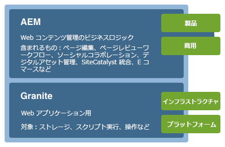
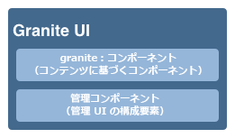
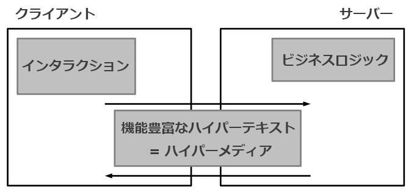
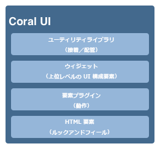
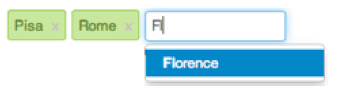

# AEM タッチ操作対応 UI の概念{#concepts-of-the-aem-touch-enabled-ui}

>[!CAUTION]
>
>AEM 6.4 の拡張サポートは終了し、このドキュメントは更新されなくなりました。 詳細は、 [技術サポート期間](https://helpx.adobe.com/jp/support/programs/eol-matrix.html). サポートされているバージョンを見つける [ここ](https://experienceleague.adobe.com/docs/?lang=ja).

AEM 5.6Adobeでは、 [レスポンシブデザイン](/help/sites-authoring/responsive-layout.md) オーサー環境用。 タッチデバイスとデスクトップデバイスの両方で動作するように設計されているので、これは元のクラシック UI とは大きく異なります。

このタッチ操作対応 UI は、クラシック UI に代わるAEMの標準 UI になりました。

>[!NOTE]
>
>タッチ操作対応 UI はAEMの標準 UI ですが、クラシック UI は引き続きサポートされます。

タッチ対応 UI は以下で構成されます。

* スイートヘッダー：

   * ロゴを表示します
   * グローバルナビゲーションへのリンクを表示します
   * 検索、ヘルプ、Marketing Cloud ソリューション、通知、ユーザー設定など、その他の汎用アクションへのリンクを表示します

* 左側のレール（必要に応じて表示／非表示の切り替えが可能）には次を表示できます。

   * タイムライン
   * 参照
   * フィルター

* ナビゲーションヘッダー。これもコンテキストに依存し、次の情報を表示できます。

   * 現在使用しているコンソールや、そのコンソール内の場所
   * 左側のパネルの選択
   * パンくずリスト
   * 適切な&#x200B;**作成**&#x200B;アクションへのアクセス
   * 表示の選択状況

* 次のコンテンツ領域：

   * コンテンツの項目（ページ、アセット、フォーラムの投稿など）をリストします
   * リクエストに応じてフォーマットできます（例：列、カード、リスト）
   * レスポンシブデザインを使用します（デバイスやウィンドウのサイズに応じて自動的に表示サイズが変更されます）。
   * 無限スクロールを使用します（ページネーションがなく、すべての項目が 1 つのウィンドウに表示されます）。


>[!NOTE]
>
>ほとんどすべてのAEM機能が、タッチ操作対応 UI に移植されています。 ただし、限られたケースでは、機能がクラシック UI に戻ることがあります。 詳しくは、 [タッチ操作対応 UI 機能のステータス](/help/release-notes/touch-ui-features-status.md) を参照してください。

タッチ操作対応 UI は、複数の製品間でユーザーエクスペリエンスの一貫性を保つために、Adobeが設計しました。 次の項目に基づいています。

* **Coral UI** (CUI) タッチ操作対応 UI 用のAdobeの表示スタイルの実装。 Coral UI は、UI の表示スタイルを採用するために必要な製品/プロジェクト/ Web アプリケーションのあらゆる機能を提供します。
* **Granite UI** コンポーネントは、Coral UI を使用して構築されます。

タッチ操作対応 UI の基本原則は次のとおりです。

* モバイル優先（デスクトップを考慮）
* レスポンシブデザイン
* コンテキスト関連の表示
* 再利用可能
* 埋め込まれたリファレンスドキュメントを含める
* 埋め込みテストを含める
* ボトムアップ設計により、これらの原則がすべての要素およびコンポーネントに確実に適用されます。

タッチ対応 UI の構造の概要について詳しくは、[AEM タッチ対応 UI の構造](/help/sites-developing/touch-ui-structure.md)の記事を参照してください。

## AEM Technology Stack {#aem-technology-stack}

AEMは Granite プラットフォームをベースとして使用し、Granite プラットフォームには Java コンテンツリポジトリが含まれます。



## Granite {#granite}

Granite は、Adobeのオープン Web スタックで、次のような様々なコンポーネントを提供します。

* アプリケーションランチャー
* すべてがデプロイされる OSGi フレームワーク
* アプリケーションの構築をサポートする多数の OSGi コンプレディアムサービス
* 様々なログ API を提供する包括的なログフレームワーク
* JCR API 仕様の CRX リポジトリ実装
* Apache Sling Web Framework
* 現在の CRX 製品の追加部分

>[!NOTE]
>
>Granite は、次のAdobe内でオープンな開発プロジェクトとして実行されます。コード、ディスカッション、問題に対する投稿は、会社全体でおこなわれます。
>
>ただし、Granite は **not** オープンソースプロジェクト。 いくつかのオープンソースプロジェクト（特に Apache Sling、Felix、Jackrabbit および Lucene）を重要なベースとしていますが、アドビは公開部分と非公開部分を明確に区別しています。

## Granite UI {#granite-ui}

Granite エンジニアリングプラットフォームには、基盤 UI フレームワークも用意されています。 主な目標は次のとおりです。

* 詳細な UI ウィジェットを提供します
* UI の概念を実装し、ベストプラクティス（長いリストのレンダリング、リストのフィルタリング、オブジェクト CRUD、CUD ウィザードなど）を説明します。
* 拡張可能なプラグインベースの管理 UI を提供する

これらは要件に従います。

* 「モバイル優先」を尊重
* 拡張可能
* 上書きが簡単


Granite UI は次のようになります。

* Sling の RESTful アーキテクチャを使用
* コンテンツ中心の Web アプリケーションの構築を目的としたコンポーネントライブラリを実装します。
* 詳細な UI ウィジェットを提供します
* デフォルトの標準化された UI を提供します。
* 拡張可能
* モバイルとデスクトップの両方のデバイス向けに設計されています（モバイルが優先されます）
* Granite ベースの任意のプラットフォーム/製品/プロジェクトで使用できます。例AEM



* [Granite UI 基盤コンポーネント](#granite-ui-foundation-components)

   この基盤コンポーネントライブラリは他のライブラリで使用または拡張できます。

* [Granite UI 管理コンポーネント](#granite-ui-administration-components)

### クライアント側とサーバー側 {#client-side-vs-server-side}

Granite UI のクライアントとサーバーの通信は、オブジェクトではなくハイパーテキストで構成されるので、クライアントがビジネスロジックを理解する必要はありません

* サーバーは、セマンティックデータを使用してHTMLをエンリッチメントします
* クライアントは、ハイパーテキストをハイパーメディア（インタラクション）でエンリッチメントします。



#### クライアント側 {#client-side}

作成者がインタラクティブな WebHTMLを構築する意向を表現できるように、アプリの語彙を拡張します。 これは、 [WAI-ARIA](https://www.w3.org/TR/wai-aria/) および [microformats](http://microformats.org/).

主に、クライアント側で実行される JS および CSS コードによって解釈されるインタラクションパターンの集まり（例えば、フォームの非同期送信）で構成されます。 クライアント側の役割は、インタラクティビティのためにマークアップ（サーバーがハイパーメディアアフォーダンスとして提供）を拡張することです。

クライアント側は、どのサーバーテクノロジーとも独立しています。 サーバーが適切なマークアップを提供している限り、クライアント側はその役割を果たすことができます。

現在、JS および CSS コードは Granite として提供されています [clientlibs](/help/sites-developing/clientlibs.md) カテゴリの下：

`granite.ui.foundation and granite.ui.foundation.admin`

これらはコンテンツパッケージの一部として提供されています。

`granite.ui.content`

#### サーバーサイド {#server-side}

sling コンポーネントのコレクションによって形成され、作成者は Web アプリケーションを迅速に構成できるようになります&#x200B;*。*&#x200B;開発者はコンポーネントを開発し、作成者はコンポーネントを Web アプリにアセンブルします。 サーバーサイドの役割は、ハイパーメディアアフォーダンス（マークアップ）をクライアントに提供することです。

現在、コンポーネントは Granite リポジトリ ( ) にあります。

`/libs/granite/ui/components/foundation`

これはコンテンツパッケージの一部として提供されています。

`granite.ui.content`

### クラシック UI との違い {#differences-with-the-classic-ui}

Granite UI と ExtJS（クラシック UI に使用）の違いも重要です。

<table> 
 <tbody> 
  <tr> 
   <td><strong>ExtJS</strong></td> 
   <td><strong>Granite UI</strong></td> 
  </tr> 
  <tr> 
   <td>リモート手続き呼び出し<br /> </td> 
   <td>状態遷移</td> 
  </tr> 
  <tr> 
   <td>データ転送オブジェクト</td> 
   <td>Hypermedia</td> 
  </tr> 
  <tr> 
   <td>クライアントはサーバの内部を把握しています</td> 
   <td>クライアントは内部を知りません</td> 
  </tr> 
  <tr> 
   <td>"Fat client"</td> 
   <td>"シンクライアント"</td> 
  </tr> 
  <tr> 
   <td>専用のクライアントライブラリ</td> 
   <td>ユニバーサルクライアントライブラリ</td> 
  </tr> 
 </tbody> 
</table>

### Granite UI 基盤コンポーネント {#granite-ui-foundation-components}

この [Granite UI 基盤コンポーネント](https://helpx.adobe.com/jp/experience-manager/6-4/sites/developing/using/reference-materials/granite-ui/api/jcr_root/libs/granite/ui/index.html) は、UI の構築に必要な基本的な構成要素を提供します。 次のようなものがあります。

* ボタン
* ハイパーリンク
* ユーザーアバター

基盤コンポーネントは、次の場所にあります。

`/libs/granite/ui/components/foundation`

このライブラリには、各 Coral 要素の Granite UI コンポーネントが含まれています。 コンポーネントはコンテンツ主導で、その設定はリポジトリに配置されます。 これにより、手動でHTMLマークアップを書かずに、Granite UI アプリケーションを作成できます。

目的：

* HTML 要素のコンポーネントモデル
* コンポーネントの構成
* 自動単体および機能テスト

実装：

* リポジトリベースの構成と設定
* Granite プラットフォームが提供するテスト機能の活用
* JSP テンプレート

この基盤コンポーネントライブラリは他のライブラリで使用または拡張できます。

### ExtJS と対応する Granite UI コンポーネント {#extjs-and-corresponding-granite-ui-components}

Granite UI を使用するために ExtJS コードをアップグレードする場合、以下のリストは、ExtJS xtype とノードタイプの、同等の Granite UI リソースタイプの便利な概要を示しています。

| **ExtJS xtype** | **Granite UI のリソースタイプ** |
|---|---|
| `button` | `granite/ui/components/foundation/form/button` |
| `checkbox` | `granite/ui/components/foundation/form/checkbox` |
| `componentstyles` | `cq/gui/components/authoring/dialog/componentstyles` |
| `cqinclude` | `granite/ui/components/foundation/include` |
| `datetime` | `granite/ui/components/foundation/form/datepicker` |
| `dialogfieldset` | `granite/ui/components/foundation/form/fieldset` |
| `hidden` | `granite/ui/components/foundation/form/hidden` |
| `html5smartfile, html5smartimage` | `granite/ui/components/foundation/form/fileupload` |
| `multifield` | `granite/ui/components/foundation/form/multifield` |
| `numberfield` | `granite/ui/components/foundation/form/numberfield` |
| `pathfield, paragraphreference` | `granite/ui/components/foundation/form/pathbrowser` |
| `selection` | `granite/ui/components/foundation/form/select` |
| `sizefield` | `cq/gui/components/authoring/dialog/sizefield` |
| `tags` | `granite/ui/components/foundation/form/autocomplete` `cq/gui/components/common/datasources/tags` |
| `textarea` | `granite/ui/components/foundation/form/textarea` |
| `textfield` | `granite/ui/components/foundation/form/textfield` |

| **ノードタイプ** | **Granite UI のリソースタイプ** |
|---|---|
| `cq:WidgetCollection` | `granite/ui/components/foundation/container` |
| `cq:TabPanel` | `granite/ui/components/foundation/container` `granite/ui/components/foundation/layouts/tabs` |
| `cq:panel` | `granite/ui/components/foundation/container` |

### Granite UI 管理コンポーネント {#granite-ui-administration-components}

[Granite UI 管理コンポーネント](https://helpx.adobe.com/jp/experience-manager/6-4/sites/developing/using/reference-materials/granite-ui/api/jcr_root/libs/granite/ui/index.html)は、基盤コンポーネントをベースに構築され、管理アプリケーションによって実装可能な一般的な構築ブロックを提供します。次に例を示します。

* グローバルナビゲーションバー
* レール（スケルトン）
* 検索パネル

目的：

* 管理アプリケーションのルックアンドフィールを統合
* 管理アプリケーションのRad

実装：

* 基盤コンポーネントを使用した事前定義済みのコンポーネント
* コンポーネントはカスタマイズ可能

## Coral UI {#coral-ui}

Coral UI(CUI) は、複数の製品間でユーザーエクスペリエンスの一貫性を保つように設計された、タッチ操作対応 UI 用のAdobeのビジュアルスタイルの実装です。 Coral UI は、オーサリング環境で使用されるビジュアルスタイルを採用するために必要なすべてを提供します。

>[!CAUTION]
>
>Coral UI は、AEM のお客様が製品ライセンスの許容範囲内でアプリケーションや web インターフェイスの構築に利用できる UI ライブラリです。
>
>Coral UI は次の場合にのみ使用できます。
>
>* AEMに出荷され、バンドルされている場合。
>* オーサリング環境の既存の UI を拡張する際に使用します。
>* アドビの販促品、広告、プレゼンテーション
>* Adobeブランドアプリケーションの UI（他の用途ですぐに使用できるフォントではない）。
>* 小さなカスタマイズがあります。
>
>次の場合は、Coral UI の使用を避ける必要があります。
>
>* Adobeに関係のない書類その他の事項
>* コンテンツ作成環境（前の項目が他のユーザーによって生成される場合があります）。
>* アドビと明確なつながりのないアプリケーション／コンポーネント／web ページ
>


Coral UI は、web アプリケーションを開発するための構成要素のコレクションです。



最初からモジュール式に設計され、各モジュールは、主な役割に基づいて個別のレイヤーを形成します。 レイヤは互いにサポートするように設計されていますが、必要に応じて個別に使用することもできます。 これにより、あらゆるHTML対応環境に Coral のユーザーエクスペリエンスを実装できます。

Coral UI では、特定の開発モデルやプラットフォームを使用する必要はありません。 Coral の主な目的は、このマークアップの発行に使用される実際の方法とは無関係に、統合されたクリーンなHTML5 マークアップを提供することです。 これは、クライアント側またはサーバ側のレンダリング、テンプレート、JSP、PHP、またはAdobeFlashの RIA アプリケーションに使用されます。

### HTML要素 — マークアップレイヤー {#html-elements-the-markup-layer}

HTML要素は、すべての基本 UI 要素（ナビゲーションバー、ボタン、メニュー、レールなど）に共通のルックアンドフィールを提供します。

最も基本的なレベルでは、HTML要素は、専用のクラス名を持つHTMLタグです。 複数のタグを（特定の方法で）相互にネストし、より複雑な要素を構成することができます。 

実際のルックアンドフィールは CSS で指定します。ルックアンドフィールを簡単にカスタマイズできるように（ブランド設定を行う場合など）、実際のスタイル値は、実行時に [LESS](https://lesscss.org/) プリプロセッサーによって展開される変数として宣言します。

目的：

* 基本的な UI 要素と共通のルックアンドフィールを提供
* デフォルトのグリッドシステムを指定

実装：

* HTMLタグと、 [ブートストラップ](https://twitter.github.com/bootstrap/)
* クラスは LESS ファイルで定義されます
* アイコンはフォントスプライトとして定義されます

例えば、マークアップは次のようになります。

```xml
<button class="btn btn-large btn-primary" type="button">Large button</button> 
<button class="btn btn-large" type="button">Large button</button>
```

このマークアップは次のように表示されます。


ルックアンドフィールは LESS で定義し、専用のクラス名によって要素に関連付けます（次の抜粋は短縮され、簡潔に示されています）。

```xml
.btn {
    font-size: @baseFontSize; 
    line-height: @baseLineHeight; 
    .buttonBackground(@btnBackground,
                                @btnBackgroundHighlight,
                                @grayDark, 0 1px 1px rgba(255,255,255,.75));
```

実際の値は LESS 変数ファイルで定義します（次の抜粋は短縮され、簡潔に示されています）。

```xml
@btnBackgroundHighlight: darken(@white, 10%); 
@btnPrimaryBackgroundHighlight: spin(@btnPrimaryBackground, 20%); 
@baseFontSize: 17px;
@baseFontFamily: @sansFontFamily;
```

### 要素プラグイン {#element-plugins}

多くのHTML要素は、ポップアップメニューを開いたり閉じたりするなど、何らかの動的な動作を示す必要があります。 これは要素プラグインの役割で、JavaScript を使用して DOM を操作することでこのようなタスクを実行します。

プラグインは次のいずれかです。

* 特定の DOM 要素に作用するように設計されています。例えば、ダイアログプラグインは、`DIV class=dialog` を検索することを想定しています。
* 汎用的なものです。例えば、レイアウトマネージャーは、`DIV` 要素または `LI` 要素のリスト用のレイアウトを提供します。

プラグインの動作は、次のいずれかの方法でパラメーターと共にカスタマイズできます。

* JavaScript 呼び出しを使用してパラメーターを渡す
* HTML マークアップに関連付けられた専用の `data-*` 属性を使用します。

開発者はどのプラグインにも最適なアプローチを選択できますが、経験則では以下のように使用します。

* HTML レイアウトに関連するオプションの `data-*` 属性。例えば、列数を指定します
* データに関連する機能の API オプション/クラス。 例えば、表示する項目のリストを作成する場合などです。

フォームの検証を実装する場合も同じ概念を使用します。要素を検証する場合、必要な入力フォームをカスタムの `data-*` 属性として指定する必要があります。この属性は、検証プラグインのオプションとして使用されます。

>[!NOTE]
>
>HTML5 ネイティブフォームの検証は、可能な場合は常に使用し、拡張する必要があります。

目的：

* HTML要素に動的な動作を提供
* 純粋な CSS では不可能なカスタムレイアウトの提供
* フォームの検証を実行
* 高度な DOM 操作の実行

実装：

* 特定の DOM 要素に結び付けられた jQuery プラグイン
* `data-*` 属性を使用した動作のカスタマイズ

サンプルのマークアップの抽出（data-&amp;ast として指定されたオプションに注意）属性 ):

```xml
<ul data-column-width="220" data-layout="card" class="cards">
  <li class="item">
    <div class="thumbnail">
       
      <div class="caption">
        <h4>Toolbar</h4>
          <p><small>toolbar</small><br></p>
      </div>
    </div>
  </li>
  <li class="item">
    <div class="thumbnail">
       
      <div class="caption">
        <h4>Toolbar</h4>
        <p><small>toolbar</small><br></p>
      </div>
    </div>
  </li>
```

次に jQuery プラグインの呼び出しを示します。

```
$(‘.cards’).cardlayout ();
```

これは、次のように表示されます。


`cardLayout` プラグインでは、囲まれた `UL` 要素のレイアウトを決定する際、それぞれの高さを基準とし、さらに親の幅を考慮します。

### HTML 要素ウィジェット {#html-elements-widgets}

ウィジェットでは、JavaScript プラグインを使用して 1 つまたは複数の基本要素を結合し、「上位の」UI 要素を形成します。これにより、単一要素の場合と比較して、より複雑な動作、さらにはより複雑なルックアンドフィールを実装できます。タグピッカーやパネルウィジェットがよい例です。

ウィジェットは、トリガーとカスタムイベントをリッスンの両方を行って、ページ上の他のウィジェットと連携することができます。 一部のウィジェットは、実際には Coral ウィジェット要素を使用するネイティブ jQueryHTMLです。

目的：

* 複雑な動作を示す高レベルの UI 要素の実装
* イベントのトリガーと処理

実装：

* jQuery プラグイン+HTMLマークアップ
* クライアント/サーバー側のテンプレートを利用可能

マークアップの例を次に示します。

```
<input type="text" name="tags" placeholder="Tags" class="tagManager"/>
```

jQuery プラグインの呼び出し（オプションを含む）:

```
$(".tagManager").tagsManager({
        prefilled: ["Pisa", "Rome"] })
```

プラグインはHTMLマークアップを発行します（このマークアップは基本要素を使用し、内部で他のプラグインを使用する場合があります）。

```
<span>Pisa</span>
<a title="Removing tag" tagidtoremove="0"
   id="myRemover_0" class="myTagRemover" href="#">x</a></span>

<span id="myTag_1" class="myTag"><span>Rome</span>
<a title="Removing tag" tagidtoremove="1"
   id="myRemover_1" class="myTagRemover" href="#">x</a></span>

<input type="text" data-original-title="" class="input-medium tagManager"
       placeholder="Tags" name="tags" data-provide="typeahead" data-items="6"
       autocomplete="off">
```

これは、次のように表示されます。



### ユーティリティライブラリ {#utility-library}

このライブラリは、次のような JavaScript ヘルパープラグインや関数のコレクションです。

* UI に依存しない
* 完全な機能を備えた Web アプリケーションの構築にとって非常に重要です

これには、XSS の処理やイベントバスが含まれます。

HTML要素のプラグインとウィジェットは、ユーティリティライブラリが提供する機能に依存する場合がありますが、ユーティリティライブラリは、要素やウィジェット自体に強く依存することはできません。

目的：

* 共通の機能を提供
* イベントバスの実装
* クライアント側テンプレート
* XSS

実装：

* jQuery プラグインまたは AMD 準拠の JavaScript モジュール
