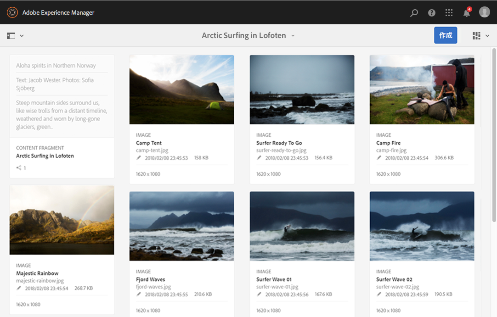
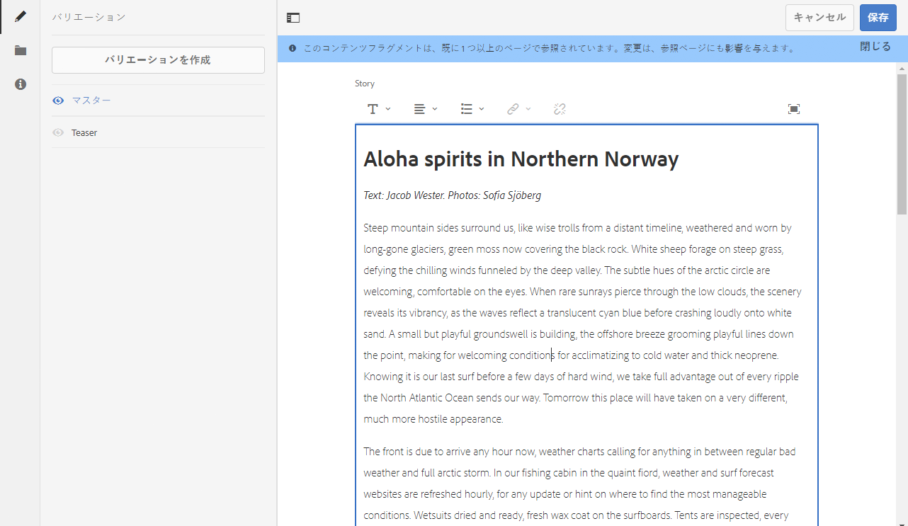
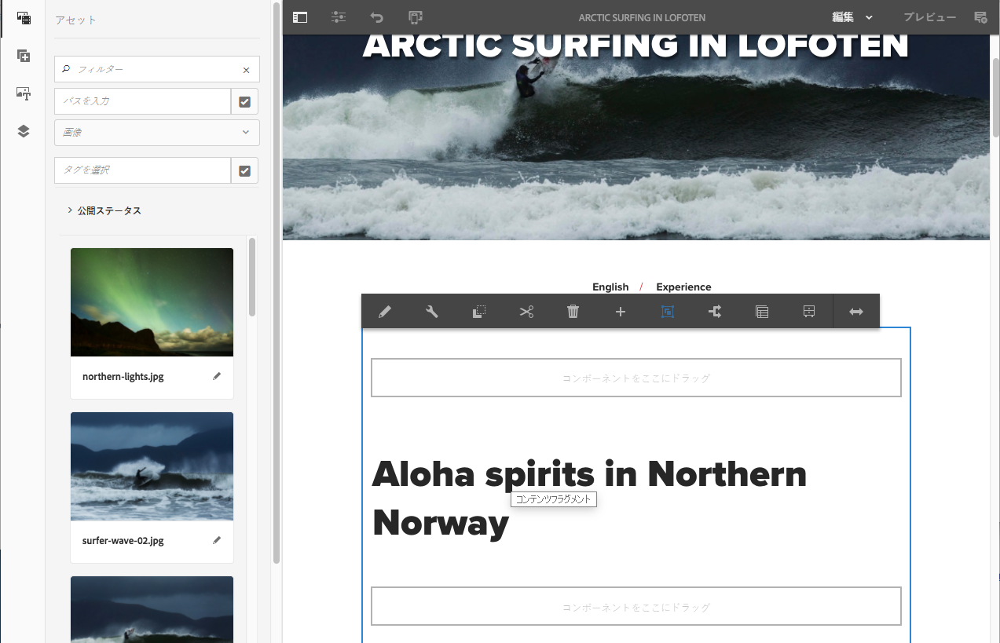

# We.Retail のコンテンツフラグメントの使用{#trying-out-content-fragments-in-we-retail}

コンテンツフラグメントを使用すると、チャネルに特化しないコンテンツをチャネル固有のバリエーションと共に作成できます。**We.Retail** (AEMの標準インスタンスで使用可能 ) は、フラグメントを提供します **Arctic Surfing in Lofoten** を基本的なサンプルとして使用します。 このフラグメントは、次のことを示しています。

* Adobe Experience Manager（AEM）のコンテンツフラグメントは、[ページに依存しないアセット](/help/assets/content-fragments.md)として作成および管理されます。コンテンツフラグメントを使用すると、チャネルに特化しないコンテンツをチャネル固有のバリエーションと共に作成できます。

   * 詳しくは、 [We.Retail でのコンテンツフラグメントアセットの場所](#where-to-find-content-fragments-in-we-retail)

* その後、コンテンツページを[オーサリングする際に、これらのフラグメントとそれらのバリエーションを使用](/help/sites-authoring/content-fragments.md)できます。

   * 詳しくは、 [We.Retail でコンテンツフラグメントが使用される場所](#where-content-fragments-are-used-in-we-retail)

コンテンツフラグメントの作成、管理、使用および開発に関する完全なドキュメントについて：

* 詳しくは、 [その他の情報](#further-information)

>[!NOTE]
>
>**コンテンツフラグメント**&#x200B;と&#x200B;**[エクスペリエンスフラグメント](/help/sites-authoring/experience-fragments.md)**&#x200B;は、AEM 内の異なる機能です。
>
>* **コンテンツフラグメント**&#x200B;は、主にテキストや関連画像などの編集コンテンツです。これは、デザインやレイアウトを含まない純粋なコンテンツです。
>* **エクスペリエンスフラグメント**&#x200B;は完全にレイアウトされたコンテンツであり、Web ページのフラグメントです。

>
>エクスペリエンスフラグメントには、コンテンツフラグメントの形式でコンテンツを含めることができますが、その逆はできません。

## We.Retail でのコンテンツフラグメントの場所 {#where-to-find-content-fragments-in-we-retail}

We.Retail には、いくつかのサンプルコンテンツフラグメントがあります。次の場所に移動： **Assets**, **ファイル**, **We.Retail**, **英語**, **エクスペリエンス**.

これには、関連するビジュアルアセットと組み合わせられたフラグメントである **Arctic Surfing in Lofoten** などがあります。

* 次の場所に移動： **Assets**, **ファイル**, **We.Retail**, **英語**, **エクスペリエンス**, **アーティックサーフィンインロフォテン**:

   * [http://localhost:4502/assets.html/content/dam/we-retail/jp/experiences/arctic-surfing-in-lofoten](http://localhost:4502/assets.html/content/dam/we-retail/jp/experiences/arctic-surfing-in-lofoten)

**Arctic Surfing in Lofoten** フラグメントを選択し、編集することができます。

* [http://localhost:4502/editor.html/content/dam/we-retail/en/experiences/arctic-surfing-in-lofoten/arctic-surfing-in-lofoten](http://localhost:4502/editor.html/content/dam/we-retail/en/experiences/arctic-surfing-in-lofoten/arctic-surfing-in-lofoten)

ここでは、タブ（左側のパネル）を使用してフラグメントを[編集および管理](/help/assets/content-fragments.md)できます。

 

* **[マークダウン](/help/assets/content-fragments-variations.md)**&#x200B;を含む[バリエーション](/help/assets/content-fragments-markdown.md)

* **[関連コンテンツ](/help/assets/content-fragments-assoc-content.md)**
* **[メタデータ](/help/assets/content-fragments-metadata.md)**

## We.Retail でコンテンツフラグメントが使用される場所 {#where-content-fragments-are-used-in-we-retail}

[コンテンツフラグメントを使用したページオーサリング](/help/sites-authoring/content-fragments.md)の例を示すために、次のような様々なサンプルページが用意されています。

* [http://localhost:4502/sites.html/content/we-retail/language-masters/en/experience](http://localhost:4502/sites.html/content/we-retail/language-masters/en/experience)

例えば、 **Arctic Surfing in Lofoten** コンテンツフラグメントは Sites ページで参照されます。

* 次の場所に移動： **サイト**, **We.Retail**, **言語マスター**, **英語**, **エクスペリエンス**. その後、**Arctic Surfing in Lofoten** を開いて編集をおこないます。

   * [http://localhost:4502/editor.html/content/we-retail/language-masters/en/experience/arctic-surfing-in-lofoten.html](http://localhost:4502/editor.html/content/we-retail/language-masters/en/experience/arctic-surfing-in-lofoten.html)

## その他の情報 {#further-information}

詳しくは、以下を参照してください。

* [コンテンツフラグメントの操作](/help/assets/content-fragments.md)

   * コンテンツフラグメントアセットを作成、編集および管理する方法について説明します。

* [コンテンツフラグメントを使用したページのオーサリング](/help/sites-authoring/content-fragments.md)

   * ページのオーサリング時にコンテンツフラグメントを使用します。

* [AEM の開発 - コンテンツフラグメント用コンポーネント](/help/sites-developing/components-content-fragments.md)

   * コンテンツフラグメント用コンポーネントの概要です。

* [コンテンツフラグメントの開発と拡張](/help/sites-developing/customizing-content-fragments.md)

   * コンテンツフラグメントの開発と拡張に役立つ情報です。
