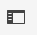
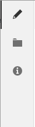

# We.Retail のコンテンツフラグメントの使用{#trying-out-content-fragments-in-we-retail}

コンテンツフラグメントを使用すると、チャネルに特化しないコンテンツをチャネル固有のバリエーションと共に作成できます。（AEM の標準のインスタンスで使用できる）**We.Retail** には、基本のサンプルとして **Arctic Surfing in Lofoten** フラグメントが用意されています。これは、次のことを示しています。

* Adobe Experience Manager（AEM）のコンテンツフラグメントは、[ページに依存しないアセット](/help/assets/content-fragments.md)として作成および管理されます。チャネルに特化しないコンテンツを、チャネル固有のバリエーションと共に作成できます。

   * [We.Retail でのコンテンツフラグメントアセットの場所](#where-to-find-content-fragments-in-we-retail)を参照してください。

* その後、コンテンツページを[オーサリングする際に、これらのフラグメントとそれらのバリエーションを使用](/help/sites-authoring/content-fragments.md)できます。

   * [We.Retail でコンテンツフラグメントが使用される場所](#where-content-fragments-are-used-in-we-retail)を参照してください。

コンテンツフラグメントの作成、管理、使用および開発に関する完全なドキュメントについて：

* [その他の情報](#further-information)を参照してください。

>[!NOTE]
>
>**コンテンツフラグメント**&#x200B;と&#x200B;**[エクスペリエンスフラグメント](/help/sites-authoring/experience-fragments.md)**&#x200B;は、AEM 内の異なる機能です。
>
>* **コンテンツフラグメント** は編集コンテンツで、主にテキストと関連する画像です。 これらは、デザインやレイアウトを含まない純粋なコンテンツです。
>* **エクスペリエンスフラグメント**&#x200B;は完全にレイアウトされたコンテンツであり、web ページのフラグメントです。
>
>エクスペリエンスフラグメントには、コンテンツフラグメントの形式でコンテンツを含めることができますが、その逆はできません。

## We.Retail でのコンテンツフラグメントの場所 {#where-to-find-content-fragments-in-we-retail}

We.Retail には、様々なコンテンツフラグメントのサンプルがあり、**Assets**／**ファイル**／**We.Retail**／**英語**／**エクスペリエンス**&#x200B;からアクセスできます。

これには、関連するビジュアルアセットと組み合わせられたフラグメントである **Arctic Surfing in Lofoten** などがあります。

* **Assets**／**ファイル**／**We.Retail**／**英語**／**エクスペリエンス**／**Artic Surfing in Lofoten** の順に移動します。

   * [http://localhost:4502/assets.html/content/dam/we-retail/jp/experiences/arctic-surfing-in-lofoten](http://localhost:4502/assets.html/content/dam/we-retail/jp/experiences/arctic-surfing-in-lofoten)

**Arctic Surfing in Lofoten** フラグメントを選択し、編集することができます。

* [http://localhost:4502/editor.html/content/dam/we-retail/en/experiences/arctic-surfing-in-lofoten/arctic-surfing-in-lofoten](http://localhost:4502/editor.html/content/dam/we-retail/en/experiences/arctic-surfing-in-lofoten/arctic-surfing-in-lofoten)

ここで、 [編集と管理](/help/assets/content-fragments.md) タブ（左側のパネル）を使用してフラグメントを次のように設定します。

 

* **[マークダウン](/help/assets/content-fragments-variations.md)**&#x200B;を含む[バリエーション](/help/assets/content-fragments-markdown.md)

* **[関連コンテンツ](/help/assets/content-fragments-assoc-content.md)**
* **[メタデータ](/help/assets/content-fragments-metadata.md)**

## We.Retail でコンテンツフラグメントが使用される場所 {#where-content-fragments-are-used-in-we-retail}

説明する [コンテンツフラグメントを使用したページオーサリング](/help/sites-authoring/content-fragments.md) の下には、例えば次のようなサンプルページが用意されています。

* [http://localhost:4502/sites.html/content/we-retail/language-masters/en/experience](http://localhost:4502/sites.html/content/we-retail/language-masters/en/experience)

例えば、**Arctic Surfing in Lofoten** のコンテンツフラグメントは、次の手順に沿って Sites ページで参照できます。

* **Sites**／**We.Retail**／**言語マスター**／**英語**／**エクスペリエンス**&#x200B;の順に移動します。その後、**Arctic Surfing in Lofoten** を開いて編集をおこないます。

   * [http://localhost:4502/editor.html/content/we-retail/language-masters/en/experience/arctic-surfing-in-lofoten.html](http://localhost:4502/editor.html/content/we-retail/language-masters/en/experience/arctic-surfing-in-lofoten.html)

## その他の情報 {#further-information}

詳しくは、以下を参照してください。

* [コンテンツフラグメントの使用方法](/help/assets/content-fragments.md)

   * コンテンツフラグメントアセットを作成、編集および管理する方法について説明します。

* [コンテンツフラグメントを使用したページのオーサリング](/help/sites-authoring/content-fragments.md)

   * ページのオーサリング時にコンテンツフラグメントを使用します。

* [AEM の開発 - コンテンツフラグメント用コンポーネント](/help/sites-developing/components-content-fragments.md)

   * コンテンツフラグメント用コンポーネントの概要です。

* [コンテンツフラグメントの開発と拡張](/help/sites-developing/customizing-content-fragments.md)

   * コンテンツフラグメントの開発と拡張に役立つ情報です。
