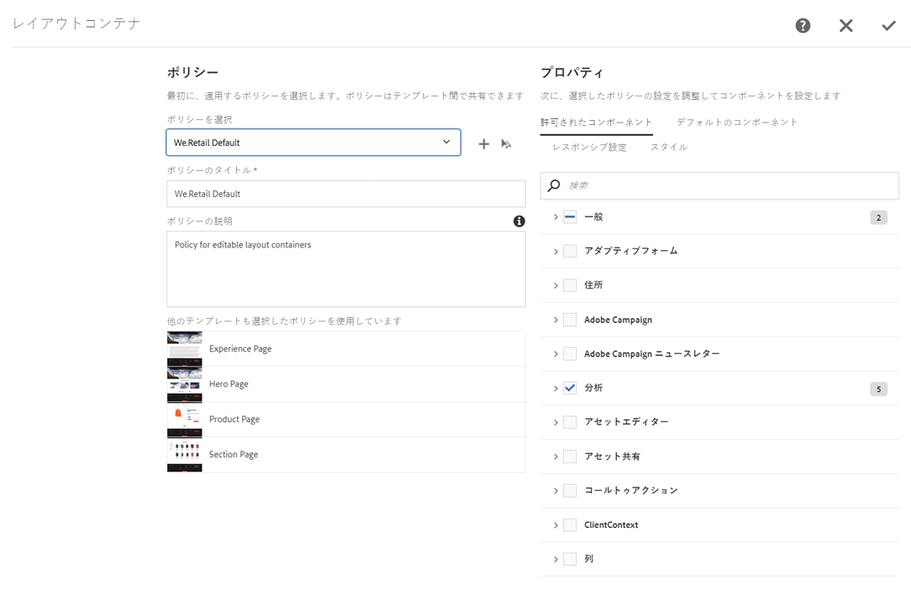

# We.Retail の編集可能テンプレートの使用{#trying-out-editable-templates-in-we-retail}

編集可能テンプレートでテンプレートを作成して管理することは、開発者のみのタスクではなくなりました。テンプレート作成者と呼ばれる一種の上級ユーザーは、テンプレートを作成できるようになりました。環境の設定、クライアントライブラリの作成、使用されるコンポーネントの作成は今でも開発者がおこなう必要がありますが、これら基本となる部分が一度配置されると、テンプレート作成者が開発プロジェクトなしにテンプレートを作成して構成できるようになります。

We.Retail のページはすべて編集可能テンプレートに基づいており、開発者以外のユーザーがテンプレートを変更したり、カスタマイズしたりできます。

## 試してみる  {#trying-it-out}

1. 言語マスターブランチの装備ページを編集します。

   http://localhost:4502/editor.html/content/we-retail/language-masters/en/equipment.html

1. モードセレクターにデザインモードがなくなったことを確認します。We.Retail のページはすべて編集可能テンプレートに基づいています。編集可能テンプレートのデザインを変更するには、テンプレートエディターで編集する必要があります。
1. **ページ情報**&#x200B;メニューから「**テンプレートを編集**」を選択します。
1. 現在編集しているのはヒーローページテンプレートです。

   ページの構造モードにより、テンプレートの構造を変更できます。これには、例えば、レイアウトコンテナで使用可能なコンポーネントが含まれます。

   

1. レイアウトコンテナのポリシーを設定して、コンテナで使用可能なコンポーネントを定義します。

   ポリシーはデザイン設定に相当します。

   

1. レイアウトコンテナのデザインダイアログでは、以下を実行できます。

   * コンテナに既存のポリシーを選択するか、新しいポリシーを作成します。
   * コンテナで使用できるコンポーネントを選択します。
   * アセットがコンテナにドラッグされたときに配置されるデフォルトのコンポーネントを定義します。

   

1. テンプレートエディターに戻り、レイアウトコンテナ内のテキストコンポーネントのポリシーを編集できます。

   以下を実行できます。

   * コンテナに既存のポリシーを選択するか、新しいポリシーを作成します。
   * ページ作成者がこのコンポーネントの使用時に利用できる機能を定義します。これには以下のような機能があります。

      * 許可される貼り付け元
      * 書式設定オプション
      * 許可される段落スタイル
      * 許可される特殊文字

   コアコンポーネントに基づく多くのコンポーネントでは、編集可能テンプレートを通じて、コンポーネントレベルでオプションを設定できます。開発者がカスタマイズする必要はありません。

   

1. テンプレートエディターに戻り、モードセレクターを使用して&#x200B;**初期コンテンツ**&#x200B;モードに変更し、ページに必要なコンテンツを定義します。

   テンプレートのレイアウトを定義するには、通常のページと同様に、**レイアウト**&#x200B;モードを使用できます。

## 詳細情報  {#more-information}

詳しくは、オーサリングドキュメント[ページテンプレートの作成](/help/sites-authoring/templates.md)または開発者ドキュメントのページ[テンプレート — 編集可能](/help/sites-developing/page-templates-editable.md)を参照して、編集可能なテンプレートの技術的詳細を確認してください。

また、[コアコンポーネント](/help/sites-developing/we-retail-core-components.md)についても調べることをお勧めします。コアコンポーネントの機能の概要については、オーサリングドキュメント[コアコンポーネント](https://docs.adobe.com/content/help/ja/experience-manager-core-components/using/introduction.html)を、技術概要については、開発者ドキュメント[コアコンポーネントの開発](https://helpx.adobe.com/experience-manager/core-components/using/developing.html)を参照してください。
