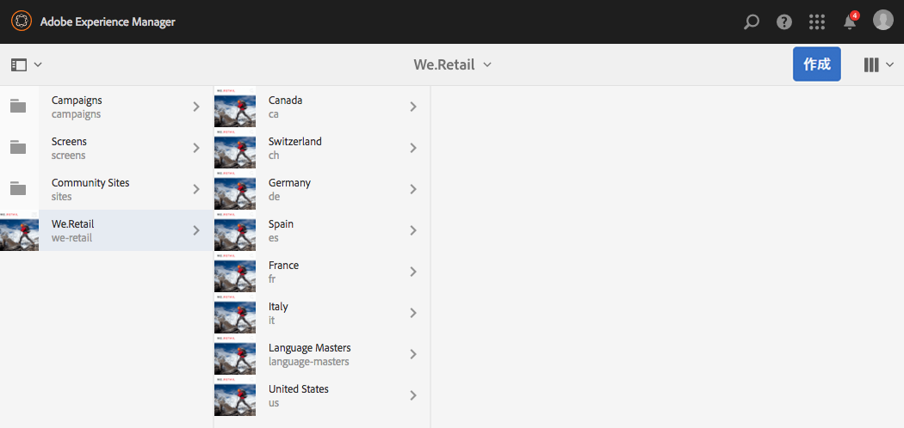
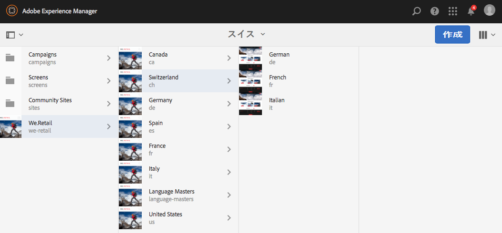
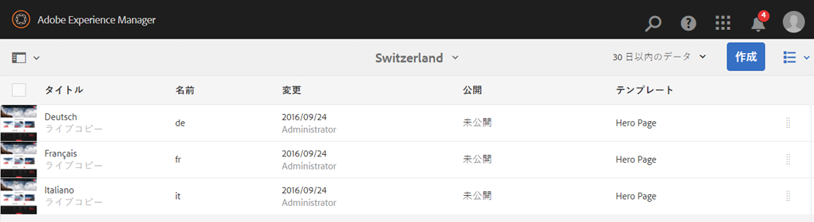
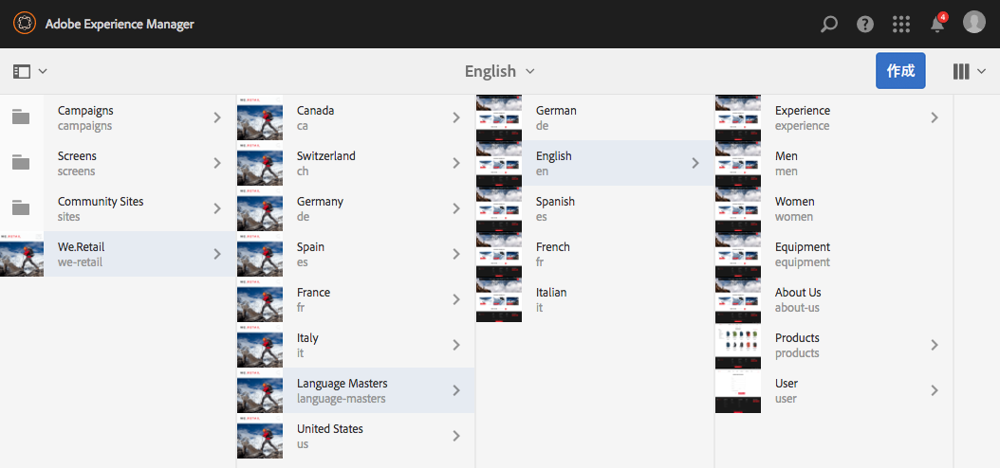
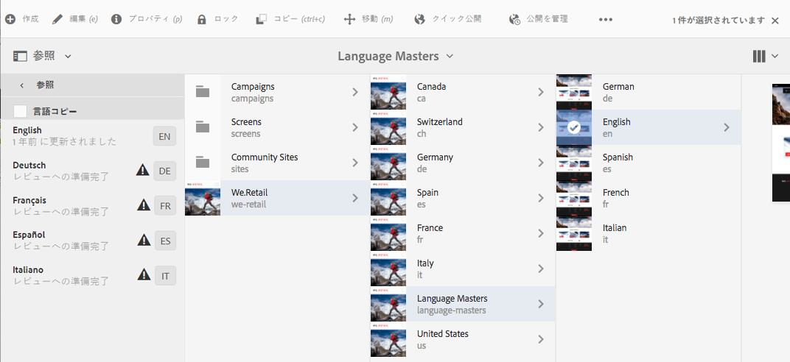
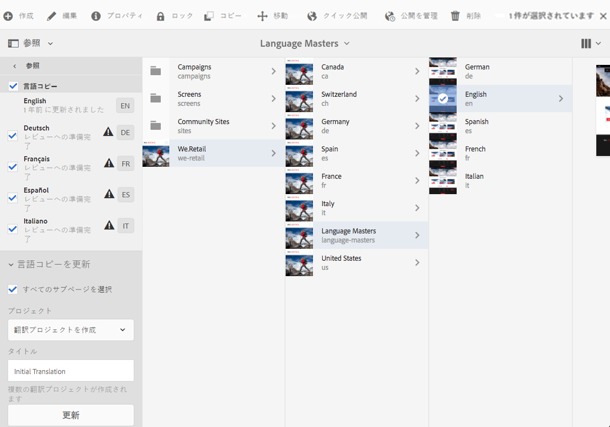
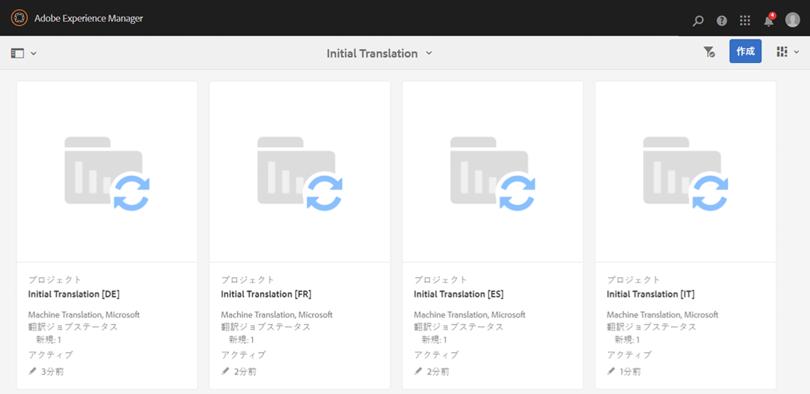
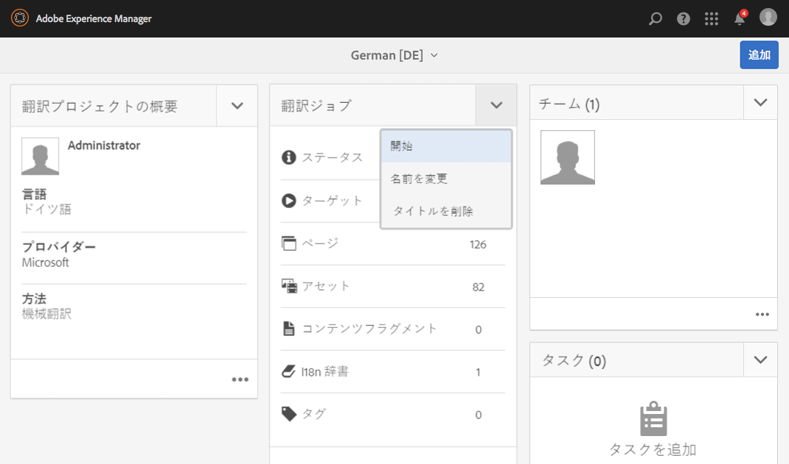
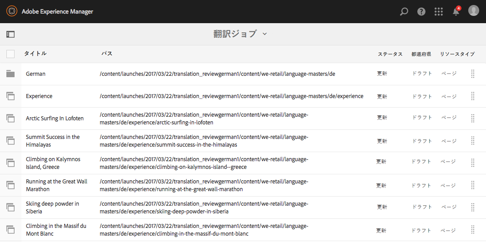
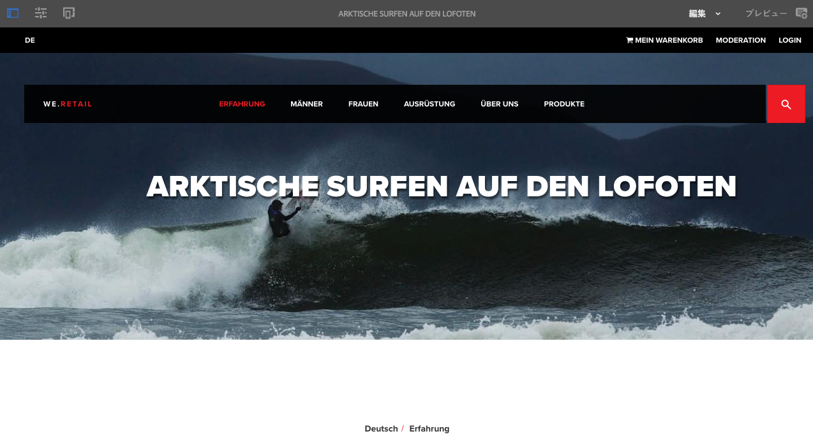

# We.Retail のグローバル化されたサイト構造の使用{#trying-out-the-globalized-site-structure-in-we-retail}

>[!CAUTION]
>
>AEM 6.4 の拡張サポートは終了し、このドキュメントは更新されなくなりました。 詳細は、 [技術サポート期間](https://helpx.adobe.com/jp/support/programs/eol-matrix.html). サポートされているバージョンを見つける [ここ](https://experienceleague.adobe.com/docs/?lang=ja).

We.Retail は、グローバル化されたサイト構造を使用して構築され、国固有の Web サイトにライブコピーできる言語マスターを提供します。 すべての機能が標準で設定されており、この構造と組み込みの翻訳機能を試すことができます。

## 試す {#trying-it-out}

1. 次の場所からサイトコンソールを開きます。 **グローバルナビゲーション/サイト**.
1. 列表示に切り替えて（まだアクティブでない場合）、We.Retail を選択します。 サンプルの国の構造には、言語マスターに加えてスイス、アメリカ、フランスなどが含まれています。

   

1. スイスを選択し、その国の言語の言語ルートを確認します。 これらのルートの下には、まだコンテンツがないことに注意してください。

   

1. リスト表示に切り替えて、各国の言語コピーがすべてライブコピーであることを確認します。

   

1. 列表示に戻り、言語マスターをクリックして、コンテンツを含む言語マスタールートを表示します。 コンテンツを持つのは英語のみです。

   We.Retail には翻訳済みのコンテンツは付属していませんが、翻訳サービスをデモするための構造と設定が用意されています。

   

1. 英語の言語マスターを選択した状態で、サイトコンソールで&#x200B;**参照**&#x200B;レールを開き、**言語コピー**&#x200B;を選択します。

   

1. の横にあるチェックボックスをオンにします。 **言語コピー** ラベル：すべての言語コピーを選択します。 内 **言語コピーを更新** パネルの「 」セクションで、「 **新しい翻訳プロジェクトを作成**. プロジェクトの名前を入力し、 **更新**.

   

1. 言語の翻訳ごとにプロジェクトが作成されます。 以下に表示します。 **ナビゲーション/プロジェクト**.

   

1. ドイツ語をクリックして、翻訳プロジェクトの詳細を表示します。 ステータスは **ドラフト**. Microsoftの翻訳サービスを使用して翻訳を開始するには、 **翻訳ジョブ** 見出しと選択 **開始**.

   

1. 翻訳プロジェクトが開始します。 詳細を確認するには、翻訳ジョブというラベルが付いたカードの下部にある省略記号をクリックします。 状態を含むページ **レビューの準備完了** は、翻訳サービスによって既に翻訳されています。

   

1. リスト内のページの 1 つを選択し、ツールバーの「**サイトでプレビュー**」を選択すると、翻訳されたページがページエディターで開かれます。

   

>[!NOTE]
>
>この手順では、Microsoftの機械翻訳との組み込みの統合について説明しました。 の使用 [AEM Translation Integration Framework](/help/sites-administering/translation.md)を使用すると、多くの標準翻訳サービスと統合して、AEMの翻訳を調整できます。

## その他の情報 {#further-information}

技術的な詳細については、オーサリングドキュメントの [多言語サイトのコンテンツの翻訳](/help/sites-administering/translation.md)を参照してください。
