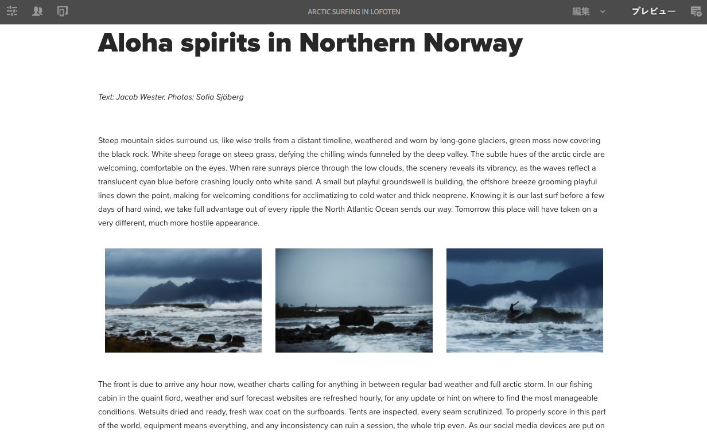
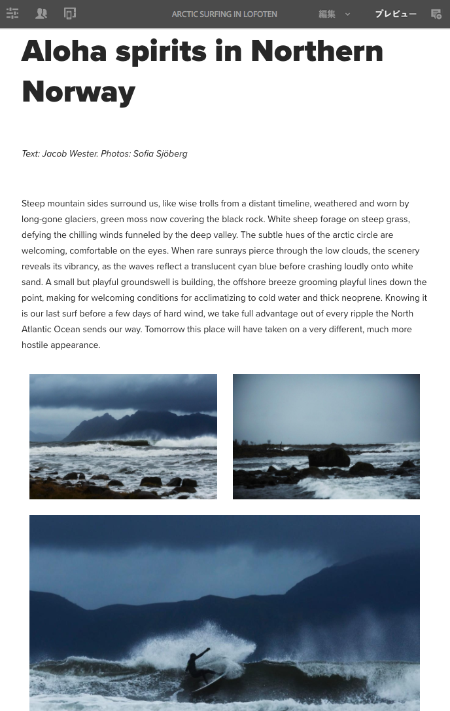
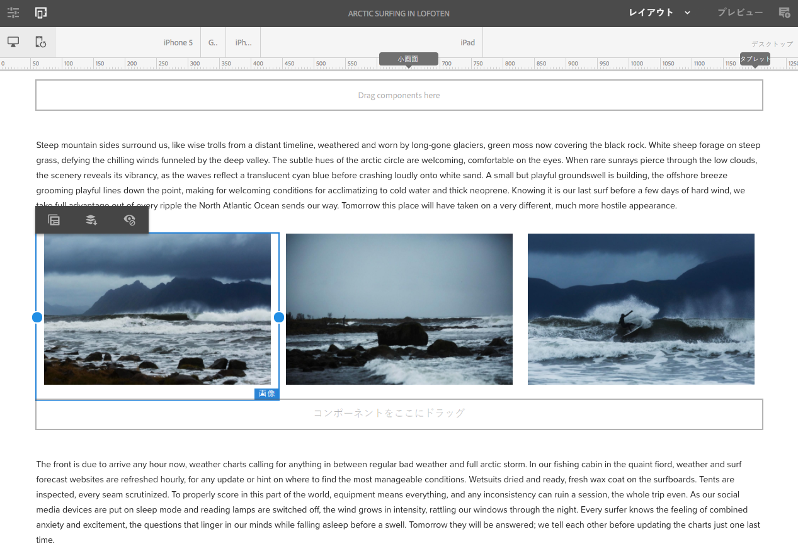
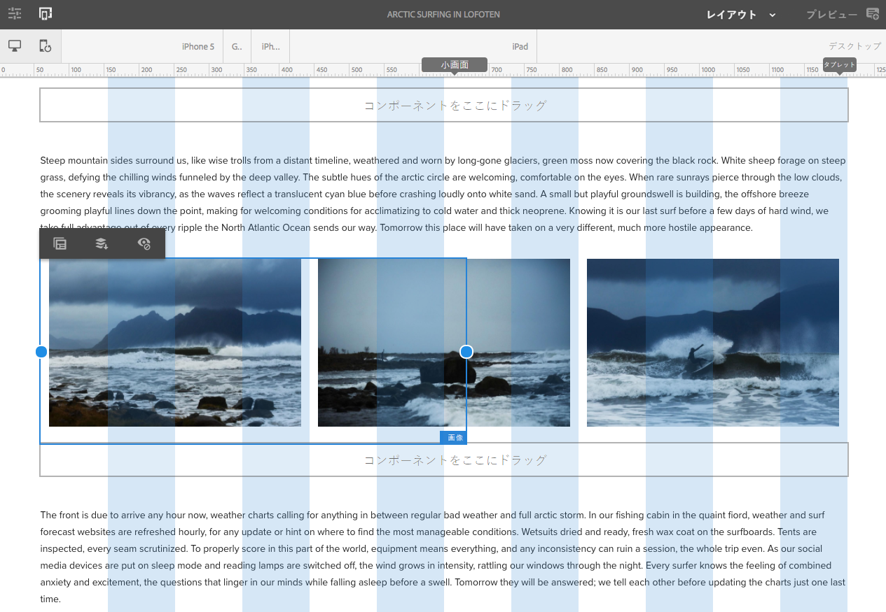

# We.Retail のレスポンシブレイアウトの使用{#trying-out-responsive-layout-in-we-retail}

>[!CAUTION]
>
>AEM 6.4 の拡張サポートは終了し、このドキュメントは更新されなくなりました。 詳細は、 [技術サポート期間](https://helpx.adobe.com/jp/support/programs/eol-matrix.html). サポートされているバージョンを見つける [ここ](https://experienceleague.adobe.com/docs/?lang=ja).

We.Retail のすべてのページでは、レスポンシブデザインを実装するためにレイアウトコンテナコンポーネントが使用されています。レイアウトコンテナは、レスポンシブグリッド内にコンポーネントを配置できる段落システムを提供します。 このグリッドでは、デバイス/ウィンドウのサイズと形式に従ってレイアウトを並べ替えることができます。 このコンポーネントを、ページエディターの&#x200B;**レイアウト**&#x200B;モードと組み合わせて使用すると、デバイスに依存するレスポンシブレイアウトを作成および編集できます。

## 試す {#trying-it-out}

1. 言語 master ブランチの「エクスペリエンス」セクションで、 Arctic Surfing ページを編集します。

   http://localhost:4502/editor.html/content/we-retail/language-masters/en/experience/arctic-surfing-in-lofoten.html

1. 切り替え先 **プレビュー** を使用して、web サイトの訪問者にレンダリングされるページを確認できます。 記事「*Aloha spirits in Norther Norway*」のコンテンツまでスクロールダウンします。

   

1. ブラウザーウィンドウのサイズを変更し、そのサイズ変更に対してレイアウトが動的に調整されることを確認します。

   

1. レイアウトモードに切り替えます。 エミュレーターツールバーが自動的に表示され、ターゲットデバイスごとにレイアウトを計画できます。

   コンポーネントを選択すると、編集メニューにフローティングおよび非表示オプションと共に、コンポーネントのサイズ変更ハンドルが表示されます。

   

1. コンポーネントのサイズ変更ハンドルを選択してドラッグすると、サイズ変更に役立つレイアウトグリッドが自動的に表示されます。

   

## その他の情報 {#further-information}

技術的な詳細については、オーサリングドキュメントの[レスポンシブレイアウト](/help/sites-authoring/responsive-layout.md)または管理者向けドキュメントの[レイアウトコンテナとレイアウトモードの設定](/help/sites-administering/configuring-responsive-layout.md)を参照してください。
