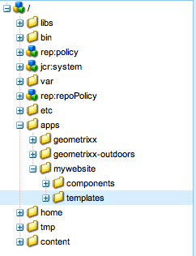
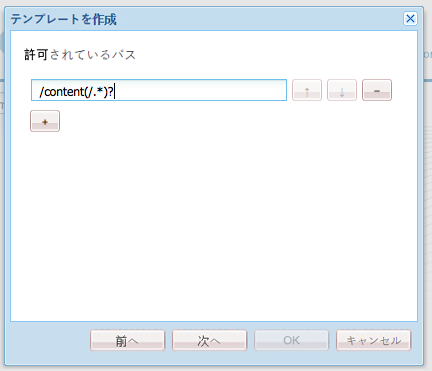
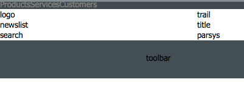
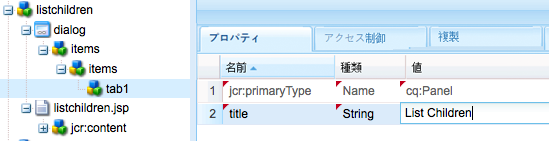

# 完全な機能を備えた Web サイトの作成（JSP）{#create-a-fully-featured-website-jsp}

>[!CAUTION]
>
>この記事では、JSP とクラシック UI を使用して Web サイトを作成する方法について説明します。アドビでは、[AEM Sites の開発の手引き](/help/sites-developing/getting-started.md)で詳しく説明しているように、Web サイトに最新の AEM テクノロジーを利用することをお勧めします。

このチュートリアルでは、Adobe Experience Manager（AEM）を使用して完全な機能を備えた Web サイトを作成できます。この Web サイトは汎用の Web サイトをベースとし、主に Web 開発者をターゲットとしています。開発はすべて、オーサー環境内でおこなわれます。

このチュートリアルでは、次の方法を説明します。

1. AEM をインストールします。
1. CRXDE Lite（開発環境）にアクセスします。
1. CRXDE Lite でプロジェクトの構造を設定します。
1. コンテンツページ作成の基礎として使用するテンプレート、コンポーネントおよびスクリプトを作成します。
1. Web サイトのルートページを作成し、次にコンテンツページを作成します。
1. ページで使用する以下のコンポーネントを作成します。

   * **[!UICONTROL 上部ナビゲーション]**
   * **[!UICONTROL リストの子]**
   * **[!UICONTROL ロゴ]**
   * **[!UICONTROL 画像]**
   * **[!UICONTROL テキスト画像]**
   * **[!UICONTROL 検索]**

1. 様々な基盤コンポーネントを含めます。

すべての手順を実行後、ページは次のようになります。


**最終結果のダウンロード**

演習をおこなわずにチュートリアルに従う場合は、website-1.0.zip をダウンロードします。このファイルは、このチュートリアルの結果を含む AEM コンテンツパッケージです。[パッケージマネージャー](/help/sites-administering/package-manager.md)を使用して、オーサーインスタンスにパッケージをインストールします。

>[!NOTE]
>このパッケージをインストールすると、このチュートリアルを使用して作成したオーサリングインスタンス上のリソースが上書きされます。

Web サイトコンテンツパッケージ

[ファイルを入手](assets/website-1_0.zip)

## Adobe Experience Manager のインストール {#installing-adobe-experience-manager}

Webサイト開発用のAEMインスタンスをインストールするには、[デプロイメント環境と作成者および発行インスタンス](/help/sites-deploying/deploy.md#author-and-publish-installs)を設定する手順に従うか、[一般的なインストール](/help/sites-deploying/deploy.md#default-local-install)を実行します。汎用インストールでは、AEM Quickstart JARファイルのダウンロード、JARファイルと同じディレクトリにlicense.propertiesファイルを配置、JARファイルを重複クリックします。

AEM をインストールしたら、ようこそページで CRXDE Lite のリンクをクリックして CRXDE Lite 開発環境にアクセスします。


>[!NOTE]
>
>デフォルトのポートを使用してローカルにインストールされたAEMオーサリングインスタンスのCRXDE LiteのURLは[http://localhost:4502/crx/de/](http://localhost:4502/crx/de/)です。

## CRXDE Lite でのプロジェクト構造の設定 {#setting-up-the-project-structure-in-crxde-lite}

CRXDE Lite を使用して、リポジトリ内に mywebsite アプリケーション構造を作成します。

1. CRXDE Liteーの左側のツリーで、**`/apps`**&#x200B;フォルダーを右クリックし、**[!UICONTROL 作成/フォルダーを作成]**&#x200B;をクリックします。 **フォルダーを作成**&#x200B;ダイアログで、フォルダー名として`mywebsite`と入力し、「**OK**」をクリックします。
1. `/apps/mywebsite`フォルダーを右クリックし、**[!UICONTROL 作成/フォルダーを作成]**&#x200B;をクリックします。 **[!UICONTROL フォルダーを作成]**&#x200B;ダイアログで、フォルダー名として`components`と入力し、「**[!UICONTROL OK]**」をクリックします。
1. `/apps/mywebsite`フォルダーを右クリックし、**[!UICONTROL 作成/フォルダーを作成]**&#x200B;をクリックします。 **[!UICONTROL フォルダーを作成]**&#x200B;ダイアログで、フォルダー名として`templates`と入力し、「**[!UICONTROL OK]**」をクリックします。

   ツリー内の構造は次のようになります。

   

1. 「**[!UICONTROL すべて保存]**」をクリックします。

## デザインの設定 {#setting-up-the-design}

ここでは、デザイナーツールを使用してアプリケーションのデザインを作成します。デザインによって、Web サイトに CSS リソースおよび画像リソースが提供されます。

>[!NOTE]
>
>``mywebsite.zip``をダウンロードするには、次のリンクをクリックしてください。アーカイブには、デザイン用のstatic.cssファイルと画像ファイルが含まれます。

サンプルの static.css ファイルおよび画像

[ファイルを入手](assets/mywebsite.zip)

1. AEM のようこそページで、「**[!UICONTROL ツール]**」をクリックします（[http://localhost:4502/libs/cq/core/content/welcome.html](http://localhost:4502/libs/cq/core/content/welcome.html)）。

   

1. フォルダーツリーで、**[!UICONTROL Designs]**&#x200B;フォルダーを選択し、**[!UICONTROL 新規/新規ページ]**&#x200B;をクリックします。 タイトルに「`mywebsite`」と入力し、「**[!UICONTROL 作成]**」をクリックします。

1. mywebsite という項目がテーブルに表示されない場合は、ツリーまたはテーブルを更新します。

1. [http://localhost:4502にあるURLへの](/help/sites-administering/webdav-access.md) WebDAVアクセスを使用して、ダウンロードしたmywebsite.zipファイルからサンプルの `static.css` ファイルと `images` フォルダーを `/etc/designs/mywebsite` フォルダーにコピーします。

   

## Contentpageテンプレート、コンポーネント、スクリプトの作成{#creating-the-contentpage-template-component-and-script}

ここでは、以下を作成します。

* サンプル Web サイトのコンテンツページを作成する際に使用する contentpage テンプレート
* コンテンツのページをレンダリングする際に使用する contentpage コンポーネント
* contentpage スクリプト

### contentpage テンプレートの作成  {#creating-the-contentpage-template}

サイトの Web ページの基礎として使用するテンプレートを作成します。

テンプレートは、新しいページのデフォルトのコンテンツを定義するものです。複雑な Web サイトでは、複数のテンプレートを使用して、サイト内の様々なタイプのページを作成する場合があります。この演習では、すべてのページを 1 つの単純なテンプレートに基づいて作成します。

1. CRXDE Liteーのフォルダーツリーで、`/apps/mywebsite/templates`を右クリックし、**[!UICONTROL 作成/テンプレートを作成]**&#x200B;をクリックします。

1. テンプレートを作成ダイアログで、次の値を入力し、「**[!UICONTROL 次へ]**」をクリックします。

   * **[!UICONTROL ラベル]**：contentpage
   * **[!UICONTROL タイトル]**：My Website Content Page Template
   * **[!UICONTROL 説明]**：This is my Website Content Page Template
   * **[!UICONTROL リソースの種類]**:mywebサイト/components/contentpage

   「ランキング」プロパティにはデフォルト値を使用します。

   

   リソースタイプは、ページをレンダリングするコンポーネントを識別します。 この場合、contentpageテンプレートを使用して作成されたすべてのページは、`mywebsite/components/contentpage`コンポーネントによってレンダリングされます。

1. このテンプレートを使用できるページのパスを指定するには、プラスボタンをクリックし、表示されるテキストボックスに「`/content(/.*)?`」と入力します。 次に、「**[!UICONTROL 次へ]**」をクリックします。

   

   許可されるパスプロパティの値は、*正規式です。*&#x200B;式と一致するパスを持つページでは、テンプレートを使用できます。 この場合、正規式は`/content`フォルダーとすべてのサブページのパスに一致します。

   作成者が`/content`の下にページを作成すると、**[!UICONTROL contentpage]**&#x200B;テンプレートが、使用可能なテンプレートのリストに表示されます。

1. **[!UICONTROL 許可された親]**&#x200B;パネルおよび&#x200B;**[!UICONTROL 許可されている子]**&#x200B;パネルで「**[!UICONTROL 次へ]**」をクリックして、「**[!UICONTROL OK]**」をクリックします。CRXDE Lite で、「**[!UICONTROL すべて保存]**」をクリックします。

   

#### contentpage コンポーネントの作成 {#creating-the-contentpage-component}

コンテンツを定義し、contentpage テンプレートを使用するコンポーネントを作成します。**&#x200B;コンポーネントの場所は、contentpage テンプレートの「リソースタイプ」プロパティの値と一致する必要があります。

1. CRXDE Liteで、`/apps/mywebsite/components`を右クリックし、**[!UICONTROL 作成/コンポーネント]**&#x200B;をクリックします。
1. **[!UICONTROL コンポーネントを作成]**&#x200B;ダイアログで、以下のプロパティ値を入力します。

   * **[!UICONTROL ラベル]**：contentpage
   * **[!UICONTROL タイトル]**：My Website Content Page Component
   * **[!UICONTROL 説明]**：This is My Website Content Page Component

   

   新しいコンポーネントの場所は`/apps/mywebsite/components/contentpage`です。 このパスは、contentpageテンプレート（パスの最初の`/apps/`部分を除く）のリソースタイプに対応します。

   この一致は、テンプレートをコンポーネントと結び付けるものなので、Web サイトを正常に機能させるために重要です。

1. **[!UICONTROL 次へ]**&#x200B;をクリックして、ダイアログの&#x200B;**[!UICONTROL 許可されている子]**&#x200B;パネルが表示されたら、**[!UICONTROL OK]**&#x200B;をクリックします。CRXDE Liteで、「**[!UICONTROL すべて保存]**」をクリックします。

   この時点で構造は次のようになります。

   

#### contentpage コンポーネントスクリプトの開発 {#developing-the-contentpage-component-script}

contentpage.jsp スクリプトにコードを追加してページコンテンツを定義します。

1. CRXDE Liteで、`/apps/mywebsite/components/contentpage`の`contentpage.jsp`ファイルを開きます。 ファイルにはデフォルトで次のコードが含まれています。

   ```java
   <%--
   
     My Website Content Page Component component.
   
     This is My Website Content Page Component.
   
   --%><%
   %><%@include file="/libs/foundation/global.jsp"%><%
   %><%@page session="false" %><%
   %><%
       /* TODO add you code here */
   %>
   ```

1. 以下のコードをコピーして、contentpage.jsp のデフォルトコードの後に貼り付けます。

   ```java
   <%@ page language="java" contentType="text/html; charset=ISO-8859-1"
       pageEncoding="ISO-8859-1"%>
   <!DOCTYPE html PUBLIC "-//W3C//DTD HTML 4.01 Transitional//EN" 
   "https://www.w3.org/TR/html4/loose.dtd">
   <html>
   <head>
   <meta http-equiv="Content-Type" content="text/html; charset=ISO-8859-1">
   <title>My title</title>
   </head>
   <body>
   <div>My body</div>
   </body>
   </html>
   ```

1. 「**[!UICONTROL すべて保存]**」をクリックして変更を保存します。

### Web サイトページおよびコンテンツページの作成 {#creating-your-website-page-and-content-pages}

このセクションでは、次のページを作成し、すべてのページでcontentpageテンプレートを使用します。Webサイト、英語、製品、サービス、およびお客様

1. AEM のようこそページ（[http://localhost:4502/libs/cq/core/content/welcome.html](http://localhost:4502/libs/cq/core/content/welcome.html)）で、「Web サイト」をクリックします。

   

1. フォルダーツリーで、**[!UICONTROL Webサイト]**&#x200B;フォルダーを選択し、**[!UICONTROL 新規/新規ページ]**&#x200B;をクリックします。
1. **[!UICONTROL ページを作成]**&#x200B;ウィンドウで、以下を入力します。

   * **[!UICONTROL タイトル]**: `My Website`
   * **[!UICONTROL 名前]**：`mywebsite`
   * 「**[!UICONTROL My Website Content Page Template]**」を選択します。

   

1. 「**[!UICONTROL 作成]**」をクリックします。フォルダーツリーで、`/Websites/My Website`ページを選択し、**[!UICONTROL 新規/新規ページ]**&#x200B;をクリックします。
1. **[!UICONTROL ページを作成]**&#x200B;ダイアログで、以下のプロパティ値を入力して「作成」をクリックします。

   * **[!UICONTROL タイトル]**:英語
   * **[!UICONTROL 名前]**:en
   * 「**[!UICONTROL My Website Content Page Template]**」を選択します。

1. フォルダーツリーで、`/Websites/My Website/English`ページを選択し、**[!UICONTROL 新規/新規ページ]**&#x200B;をクリックします。
1. **[!UICONTROL ページを作成]**&#x200B;ダイアログで、以下のプロパティ値を入力して「**[!UICONTROL 作成]**」をクリックします。

   * **[!UICONTROL タイトル]**:製品
   * 「**[!UICONTROL My Website Content Page Template]**」を選択します。

1. フォルダーツリーで、`/Websites/My Website/English`ページを選択し、**[!UICONTROL 新規/新規ページ]**&#x200B;をクリックします。
1. **[!UICONTROL ページを作成]**&#x200B;ダイアログで、以下のプロパティ値を入力して「**[!UICONTROL 作成]**」をクリックします。

   * **タイトル**:サービス
   * 「**[!UICONTROL My Website Content Page Template]**」を選択します。

1. フォルダーツリーで、`/Websites/My Website/English`ページを選択し、**[!UICONTROL 新規/新規ページ]**&#x200B;をクリックします。
1. **[!UICONTROL ページを作成]**&#x200B;ダイアログで、以下のプロパティ値を入力して「**[!UICONTROL 作成]**」をクリックします。

   * **タイトル**:お客様
   * 「**[!UICONTROL My Website Content Page Template]**」を選択します。

   構造は次のようになります。

   

1. ページをmywebサイトデザインにリンクするには、CRXDE Liteで`/content/mywebsite/en/jcr:content`ノードを選択します。 「**[!UICONTROL プロパティ]**」タブで、新しいプロパティに次の値を入力し、追加「プロパティ」をクリックします。

   * **[!UICONTROL 名前]**:cq:designPath
   * **[!UICONTROL 種類]**：string
   * **[!UICONTROL 値]**:/etc/designs/mywebsite

   

1. 新しいWebブラウザーのタブまたはウィンドウで、[http://localhost:4502/content/mywebsite/en/products.html](http://localhost:4502/content/mywebsite/en/products.html)を開いて製品ページを表示します。

   

### contentpage スクリプトの機能強化 {#enhancing-the-contentpage-script}

ここでは、AEM 基盤コンポーネントのスクリプトを使用し、独自のスクリプトを作成することによって contentpage スクリプトの機能を強化する方法について説明します。

**[!UICONTROL Products]** ページは次のようになります。


#### 基盤ページスクリプトの使用 {#using-the-foundation-page-scripts}

この練習では、pagecontentコンポーネントを設定して、スーパータイプがAEM Pageコンポーネントになるようにします。コンポーネントはスーパータイプの機能を継承するので、ページコンテンツはページコンポーネントのスクリプトとプロパティを継承します。

例えば、自分のコンポーネントの JSP コード内で、スーパータイプコンポーネントによって提供されているスクリプトを、自分のコンポーネントに含まれているかのように参照できます。

1. CRXDE Liteで、`/apps/mywebsite/components/contentpage`ノードにプロパティを追加します。

   1. `/apps/mywebsite/components/contentpage`ノードを選択します。
   1. 「プロパティ」タブの下部で、次のプロパティ値を入力し、クリックし追加ます。

      * **[!UICONTROL 名前]**:sling:resourceSuperType
      * **[!UICONTROL 種類]**：string
      * **[!UICONTROL 値]**:foundation/components/page
   1. 「**[!UICONTROL すべて保存]**」をクリックします。


1. `/apps/mywebsite/components/contentpage`の下の`contentpage.jsp`ファイルを開き、既存のコードを次のコードに置き換えます。

   ```xml
   <%@include file="/libs/foundation/global.jsp"%><%
   %><%@page session="false" contentType="text/html; charset=utf-8" %><%
   %><!DOCTYPE HTML PUBLIC "-//W3C//DTD HTML 4.01//EN" "https://www.w3.org/TR/html4/strict.dtd">
   <html>
   <cq:include script="head.jsp"/>
   <cq:include script="body.jsp"/>
   </html>
   ```

1. 変更を保存します。
1. ブラウザーで、**[!UICONTROL 製品]**&#x200B;ページを再読み込みします。次のようになります。

   

   ページソースを開いて、head.jsp スクリプトと body.jsp スクリプトによって生成された JavaScript および HTML の要素を確認します。以下のスクリプトスニペットを指定すると、ページを開いたときにサイドキックが開きます。

   ```java
   CQ.WCM.launchSidekick("/content/mywebsite/en/products",
               {propsDialog: "/libs/foundation/components/page/dialog",
                  locked: false locked: false
                }); 
   ```

#### 独自のスクリプトの使用  {#using-your-own-scripts}

ここでは、それぞれページ本体の一部を生成する複数のスクリプトを作成します。次に、pagecontent コンポーネントで body.jsp ファイルを作成して、AEM のページコンポーネントの body.jsp を上書きします。作成する body.jsp ファイルには、ページ本体の様々な部分を生成するスクリプトを含めます。

**ヒント：**&#x200B;コンポーネントのスーパータイプ内のファイルと同じ名前で相対的な場所も同じファイルがコンポーネントに含まれている場合、これをオーバーレイと呼びます。**

1. CRXDE Liteで、`/apps/mywebsite/components/contentpage`の下にファイル`left.jsp`を作成します。

   1. ノード`/apps/mywebsite/components/contentpage`を右クリックし、「**[!UICONTROL 作成]**」、「**[!UICONTROL ファイルを作成]**」の順に選択します。
   1. ウィンドウで、「**名前**」に「`left.jsp`」と入力し、「**[!UICONTROL OK]**」をクリックします。

1. `left.jsp` ファイルを編集して、既存のコンテンツを削除し、以下のコードに置き換えます。

   ```java
   <%@include file="/libs/foundation/global.jsp"%><%
   %><div class="left">
   <div>logo</div>
   <div>newslist</div>
   <div>search</div>
   </div>
   ```

1. 変更内容を保存します。
1. CRXDE Liteで、`/apps/mywebsite/components/contentpage`の下にファイル`center.jsp`を作成します。

   1. ノード`/apps/mywebsite/components/contentpage`を右クリックし、「**[!UICONTROL 作成]**」、「**[!UICONTROL ファイルを作成]**」の順に選択します。
   1. ダイアログで、`center.jsp`を&#x200B;**[!UICONTROL 名前]**&#x200B;と入力し、**[!UICONTROL OK]**&#x200B;をクリックします。

1. ファイル`center.jsp`を編集して既存のコンテンツを削除し、次のコードに置き換えます。

   ```java
   <%@include file="/libs/foundation/global.jsp"%><%
   %><div class="center">
   <div>trail</div>
   <div>title</div>
   <div>parsys</div>
   </div>
   ```

1. 変更内容を保存します。
1. CRXDE Liteで、`/apps/mywebsite/components/contentpage`の下にファイル`right.jsp`を作成します。

   1. ノード`/apps/mywebsite/components/contentpage`を右クリックし、「**[!UICONTROL 作成]**」、「**[!UICONTROL ファイルを作成]**」の順に選択します。
   1. ダイアログボックスで、「`right.jsp`名前&#x200B;**[!UICONTROL 」に]** と入力して、「**[!UICONTROL OK]**」をクリックします。

1. `right.jsp` ファイルを編集して、既存のコンテンツを削除し、以下のコードに置き換えます。

   ```java
   <%@include file="/libs/foundation/global.jsp"%><%
   %><div class="right">
   <div>iparsys</div>
   </div>
   ```

1. 変更内容を保存します。
1. CRXDE Liteで、`/apps/mywebsite/components/contentpage`の下にファイル`body.jsp`を作成します。
1. `body.jsp` ファイルを編集して、既存のコンテンツを削除し、以下のコードに置き換えます。

   ```java
   <%@include file="/libs/foundation/global.jsp"%><%
   %><body>
   <div id="CQ">
   <div class="topnav">topnav</div>
   <div class="content">
   <cq:include script="left.jsp" />
   <cq:include script="center.jsp" />
   <cq:include script="right.jsp" />
   </div>
   <div class="footer">
   <div class="toolbar">toolbar</div>
   </div>
   </div>
   </body>
   ```

1. 変更内容を保存します。
1. ブラウザーで、**[!UICONTROL 製品]**&#x200B;ページを再読み込みします。次のようになります。

   

### 上部ナビゲーションコンポーネントの作成 {#creating-the-top-navigation-component}

ここでは、ナビゲーションを簡単にするために、Web サイトのすべての最上位ページへのリンクを表示するコンポーネントを作成します。このコンポーネントのコンテンツは、contentpage テンプレートを使用して作成されたすべてのページの上部に表示されます。

上部ナビゲーションコンポーネント（topnav）の最初のバージョンでは、ナビゲーション項目はテキストリンクのみです。2 番目のバージョンでは、画像ナビゲーションリンクと共に topnav を実装します。

上部ナビゲーションは次のようになります。


#### 上部ナビゲーションコンポーネントの作成 {#creating-the-top-navigation-component-1}

1. CRXDE Liteで、`/apps/mywebsite/components`を右クリックし、「**[!UICONTROL 作成]**」を選択してから、「**[!UICONTROL コンポーネントを作成]**」を選択します。
1. **[!UICONTROL コンポーネントを作成]**&#x200B;ウィンドウで、以下を入力します。

   * **[!UICONTROL ラベル]**:  `topnav`
   * **[!UICONTROL タイトル]**: `My Top Navigation Component`
   * **[!UICONTROL 説明]**: `This is My Top Navigation Component`

1. 「**[!UICONTROL 次へ]**」を数回クリックして最後のウィンドウに移動し、「**[!UICONTROL OK]**」をクリックします。変更内容を保存します。

#### テキストリンクを含む上部ナビゲーションスクリプトの作成  {#creating-the-top-navigation-script-with-textual-links}

topnav にレンダリングスクリプトを追加して、子ページへのテキストリンクを生成します。

1. CRXDE Liteで、`/apps/mywebsite/components/topnav`の下の`topnav.jsp`ファイルを開きます。
1. 以下のコードをコピー＆ペーストして、ファイル内のコードを置き換えます。

   ```xml
   <%@include file="/libs/foundation/global.jsp"%><% 
   %><%@ page import="java.util.Iterator,
           com.day.text.Text, 
           com.day.cq.wcm.api.PageFilter, com.day.cq.wcm.api.Page" %><% 
       /* get starting point of navigation */
       Page navRootPage = currentPage.getAbsoluteParent(2); 
       if (navRootPage == null && currentPage != null) { 
       navRootPage = currentPage; 
       }
       if (navRootPage != null) { 
           Iterator<Page> children = navRootPage.listChildren(new PageFilter(request));
           while (children.hasNext()) { 
               Page child = children.next(); 
               %><a href="<%= child.getPath() %>.html"><%=child.getTitle() %></a><% 
           } 
       } 
   %> 
   ```

#### contentpage コンポーネントに上部ナビゲーションを含める  {#including-top-navigation-in-the-contentpage-component}

contentpage コンポーネントに topnav を含めるには：

1. CRXDE Liteで、`/apps/mywebsite/components/contentpage`の下の`body.jsp`を開き、次を置き換えます。

   ```xml
   <div class="topnav">topnav</div>
   ```

   を次のように置き換えます。

   ```xml
   <cq:include path="topnav" resourceType="mywebsite/components/topnav" />
   ```

1. 変更内容を保存します。
1. ブラウザーで、**[!UICONTROL 製品]**&#x200B;ページを再読み込みします。 トップナビゲーションは次のように表示されます。

   

#### サブタイトルを含めたページの強化 {#enhancing-pages-with-subtitles}

**[!UICONTROL ページ]**&#x200B;コンポーネントは、ページのサブタイトルを提供するプロパティを定義します。ページのコンテンツに関する情報を追加提供するサブタイトル。

1. ブラウザーで、**[!UICONTROL 製品]**&#x200B;ページを開きます。
1. 「サイドキック&#x200B;**[!UICONTROL ページ]**」タブで、「**[!UICONTROL ページのプロパティ]**」をクリックします。
1. ダイアログの「**[!UICONTROL 基本]**」タブで、「**[!UICONTROL 詳細なタイトルと説明]**」を展開し、**[!UICONTROL 字幕]**&#x200B;プロパティに「`what we do`」と入力します。「**[!UICONTROL OK]**」をクリックします。
1. 前の手順を繰り返して、アドビのサービス&#x200B;**に関するサブタイトル**&#x200B;を&#x200B;**[!UICONTROL サービス]**&#x200B;ページに追加します。
1. 前述の手順を繰り返して、**得た信頼を**[!UICONTROL &#x200B;顧客&#x200B;]**ページに追加します。**

   **ヒント：** CRXDE Lite で、/content/mywebsite/en/products/jcr:content ノードを選択して、サブタイトルプロパティが追加されていることを確認します。

#### 画像リンクを使用した上部ナビゲーションの強化  {#enhance-top-navigation-by-using-image-links}

ハイパーテキストの代わりに画像リンクを使用してナビゲーションを制御するように、topnav コンポーネントのレンダリングスクリプトを強化します。画像には、リンクターゲットのタイトルとサブタイトルが含まれます。

この演習では、[Sling の要求処理](/help/sites-developing/the-basics.md#sling-request-processing)を実証します。ページナビゲーションリンクに使用する画像を動的に生成するスクリプトを呼び出すように topnav.jsp スクリプトを変更します。この演習では、Sling で画像ソースファイルの URL を解析し、画像のレンダリングに使用するスクリプトを特定します。

例えば、Products ページへの画像リンクのソースは、http://localhost:4502/content/mywebsite/en/products.navimage.png などになります。Sling では、この URL を解析して、リソースタイプおよびリソースのレンダリングに使用するスクリプトを特定します。

1. Slingは、`/content/mwebysite/en/products.png.`とするリソースのパスを決定します
1. Slingは、このパスと`/content/mywebsite/en/products`ノードを一致させます。
1. Slingは、このノードの`sling:resourceType`を`mywebsite/components/contentpage`と判断します。

1. Sling が、このコンポーネント内で、URL セレクター（`navimage`）およびファイル名拡張子（`png`）に最も一致するスクリプトを見つけます。

この演習では、Sling はこれらの URL を、ユーザーが作成する /apps/mywebsite/components/contentpage/navimage.png.java スクリプトと照合します。

1. CRXDE Liteで、`/apps/mywebsite/components/topnav.`アンカー要素の内容（14行目）の下の`topnav.jsp`を開きます。

   ```xml
   <%=child.getTitle() %>
   ```

1. アンカーのコンテンツを以下のコードに置き換えます。

   ```xml
   " src="<%= child.getPath() %>.navimage.png">
   ```

1. 変更内容を保存します。
1. `/apps/mywebsite/components/contentpage` ノードを右クリックして、**[!UICONTROL 作成／ファイルを作成]**&#x200B;をクリックします。
1. **[!UICONTROL ファイルを作成]**&#x200B;ウィンドウで、**[!UICONTROL 名前]**&#x200B;として`navimage.png.java`と入力します。

   .javaファイル名の拡張子は、Slingに対して、Apache SlingスクリプティングJavaサポートを使用してスクリプトをコンパイルし、サーブレットを作成する必要があることを示します。

1. 次のコードを`navimage.png.java.`AbstractImageServletクラスにコピーします。

   * [AbstractImageServlet](https://helpx.adobe.com/experience-manager/6-4/sites/developing/using/reference-materials/javadoc/com/day/cq/wcm/commons/AbstractImageServlet.html) は、現在のリソースのプロパティを格納する ImageContext オブジェクトを作成します。
   * リソースの親ページは、ImageContext オブジェクトから抽出されます。その後、ページのタイトルとサブタイトルが取得されます。
   * [ImageHelper](https://helpx.adobe.com/experience-manager/6-4/sites/developing/using/reference-materials/javadoc/com/day/cq/commons/ImageHelper.html) は、サイトデザイン、ページタイトルおよびページサブタイトルの navimage_bg.jpg ファイルから画像を生成するために使用します。

   ```java
   package apps.mywebsite.components.contentpage;
   
   import java.awt.Color; 
   import java.awt.Paint; 
   import java.awt.geom.Rectangle2D; 
   
   import java.io.IOException;
   import javax.jcr.RepositoryException; 
   
   import com.day.cq.wcm.api.Page; 
   import com.day.cq.wcm.api.PageManager; 
   import com.day.cq.wcm.api.components.Component; 
   import com.day.cq.wcm.api.designer.Designer;
   
   import com.day.cq.commons.SlingRepositoryException; 
   import com.day.cq.wcm.commons.WCMUtils; 
   import com.day.cq.wcm.commons.AbstractImageServlet; 
   import com.day.cq.commons.ImageHelper; 
   
   import com.day.image.Font; 
   import com.day.image.Layer; 
   
   import org.apache.sling.api.SlingHttpServletRequest; 
   import org.apache.sling.api.SlingHttpServletResponse; 
   import org.apache.sling.api.resource.Resource; 
   import org.apache.sling.api.servlets.SlingSafeMethodsServlet; 
   
   /**
     * Renders the navigation image
     */ 
   public class navimage_png extends AbstractImageServlet {
   
         protected Layer createLayer(ImageContext ctx)
                throws RepositoryException, IOException {
            PageManager pageManager = ctx.resolver.adaptTo(PageManager.class);
            Page currentPage = pageManager.getContainingPage(ctx.resource);
   
            /* constants for image appearance */
            int scale = 6;
            int paddingX = 24;
            int paddingY = 24;
            Color bgColor = new Color(0x004a565c, true);
   
            /* obtain the page title */
            String title = currentPage.getTitle();
            if (title == null) {
                title = currentPage.getName();
            }
   
            /* format the title text */
            title = title.toUpperCase();
            Paint titleColor = Color.WHITE;
            Font titleFont = new Font("Myriad Pro", 10 * scale, Font.BOLD);
            int titleBase = 10 * scale;
   
            /* obtain and format the page subtitle */
            String subtitle = currentPage.getProperties().get("subtitle", "");
            Paint subtitleColor = new Color(0xffa9afb1, true);
            Font subTitleFont = new Font("Tahoma", 7);
            int subTitleBase = 20;
   
            /* create a layer that contains the background image from the mywebsite design */
            Designer dg = ctx.resolver.adaptTo(Designer.class);
            String imgPath = new String(dg.getDesignPath(currentPage)+"/images/navimage_bg.jpg");
            Layer bg = ImageHelper.createLayer(ctx.resolver.resolve(imgPath));
   
            /* draw the title text (4 times bigger) */
            Rectangle2D titleExtent = titleFont.getTextExtent(0, 0, 0, 0, title, Font.ALIGN_LEFT, 0, 0);
            Rectangle2D subtitleExtent = subTitleFont.getTextExtent(0, 0, 0, 0, subtitle, Font.ALIGN_LEFT, 0, 0);
   
            /* ensure subtitleExtent is wide enough */
            if ( subtitle.length() > 0 ) {
                int titleWidth = (int)titleExtent.getWidth() / scale;
                if ( subtitleExtent.getWidth() > titleWidth && subtitleExtent.getWidth() + 2 * paddingX >
    bg.getWidth() ) {
                    int charWidth = (int)subtitleExtent.getWidth() / subtitle.length();
                    int maxWidth = (bg.getWidth() > titleWidth + 2  * paddingX ? bg.getWidth() - 2 * paddingX : titleWidth);
                    int len = (maxWidth - ( 2 * charWidth) ) / charWidth;
                    subtitle = subtitle.substring(0, len) + "...";
                    subtitleExtent = subTitleFont.getTextExtent(0, 0, 0, 0, subtitle, Font.ALIGN_LEFT, 0, 0);
                }
            }
            int width = Math.max((int) titleExtent.getWidth(), (int) subtitleExtent.getWidth());
           /* create the text layer */
            Layer text = new Layer(width, (int) titleExtent.getHeight() + 40, new Color(0x01ffffff, true));
            text.setPaint(titleColor);
            text.drawText(0, titleBase, 0, 0, title, titleFont, Font.ALIGN_LEFT | Font.ALIGN_BASE, 0, 0);
            text.resize(text.getWidth() / scale, text.getHeight() / scale);
            text.setX(0);
            text.setY(0);
   
            if (subtitle.length() > 0) {
                /* draw the subtitle normal sized */
                text.setPaint(subtitleColor);
                text.drawText(0, subTitleBase, 0, 0, subtitle, subTitleFont, Font.ALIGN_LEFT | Font.ALIGN_BASE, 0, 0); 
            }
   
            /* merge the image and text layers */
            text.setY(paddingY);
            text.setX(paddingX);
            text.setBackgroundColor(bgColor);
   
            int bgWidth = bg.getWidth();
            if ( text.getWidth() + 2 * paddingX > bgWidth ) {
                bgWidth = text.getWidth() + 2 * paddingX;
                bg.resize(bgWidth, bg.getHeight());
            }
            bg.merge(text);
   
            return bg;
        }
    }
   ```

1. 変更内容を保存します。
1. ブラウザーで、**[!UICONTROL 製品]**&#x200B;ページを再読み込みします。トップナビゲーションは、次のように表示されます。

   

### リストの子コンポーネントの作成 {#creating-the-list-children-component}

ページ（製品ページなど）のタイトル、説明および日付を含むページリンクのリストを生成するリストの子（listchildren）コンポーネントを作成します。このリンクのターゲットは、現在のページの、またはコンポーネントのダイアログで指定されているルートページの子ページです。


#### 製品ページの作成 {#creating-product-pages}

**[!UICONTROL 製品]**&#x200B;ページの下に2つのページを作成します。各ページ（2つの特定の製品を説明）ごとに、タイトル、説明、日付を設定します。

1. **[!UICONTROL Webサイト]**&#x200B;ページのフォルダーツリーで、**[!UICONTROL Webサイト/My Webサイト/English/Products]**&#x200B;を選択し、**[!UICONTROL 新規/新規ページ]**&#x200B;をクリックします。
1. ダイアログで、次のプロパティ値を入力し、「**[!UICONTROL 作成]**」をクリックします。

   * **[!UICONTROL タイトル]**:製品1.
   * **[!UICONTROL 名前]**:product1.
   * 「**[!UICONTROL My Webサイトコンテンツページのテンプレート]**」を選択します。

1. 以下のプロパティ値を使用して、Products の下にもう 1 つのページを作成します。

   * **[!UICONTROL タイトル]**:製品2
   * **[!UICONTROL 名前]**:product2
   * 「**[!UICONTROL My Webサイトコンテンツページのテンプレート]**」を選択します。

1. CRXDE Lite で、Product 1 ページの説明と日付を設定します。

   1. `/content/mywebsite/en/products/product1/jcr:content`ノードを選択します。
   1. 「**[!UICONTROL プロパティ]**」タブで、以下の値を入力します。

      * **[!UICONTROL 名前]**：`jcr:description`
      * **[!UICONTROL 型]**：`String`
      * **[!UICONTROL 値]**: `This is a description of the Product 1!.`
   1. 「**[!UICONTROL 追加]**」をクリックします。
   1. 「**[!UICONTROL プロパティ]**」タブで、以下の値を使用してもう 1 つのプロパティを作成します。

      * **[!UICONTROL 名前]**:date
      * **[!UICONTROL 種類]**：string
      * **[!UICONTROL 値]**:02/14/2008
      * 「**[!UICONTROL 追加]**」をクリックします。
   1. 「**[!UICONTROL すべて保存]**」をクリックします。


1. CRXDE Lite で、Product 2 ページの説明と日付を設定します。

   1. `/content/mywebsite/en/products/product2/jcr:content`ノードを選択します。
   1. 「**[!UICONTROL プロパティ]**」タブで、以下の値を入力します。

      * **[!UICONTROL 名前]**:jcr:description
      * **[!UICONTROL 種類]**：string
      * **[!UICONTROL 値]**:製品2の説明です。
   1. 「**[!UICONTROL 追加]**」をクリックします。
   1. 同じテキストボックスで、前の値を以下の値に置き換えます。

      * **[!UICONTROL 名前]**:date
      * **[!UICONTROL 種類]**：string
      * **[!UICONTROL 値]**:05/11/2012
      * 「**[!UICONTROL 追加]**」をクリックします。
   1. 「**[!UICONTROL すべて保存]**」をクリックします。


#### リストの子コンポーネントの作成 {#creating-the-list-children-component-1}

listchildren コンポーネントを作成するには：

1. CRXDE Liteで、`/apps/mywebsite/components`を右クリックし、「**[!UICONTROL 作成]**」を選択してから、「**[!UICONTROL コンポーネントを作成]**」を選択します。
1. ダイアログで、次のプロパティ値を入力し、「**[!UICONTROL 次へ]**」をクリックします。

   * **[!UICONTROL ラベル]**:listchildren.
   * **[!UICONTROL タイトル]**:My Listchildrenコンポーネント。
   * **[!UICONTROL 説明]**:これはMy Listchildrenコンポーネントです。

1. 引き続き「**[!UICONTROL 次へ]**」をクリックして、**[!UICONTROL 許可されている子]**&#x200B;パネルが表示されたら、「**[!UICONTROL OK]**」をクリックします。

#### リストの子スクリプトの作成 {#creating-the-list-children-script}

listchildren コンポーネントのスクリプトを開発します。

1. CRXDE Liteで、`/apps/mywebsite/components/listchildren`の下の`listchildren.jsp`ファイルを開きます。
1. デフォルトのコードを以下のコードに置き換えます。

   ```xml
   <%@include file="/libs/foundation/global.jsp"%><%
   %><%@ page import="java.util.Iterator,
            com.day.cq.wcm.api.PageFilter"%><%
        /* Create a new Page object using the path of the current page */ 
         String listroot = properties.get("listroot", currentPage.getPath());
        Page rootPage = pageManager.getPage(listroot);
        /* iterate through the child pages and gather properties */
        if (rootPage != null) {
            Iterator<Page> children = rootPage.listChildren(new PageFilter(request));
            while (children.hasNext()) {
                Page child = children.next();
                String title = child.getTitle() == null ? child.getName() : child.getTitle();
                String date = child.getProperties().get("date","");
                %><div class="item">
                <a href="<%= child.getPath() %>.html"><b><%= title %></b></a>
                <span><%= date %></span><br>
                <%= child.getProperties().get("jcr:description","") %><br>
                </div><%
            }
        }
    %>
   ```

1. 変更内容を保存します。

#### リストの子ダイアログの作成  {#creating-the-list-children-dialog}

listchildren コンポーネントのプロパティを設定する際に使用するダイアログを作成します。

1. listchildren コンポーネントの下に dialog ノードを作成します。

   1. CRXDE Liteで、`/apps/mywebsite/components/listchildren`ノードを右クリックし、**[!UICONTROL 作成/ダイアログを作成]**&#x200B;をクリックします。
   1. ダイアログで、以下のプロパティ値を入力して「OK」をクリックします。

      * **[!UICONTROL ラベル]**:  `dialog`
      * **[!UICONTROL タイトル]**: `Edit Component` 「 **[!UICONTROL OK]**」をクリックします。

   

   次のようにプロパティを定義します。

   

1. `/apps/mywebsite/components/listchildren/dialog/items/items/tab1`ノードを選択します。
1. 「**[!UICONTROL プロパティ]**」タブで、**[!UICONTROL title]**&#x200B;プロパティの値を`List Children`に変更します

   

1. **tab1**&#x200B;ノードを選択し、**[!UICONTROL 作成/ノードを作成]**&#x200B;をクリックし、次のプロパティ値を入力して、「**[!UICONTROL OK]**」をクリックします。

   * **[!UICONTROL 名前]**：items
   * **[!UICONTROL タイプ]**：cq:WidgetCollection

   

1. 以下のプロパティ値を使用して、items ノードの下にノードを作成します。

   * **[!UICONTROL 名前]**:リストロー
   * **[!UICONTROL タイプ]**：cq:Widget

   

1. リストア追加ウトノードをテキストフィールドとして設定するためのプロパティ。次の表に示す各行は、プロパティを表しています。終了したら、「**[!UICONTROL すべて保存]**」をクリックします。

   | 名前 | タイプ | 値 |
   |---|---|---|
   | fieldLabel | String | リストルートのパス |
   | name | 文字列 | 。/listroot |
   | xtype | 文字列 | textfield |

   

#### contentpage コンポーネントにリストの子を含める {#including-list-children-in-the-contentpage-component}

contentpage コンポーネントに listchildren コンポーネントを含めるには、次の手順を実行します。

1. CRXDE Liteで、`/apps/mywebsite/components/contentpage`の下の`left.jsp`ファイルを開き、次のコード（4行目）を探します。

   ```xml
   <div>newslist</div>
   ```

1. このコードを以下のコードに置き換えます。

   ```xml
   <cq:include path="newslist" resourceType="mywebsite/components/listchildren" />
   ```

1. 変更内容を保存します。

#### ページでのリストの子の表示  {#viewing-list-children-in-a-page}

このコンポーネントの完全な動作は、Products ページを表示して確認できます。

* 親ページ（「リストルートのパス」）が定義されていないとき。
* 親ページ（「リストルートのパス」）が定義されているとき。

1. ブラウザーで、**[!UICONTROL 製品]**&#x200B;ページを再読み込みします。listchildrenコンポーネントは次のように表示されます。

   

1. 

1. リストルートのパスとして、次のように入力します。`/content/mywebsite/en`.「**[!UICONTROL OK]**」をクリックします。 ページ上のlistchildrenコンポーネントは次のようになります。

   

### ロゴコンポーネントの作成 {#creating-the-logo-component}

会社のロゴを表示し、サイトのホームページへのリンクを提供するコンポーネントを作成します。このコンポーネントにはデザインモードのダイアログが含まれており、プロパティ値はサイトデザイン（/etc/designs/mywebsite）に格納されます。

* このデザインを使用するページに追加されるコンポーネントのすべてのインスタンスにプロパティ値が適用されます。
* プロパティの設定には、このデザインを使用するページ上にあるコンポーネントのどのインスタンスでも使用できます。

デザインモードのダイアログには、画像とリンクパスを設定するためのプロパティが含まれています。ロゴコンポーネントは、Web サイトのすべてのページの左上に配置されます。

次のようになります。


>[!NOTE]
>
>Adobe Experience Managerは、よりフル機能のロゴコンポーネント(`/libs/foundation/components/logo`)を提供しています。

#### ロゴコンポーネントノードの作成 {#creating-the-logo-component-node}

ロゴコンポーネントを作成するには、次の手順を実行します。

1. CRXDE Lite で、/apps/mywebsite/components を右クリックして、**[!UICONTROL 作成]**／**[!UICONTROL コンポーネントを作成]**&#x200B;をクリックします。
1. コンポーネントを作成ダイアログで、以下のプロパティ値を入力して「次へ」をクリックします。

   * **[!UICONTROL ラベル]**: `logo`.
   * **[!UICONTROL タイトル]**: `My Logo Component`.
   * **[!UICONTROL 説明]**: `This is My Logo Component`.

1. 「次へ」を数回クリックしてダイアログの最後のパネルを表示し、「**[!UICONTROL OK]**」をクリックします。

#### ロゴスクリプトの作成  {#creating-the-logo-script}

ここでは、ホームページへのリンクを含むロゴイメージを表示するスクリプトの作成方法について説明します。

1. CRXDE Liteで、`/apps/mywebsite/components/logo`の下の`logo.jsp`ファイルを開きます。
1. 以下のコードでは、サイトのホームページへのリンクが作成され、ロゴイメージへの参照が追加されます。このコードを `logo.jsp` にコピーします。

   ```xml
   <%@include file="/libs/foundation/global.jsp"%><%
   %><%@ page import="com.day.text.Text,
                      com.day.cq.wcm.foundation.Image,
                      com.day.cq.commons.Doctype" %><%
       /* obtain the path for home */
       long absParent = currentStyle.get("absParent", 2L);
       String home = Text.getAbsoluteParent(currentPage.getPath(), (int) absParent);
       /* obtain the image */
       Resource res = currentStyle.getDefiningResource("imageReference");
       if (res == null) {
           res = currentStyle.getDefiningResource("image");
       }
       /* if no image use text link, otherwise draw the image */
       %>
   <a href="<%= home %>.html"><%
       if (res == null) {
           %>Home<%
       } else {
           Image img = new Image(res);
           img.setItemName(Image.NN_FILE, "image");
           img.setItemName(Image.PN_REFERENCE, "imageReference");
           img.setSelector("img");
           img.setDoctype(Doctype.fromRequest(request));
           img.setAlt("Home");
           img.draw(out);
       }
       %></a>
   ```

1. 変更内容を保存します。

#### ロゴデザインダイアログの作成  {#creating-the-logo-design-dialog}

デザインモードでロゴコンポーネントを設定するためのダイアログを作成します。デザインモードのダイアログには、`design_dialog` という名前を付ける必要があります。

1. logo コンポーネントの下に dialog ノードを作成します。

   1. `/apps/mywebsite/components/logo`ノードを右クリックし、**[!UICONTROL 作成/ダイアログを作成]**&#x200B;をクリックします。
   1. 次のプロパティ値を入力し、「**[!UICONTROL OK]**」をクリックします。

      * **[!UICONTROL ラベル]** `design_dialog`
      * **[!UICONTROL タイトル]** `Logo (Design)`

1. design_dialogブランチのtab1ノードを右クリックし、「削除」をクリックします。「**[!UICONTROL すべて保存]**」をクリックします。
1. `design_dialog/items/items`ノードの下に、`cq:Widget`型の`img`という名前の新しいノードを作成します。 追加次のプロパティを設定し、「**[!UICONTROL すべて保存]**」をクリックします。

   | 名前 | タイプ | 値 |
   |---|---|---|
   | fileNameParameter | 文字列 | 。/imageName |
   | fileReferenceParameter | 文字列 | 。/imageReference |
   | name | 文字列 | 。/画像 |
   | title | 文字列 | 画像 |
   | xtype | 文字列 | html5smartimage |

   

#### ロゴレンダリングスクリプトの作成 {#creating-the-logo-render-script}

ロゴイメージを取得してページに書き込むスクリプトを作成します。

1. logoコンポーネントノードを右クリックし、**[!UICONTROL 作成/ファイルを作成]**&#x200B;をクリックして、img.GET.javaという名前のスクリプトファイルを作成します。
1. ファイルを開き、次のコードをファイルにコピーし、「**[!UICONTROL すべて保存]**」をクリックします。

```java
package apps.mywebsite.components.logo;

import java.io.IOException;
import java.io.InputStream;

import javax.jcr.RepositoryException;
import javax.jcr.Property;
import javax.servlet.http.HttpServletResponse;

import com.day.cq.wcm.foundation.Image;
import com.day.cq.wcm.commons.RequestHelper;
import com.day.cq.wcm.commons.WCMUtils;
import com.day.cq.wcm.commons.AbstractImageServlet;
import com.day.cq.commons.SlingRepositoryException;
import com.day.image.Layer;
import org.apache.commons.io.IOUtils;
import org.apache.sling.api.SlingHttpServletRequest;
import org.apache.sling.api.SlingHttpServletResponse;
import org.apache.sling.api.resource.Resource;
import org.apache.sling.api.resource.ValueMap;
import org.apache.sling.api.servlets.SlingSafeMethodsServlet;

/**
 * Renders an image
 */
public class img_GET extends AbstractImageServlet {

    protected Layer createLayer(ImageContext c)
            throws RepositoryException, IOException {
        /* don't create the layer yet. handle everything later */
        return null;
    }

    protected void writeLayer(SlingHttpServletRequest req,
                              SlingHttpServletResponse resp,
                              ImageContext c, Layer layer)
            throws IOException, RepositoryException {

        Image image = new Image(c.resource);
        image.setItemName(Image.NN_FILE, "image");
        image.setItemName(Image.PN_REFERENCE, "imageReference");
        if (!image.hasContent()) {
            resp.sendError(HttpServletResponse.SC_NOT_FOUND);
            return;
        }
        /* get pure layer */
        layer = image.getLayer(false, false, false);

        /* do not re-encode layer, just spool */
        Property data = image.getData();
        InputStream in = data.getStream();
        resp.setContentLength((int) data.getLength());
        String contentType = image.getMimeType();
        if (contentType.equals("application/octet-stream")) {
            contentType=c.requestImageType;
        }
        resp.setContentType(contentType);
        IOUtils.copy(in, resp.getOutputStream());
        in.close();

        resp.flushBuffer();
    }
}
```

#### contentpage コンポーネントへのロゴコンポーネントの追加 {#adding-the-logo-component-to-the-contentpage-component}

1. CRXDE Liteで、`/apps/mywebsite/components/contentpage file`の下の`left.jsp`を開き、次のコード行を探します。

   ```xml
   <div>logo</div>
   ```

1. このコードを以下のコード行に置き換えます。

   ```xml
   <cq:include path="logo" resourceType="mywebsite/components/logo" />
   ```

1. 変更内容を保存します。
1. ブラウザーで、**[!UICONTROL 製品]**&#x200B;ページを再読み込みします。ロゴは次のようになりますが、現在のところ、基になるリンクのみを表示します。

   

#### ページでのロゴイメージの設定 {#setting-the-logo-image-in-a-page}

ここでは、デザインモードのダイアログを使用して画像をロゴとして設定する方法について説明します。

1. ブラウザーで&#x200B;**[!UICONTROL 製品]**&#x200B;ページを開き、サイドキックの下部にある&#x200B;**[!UICONTROL デザイン]**&#x200B;ボタンをクリックして、**[!UICONTROL デザイン]**&#x200B;モードに入ります。

   

1. ロゴバーのデザインで、**[!UICONTROL 編集]**&#x200B;をクリックし、ダイアログを使用してロゴコンポーネントの設定を編集します。
1. ダイアログで、「**[!UICONTROL 画像]**」タブのパネル内をクリックし、`mywebsite.zip`ファイルから抽出した`logo.png`画像を参照して、「**[!UICONTROL OK]**」をクリックします。

   

1. サイドキックのタイトルバーの三角形をクリックして、**[!UICONTROL 編集]**&#x200B;モードに戻ります。

   

1. CRXDE Lite で、以下のノードに移動して、格納されているプロパティ値を確認します。

   `/etc/designs/mywebsite/jcr:content/contentpage/logo`

### パンくずコンポーネントを含める {#including-the-breadcrumb-component}

ここでは、基盤コンポーネントの 1 つであるパンくず（trail）コンポーネントを含めます。

1. CRXDE Liteで、`/apps/mywebsite/components/contentpage`を参照し、`center.jsp`ファイルを開いて次を置き換えます。

   ```java
   <div>trail</div>
   ```

   を次のように置き換えます。

   ```xml
   <cq:include path="trail" resourceType="foundation/components/breadcrumb" />
   ```

1. 変更内容を保存します。
1. ブラウザーで、**[!UICONTROL Products 1]** ページを再読み込みします。trail コンポーネントは次のようになります。

   

### タイトルコンポーネントを含める {#including-the-title-component}

ここでは、基盤コンポーネントの 1 つであるタイトルコンポーネントを含めます。

1. CRXDE Liteで、`/apps/mywebsite/components/contentpage`を参照し、`center.jsp`ファイルを開いて次を置き換えます。

   ```xml
   <div>title</div>
   ```

   を次のように置き換えます。

   ```xml
   <cq:include path="title" resourceType="foundation/components/title" />
   ```

1. 変更内容を保存します。
1. ブラウザーで、**[!UICONTROL 製品]**&#x200B;ページを再読み込みします。titleコンポーネントは次のようになります。

   

>[!NOTE]
>**[!UICONTROL 編集]**&#x200B;モードで、別のタイトルとタイプ/サイズを設定できます。

### 段落システムコンポーネントを含める {#including-the-paragraph-system-component}

段落システム（parsys）は、段落のリストを管理するので、Web サイトの重要部分です。これを使用すると、作成者は段落コンポーネントをページに追加し、構造を指定できます。

parsys コンポーネント（基盤コンポーネントの 1 つ）を、contentpage コンポーネントに追加します。

1. CRXDE Liteで`/apps/mywebsite/components/contentpage`を参照し、ファイル`center.jsp`を開き、次のコード行を探します。

   ```xml
   <div>parsys</div>
   ```

1. このコード行を以下のコードに置き換えて、変更内容を保存します。

   ```xml
   <cq:include path="par" resourceType="foundation/components/parsys" />
   ```

1. ブラウザーで、**[!UICONTROL 製品]**&#x200B;ページを更新します。現在は、次のようなparsysコンポーネントが含まれています。

   

### 画像コンポーネントの作成 {#creating-the-image-component}

段落システムに画像を表示するコンポーネントを作成します。時間を節約するために、この画像コンポーネントは、ロゴコンポーネントをコピーし、一部のプロパティを変更して作成します。

>[!NOTE]
>
>Adobe Experience Managerは、よりフル機能の画像コンポーネント(`/libs/foundation/components/image`)を提供しています。

#### 画像コンポーネントの作成 {#creating-the-image-component-1}

1. `/apps/mywebsite/components/logo`ノードを右クリックし、「**[!UICONTROL コピー]**」をクリックします。
1. `/apps/mywebsite/components`ノードを右クリックし、「**[!UICONTROL 貼り付け]**」をクリックします。
1. `Copy of logo`ノードを右クリックし、「**[!UICONTROL 名前を変更]**」をクリックします。既存のテキストを削除して、「`image`」と入力します。

1. `image` コンポーネントノードを選択して、以下のプロパティ値を変更します。

   * `jcr:title:` マイ画像コンポーネント
   * `jcr:description`:これはMy Imageコンポーネントです。

1. 以下のプロパティ値を使用して、`image` ノードにプロパティを追加します。

   * **[!UICONTROL 名前]**:componentGroup
   * **[!UICONTROL 種類]**：string
   * **[!UICONTROL 値]**:MyWebサイト

1. `image`ノードの下で、`design_dialog`ノードの名前を`dialog`に変更します。

1. `logo.jsp`を`image.jsp.`に変更します

1. img.GET.java を開いて、パッケージを `apps.mywebsite.components.image` に変更します。


#### 画像スクリプトの作成 {#creating-the-image-script}

ここでは、画像スクリプトを作成する方法について説明します。

1. `/apps/mywebsite/components/image/` を開きます。`image.jsp`
1. 既存のコードを以下のコードに置き換えて、変更内容を保存します。

   ```xml
   <%@include file="/libs/foundation/global.jsp"%><%
   %><%@ page import="com.day.cq.commons.Doctype,
                       com.day.cq.wcm.foundation.Image,
                       com.day.cq.wcm.api.components.DropTarget,
                       com.day.cq.wcm.api.components.EditConfig,
                       com.day.cq.wcm.commons.WCMUtils" %><%
    /* global.jsp provides access to the current resource through the resource object */
           Image img = new Image(resource);
           img.setItemName(Image.NN_FILE, "image");
           img.setItemName(Image.PN_REFERENCE, "imageReference");
           img.setSelector("img");
           img.setDoctype(Doctype.fromRequest(request));
           img.setAlt("Home");
           img.draw(out); %>
   ```

1. 変更内容を保存します。

#### 画像の cq:editConfig ノードの作成  {#creating-the-image-cq-editconfig-node}

`cq:editConfig` ノードタイプを使用すると、プロパティを編集するときに、コンポーネントの一定の動作を設定できます。

ここでは、cq:editConfig ノードを使用して、コンテンツファインダーから画像コンポーネントへ、アセットをドラッグできるようにします。

1. CRXDE Lite で、/apps/mywebsite/components/image ノードの下に、以下のように新しいノードを作成します。

   * **[!UICONTROL 名前]**:cq:editConfig.
   * **[!UICONTROL タイプ]**:cq:EditConfig.

1. cq:editConfig ノードの下に、以下のように新しいノードを作成します。

   * **[!UICONTROL 名前]**:cq:dropTargets.
   * **[!UICONTROL タイプ]**:cq:DropTargetConfig.

1. cq:dropTargets ノードの下に、以下のように新しいノードを作成します。

   * **[!UICONTROL 名前]**:image.
   * **[!UICONTROL タイプ]**:nt:unstructured。

1. CRXDE で、プロパティを以下のように設定します。

| 名前 | タイプ | 値 |
|---|---|---|
| 同意 | 文字列 | image/(gif | jpeg | png) |
| グループ | 文字列 | media |
| propertyName | 文字列 | 。/imageReference |


#### アイコンの追加 {#adding-the-icon}

ここでは、画像コンポーネントをサイドキックに表示したときに横に表示されるアイコンを追加します。

1. CRXDE Liteで、ファイル`/libs/foundation/components/image/icon.png`を右クリックし、「**[!UICONTROL コピー]**」を選択します。
1. ノード`/apps/mywebsite/components/image`を右クリックし、「**[!UICONTROL 貼り付け]**」をクリックします。次に、「**[!UICONTROL すべて保存]**」をクリックします。

#### 画像コンポーネントの使用 {#using-the-image-component}

ここでは、**[!UICONTROL Products]** ページを表示して、段落システムに画像コンポーネントを追加します。

1. ブラウザーで、**[!UICONTROL 製品]**&#x200B;ページを再読み込みします。
1. サイドキックで、**[!UICONTROL デザインモード]**&#x200B;アイコンをクリックします。
1. 「**[!UICONTROL 編集]**」ボタンをクリックして、parのデザインダイアログを編集します。
1. このダイアログには、**[!UICONTROL 許可されているコンポーネント]**&#x200B;のリストが表示されます。**[!UICONTROL MyWebサイト]**&#x200B;に移動し、**[!UICONTROL マイ画像コンポーネント]**&#x200B;を選択して、**[!UICONTROL OK]**&#x200B;をクリックします。
1. **[!UICONTROL 編集モード]**&#x200B;に戻ります。
1. parsys フレーム（**[!UICONTROL コンポーネントまたはアセットをここにドラッグします]**）をダブルクリックします。**[!UICONTROL 新規コンポーネントを挿入]**&#x200B;および&#x200B;**[!UICONTROL サイドキック]**&#x200B;のセレクターは以下のように表示されます。

   

### ツールバーコンポーネントを含める {#including-the-toolbar-component}

ここでは、基盤コンポーネントの 1 つであるツールバーコンポーネントを含めます。

編集モードとデザインモードで、複数のオプションがあります。

1. CRXDE Liteで`/apps/mywebsite/components/contentpage`に移動し、`body.jsp`ファイルを開いて次のコードを探します。

   ```java
   <div class="toolbar">toolbar</div>
   ```

1. このコードを以下のコードに置き換えて、変更内容を保存します。

   ```java
   <cq:include path="toolbar" resourceType="foundation/components/toolbar"/>
   ```

1. AEM Webサイトページのフォルダーツリーで、`Websites/My Website/English`を選択し、**[!UICONTROL 新規/新規ページ]**&#x200B;をクリックします。 次のプロパティ値を指定し、「作成」をクリックします。

   * **[!UICONTROL タイトル]**:ツールバー
   * 「**[!UICONTROL My Webサイトコンテンツページのテンプレート]**」を選択します。

1. ページのリストで、**[!UICONTROL ツールバー]**&#x200B;ページを右クリックし、**[!UICONTROL プロパティ]**&#x200B;をクリックします。「**[!UICONTROL ナビゲーションで隠す]**」を選択し、「**[!UICONTROL OK]**」をクリックします。

   「**[!UICONTROL ナビゲーションで非表示]**」オプションを使用すると、topnavやlistchildrenなどのナビゲーションコンポーネントにページが表示されなくなります。

1. **[!UICONTROL ツールバー]**&#x200B;の下で、次のページを作成します。

   * Contacts
   * Feedback
   * Login
   * 検索

1. ブラウザーで、**[!UICONTROL 製品]**&#x200B;ページを再読み込みします。次のようになります。

   

### 検索コンポーネントの作成 {#creating-the-search-component}

ここでは、Web サイトでコンテンツを検索するコンポーネントを作成します。この検索コンポーネントは、任意のページ（特殊な検索結果ページなど）の段落システムに配置できます。

検索入力ボックスは、**[!UICONTROL English]** ページに以下のように表示されます。


#### 検索コンポーネントの作成 {#creating-the-search-component-1}

1. CRXDE Liteで、`/apps/mywebsite/components`を右クリックし、「**[!UICONTROL 作成]**」を選択してから、「**[!UICONTROL コンポーネントを作成]**」を選択します。
1. ダイアログを使用してコンポーネントを設定します。

   1. 最初のパネルで、以下のプロパティ値を指定します。

      * **[!UICONTROL ラベル]**:search
      * **[!UICONTROL タイトル]**:検索コンポーネント
      * **[!UICONTROL 説明]**:これは検索コンポーネントです
      * **[!UICONTROL グループ]**:MyWebサイト
   1. 「**[!UICONTROL 次へ]**」をクリックし、「**[!UICONTROL 次へ]**」を再度クリックします。
   1. **[!UICONTROL 許可されている親]**&#x200B;パネルで、**[!UICONTROL +]**&#x200B;ボタンをクリックし、`*/parsys`と入力します。
   1. 「**[!UICONTROL 次へ]**」をクリックし、「**[!UICONTROL OK]**」をクリックします。


1. 「**[!UICONTROL すべて保存]**」をクリックします。
1. 次のノードをコピーして`apps/mywebsite/components/search`ノードに貼り付けます。

   * `/libs/foundation/components/search/dialog`
   * &quot;`/libs/foundation/components/search/i18n`
   * `/libs/foundation/components/search/icon.png`

1. 「**[!UICONTROL すべて保存]**」をクリックします。

#### 検索スクリプトの作成 {#creating-the-search-script}

ここでは、検索スクリプトを作成する方法について説明します。

1. `/apps/mywebsite/components/search/search.jsp`ファイルを開きます。
1. 以下のコードを `search.jsp` にコピーします。

   ```java
   <%@ page import="com.day.cq.wcm.foundation.Search,com.day.cq.tagging.TagManager" %>
   <%@include file="/libs/foundation/global.jsp" %><%
   %><cq:setContentBundle/><%
       Search search = new Search(slingRequest);
   
       String searchIn = (String) properties.get("searchIn");
       String requestSearchPath = request.getParameter("path");
       if (searchIn != null) {
           /* only allow the "path" request parameter to be used if it
            is within the searchIn path configured */
           if (requestSearchPath != null && requestSearchPath.startsWith(searchIn)) {
               search.setSearchIn(requestSearchPath);
           } else {
               search.setSearchIn(searchIn);
           }
       } else if (requestSearchPath != null) {
           search.setSearchIn(requestSearchPath);
       }
   
       pageContext.setAttribute("search", search);
       TagManager tm = resourceResolver.adaptTo(TagManager.class);
   %><c:set var="trends" value="${search.trends}"/><%
   %><center>
     <form action="${currentPage.path}.html">
       <input size="41" maxlength="2048" name="q" value="${fn:escapeXml(search.query)}"/>
       <input value="<fmt:message key="searchButtonText"/>" type="submit" />
     </form>
   </center>
   <br/>
   <c:set var="result" value="${search.result}"/>
   <c:choose>
     <c:when test="${empty result && empty search.query}">
     </c:when>
     <c:when test="${empty result.hits}">
       <c:if test="${result.spellcheck != null}">
         <p><fmt:message key="spellcheckText"/> <a href="<c:url value="${currentPage.path}.html"><c:param name="q" value="${result.spellcheck}"/></c:url>"><b><c:out value="${result.spellcheck}"/></b></a></p>
       </c:if>
       <fmt:message key="noResultsText">
         <fmt:param value="${fn:escapeXml(search.query)}"/>
       </fmt:message>
     </c:when>
     <c:otherwise>
       <p class="searchmeta">Results ${result.startIndex + 1} - ${result.startIndex + fn:length(result.hits)} of ${result.totalMatches} for <b>${fn:escapeXml(search.query)}</b>. (${result.executionTime} seconds)</p>
      <br/>
   
     <div class="searchresults"> 
       <div class="results">
         <c:forEach var="hit" items="${result.hits}" varStatus="status">
           <div class="hit">
           <a href="${hit.URL}">${hit.title}</a>
           <div class="excerpt">${hit.excerpt}</div>
          <div class="hiturl"> ${hit.URL}<c:if test="${!empty hit.properties['cq:lastModified']}"> - <c:catch><fmt:formatDate value="${hit.properties['cq:lastModified'].time}" dateStyle="medium"/></c:catch></c:if> - <a href="${hit.similarURL}"><fmt:message key="similarPagesText"/></a>
           </div></div>
         </c:forEach>
       </div>
         <br/>
   
        <div class="searchRight">
             <c:if test="${fn:length(trends.queries) > 0}">
                 <p><fmt:message key="searchTrendsText"/></p>
                 <div class="searchTrends">
                     <c:forEach var="query" items="${trends.queries}">
                         <a href="<c:url value="${currentPage.path}.html"><c:param name="q" value="${query.query}"/></c:url>"><span style="font-size:${query.size}px"><c:out value="${query.query}"/></span></a>
                     </c:forEach>
                 </div>
             </c:if> 
             <c:if test="${result.facets.languages.containsHit}">
                 <p>Languages</p>
                 <c:forEach var="bucket" items="${result.facets.languages.buckets}">
                     <c:set var="bucketValue" value="${bucket.value}"/>
                     <c:set var="label" value='<%= new java.util.Locale((String) pageContext.getAttribute("bucketValue")).getDisplayLanguage(request.getLocale()) %>'/>
                     <c:choose>
                         <c:when test="${param.language != null}">${label} (${bucket.count}) - <a href="<cq:requestURL><cq:removeParam name="language"/></cq:requestURL>">remove filter</a></c:when>
                         <c:otherwise><a title="filter results" href="<cq:requestURL><cq:addParam name="language" value="${bucket.value}"/></cq:requestURL>">${label} (${bucket.count})</a></c:otherwise>
                     </c:choose><br/>
                 </c:forEach>
             </c:if> 
             <c:if test="${result.facets.tags.containsHit}">
                 <p>Tags</p>
                 <c:forEach var="bucket" items="${result.facets.tags.buckets}">
                     <c:set var="bucketValue" value="${bucket.value}"/>
                     <c:set var="tag" value="<%= tm.resolve((String) pageContext.getAttribute("bucketValue")) %>"/>
                     <c:if test="${tag != null}">
                         <c:set var="label" value="${tag.title}"/>
                         <c:choose>
                             <c:when test="<%= request.getParameter("tag") != null && java.util.Arrays.asList(request.getParameterValues("tag")).contains(pageContext.getAttribute("bucketValue")) %>">${label} (${bucket.count}) - <a href="<cq:requestURL><cq:removeParam name="tag" value="${bucket.value}"/></cq:requestURL>">remove filter</a></c:when>
                             <c:otherwise><a title="filter results" href="<cq:requestURL><cq:addParam name="tag" value="${bucket.value}"/></cq:requestURL>">${label} (${bucket.count})</a></c:otherwise>
                         </c:choose><br/>
                     </c:if>
                 </c:forEach>
             </c:if> 
             <c:if test="${result.facets.mimeTypes.containsHit}">
                 <jsp:useBean id="fileTypes" class="com.day.cq.wcm.foundation.FileTypes"/>
                 <p>File types</p>
                 <c:forEach var="bucket" items="${result.facets.mimeTypes.buckets}">
                     <c:set var="bucketValue" value="${bucket.value}"/>
                     <c:set var="label" value="${fileTypes[bucket.value]}"/>
                     <c:choose>
                         <c:when test="<%= request.getParameter("mimeType") != null && java.util.Arrays.asList(request.getParameterValues("mimeType")).contains(pageContext.getAttribute("bucketValue")) %>">${label} (${bucket.count}) - <a href="<cq:requestURL><cq:removeParam name="mimeType" value="${bucket.value}"/></cq:requestURL>">remove filter</a></c:when>
                         <c:otherwise><a title="filter results" href="<cq:requestURL><cq:addParam name="mimeType" value="${bucket.value}"/></cq:requestURL>">${label} (${bucket.count})</a></c:otherwise>
                     </c:choose><br/>
                 </c:forEach>
             </c:if>
             <c:if test="${result.facets.lastModified.containsHit}">
                 <p>Last Modified</p>
                 <c:forEach var="bucket" items="${result.facets.lastModified.buckets}">
                     <c:choose>
                         <c:when test="${param.from == bucket.from && param.to == bucket.to}">${bucket.value} (${bucket.count}) - <a href="<cq:requestURL><cq:removeParam name="from"/><cq:removeParam name="to"/></cq:requestURL>">remove filter</a></c:when>
                         <c:otherwise><a title="filter results" href="<cq:requestURL><cq:removeParam name="from"/><cq:removeParam name="to"/><c:if test="${bucket.from != null}"><cq:addParam name="from" value="${bucket.from}"/></c:if><c:if test="${bucket.to != null}"><cq:addParam name="to" value="${bucket.to}"/></c:if></cq:requestURL>">${bucket.value} (${bucket.count})</a></c:otherwise>
                     </c:choose><br/>
                 </c:forEach>
             </c:if>
   
         <c:if test="${fn:length(search.relatedQueries) > 0}">
   
          <br/><br/><div class="related">
           <fmt:message key="relatedSearchesText"/>
           <c:forEach var="rq" items="${search.relatedQueries}">
               <a href="${currentPage.path}.html?q=${rq}"><c:out value="${rq}"/></a>
           </c:forEach></div>
         </c:if>
         </div> 
   
         <c:if test="${fn:length(result.resultPages) > 1}">
           <div class="pagination"> 
               <fmt:message key="resultPagesText"/>
           <c:if test="${result.previousPage != null}">
             <a href="${result.previousPage.URL}"><fmt:message key="previousText"/></a>
           </c:if>
           <c:forEach var="page" items="${result.resultPages}">
             <c:choose>
               <c:when test="${page.currentPage}">${page.index + 1}</c:when>
               <c:otherwise>
                 <a href="${page.URL}">${page.index + 1}</a>
               </c:otherwise>
             </c:choose>
           </c:forEach>
           <c:if test="${result.nextPage != null}">
             <a href="${result.nextPage.URL}"><fmt:message key="nextText"/></a>
           </c:if>
           </div>
         </c:if>
         </div>
   
     </c:otherwise>
   </c:choose>
   ```

1. 変更内容を保存します。

#### contentpage コンポーネントに検索ボックスを含める  {#including-a-search-box-in-the-contentpage-component}

contentpage の左側のセクションに検索入力ボックスを含めるには、以下の手順を実行します。

1. CRXDE Liteで、`/apps/mywebsite/components/contentpage`の下の`left.jsp`ファイルを開き、次のコード（2行目）を探します。

   ```xml
   %><div class="left">
   ```

1. この行の&#x200B;*前に*、以下のコードを挿入します。

   ```java
   %><%@ page import="com.day.text.Text"%><%
   %><% String docroot = currentDesign.getPath(); 
   String home = Text.getAbsoluteParent(currentPage.getPath(), 2);%><%
   ```

1. 以下のコード行を見つけます。

   ```xml
   <div>search</div>
   ```

1. このコードを以下のコードに置き換えて、変更内容を保存します。

   ```java
   <div class="form_1">
        <form class="geo" action="<%= home %>/toolbar/search.html" id="form" >
             <p>
                  <input class="geo" type="text" name="q"><br> 
                  <a href="<%= home %>/toolbar/search.html" class="link_1">advanced search</a> 
             </p>
        </form>
   </div>
   ```

1. ブラウザーで、**[!UICONTROL 製品]**&#x200B;ページを再読み込みします。検索コンポーネントは次のようになります。

   

#### Search ページに検索コンポーネントを含める {#including-the-search-component-in-the-search-page}

ここでは、検索コンポーネントを段落システムに含めます。

1. ブラウザーで、**検索**&#x200B;ページを開きます。
1. サイドキックで、**[!UICONTROL デザイン]**&#x200B;モードアイコンをクリックします。
1. [各ブロックのデザイン]（検索タイトルの下）で、[**[!UICONTROL 編集]**]をクリックします。
1. ダイアログで、「**[!UICONTROL My Webサイト]**」グループまで下にスクロールし、「**[!UICONTROL My Search Component]**」を選択して「**[!UICONTROL OK]**」をクリックします。
1. サイドキックで三角形をクリックして&#x200B;**[!UICONTROL 編集]**&#x200B;モードに戻ります。
1. サイドキックから&#x200B;**[!UICONTROL My Search]**&#x200B;コンポーネントをparsysフレームにドラッグします。次のようになります。

   

1. **[!UICONTROL 製品]**&#x200B;ページに移動します。入力ボックスで顧客を検索し、**[!UICONTROL Enter]**&#x200B;キーを押します。**[!UICONTROL 検索]**&#x200B;ページにリダイレクトされます。**[!UICONTROL プレビュー]**&#x200B;モードに切り替え：出力は、次のような形式になります。

   

### iparsys コンポーネントを含める {#including-the-iparsys-component}

ここでは、基盤コンポーネントの 1 つである継承の段落システム（iparsys）コンポーネントを含めます。このコンポーネントを使用すると、親ページで段落の構造を作成し、子ページに段落を継承させることができます。

このコンポーネントでは、編集モードとデザインモードの両方で複数のパラメーターを設定できます。

1. CRXDE Liteで、`/apps/mywebsite/components/contentpage`に移動し、`right.jsp`ファイルを開いて次を置き換えます。

   ```java
   <div>iparsys</div>
   ```

   を次のように置き換えます。

   ```java
   <cq:include path="rightpar" resourceType="foundation/components/iparsys" />
   ```

1. 変更内容を保存します。
1. ブラウザーで、**[!UICONTROL 製品]**&#x200B;ページを再読み込みします。ページ全体は次のようになります。

   

