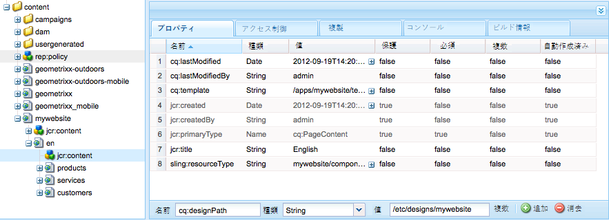
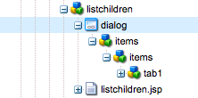
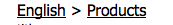

# 完全に機能する Web サイト (JSP) の作成{#create-a-fully-featured-website-jsp}

>[!CAUTION]
>
>AEM 6.4 の拡張サポートは終了し、このドキュメントは更新されなくなりました。 詳細は、 [技術サポート期間](https://helpx.adobe.com/jp/support/programs/eol-matrix.html). サポートされているバージョンを見つける [ここ](https://experienceleague.adobe.com/docs/?lang=ja).

>[!CAUTION]
>
>この記事では、JSP を使用し、クラシック UI に基づく Web サイトを作成する方法について説明します。 アドビでは、[AEM Sites の開発の手引き](/help/sites-developing/getting-started.md)で詳しく説明しているように、web サイトに最新の AEM テクノロジーを利用することをお勧めします。

このチュートリアルでは、Adobe Experience Manager(AEM) で完全な機能を備えた Web サイトを作成できます。 Web サイトは汎用の Web サイトに基づき、主に Web 開発者をターゲットにします。 すべての開発は、1 つのオーサー環境内でおこなわれます。

このチュートリアルでは、次の方法について説明します。

1. AEM をインストールします。
1. CRXDE Lite（開発環境）にアクセスします。
1. CRXDE Lite でプロジェクトの構造を設定します。
1. コンテンツページを作成する際の基礎として使用するテンプレート、コンポーネント、スクリプトを作成します。
1. Web サイトのルートページを作成し、次にコンテンツページを作成します。
1. ページで使用する以下のコンポーネントを作成します。

   * **[!UICONTROL 上部ナビゲーション]**
   * **[!UICONTROL リストの子]**
   * **[!UICONTROL Logo（ロゴ）]**
   * **[!UICONTROL 画像]**
   * **[!UICONTROL テキスト画像]**
   * **[!UICONTROL 検索]**

1. 様々な基盤コンポーネントを含めます。

すべての手順を実行すると、ページは次のようになります。


**最終結果をダウンロード**

演習を実行する代わりにチュートリアルに従うには、website-1.0.zip をダウンロードします。 このファイルは、このチュートリアルの結果を含むAEMコンテンツパッケージです。 用途 [パッケージマネージャー](/help/sites-administering/package-manager.md) をクリックして、パッケージをオーサーインスタンスにインストールします。

>[!NOTE]
>このパッケージをインストールすると、このチュートリアルを使用して作成したオーサーインスタンス上のリソースが上書きされます。

Web サイトコンテンツパッケージ

[ファイルを入手](assets/website-1_0.zip)

## Adobe Experience Manager のインストール {#installing-adobe-experience-manager}

Web サイトを開発するための AEM インスタンスをインストールするには、[オーサーインスタンスとパブリッシュインスタンスを含むデプロイメント環境](/help/sites-deploying/deploy.md#author-and-publish-installs)の設定手順に従うか、または[汎用インストール](/help/sites-deploying/deploy.md#default-local-install)を実行します。汎用インストールでは、AEM クイックスタート JAR ファイルをダウンロードし、license.properties ファイルを JAR ファイルと同じディレクトリに配置して、JAR ファイルをダブルクリックします。

AEM をインストールしたら、ようこそページで CRXDE Lite のリンクをクリックして CRXDE Lite 開発環境にアクセスします。


>[!NOTE]
>
>デフォルトのCRXDE Liteを使用してローカルにインストールされるAEMオーサリングインスタンスのポートの URL は、 [http://localhost:4502/crx/de/](http://localhost:4502/crx/de/).

## CRXDE Liteでのプロジェクト構造の設定 {#setting-up-the-project-structure-in-crxde-lite}

CRXDE Liteを使用して、リポジトリ内に mywebsite アプリケーション構造を作成します。

1. CRXDE Liteの左側のツリーで、**`/apps`** フォルダーを右クリックし、**[!UICONTROL 作成／作成／フォルダー]**&#x200B;をクリックします。**フォルダーを作成**&#x200B;ダイアログで、フォルダー名として `mywebsite` と入力し、「**OK**」をクリックします。
1. `/apps/mywebsite` フォルダーを右クリックして、**[!UICONTROL 作成／フォルダーを作成]**&#x200B;をクリックしてください。**[!UICONTROL フォルダーを作成]**&#x200B;ダイアログで、フォルダー名として `components` と入力し、「**[!UICONTROL OK]**」をクリックします。
1. `/apps/mywebsite` フォルダーを右クリックして、**[!UICONTROL 作成／フォルダーを作成]**&#x200B;をクリックしてください。**[!UICONTROL フォルダーを作成]**&#x200B;ダイアログで、フォルダー名として `templates` と入力し、「**[!UICONTROL OK]**」をクリックします。

   ツリー内の構造は次のようになります。

   

1. 「**[!UICONTROL すべて保存]**」をクリックします。

## デザインの設定 {#setting-up-the-design}

この節では、Designer ツールを使用して、アプリケーションのデザインを作成します。 デザインは、Web サイトに CSS および画像リソースを提供します。

>[!NOTE]
>
>次のリンクをクリックして、をダウンロードします。 ``mywebsite.zip``.アーカイブには、デザイン用の static.css ファイルと画像ファイルが含まれます。

サンプルの static.css ファイルおよび画像

[ファイルを入手](assets/mywebsite.zip)

1. AEM のようこそ画面で、「**[!UICONTROL ツール]**」をクリックします。([http://localhost:4502/libs/cq/core/content/welcome.html](http://localhost:4502/libs/cq/core/content/welcome.html))

   

1. フォルダーツリーで、**[!UICONTROL Designs]** フォルダーを選択して、**[!UICONTROL 新規／新しいページ]**&#x200B;をクリックします。タイトルとして `mywebsite` と入力し、「**[!UICONTROL 作成]**」をクリックします。

1. mywebsite という項目がテーブルに表示されない場合は、ツリーまたはテーブルを更新します。

1. [WebDAV の使用](/help/sites-administering/webdav-access.md) URL( http://localhost:4502 ) にアクセスし、サンプルをコピーします。 `static.css` ファイルと `images` ダウンロードした mywebsite.zip ファイルから `/etc/designs/mywebsite` フォルダー。

   

## contentpage テンプレート、コンポーネント、スクリプトの作成 {#creating-the-contentpage-template-component-and-script}

このセクションでは、次のものを作成します。

* サンプル Web サイト内のコンテンツページの作成に使用される contentpage テンプレート
* コンテンツのページをレンダリングするために使用される contentpage コンポーネント
* contentpage スクリプト

### コンテンツページテンプレートの作成 {#creating-the-contentpage-template}

サイトの Web ページの基礎として使用するテンプレートを作成します。

テンプレートは、新しいページのデフォルトコンテンツを定義します。 複雑な Web サイトでは、サイト内の様々なタイプのページを作成するために、複数のテンプレートを使用する場合があります。 この演習では、すべてのページを 1 つのシンプルなテンプレートに基づいて作成します。

1. CRXDE Lite のフォルダーツリーで、`/apps/mywebsite/templates` を右クリックして、**[!UICONTROL 作成／テンプレートを作成]**&#x200B;をクリックします。

1. テンプレートを作成ダイアログで、次の値を入力し、 **[!UICONTROL 次へ]**:

   * **[!UICONTROL ラベル]**:contentpage
   * **[!UICONTROL タイトル]**:My Web サイトコンテンツページテンプレート
   * **[!UICONTROL 説明]**:これは私のウェブサイトコンテンツページテンプレートです
   * **[!UICONTROL リソースタイプ]**:mywebsite/components/contentpage

   「ランキング」プロパティにはデフォルト値を使用します。

   

   リソースタイプは、ページをレンダリングするコンポーネントを識別します。この場合、contentpage テンプレートを使用して作成されたページはすべて `mywebsite/components/contentpage` コンポーネントによってレンダリングされます。

1. このテンプレートを使用できるページのパスを指定するには、プラス記号のボタンをクリックして、表示されるテキストボックスに `/content(/.*)?` と入力します。次に、「**[!UICONTROL 次へ]**」をクリックします。

   

   許可されているパスプロパティの値は、 *正規表現。* この式と一致するパスを持つページは、このテンプレートを使用できます。 この場合、正規表現は `/content` フォルダーとすべてのサブページ。

   作成者が以下のページを作成したとき `/content`、 **[!UICONTROL contentpage]** 使用可能なテンプレートのリストにテンプレートが表示されます。

1. **[!UICONTROL 許可された親]**&#x200B;パネルおよび&#x200B;**[!UICONTROL 許可されている子]**&#x200B;パネルで「**[!UICONTROL 次へ]**」をクリックして、「**[!UICONTROL OK]**」をクリックします。CRXDE Lite で、「**[!UICONTROL すべて保存]**」をクリックします。

   

#### contentpage コンポーネントの作成 {#creating-the-contentpage-component}

コンテンツを定義し、contentpage テンプレートを使用するコンポーネントを作成します&#x200B;*。*&#x200B;コンポーネントの場所は、contentpage テンプレートの「リソースタイプ」プロパティの値と一致する必要があります。

1. CRXDE Lite で、`/apps/mywebsite/components` を右クリックして、**[!UICONTROL 作成／コンポーネント]**&#x200B;をクリックします。
1. **[!UICONTROL コンポーネントを作成]**&#x200B;ダイアログで、以下のプロパティ値を入力します。

   * **[!UICONTROL ラベル]**:contentpage
   * **[!UICONTROL タイトル]**:My Web サイトコンテンツページコンポーネント
   * **[!UICONTROL 説明]**:これは My Website Content Page コンポーネントです

   

   新しいコンポーネントの場所は `/apps/mywebsite/components/contentpage` です。このパスは、contentpage テンプレートのリソースタイプ（パスの最初の `/apps/` 部分を除く）に対応します。

   この一致は、テンプレートをコンポーネントと結び付けるものなので、Web サイトを正常に機能させるために重要です。

1. 「**[!UICONTROL 次へ]******」を数回クリックしてダイアログの許可されている子パネルを表示し、「**[!UICONTROL OK]**」をクリックします。CRXDE Lite で、「**[!UICONTROL すべて保存]**」をクリックします。

   この時点で構造は次のようになります。

   

#### contentpage コンポーネントスクリプトの開発 {#developing-the-contentpage-component-script}

contentpage.jsp スクリプトにコードを追加して、ページのコンテンツを定義します。

1. CRXDE Liteで、`/apps/mywebsite/components/contentpage` にあるファイル `contentpage.jsp` を開きます。ファイルには、デフォルトで次のコードが含まれています。

   ```java
   <%--
   
     My Website Content Page Component component.
   
     This is My Website Content Page Component.
   
   --%><%
   %><%@include file="/libs/foundation/global.jsp"%><%
   %><%@page session="false" %><%
   %><%
       /* TODO add you code here */
   %>
   ```

1. 以下のコードをコピーして、contentpage.jsp のデフォルトコードの後に貼り付けます。

   ```java
   <%@ page language="java" contentType="text/html; charset=ISO-8859-1"
       pageEncoding="ISO-8859-1"%>
   <!DOCTYPE html PUBLIC "-//W3C//DTD HTML 4.01 Transitional//EN" 
   "https://www.w3.org/TR/html4/loose.dtd">
   <html>
   <head>
   <meta http-equiv="Content-Type" content="text/html; charset=ISO-8859-1">
   <title>My title</title>
   </head>
   <body>
   <div>My body</div>
   </body>
   </html>
   ```

1. 「**[!UICONTROL すべて保存]**」をクリックして変更を保存します。

### Web サイトページおよびコンテンツページの作成 {#creating-your-website-page-and-content-pages}

ここでは、すべて contentpage テンプレートを使用する、My Website、English、Products、Services、Customers の各ページを作成します。

1. AEMのようこそページ ([http://localhost:4502/libs/cq/core/content/welcome.html](http://localhost:4502/libs/cq/core/content/welcome.html))、「Web サイト」をクリックします。

   

1. フォルダーツリーで、**[!UICONTROL Websites]** フォルダーを選択して、**[!UICONTROL 新規／新しいページ]**&#x200B;をクリックします。
1. **[!UICONTROL ページを作成]**&#x200B;ウィンドウで、以下を入力します。

   * **[!UICONTROL タイトル]**：`My Website`
   * **[!UICONTROL 名前]**：`mywebsite`
   * を選択します。 **[!UICONTROL My Web サイトコンテンツページテンプレート]**

   

1. 「**[!UICONTROL 作成]**」をクリックします。フォルダーツリーで、 `/Websites/My Website` ページを開き、「 **[!UICONTROL 新規/新しいページ]**.
1. **[!UICONTROL ページを作成]**&#x200B;ダイアログで、以下のプロパティ値を入力して「作成」をクリックします。

   * **[!UICONTROL タイトル]**:英語
   * **[!UICONTROL 名前]**:en
   * を選択します。 **[!UICONTROL My Web サイトコンテンツページテンプレート]**

1. フォルダーツリーで、 `/Websites/My Website/English` ページを開き、「 **[!UICONTROL 新規/新しいページ]**.
1. **[!UICONTROL ページを作成]**&#x200B;ダイアログで、以下のプロパティ値を入力して「**[!UICONTROL 作成]**」をクリックします。

   * **[!UICONTROL タイトル]**:製品
   * を選択します。 **[!UICONTROL My Web サイトコンテンツページテンプレート]**

1. フォルダーツリーで、 `/Websites/My Website/English` ページを開き、「 **[!UICONTROL 新規/新しいページ]**.
1. **[!UICONTROL ページを作成]**&#x200B;ダイアログで、以下のプロパティ値を入力して「**[!UICONTROL 作成]**」をクリックします。

   * **タイトル**:サービス
   * を選択します。 **[!UICONTROL My Web サイトコンテンツページテンプレート]**

1. フォルダーツリーで、 `/Websites/My Website/English` ページを開き、「 **[!UICONTROL 新規/新しいページ]**.
1. **[!UICONTROL ページを作成]**&#x200B;ダイアログで、以下のプロパティ値を入力して「**[!UICONTROL 作成]**」をクリックします。

   * **タイトル**:顧客
   * を選択します。 **[!UICONTROL My Web サイトコンテンツページテンプレート]**

   構造は次のようになります。

   

1. ページを mywebsite デザインにリンクさせるには、CRXDE Liteで、`/content/mywebsite/en/jcr:content` ノードを選択します。の **[!UICONTROL プロパティ]** タブで、新しいプロパティに次の値を入力し、「追加」をクリックします。

   * **[!UICONTROL 名前]**:cq:designPath
   * **[!UICONTROL タイプ]**:文字列
   * **[!UICONTROL 値]**:/etc/designs/mywebsite

   

1. 新しい Web ブラウザータブまたはウィンドウで、 [http://localhost:4502/content/mywebsite/en/products.html](http://localhost:4502/content/mywebsite/en/products.html) 製品ページを表示するには：

   

### contentpage スクリプトの強化 {#enhancing-the-contentpage-script}

この節では、AEM基盤コンポーネントスクリプトを使用し、独自のスクリプトを記述して、contentpage スクリプトを拡張する方法について説明します。

この **[!UICONTROL 製品]** ページは次のようになります。


#### 基盤ページスクリプトの使用 {#using-the-foundation-page-scripts}

この演習では、スーパータイプが AEM のページコンポーネントとなるように pagecontent コンポーネントを設定します。コンポーネントはスーパータイプの機能を継承するので、pagecontent はページコンポーネントのスクリプトとプロパティを継承します。

例えば、自分のコンポーネントの JSP コード内で、スーパータイプコンポーネントによって提供されているスクリプトを、自分のコンポーネントに含まれているかのように参照できます。

1. CRXDE Lite で、`/apps/mywebsite/components/contentpage` ノードにプロパティを追加します。

   1. `/apps/mywebsite/components/contentpage` ノードを選択します。
   1. 「プロパティ」タブの下部で、以下のプロパティ値を入力して「追加」をクリックします。

      * **[!UICONTROL 名前]**:sling:resourceSuperType
      * **[!UICONTROL タイプ]**:文字列
      * **[!UICONTROL 値]**:foundation/components/page
   1. 「**[!UICONTROL すべて保存]**」をクリックします。


1. `/apps/mywebsite/components/contentpage` の下の `contentpage.jsp` ファイルを開いて、既存のコードを以下のコードに置換します。

   ```xml
   <%@include file="/libs/foundation/global.jsp"%><%
   %><%@page session="false" contentType="text/html; charset=utf-8" %><%
   %><!DOCTYPE HTML PUBLIC "-//W3C//DTD HTML 4.01//EN" "https://www.w3.org/TR/html4/strict.dtd">
   <html>
   <cq:include script="head.jsp"/>
   <cq:include script="body.jsp"/>
   </html>
   ```

1. 変更を保存します。
1. ブラウザーで&#x200B;**[!UICONTROL 製品]**&#x200B;ページをリロードします。次のようなコンソールが表示されます。

   

   ページソースを開いて、head.jsp および body.jsp スクリプトで生成された JavaScript 要素とHTML要素を確認します。 次のスクリプトスニペットは、ページを開く際にサイドキックを開きます。

   ```java
   CQ.WCM.launchSidekick("/content/mywebsite/en/products",
               {propsDialog: "/libs/foundation/components/page/dialog",
                  locked: false locked: false
                }); 
   ```

#### 独自のスクリプトの使用 {#using-your-own-scripts}

このセクションでは、ページ本文の一部を生成する複数のスクリプトを作成します。 次に、pagecontent コンポーネントに body.jsp ファイルを作成して、AEM Page コンポーネントの body.jsp を上書きします。 body.jsp ファイルに、ページ本文の様々な部分を生成するスクリプトを含めます。

**ヒント：**&#x200B;コンポーネントのスーパータイプ内のファイルと同じ名前で相対的な場所も同じファイルがコンポーネントに含まれている場合、これをオーバーレイと呼びます&#x200B;*。*

1. CRXDE Lite で、`/apps/mywebsite/components/contentpage` の下に `left.jsp` ファイルを作成します。

   1. ノードを右クリックします。 `/apps/mywebsite/components/contentpage`を選択し、「 **[!UICONTROL 作成]** その後 **[!UICONTROL ファイルを作成]**.
   1. ウィンドウに、「 `left.jsp` を「**名前**」として選択し、「 **[!UICONTROL OK]**.

1. `left.jsp` ファイルを編集して、既存のコンテンツを削除し、以下のコードに置き換えます。

   ```java
   <%@include file="/libs/foundation/global.jsp"%><%
   %><div class="left">
   <div>logo</div>
   <div>newslist</div>
   <div>search</div>
   </div>
   ```

1. 変更内容を保存します。
1. CRXDE Lite で、`/apps/mywebsite/components/contentpage` の下に `center.jsp` ファイルを作成します。

   1. `/apps/mywebsite/components/contentpage` ノードを右クリックして、**[!UICONTROL 作成]**／**[!UICONTROL ファイルを作成]**&#x200B;を選択します。
   1. ダイアログで、「 `center.jsp` as **[!UICONTROL 名前]** をクリックし、 **[!UICONTROL OK]**.

1. `center.jsp` ファイルを編集して、既存のコンテンツを削除し、以下のコードに置換します。

   ```java
   <%@include file="/libs/foundation/global.jsp"%><%
   %><div class="center">
   <div>trail</div>
   <div>title</div>
   <div>parsys</div>
   </div>
   ```

1. 変更内容を保存します。
1. CRXDE Lite で、`/apps/mywebsite/components/contentpage` の下に `right.jsp` ファイルを作成します。

   1. `/apps/mywebsite/components/contentpage` ノードを右クリックして、**[!UICONTROL 作成]**／**[!UICONTROL ファイルを作成]**&#x200B;を選択します。
   1. ダイアログボックスで、「`right.jsp`名前&#x200B;**[!UICONTROL 」に]** と入力して、「**[!UICONTROL OK]**」をクリックします。

1. `right.jsp` ファイルを編集して、既存のコンテンツを削除し、以下のコードに置き換えます。

   ```java
   <%@include file="/libs/foundation/global.jsp"%><%
   %><div class="right">
   <div>iparsys</div>
   </div>
   ```

1. 変更内容を保存します。
1. CRXDE Lite で、`/apps/mywebsite/components/contentpage` の下に `body.jsp` ファイルを作成します。
1. `body.jsp` ファイルを編集して、既存のコンテンツを削除し、以下のコードに置き換えます。

   ```java
   <%@include file="/libs/foundation/global.jsp"%><%
   %><body>
   <div id="CQ">
   <div class="topnav">topnav</div>
   <div class="content">
   <cq:include script="left.jsp" />
   <cq:include script="center.jsp" />
   <cq:include script="right.jsp" />
   </div>
   <div class="footer">
   <div class="toolbar">toolbar</div>
   </div>
   </div>
   </body>
   ```

1. 変更内容を保存します。
1. ブラウザーで&#x200B;**[!UICONTROL 製品]**&#x200B;ページをリロードします。次のようなコンソールが表示されます。

   

### 上部ナビゲーションコンポーネントの作成 {#creating-the-top-navigation-component}

このセクションでは、ナビゲーションを容易にするために、Web サイトのすべてのトップレベルページへのリンクを表示するコンポーネントを作成します。 このコンポーネントのコンテンツは、contentpage テンプレートを使用して作成されるすべてのページの上部に表示されます。

上部ナビゲーションコンポーネント (topnav) の最初のバージョンでは、ナビゲーション項目はテキストリンクのみです。 2 つ目のバージョンでは、画像ナビゲーションリンクを含む topnav を実装します。

上部ナビゲーションは次のようになります。


#### 上部ナビゲーションコンポーネントの作成 {#creating-the-top-navigation-component-1}

1. CRXDE Lite で `/apps/mywebsite/components` を右クリックして、**[!UICONTROL 作成]**／**[!UICONTROL コンポーネントを作成]**&#x200B;をクリックします。
1. **[!UICONTROL コンポーネントを作成]**&#x200B;ウィンドウで、以下を入力します。

   * **[!UICONTROL ラベル]**： `topnav`
   * **[!UICONTROL タイトル]**: `My Top Navigation Component`
   * **[!UICONTROL 説明]**: `This is My Top Navigation Component`

1. クリック **[!UICONTROL 次へ]** 最後のウィンドウに来て **[!UICONTROL OK]**. 変更を保存します。

#### テキストリンクを含むトップナビゲーションスクリプトの作成 {#creating-the-top-navigation-script-with-textual-links}

topnav にレンダリングスクリプトを追加して、子ページへのテキストリンクを生成します。

1. CRXDE Lite で、`/apps/mywebsite/components/topnav` の下の `topnav.jsp` ファイルを開きます。
1. 次のコードをコピー&amp;ペーストして、そこにあるコードを置き換えます。

   ```xml
   <%@include file="/libs/foundation/global.jsp"%><% 
   %><%@ page import="java.util.Iterator,
           com.day.text.Text, 
           com.day.cq.wcm.api.PageFilter, com.day.cq.wcm.api.Page" %><% 
       /* get starting point of navigation */
       Page navRootPage = currentPage.getAbsoluteParent(2); 
       if (navRootPage == null && currentPage != null) { 
       navRootPage = currentPage; 
       }
       if (navRootPage != null) { 
           Iterator<Page> children = navRootPage.listChildren(new PageFilter(request));
           while (children.hasNext()) { 
               Page child = children.next(); 
               %><a href="<%= child.getPath() %>.html"><%=child.getTitle() %></a><% 
           } 
       } 
   %> 
   ```

#### Contentpage コンポーネントへの上部ナビゲーションの追加 {#including-top-navigation-in-the-contentpage-component}

topnav を contentpage コンポーネントに含めるには：

1. CRXDE Lite で、`/apps/mywebsite/components/contentpage` の下の `body.jsp` ファイルを開いて、

   ```xml
   <div class="topnav">topnav</div>
   ```

   次を使用：

   ```xml
   <cq:include path="topnav" resourceType="mywebsite/components/topnav" />
   ```

1. 変更を保存します。
1. ブラウザーで、 **[!UICONTROL 製品]** ページ。 上部ナビゲーションは次のように表示されます。

   

#### サブタイトル付きのページを強化する {#enhancing-pages-with-subtitles}

この **[!UICONTROL ページ]** コンポーネントでは、ページのサブタイトルを指定できるプロパティを定義します。 ページコンテンツに関する情報を提供するサブタイトルを追加します。

1. ブラウザーで、**[!UICONTROL 製品]**&#x200B;ページを開きます。
1. サイドキックの「**[!UICONTROL ページ]**」タブで、「**[!UICONTROL ページのプロパティ]**」をクリックします。
1. の **[!UICONTROL 基本]** ダイアログのタブ、展開 **[!UICONTROL その他のタイトルと説明]** そして **[!UICONTROL 字幕]** プロパティ、タイプ `what we do`.クリック **[!UICONTROL OK]**.
1. ここまでの手順を繰り返して、「**私たちのサービス**」というサブタイトルを&#x200B;**[!UICONTROL サービス]**&#x200B;ページに追加します。
1. ここまでの手順を繰り返して、「**私たちが得た信頼**」というサブタイトルを&#x200B;**[!UICONTROL 顧客]**&#x200B;ページに追加します。

   **ヒント：** CRXDE Liteで、 /content/mywebsite/en/products/jcr:content ノードを選択し、subtitle プロパティが追加されたことを確認します。

#### 画像リンクを使用して上部ナビゲーションを強化 {#enhance-top-navigation-by-using-image-links}

topnav コンポーネントのレンダリングスクリプトを拡張して、ナビゲーションコントロールにハイパーテキストの代わりに画像リンクを使用します。 画像には、リンクターゲットのタイトルとサブタイトルが含まれます。

この演習では、次のことを実証します。 [Sling リクエストの処理](/help/sites-developing/the-basics.md#sling-request-processing). topnav.jsp スクリプトを変更して、ページナビゲーションリンクに使用する画像を動的に生成するスクリプトを呼び出します。 この演習では、Sling は画像ソースファイルの URL を解析し、画像のレンダリングに使用するスクリプトを決定します。

例えば、製品ページへの画像リンクのソースは、http://localhost:4502/content/mywebsite/en/products.navimage.pngになります。 Sling は、この URL を解析して、リソースタイプと、リソースをレンダリングするために使用するスクリプトを決定します。

1. Sling がリソースのパスを `/content/mwebysite/en/products.png.` と特定します。
1. Sling がこのパスを `/content/mywebsite/en/products` ノードと照合します。
1. Sling がこのノードの `sling:resourceType` を `mywebsite/components/contentpage` と特定します。

1. Sling が、このコンポーネント内で、URL セレクター（`navimage`）およびファイル名拡張子（`png`）に最も一致するスクリプトを見つけます。

この演習では、Sling はこれらの URL を、ユーザーが作成する /apps/mywebsite/components/contentpage/navimage.png.java スクリプトと照合します。

1. CRXDE Lite で、`/apps/mywebsite/components/topnav.` の下の `topnav.jsp` を開きます。アンカー要素（14 行目）のコンテンツを見つけます。

   ```xml
   <%=child.getTitle() %>
   ```

1. アンカーの内容を次のコードに置き換えます。

   ```xml
   " src="<%= child.getPath() %>.navimage.png">
   ```

1. 変更内容を保存します。
1. `/apps/mywebsite/components/contentpage` ノードを右クリックして、**[!UICONTROL 作成／ファイルを作成]**&#x200B;をクリックします。
1. **[!UICONTROL ファイルを作成]**&#x200B;ウィンドウで、「**[!UICONTROL 名前]**」に `navimage.png.java` と入力します。

   .java というファイル名の拡張子は、Apache Sling Scripting Java Support を使用してスクリプトをコンパイルし、サーブレットを作成する必要があることを Sling に示しています。

1. 以下のコードを `navimage.png.java.` にコピーします。このコードによって、AbstractImageServlet クラスが拡張されます。

   * [AbstractImageServlet](https://helpx.adobe.com/experience-manager/6-4/sites/developing/using/reference-materials/javadoc/com/day/cq/wcm/commons/AbstractImageServlet.html) は、現在のリソースのプロパティを格納する ImageContext オブジェクトを作成します。
   * リソースの親ページは、ImageContext オブジェクトから抽出されます。 次に、ページタイトルとサブタイトルが取得されます。
   * [ImageHelper](https://helpx.adobe.com/experience-manager/6-4/sites/developing/using/reference-materials/javadoc/com/day/cq/commons/ImageHelper.html) は、サイトデザインの navimage_bg.jpg ファイル、ページタイトルおよびページサブタイトルから画像を生成するために使用されます。

   ```java
   package apps.mywebsite.components.contentpage;
   
   import java.awt.Color; 
   import java.awt.Paint; 
   import java.awt.geom.Rectangle2D; 
   
   import java.io.IOException;
   import javax.jcr.RepositoryException; 
   
   import com.day.cq.wcm.api.Page; 
   import com.day.cq.wcm.api.PageManager; 
   import com.day.cq.wcm.api.components.Component; 
   import com.day.cq.wcm.api.designer.Designer;
   
   import com.day.cq.commons.SlingRepositoryException; 
   import com.day.cq.wcm.commons.WCMUtils; 
   import com.day.cq.wcm.commons.AbstractImageServlet; 
   import com.day.cq.commons.ImageHelper; 
   
   import com.day.image.Font; 
   import com.day.image.Layer; 
   
   import org.apache.sling.api.SlingHttpServletRequest; 
   import org.apache.sling.api.SlingHttpServletResponse; 
   import org.apache.sling.api.resource.Resource; 
   import org.apache.sling.api.servlets.SlingSafeMethodsServlet; 
   
   /**
     * Renders the navigation image
     */ 
   public class navimage_png extends AbstractImageServlet {
   
         protected Layer createLayer(ImageContext ctx)
                throws RepositoryException, IOException {
            PageManager pageManager = ctx.resolver.adaptTo(PageManager.class);
            Page currentPage = pageManager.getContainingPage(ctx.resource);
   
            /* constants for image appearance */
            int scale = 6;
            int paddingX = 24;
            int paddingY = 24;
            Color bgColor = new Color(0x004a565c, true);
   
            /* obtain the page title */
            String title = currentPage.getTitle();
            if (title == null) {
                title = currentPage.getName();
            }
   
            /* format the title text */
            title = title.toUpperCase();
            Paint titleColor = Color.WHITE;
            Font titleFont = new Font("Myriad Pro", 10 * scale, Font.BOLD);
            int titleBase = 10 * scale;
   
            /* obtain and format the page subtitle */
            String subtitle = currentPage.getProperties().get("subtitle", "");
            Paint subtitleColor = new Color(0xffa9afb1, true);
            Font subTitleFont = new Font("Tahoma", 7);
            int subTitleBase = 20;
   
            /* create a layer that contains the background image from the mywebsite design */
            Designer dg = ctx.resolver.adaptTo(Designer.class);
            String imgPath = new String(dg.getDesignPath(currentPage)+"/images/navimage_bg.jpg");
            Layer bg = ImageHelper.createLayer(ctx.resolver.resolve(imgPath));
   
            /* draw the title text (4 times bigger) */
            Rectangle2D titleExtent = titleFont.getTextExtent(0, 0, 0, 0, title, Font.ALIGN_LEFT, 0, 0);
            Rectangle2D subtitleExtent = subTitleFont.getTextExtent(0, 0, 0, 0, subtitle, Font.ALIGN_LEFT, 0, 0);
   
            /* ensure subtitleExtent is wide enough */
            if ( subtitle.length() > 0 ) {
                int titleWidth = (int)titleExtent.getWidth() / scale;
                if ( subtitleExtent.getWidth() > titleWidth && subtitleExtent.getWidth() + 2 * paddingX >
    bg.getWidth() ) {
                    int charWidth = (int)subtitleExtent.getWidth() / subtitle.length();
                    int maxWidth = (bg.getWidth() > titleWidth + 2  * paddingX ? bg.getWidth() - 2 * paddingX : titleWidth);
                    int len = (maxWidth - ( 2 * charWidth) ) / charWidth;
                    subtitle = subtitle.substring(0, len) + "...";
                    subtitleExtent = subTitleFont.getTextExtent(0, 0, 0, 0, subtitle, Font.ALIGN_LEFT, 0, 0);
                }
            }
            int width = Math.max((int) titleExtent.getWidth(), (int) subtitleExtent.getWidth());
           /* create the text layer */
            Layer text = new Layer(width, (int) titleExtent.getHeight() + 40, new Color(0x01ffffff, true));
            text.setPaint(titleColor);
            text.drawText(0, titleBase, 0, 0, title, titleFont, Font.ALIGN_LEFT | Font.ALIGN_BASE, 0, 0);
            text.resize(text.getWidth() / scale, text.getHeight() / scale);
            text.setX(0);
            text.setY(0);
   
            if (subtitle.length() > 0) {
                /* draw the subtitle normal sized */
                text.setPaint(subtitleColor);
                text.drawText(0, subTitleBase, 0, 0, subtitle, subTitleFont, Font.ALIGN_LEFT | Font.ALIGN_BASE, 0, 0); 
            }
   
            /* merge the image and text layers */
            text.setY(paddingY);
            text.setX(paddingX);
            text.setBackgroundColor(bgColor);
   
            int bgWidth = bg.getWidth();
            if ( text.getWidth() + 2 * paddingX > bgWidth ) {
                bgWidth = text.getWidth() + 2 * paddingX;
                bg.resize(bgWidth, bg.getHeight());
            }
            bg.merge(text);
   
            return bg;
        }
    }
   ```

1. 変更を保存します。
1. ブラウザーで&#x200B;**[!UICONTROL 製品]**&#x200B;ページをリロードします。上部ナビゲーションが次のように表示されます。

   

### リストの子コンポーネントの作成 {#creating-the-list-children-component}

ページのタイトル、説明、日付（製品ページなど）を含むページリンクのリストを生成する listchildren コンポーネントを作成します。 リンクは、現在のページの子ページ、またはコンポーネントダイアログで指定されたルートページをターゲットとします。


#### 製品ページの作成 {#creating-product-pages}

以下に 2 つのページを作成します。 **[!UICONTROL 製品]** ページ。 2 つの特定の製品を説明する各ページに対して、タイトル、説明、日付を設定します。

1. ( **[!UICONTROL Web サイト]** ページで、 **[!UICONTROL Web サイト/My Website/English/Products]** 項目とクリック **[!UICONTROL 新規/新しいページ]**.
1. ダイアログで、次のプロパティ値を入力し、 **[!UICONTROL 作成]**:

   * **[!UICONTROL タイトル]**:製品 1.
   * **[!UICONTROL 名前]**:product1.
   * 選択 **[!UICONTROL My Web サイトコンテンツページテンプレート]**

1. 次のプロパティ値を使用して、Products の下に別のページを作成します。

   * **[!UICONTROL タイトル]**:製品 2
   * **[!UICONTROL 名前]**:product2
   * 選択 **[!UICONTROL My Web サイトコンテンツページテンプレート]**

1. CRXDE Lite で、Product 1 ページの説明と日付を設定します。

   1. `/content/mywebsite/en/products/product1/jcr:content` ノードを選択します。
   1. 「**[!UICONTROL プロパティ]**」タブで、以下の値を入力します。

      * **[!UICONTROL 名前]**：`jcr:description`
      * **[!UICONTROL 型]**：`String`
      * **[!UICONTROL 値]**：`This is a description of the Product 1!.`
   1. 「**[!UICONTROL 追加]**」をクリックします。
   1. 内 **[!UICONTROL プロパティ]** タブで、次の値を使用して別のプロパティを作成します。

      * **[!UICONTROL 名前]**:日付
      * **[!UICONTROL タイプ]**:文字列
      * **[!UICONTROL 値]**:02/14/2008
      * 「**[!UICONTROL 追加]**」をクリックします。
   1. 「**[!UICONTROL すべて保存]**」をクリックします。


1. CRXDE Lite で、Product 2 ページの説明と日付を設定します。

   1. `/content/mywebsite/en/products/product2/jcr:content` ノードを選択します。
   1. 「**[!UICONTROL プロパティ]**」タブで、以下の値を入力します。

      * **[!UICONTROL 名前]**:jcr:description
      * **[!UICONTROL タイプ]**:文字列
      * **[!UICONTROL 値]**:これは製品 2 の説明です。
   1. 「**[!UICONTROL 追加]**」をクリックします。
   1. 同じテキストボックスで、以前の値を次の値に置き換えます。

      * **[!UICONTROL 名前]**:日付
      * **[!UICONTROL タイプ]**:文字列
      * **[!UICONTROL 値]**:05/11/2012
      * 「**[!UICONTROL 追加]**」をクリックします。
   1. 「**[!UICONTROL すべて保存]**」をクリックします。


#### リストの子コンポーネントの作成 {#creating-the-list-children-component-1}

listchildren コンポーネントを作成するには：

1. CRXDE Lite で `/apps/mywebsite/components` を右クリックして、**[!UICONTROL 作成]**／**[!UICONTROL コンポーネントを作成]**&#x200B;をクリックします。
1. ダイアログで、次のプロパティ値を入力し、 **[!UICONTROL 次へ]**:

   * **[!UICONTROL ラベル]**:listchildren.
   * **[!UICONTROL タイトル]**:My Listchildren コンポーネント
   * **[!UICONTROL 説明]**:これは My Listchildren コンポーネントです。

1. クリックを続行 **[!UICONTROL 次へ]** まで **[!UICONTROL 許可されている子]** パネルが表示され、次に、 **[!UICONTROL OK]**.

#### リストの子スクリプトの作成 {#creating-the-list-children-script}

listchildren コンポーネントのスクリプトを開発します。

1. CRXDE Lite で、`/apps/mywebsite/components/listchildren` の下の `listchildren.jsp` ファイルを開きます。
1. デフォルトのコードを次のコードに置き換えます。

   ```xml
   <%@include file="/libs/foundation/global.jsp"%><%
   %><%@ page import="java.util.Iterator,
            com.day.cq.wcm.api.PageFilter"%><%
        /* Create a new Page object using the path of the current page */ 
         String listroot = properties.get("listroot", currentPage.getPath());
        Page rootPage = pageManager.getPage(listroot);
        /* iterate through the child pages and gather properties */
        if (rootPage != null) {
            Iterator<Page> children = rootPage.listChildren(new PageFilter(request));
            while (children.hasNext()) {
                Page child = children.next();
                String title = child.getTitle() == null ? child.getName() : child.getTitle();
                String date = child.getProperties().get("date","");
                %><div class="item">
                <a href="<%= child.getPath() %>.html"><b><%= title %></b></a>
                <span><%= date %></span><br>
                <%= child.getProperties().get("jcr:description","") %><br>
                </div><%
            }
        }
    %>
   ```

1. 変更内容を保存します。

#### リストの子ダイアログの作成 {#creating-the-list-children-dialog}

listchildren コンポーネントのプロパティの設定に使用するダイアログを作成します。

1. listchildren コンポーネントの下に dialog ノードを作成します。

   1. CRXDE Lite で `/apps/mywebsite/components/listchildren` ノードを右クリックして、**[!UICONTROL 作成／ダイアログを作成]**&#x200B;をクリックします。
   1. ダイアログで、以下のプロパティ値を入力して「OK」をクリックします。

      * **[!UICONTROL ラベル]**：`dialog`
      * **[!UICONTROL タイトル]**：`Edit Component` を行い、「**[!UICONTROL OK]**」をクリックします。

   

   次のようにプロパティを定義します。

   

1. `/apps/mywebsite/components/listchildren/dialog/items/items/tab1` ノードを選択します。
1. 内 **[!UICONTROL プロパティ]** 」タブで、 **[!UICONTROL タイトル]** プロパティを `List Children`

   

1. を選択します。 **tab1** ノードをクリックし、 **[!UICONTROL 作成/ノードを作成]**&#x200B;次のプロパティ値を入力し、 **[!UICONTROL OK]**:

   * **[!UICONTROL 名前]**：items
   * **[!UICONTROL タイプ]**:cq:WidgetCollection

   

1. 次のプロパティ値を使用して、items ノードの下にノードを作成します。

   * **[!UICONTROL 名前]**:リストロ
   * **[!UICONTROL タイプ]**:cq:Widget

   

1. リストルートノードのプロパティを追加して、テキストフィールドとして設定します。次の表の各行は、プロパティを表しています。終了したら、 **[!UICONTROL すべて保存]**.

   | 名前 | タイプ | 値 |
   |---|---|---|
   | fieldLabel | 文字列 | リストルートのパス |
   | name | 文字列 | 。/listroot |
   | xtype | 文字列 | textfield |

   

#### Contentpage コンポーネントへのリストの子の追加 {#including-list-children-in-the-contentpage-component}

contentpage コンポーネントに listchildren コンポーネントを組み込むには、次の手順に従います。

1. CRXDE Lite で `/apps/mywebsite/components/contentpage` の下の `left.jsp` ファイルを開いて、以下のコードを見つけます（4 行目）。

   ```xml
   <div>newslist</div>
   ```

1. そのコードを次のコードに置き換えます。

   ```xml
   <cq:include path="newslist" resourceType="mywebsite/components/listchildren" />
   ```

1. 変更内容を保存します。

#### ページ内のリストの子の表示 {#viewing-list-children-in-a-page}

このコンポーネントの完全な操作を確認するには、製品ページを表示できます。

* ( 親ページ（「リストルートのパス」）が定義されていない場合 )。
* ( 親ページ（「リストルートのパス」）が定義されている場合 )。

1. ブラウザーで&#x200B;**[!UICONTROL 製品]**&#x200B;ページをリロードします。listchildren コンポーネントは次のように表示されます。

   

1. 

1. 「リストルートのパス」に、次のように入力します。 `/content/mywebsite/en`.クリック **[!UICONTROL OK]**. ページ上の listchildren コンポーネントは次のようになります。

   

### ロゴコンポーネントの作成 {#creating-the-logo-component}

会社のロゴを表示し、サイトのホームページへのリンクを提供するコンポーネントを作成します。 このコンポーネントにはデザインモードのダイアログが含まれ、プロパティ値がサイトデザイン (/etc/designs/mywebsite) に格納されます。

* プロパティの値は、デザインを使用するページに追加されるコンポーネントのすべてのインスタンスに適用されます。
* プロパティは、デザインを使用するページ上にある任意のコンポーネントのインスタンスを使用して設定できます。

デザインモードダイアログには、画像とリンクパスを設定するためのプロパティが含まれています。 ロゴコンポーネントは、Web サイト内のすべてのページの左上に配置されます。

次のようになります。


>[!NOTE]
>
>Adobe Experience Manager は、より充実した機能を持つロゴコンポーネント（`/libs/foundation/components/logo`）を提供します。

#### ロゴコンポーネントノードの作成 {#creating-the-logo-component-node}

ロゴコンポーネントを作成するには、次の手順に従います。

1. CRXDE Lite で、/apps/mywebsite/components を右クリックして、**[!UICONTROL 作成]**／**[!UICONTROL コンポーネントを作成]**&#x200B;をクリックします。
1. コンポーネントを作成ダイアログで、以下のプロパティ値を入力して「次へ」をクリックします。

   * **[!UICONTROL ラベル]**: `logo`.
   * **[!UICONTROL タイトル]**: `My Logo Component`.
   * **[!UICONTROL 説明]**: `This is My Logo Component`.

1. 「次へ」をクリックして、ダイアログの最後のパネルに到達し、 **[!UICONTROL OK]**.

#### ロゴスクリプトの作成 {#creating-the-logo-script}

この節では、ホームページへのリンクを含むロゴ画像を表示するスクリプトを作成する方法について説明します。

1. CRXDE Lite で、`/apps/mywebsite/components/logo` の下の `logo.jsp` ファイルを開きます。
1. 以下のコードでは、サイトのホームページへのリンクが作成され、ロゴイメージへの参照が追加されます。このコードを `logo.jsp` にコピーします。

   ```xml
   <%@include file="/libs/foundation/global.jsp"%><%
   %><%@ page import="com.day.text.Text,
                      com.day.cq.wcm.foundation.Image,
                      com.day.cq.commons.Doctype" %><%
       /* obtain the path for home */
       long absParent = currentStyle.get("absParent", 2L);
       String home = Text.getAbsoluteParent(currentPage.getPath(), (int) absParent);
       /* obtain the image */
       Resource res = currentStyle.getDefiningResource("imageReference");
       if (res == null) {
           res = currentStyle.getDefiningResource("image");
       }
       /* if no image use text link, otherwise draw the image */
       %>
   <a href="<%= home %>.html"><%
       if (res == null) {
           %>Home<%
       } else {
           Image img = new Image(res);
           img.setItemName(Image.NN_FILE, "image");
           img.setItemName(Image.PN_REFERENCE, "imageReference");
           img.setSelector("img");
           img.setDoctype(Doctype.fromRequest(request));
           img.setAlt("Home");
           img.draw(out);
       }
       %></a>
   ```

1. 変更内容を保存します。

#### ロゴデザインダイアログの作成 {#creating-the-logo-design-dialog}

デザインモードでロゴコンポーネントを設定するためのダイアログを作成します。デザインモードのダイアログには、`design_dialog` という名前を付ける必要があります。

1. logo コンポーネントの下に dialog ノードを作成します。

   1. `/apps/mywebsite/components/logo` ノードを右クリックして、**[!UICONTROL 作成／ダイアログを作成]**&#x200B;をクリックします。
   1. 次のプロパティ値を入力して、 **[!UICONTROL OK]**:

      * **[!UICONTROL ラベル]** `design_dialog`
      * **[!UICONTROL タイトル]** `Logo (Design)`

1. design_dialog ブランチの tab1 ノードを右クリックし、「削除」(Delete) をクリックします。クリック **[!UICONTROL すべて保存]**.
1. `design_dialog/items/items` ノードの下に、`cq:Widget` タイプの `img` という名前の新しいノードを作成します。次のプロパティを追加し、「 **[!UICONTROL すべて保存]**:

   | 名前 | タイプ | 値 |
   |---|---|---|
   | fileNameParameter | 文字列 | 。/imageName |
   | fileReferenceParameter | 文字列 | 。/imageReference |
   | name | 文字列 | 。/画像 |
   | title | String | 画像 |
   | xtype | 文字列 | html5smartimage |

   

#### ロゴレンダリングスクリプトの作成 {#creating-the-logo-render-script}

ロゴイメージを取得してページに書き込むスクリプトを作成します。

1. ロゴコンポーネントノードを右クリックし、 **[!UICONTROL 作成/ファイルを作成]** 次に、img.data.java という名前のスクリプトファイルを作成します。GET.java.
1. ファイルを開き、次のコードをファイルにコピーしてから、 **[!UICONTROL すべて保存]**:

```java
package apps.mywebsite.components.logo;

import java.io.IOException;
import java.io.InputStream;

import javax.jcr.RepositoryException;
import javax.jcr.Property;
import javax.servlet.http.HttpServletResponse;

import com.day.cq.wcm.foundation.Image;
import com.day.cq.wcm.commons.RequestHelper;
import com.day.cq.wcm.commons.WCMUtils;
import com.day.cq.wcm.commons.AbstractImageServlet;
import com.day.cq.commons.SlingRepositoryException;
import com.day.image.Layer;
import org.apache.commons.io.IOUtils;
import org.apache.sling.api.SlingHttpServletRequest;
import org.apache.sling.api.SlingHttpServletResponse;
import org.apache.sling.api.resource.Resource;
import org.apache.sling.api.resource.ValueMap;
import org.apache.sling.api.servlets.SlingSafeMethodsServlet;

/**
 * Renders an image
 */
public class img_GET extends AbstractImageServlet {

    protected Layer createLayer(ImageContext c)
            throws RepositoryException, IOException {
        /* don't create the layer yet. handle everything later */
        return null;
    }

    protected void writeLayer(SlingHttpServletRequest req,
                              SlingHttpServletResponse resp,
                              ImageContext c, Layer layer)
            throws IOException, RepositoryException {

        Image image = new Image(c.resource);
        image.setItemName(Image.NN_FILE, "image");
        image.setItemName(Image.PN_REFERENCE, "imageReference");
        if (!image.hasContent()) {
            resp.sendError(HttpServletResponse.SC_NOT_FOUND);
            return;
        }
        /* get pure layer */
        layer = image.getLayer(false, false, false);

        /* do not re-encode layer, just spool */
        Property data = image.getData();
        InputStream in = data.getStream();
        resp.setContentLength((int) data.getLength());
        String contentType = image.getMimeType();
        if (contentType.equals("application/octet-stream")) {
            contentType=c.requestImageType;
        }
        resp.setContentType(contentType);
        IOUtils.copy(in, resp.getOutputStream());
        in.close();

        resp.flushBuffer();
    }
}
```

#### Contentpage コンポーネントへのロゴコンポーネントの追加 {#adding-the-logo-component-to-the-contentpage-component}

1. CRXDE Liteで `/apps/mywebsite/components/contentpage file` の下にある `left.jsp` を開き、次のコード行を探します。

   ```xml
   <div>logo</div>
   ```

1. そのコードを次のコード行に置き換えます。

   ```xml
   <cq:include path="logo" resourceType="mywebsite/components/logo" />
   ```

1. 変更を保存します。
1. ブラウザーで&#x200B;**[!UICONTROL 製品]**&#x200B;ページをリロードします。ロゴは次のように表示されますが、現在は基になるリンクのみが表示されます。

   

#### ページ内でのロゴイメージの設定 {#setting-the-logo-image-in-a-page}

ここでは、デザインモードダイアログを使用して画像をロゴとして設定する方法について説明します。

1. を使用 **[!UICONTROL 製品]** ブラウザーでページを開き、 **[!UICONTROL デザイン]** サイドキックの下部にあるボタンをクリックして、 **[!UICONTROL デザイン]** モード。

   

1. ロゴのデザインバーで、 **[!UICONTROL 編集]** ：ダイアログを使用してロゴコンポーネントの設定を編集します。
1. ダイアログで、 **[!UICONTROL 画像]** タブ、参照 `logo.png` 抽出した画像 `mywebsite.zip` ファイルを選択し、 **[!UICONTROL OK]**.

   

1. サイドキックのタイトルバーの三角形をクリックして、に戻ります。 **[!UICONTROL 編集]** モード。

   

1. CRXDE Lite で、以下のノードに移動して、格納されているプロパティ値を確認します。

   `/etc/designs/mywebsite/jcr:content/contentpage/logo`

### パンくずコンポーネントの取り込み {#including-the-breadcrumb-component}

この節では、基盤コンポーネントの 1 つであるパンくず (trail) コンポーネントを含めます。

1. CRXDE Lite で `/apps/mywebsite/components/contentpage` を参照し、`center.jsp` ファイルを開いて次と置換します。

   ```java
   <div>trail</div>
   ```

   次を使用：

   ```xml
   <cq:include path="trail" resourceType="foundation/components/breadcrumb" />
   ```

1. 変更を保存します。
1. ブラウザーで、 **[!UICONTROL 製品 1]** ページ。 trail コンポーネントは次のようになります。

   

### タイトルコンポーネントの取り込み {#including-the-title-component}

この節では、基盤コンポーネントの 1 つであるタイトルコンポーネントを含めます。

1. CRXDE Lite で `/apps/mywebsite/components/contentpage` を参照し、`center.jsp` ファイルを開いて次と置換します。

   ```xml
   <div>title</div>
   ```

   次を使用：

   ```xml
   <cq:include path="title" resourceType="foundation/components/title" />
   ```

1. 変更を保存します。
1. ブラウザーで&#x200B;**[!UICONTROL 製品]**&#x200B;ページをリロードします。タイトルコンポーネントは次のようになります。

   

>[!NOTE]
>別のタイトルとタイプ/サイズを **[!UICONTROL 編集]** モード。

### 段落システムコンポーネントの取り込み {#including-the-paragraph-system-component}

段落システム (parsys) は、段落のリストを管理する Web サイトの重要な部分です。 作成者は、これを使用して、ページに段落コンポーネントを追加し、構造を提供できます。

parsys コンポーネント（基盤コンポーネントの 1 つ）を contentpage コンポーネントに追加します。

1. CRXDE Lite で `/apps/mywebsite/components/contentpage` を参照し、`center.jsp` ファイルを開いて以下のコード行を見つけます。

   ```xml
   <div>parsys</div>
   ```

1. このコード行を以下のコードに置き換えて、変更内容を保存します。

   ```xml
   <cq:include path="par" resourceType="foundation/components/parsys" />
   ```

1. ブラウザーで、 **[!UICONTROL 製品]** ページ。これで、parsys コンポーネントが追加され、次のように表示されます。

   

### 画像コンポーネントの作成 {#creating-the-image-component}

段落システムに画像を表示するコンポーネントを作成します。 時間を節約するために、画像コンポーネントはロゴコンポーネントのコピーとして作成され、いくつかのプロパティの変更が加えられます。

>[!NOTE]
>
>Adobe Experience Manager は、より充実した機能を持つ画像コンポーネント（`/libs/foundation/components/image`）を提供します。

#### 画像コンポーネントの作成 {#creating-the-image-component-1}

1. 右クリック `/apps/mywebsite/components/logo` ノードをクリックし、 **[!UICONTROL コピー]**.
1. を右クリックします。 `/apps/mywebsite/components` ノードをクリックし、 **[!UICONTROL 貼り付け]**.
1. `Copy of logo`**** ノードを右クリックし、「名前を変更」をクリックして既存のテキストを削除し、`image` と入力します。

1. `image` コンポーネントノードを選択して、以下のプロパティ値を変更します。

   * `jcr:title:`：自分の画像コンポーネント
   * `jcr:description`：これは自分の画像コンポーネントです。

1. 以下のプロパティ値を使用して、`image` ノードにプロパティを追加します。

   * **[!UICONTROL 名前]**:componentGroup
   * **[!UICONTROL タイプ]**:文字列
   * **[!UICONTROL 値]**:MyWebsite

1. `image` ノードの下で、`design_dialog` ノードの名前を `dialog` に変更します。

1. `logo.jsp` を `image.jsp.` に名前を変更します。

1. img.GET.java を開いて、パッケージを `apps.mywebsite.components.image` に変更します。


#### 画像スクリプトの作成 {#creating-the-image-script}

この節では、画像スクリプトを作成する方法について説明します。

1. 次を開きます： `/apps/mywebsite/components/image/` `image.jsp`
1. 既存のコードを次のコードで置き換えて、変更を保存します。

   ```xml
   <%@include file="/libs/foundation/global.jsp"%><%
   %><%@ page import="com.day.cq.commons.Doctype,
                       com.day.cq.wcm.foundation.Image,
                       com.day.cq.wcm.api.components.DropTarget,
                       com.day.cq.wcm.api.components.EditConfig,
                       com.day.cq.wcm.commons.WCMUtils" %><%
    /* global.jsp provides access to the current resource through the resource object */
           Image img = new Image(resource);
           img.setItemName(Image.NN_FILE, "image");
           img.setItemName(Image.PN_REFERENCE, "imageReference");
           img.setSelector("img");
           img.setDoctype(Doctype.fromRequest(request));
           img.setAlt("Home");
           img.draw(out); %>
   ```

1. 変更内容を保存します。

#### 画像 cq:editConfig ノードの作成 {#creating-the-image-cq-editconfig-node}

`cq:editConfig` ノードタイプを使用すると、プロパティを編集するときに、コンポーネントの一定の動作を設定できます。

この節では、cq:editConfig ノードを使用して、コンテンツファインダーから画像コンポーネントにアセットをドラッグできるようにします。

1. CRXDE Liteの/apps/mywebsite/components/image ノードの下に、次のように新しいノードを作成します。

   * **[!UICONTROL 名前]**:cq:editConfig
   * **[!UICONTROL タイプ]**:cq:EditConfig

1. cq:editConfig ノードの下に、次のように新しいノードを作成します。

   * **[!UICONTROL 名前]**:cq:dropTargets.
   * **[!UICONTROL タイプ]**:cq:DropTargetConfig.

1. cq:dropTargets ノードの下に、次のように新しいノードを作成します。

   * **[!UICONTROL 名前]**:画像。
   * **[!UICONTROL タイプ]**:nt:unstructured.

1. CRXDE で、プロパティを次のように設定します。

| 名前 | タイプ | 値 |
|---|---|---|
| 同意 | 文字列 | image/gif | jpeg | png) |
| グループ | 文字列 | media |
| propertyName | 文字列 | 。/imageReference |


#### アイコンの追加 {#adding-the-icon}

この節では、画像コンポーネントがサイドキックに表示される際に、画像コンポーネントの横に表示されるアイコンを追加します。

1. CRXDE Liteで、ファイルを右クリックします。 `/libs/foundation/components/image/icon.png` を選択し、 **[!UICONTROL コピー]**.
1. `/apps/mywebsite/components/image` ノードを右クリックして「**[!UICONTROL 貼り付け]**」をクリックし、「**[!UICONTROL すべて保存]**」をクリックします。

#### 画像コンポーネントの使用 {#using-the-image-component}

ここでは、**[!UICONTROL Products]** ページを表示して、段落システムに画像コンポーネントを追加します。

1. ブラウザーで&#x200B;**[!UICONTROL 製品]**&#x200B;ページをリロードします。
1. サイドキックで、 **[!UICONTROL デザインモード]** アイコン
1. 次をクリック： **[!UICONTROL 編集]** ボタンをクリックして、par のデザインダイアログを編集します。
1. ダイアログで、 **[!UICONTROL 許可されたコンポーネント]** が表示されます。に移動します。 **[!UICONTROL MyWebsite]**&#x200B;を選択し、 **[!UICONTROL マイ画像コンポーネント]** をクリックし、 **[!UICONTROL OK]**.
1. 戻る **[!UICONTROL 編集モード]**.
1. parsys フレームをダブルクリックします ( **[!UICONTROL コンポーネントまたはアセットをここにドラッグ]**) をクリックします。 この **[!UICONTROL 新規コンポーネントを挿入]** および **[!UICONTROL サイドキック]** セレクターは次のようになります。

   

### ツールバーコンポーネントを含める {#including-the-toolbar-component}

この節では、基盤コンポーネントの 1 つであるツールバーコンポーネントを含めます。

デザインモードに加えて、編集モードにも複数のオプションがあります。

1. CRXDE Lite で `/apps/mywebsite/components/contentpage` に移動し、`body.jsp` ファイルを開いて以下のコードを見つけます。

   ```java
   <div class="toolbar">toolbar</div>
   ```

1. このコードを以下のコードに置き換えて、変更内容を保存します。

   ```java
   <cq:include path="toolbar" resourceType="foundation/components/toolbar"/>
   ```

1. AEM Web サイトページのフォルダーツリーで、「 」を選択します。 `Websites/My Website/English`を選択し、「 **[!UICONTROL 新規/新しいページ]**. 次のプロパティ値を指定し、「作成」をクリックします。

   * **[!UICONTROL タイトル]**:ツールバー
   * 選択 **[!UICONTROL My Web サイトコンテンツページテンプレート]**

1. ページのリストで、 **[!UICONTROL ツールバー]** ページを開き、「 **[!UICONTROL プロパティ]**. 選択 **[!UICONTROL ナビゲーション内で非表示にする]**&#x200B;をクリックし、 **[!UICONTROL OK]**.

   この **[!UICONTROL ナビゲーション内で非表示にする]** 「 」オプションを使用すると、topnav や listchildren などのナビゲーションコンポーネントにページが表示されなくなります。

1. の下 **[!UICONTROL ツールバー]**、次のページを作成します。

   * 連絡先
   * フィードバック
   * ログイン
   * 検索

1. ブラウザーで&#x200B;**[!UICONTROL 製品]**&#x200B;ページをリロードします。次のようなコンソールが表示されます。

   

### 検索コンポーネントの作成 {#creating-the-search-component}

このセクションでは、Web サイト上のコンテンツを検索するためのコンポーネントを作成します。 この検索コンポーネントは、任意のページの段落システム（特殊な検索結果ページなど）に配置できます。

検索入力ボックスは、**[!UICONTROL English]** ページに以下のように表示されます。


#### 検索コンポーネントの作成 {#creating-the-search-component-1}

1. CRXDE Lite で `/apps/mywebsite/components` を右クリックして、**[!UICONTROL 作成]**／**[!UICONTROL コンポーネントを作成]**&#x200B;をクリックします。
1. ダイアログを使用してコンポーネントを設定します。

   1. 最初のパネルで、次のプロパティ値を指定します。

      * **[!UICONTROL ラベル]**:検索
      * **[!UICONTROL タイトル]**:マイ検索コンポーネント
      * **[!UICONTROL 説明]**:これはマイ検索コンポーネントです
      * **[!UICONTROL グループ]**:MyWebsite
   1. クリック **[!UICONTROL 次へ]**&#x200B;を選択し、「 **[!UICONTROL 次へ]** 再び
   1. の **[!UICONTROL 許可された親]** パネル、 **[!UICONTROL +]** ボタンとタイプ `*/parsys`.
   1. クリック **[!UICONTROL 次へ]** 次に、 **[!UICONTROL OK]**.


1. 「**[!UICONTROL すべて保存]**」をクリックします。
1. 次のノードをコピーし、 `apps/mywebsite/components/search` ノード：

   * `/libs/foundation/components/search/dialog`
   * `` `/libs/foundation/components/search/i18n`
   * `/libs/foundation/components/search/icon.png`

1. 「**[!UICONTROL すべて保存]**」をクリックします。

#### 検索スクリプトの作成 {#creating-the-search-script}

ここでは、検索スクリプトを作成する方法について説明します。

1. `/apps/mywebsite/components/search/search.jsp` ファイルを開きます。
1. 以下のコードを `search.jsp` にコピーします。

   ```java
   <%@ page import="com.day.cq.wcm.foundation.Search,com.day.cq.tagging.TagManager" %>
   <%@include file="/libs/foundation/global.jsp" %><%
   %><cq:setContentBundle/><%
       Search search = new Search(slingRequest);
   
       String searchIn = (String) properties.get("searchIn");
       String requestSearchPath = request.getParameter("path");
       if (searchIn != null) {
           /* only allow the "path" request parameter to be used if it
            is within the searchIn path configured */
           if (requestSearchPath != null && requestSearchPath.startsWith(searchIn)) {
               search.setSearchIn(requestSearchPath);
           } else {
               search.setSearchIn(searchIn);
           }
       } else if (requestSearchPath != null) {
           search.setSearchIn(requestSearchPath);
       }
   
       pageContext.setAttribute("search", search);
       TagManager tm = resourceResolver.adaptTo(TagManager.class);
   %><c:set var="trends" value="${search.trends}"/><%
   %><center>
     <form action="${currentPage.path}.html">
       <input size="41" maxlength="2048" name="q" value="${fn:escapeXml(search.query)}"/>
       <input value="<fmt:message key="searchButtonText"/>" type="submit" />
     </form>
   </center>
   <br/>
   <c:set var="result" value="${search.result}"/>
   <c:choose>
     <c:when test="${empty result && empty search.query}">
     </c:when>
     <c:when test="${empty result.hits}">
       <c:if test="${result.spellcheck != null}">
         <p><fmt:message key="spellcheckText"/> <a href="<c:url value="${currentPage.path}.html"><c:param name="q" value="${result.spellcheck}"/></c:url>"><b><c:out value="${result.spellcheck}"/></b></a></p>
       </c:if>
       <fmt:message key="noResultsText">
         <fmt:param value="${fn:escapeXml(search.query)}"/>
       </fmt:message>
     </c:when>
     <c:otherwise>
       <p class="searchmeta">Results ${result.startIndex + 1} - ${result.startIndex + fn:length(result.hits)} of ${result.totalMatches} for <b>${fn:escapeXml(search.query)}</b>. (${result.executionTime} seconds)</p>
      <br/>
   
     <div class="searchresults"> 
       <div class="results">
         <c:forEach var="hit" items="${result.hits}" varStatus="status">
           <div class="hit">
           <a href="${hit.URL}">${hit.title}</a>
           <div class="excerpt">${hit.excerpt}</div>
          <div class="hiturl"> ${hit.URL}<c:if test="${!empty hit.properties['cq:lastModified']}"> - <c:catch><fmt:formatDate value="${hit.properties['cq:lastModified'].time}" dateStyle="medium"/></c:catch></c:if> - <a href="${hit.similarURL}"><fmt:message key="similarPagesText"/></a>
           </div></div>
         </c:forEach>
       </div>
         <br/>
   
        <div class="searchRight">
             <c:if test="${fn:length(trends.queries) > 0}">
                 <p><fmt:message key="searchTrendsText"/></p>
                 <div class="searchTrends">
                     <c:forEach var="query" items="${trends.queries}">
                         <a href="<c:url value="${currentPage.path}.html"><c:param name="q" value="${query.query}"/></c:url>"><span style="font-size:${query.size}px"><c:out value="${query.query}"/></span></a>
                     </c:forEach>
                 </div>
             </c:if> 
             <c:if test="${result.facets.languages.containsHit}">
                 <p>Languages</p>
                 <c:forEach var="bucket" items="${result.facets.languages.buckets}">
                     <c:set var="bucketValue" value="${bucket.value}"/>
                     <c:set var="label" value='<%= new java.util.Locale((String) pageContext.getAttribute("bucketValue")).getDisplayLanguage(request.getLocale()) %>'/>
                     <c:choose>
                         <c:when test="${param.language != null}">${label} (${bucket.count}) - <a href="<cq:requestURL><cq:removeParam name="language"/></cq:requestURL>">remove filter</a></c:when>
                         <c:otherwise><a title="filter results" href="<cq:requestURL><cq:addParam name="language" value="${bucket.value}"/></cq:requestURL>">${label} (${bucket.count})</a></c:otherwise>
                     </c:choose><br/>
                 </c:forEach>
             </c:if> 
             <c:if test="${result.facets.tags.containsHit}">
                 <p>Tags</p>
                 <c:forEach var="bucket" items="${result.facets.tags.buckets}">
                     <c:set var="bucketValue" value="${bucket.value}"/>
                     <c:set var="tag" value="<%= tm.resolve((String) pageContext.getAttribute("bucketValue")) %>"/>
                     <c:if test="${tag != null}">
                         <c:set var="label" value="${tag.title}"/>
                         <c:choose>
                             <c:when test="<%= request.getParameter("tag") != null && java.util.Arrays.asList(request.getParameterValues("tag")).contains(pageContext.getAttribute("bucketValue")) %>">${label} (${bucket.count}) - <a href="<cq:requestURL><cq:removeParam name="tag" value="${bucket.value}"/></cq:requestURL>">remove filter</a></c:when>
                             <c:otherwise><a title="filter results" href="<cq:requestURL><cq:addParam name="tag" value="${bucket.value}"/></cq:requestURL>">${label} (${bucket.count})</a></c:otherwise>
                         </c:choose><br/>
                     </c:if>
                 </c:forEach>
             </c:if> 
             <c:if test="${result.facets.mimeTypes.containsHit}">
                 <jsp:useBean id="fileTypes" class="com.day.cq.wcm.foundation.FileTypes"/>
                 <p>File types</p>
                 <c:forEach var="bucket" items="${result.facets.mimeTypes.buckets}">
                     <c:set var="bucketValue" value="${bucket.value}"/>
                     <c:set var="label" value="${fileTypes[bucket.value]}"/>
                     <c:choose>
                         <c:when test="<%= request.getParameter("mimeType") != null && java.util.Arrays.asList(request.getParameterValues("mimeType")).contains(pageContext.getAttribute("bucketValue")) %>">${label} (${bucket.count}) - <a href="<cq:requestURL><cq:removeParam name="mimeType" value="${bucket.value}"/></cq:requestURL>">remove filter</a></c:when>
                         <c:otherwise><a title="filter results" href="<cq:requestURL><cq:addParam name="mimeType" value="${bucket.value}"/></cq:requestURL>">${label} (${bucket.count})</a></c:otherwise>
                     </c:choose><br/>
                 </c:forEach>
             </c:if>
             <c:if test="${result.facets.lastModified.containsHit}">
                 <p>Last Modified</p>
                 <c:forEach var="bucket" items="${result.facets.lastModified.buckets}">
                     <c:choose>
                         <c:when test="${param.from == bucket.from && param.to == bucket.to}">${bucket.value} (${bucket.count}) - <a href="<cq:requestURL><cq:removeParam name="from"/><cq:removeParam name="to"/></cq:requestURL>">remove filter</a></c:when>
                         <c:otherwise><a title="filter results" href="<cq:requestURL><cq:removeParam name="from"/><cq:removeParam name="to"/><c:if test="${bucket.from != null}"><cq:addParam name="from" value="${bucket.from}"/></c:if><c:if test="${bucket.to != null}"><cq:addParam name="to" value="${bucket.to}"/></c:if></cq:requestURL>">${bucket.value} (${bucket.count})</a></c:otherwise>
                     </c:choose><br/>
                 </c:forEach>
             </c:if>
   
         <c:if test="${fn:length(search.relatedQueries) > 0}">
   
          <br/><br/><div class="related">
           <fmt:message key="relatedSearchesText"/>
           <c:forEach var="rq" items="${search.relatedQueries}">
               <a href="${currentPage.path}.html?q=${rq}"><c:out value="${rq}"/></a>
           </c:forEach></div>
         </c:if>
         </div> 
   
         <c:if test="${fn:length(result.resultPages) > 1}">
           <div class="pagination"> 
               <fmt:message key="resultPagesText"/>
           <c:if test="${result.previousPage != null}">
             <a href="${result.previousPage.URL}"><fmt:message key="previousText"/></a>
           </c:if>
           <c:forEach var="page" items="${result.resultPages}">
             <c:choose>
               <c:when test="${page.currentPage}">${page.index + 1}</c:when>
               <c:otherwise>
                 <a href="${page.URL}">${page.index + 1}</a>
               </c:otherwise>
             </c:choose>
           </c:forEach>
           <c:if test="${result.nextPage != null}">
             <a href="${result.nextPage.URL}"><fmt:message key="nextText"/></a>
           </c:if>
           </div>
         </c:if>
         </div>
   
     </c:otherwise>
   </c:choose>
   ```

1. 変更内容を保存します。

#### Contentpage コンポーネントへの検索ボックスの追加 {#including-a-search-box-in-the-contentpage-component}

コンテンツページの左側のセクションに検索入力ボックスを含めるには、次の手順に従います。

1. CRXDE Lite で `/apps/mywebsite/components/contentpage` の下の `left.jsp` ファイルを開いて、以下のコードを見つけます（2 行目）。

   ```xml
   %><div class="left">
   ```

1. 次のコードを挿入します。 *前* その行：

   ```java
   %><%@ page import="com.day.text.Text"%><%
   %><% String docroot = currentDesign.getPath(); 
   String home = Text.getAbsoluteParent(currentPage.getPath(), 2);%><%
   ```

1. 次のコード行を探します。

   ```xml
   <div>search</div>
   ```

1. このコードを以下のコードに置き換えて、変更内容を保存します。

   ```java
   <div class="form_1">
        <form class="geo" action="<%= home %>/toolbar/search.html" id="form" >
             <p>
                  <input class="geo" type="text" name="q"><br> 
                  <a href="<%= home %>/toolbar/search.html" class="link_1">advanced search</a> 
             </p>
        </form>
   </div>
   ```

1. ブラウザーで&#x200B;**[!UICONTROL 製品]**&#x200B;ページをリロードします。検索コンポーネントは次のようになります。

   

#### 検索ページへの検索コンポーネントの追加 {#including-the-search-component-in-the-search-page}

この節では、段落システムに検索コンポーネントを追加します。

1. ブラウザーで、 **検索** ページ。
1. サイドキックで、 **[!UICONTROL デザイン]** モードアイコン
1. 「Design of par」ブロック（「Search」タイトルの下）で、 **[!UICONTROL 編集]**.
1. ダイアログで、下にスクロールして&#x200B;**[!UICONTROL 自分の web サイト]**&#x200B;グループを表示し、「**[!UICONTROL 自分の検索コンポーネント]**」を選択して「**[!UICONTROL OK]**」をクリックします。
1. サイドキックで、三角形をクリックしてに戻ります。 **[!UICONTROL 編集]** モード。
1. 次をドラッグ： **[!UICONTROL マイ検索]** コンポーネントをサイドキックから parsys フレームに挿入します。 次のようなコンソールが表示されます。

   

1. 次の場所に移動： **[!UICONTROL 製品]** ページ。入力ボックスで顧客を検索し、 **[!UICONTROL 入力]**.次のページにリダイレクトされます： **[!UICONTROL 検索]** ページ。切り替え先 **[!UICONTROL プレビュー]** モード：出力は、次のような形式です。

   

### Iparsys コンポーネントの取り込み {#including-the-iparsys-component}

この節では、基盤コンポーネントの 1 つである継承段落システム (iparsys) コンポーネントを含めます。 このコンポーネントを使用すると、親ページ上に段落の構造を作成でき、子ページに段落を継承させることができます。

このコンポーネントでは、編集モードとデザインモードの両方で複数のパラメータを設定できます。

1. CRXDE Lite で `/apps/mywebsite/components/contentpage` に移動し、`right.jsp` ファイルを開いて次と置換します。

   ```java
   <div>iparsys</div>
   ```

   次を使用：

   ```java
   <cq:include path="rightpar" resourceType="foundation/components/iparsys" />
   ```

1. 変更を保存します。
1. ブラウザーで&#x200B;**[!UICONTROL 製品]**&#x200B;ページをリロードします。ページ全体は次のようになります。

   
