# ウィジェットの使用および拡張（クラシック UI）{#using-and-extending-widgets-classic-ui}

>[!CAUTION]
>
>AEM 6.4 の拡張サポートは終了し、このドキュメントは更新されなくなりました。 詳細は、 [技術サポート期間](https://helpx.adobe.com/jp/support/programs/eol-matrix.html). サポートされているバージョンを見つける [ここ](https://experienceleague.adobe.com/docs/?lang=ja).

Adobe Experience Manager の web ベースインターフェイスでは、AJAX やその他の最新のブラウザー技術を使用しています。これらの技術により、作成者は、web ページ上でコンテンツの WYSIWYG 編集や書式設定を行うことができます。

Adobe Experience Manager(AEM) は [ExtJS](https://www.sencha.com/) ウィジェットライブラリ。最も重要なブラウザーすべてで機能し、デスクトップグレードの UI エクスペリエンスを作成できる、高度に磨かれたユーザーインターフェイス要素を提供します。

これらのウィジェットはAEM内に含まれ、AEM自体で使用される以外に、AEMを使用して作成された任意の Web サイトで使用できます。

AEM で使用可能なすべてのウィジェットについて詳しくは、[ウィジェット API ドキュメント](https://helpx.adobe.com/jp/experience-manager/6-4/sites/developing/using/reference-materials/widgets-api/index.html)または[既存の xtype のリスト](/help/sites-developing/xtypes.md)を参照してください。また、ExtJS フレームワークを所有している [Sencha](https://www.sencha.com/products/extjs/examples/) のサイトには、ExtJS フレームワークの使用方法の例が多数掲載されています。

このページでは、ウィジェットの使用と拡張の方法に関するインサイトを提供します。 まず、 [ページにクライアント側コードを含める](#including-the-client-sided-code-in-a-page). 次に、基本的な使用方法や拡張機能を説明するために作成されたサンプルコンポーネントについて説明します。 これらのコンポーネントは、 **ExtJS ウィジェットの使用** パッケージ **パッケージ共有**.

このパッケージには、次の例が含まれます。

* [基本ダイアログ](#basic-dialogs) 標準ウィジェットで構築されています。
* [動的ダイアログ](#dynamic-dialogs) 標準のウィジェットとカスタマイズされた javascript ロジックで構築されています。
* 次に基づくダイアログ [カスタムウィジェット](#custom-widgets).
* A [ツリーパネル](#tree-overview) 特定のパスの下に JCR ツリーを表示する。
* A [グリッドパネル](#grid-overview) 表形式でのデータの表示。

>[!NOTE]
>
>Adobe Experience Manager のクラシック UI は、[ExtJS 3.4.0](https://extjs.cachefly.net/ext-3.4.0/docs/) をベースに構築されています。

>[!NOTE]
>
>このページでは、クラシック UI でのウィジェットの使用方法について説明します。 アドビでは、[Coral UI](/help/sites-developing/touch-ui-concepts.md#coral-ui) と [Granite UI](/help/sites-developing/touch-ui-concepts.md#granite-ui-foundation-components) をベースとした最新の[タッチ操作対応 UI](/help/sites-developing/touch-ui-concepts.md) の使用を推奨しています。

## クライアントサイドのコードをページに含める {#including-the-client-sided-code-in-a-page}

クライアントサイドの Javascript とスタイルシートのコードをクライアントライブラリに配置します。

クライアントライブラリを作成するには：

1. `/apps/<project>` の下にノードを作成し、次のプロパティを設定します。

   ```
       name="clientlib"
       jcr:mixinTypes="[mix:lockable]"
       jcr:primaryType="cq:ClientLibraryFolder" 
       sling:resourceType="widgets/clientlib" 
       categories="[<category-name>]" 
       dependencies="[cq.widgets]"
   ```

   >[!NOTE]
   >
   >注意： `<category-name>` はカスタムライブラリの名前です ( 例：&quot;cq.extjstraining&quot;) と呼ばれ、ページにライブラリを組み込むために使用されます。

1. `clientlib` の下に `css` フォルダーと `js` フォルダー（nt:folder）を作成します。

1. `clientlib` の下に `css.txt` ファイルと `js.txt` ファイル（nt:file）を作成します。これらの .txt ファイルには、ライブラリに組み込むファイルを記述します。

1. `js.txt` を編集します。このファイルは、先頭に「`#base=js`」を指定し、その下に CQ クライアントライブラリサービスによって集約されるファイルのリストを指定する必要があります。次は例です。

   ```
   #base=js
    components.js
    exercises.js
    CustomWidget.js
    CustomBrowseField.js
    InsertTextPlugin.js
   ```

1. `css.txt` を編集します。このファイルは、先頭に「`#base=css`」を指定し、その下に CQ クライアントライブラリサービスによって集約されるファイルのリストを指定する必要があります。以下に例を示します。

   ```
   #base=css
    components.css
   ```

1. `js` フォルダーの下に、ライブラリに属する Javascript ファイルを配置します。

1. `css` フォルダーの下に、`.css` ファイルと、css ファイルが使用するリソース（`my_icon.png` など）を配置します。

>[!NOTE]
>
>前述のスタイルシートの処理は、必要に応じておこないます。

ページコンポーネント jsp にクライアントライブラリを組み込むには：

* Javascript コードとスタイルシートの両方を組み込むには：

   `<ui:includeClientLib categories="<category-name1>, <category-name2>, ..."/>`

   場所 `<category-nameX>` はクライアント側ライブラリの名前です。

* Javascript コードのみを組み込むには：

   `<ui:includeClientLib js="<category-name>"/>`

詳しくは、 [&lt;ui:includeclientlib>](/help/sites-developing/taglib.md#amp-lt-ui-includeclientlib) タグを使用します。

場合によっては、クライアントライブラリはオーサーモードでのみ使用でき、パブリッシュモードで除外する必要があります。 これは、次のように実行できます。

```xml
    if (WCMMode.fromRequest(request) != WCMMode.DISABLED) {
        %><ui:includeClientLib categories="cq.collab.blog"/><%
    }
```

### サンプルの概要 {#getting-started-with-the-samples}

このページのチュートリアルに従うには、**Using ExtJS Widgets** という名前のパッケージをローカル AEM インスタンスにインストールして、コンポーネントを組み込むサンプルページを作成します。これを行うには：

1. AEM インスタンスで、パッケージ共有から **Using ExtJS Widgets (v01)** という名前のパッケージをダウンロードしてインストールします。リポジトリの `/apps` の下に `extjstraining` という名前のプロジェクトが作成されます。

1. サンプルコンポーネントを **Geometrixx** ブランチ：

   in **CRXDE Lite** ファイルを開く `/apps/geometrixx/components/page/headlibs.jsp` をクリックし、 `cq.extjstraining` 既存の `<ui:includeClientLib>` タグの下に次のように記述します。

   `%><ui:includeClientLib categories="apps.geometrixx-main, cq.extjstraining"/><%`

1. `/content/geometrixx/en/products` の下にある **Geometrixx** ブランチに新しいページを作成し、**Using ExtJS Widgets** という名前を設定します。

1. デザインモードに切り替え、**Using ExtJS Widgets** という名前のグループのすべてのコンポーネントを Geometrixx のデザインに追加します。
1. 編集モードに戻ります。サイドキックで **Using ExtJS Widgets**&#x200B;グループのコンポーネントが使用可能になります。

>[!NOTE]
>
>このページの例は、Geometrixx サンプルコンテンツに基づいています。これは現在、AEM には付属しておらず、We.Retail に置き換えられています。Geometrixx のダウンロードおよびインストール方法については、[We.Retail 参照実装](/help/sites-developing/we-retail.md#we-retail-geometrixx)を参照してください。

### 基本ダイアログ {#basic-dialogs}

ダイアログは通常、コンテンツの編集に使用されますが、情報の表示のみに使用することもできます。 完全なダイアログを簡単に表示するには、JSON 形式で表現にアクセスします。 これをおこなうには、ブラウザーで次の設定をおこないます。

`http://localhost:4502/<path-to-dialog>.-1.json`

の最初のコンポーネント **ExtJS ウィジェットの使用** サイドキックのグループは、 **1. ダイアログの基本** には、すぐに使用できるウィジェットを使用して構築され、カスタマイズされた javascript ロジックを使用しない、4 つの基本的なダイアログが含まれています。 ダイアログは、`/apps/extjstraining/components/dialogbasics` の下に保存されています。基本的なダイアログを次に示します。

* フルダイアログ（`full` ノード）：3 つのタブを持つウィンドウが表示されます。各タブには、2 つのテキストフィールドがあります。

* 単一パネルダイアログ（`singlepanel` ノード）：1 つのタブを持つウィンドウが表示されます。このタブには、2 つのテキストフィールドがあります。
* 複数パネルダイアログ（`multipanel` ノード）：表示内容はフルダイアログと同じですが、ダイアログの作成の仕方が異なります。
* デザインダイアログ（`design` ノード）：2 つのタブを持つウィンドウが表示されます。最初のタブには、テキストフィールド、ドロップダウンメニューおよび折りたたみ可能なテキスト領域があります。 2 番目のタブには、4 つのテキストフィールドを含むフィールドセットと、2 つのテキストフィールドを含む折りたたみ可能なフィールドセットがあります。

次を含める： **1. ダイアログの基本** コンポーネントを次のサンプルページに示します。

1. **1 を追加します。Dialog Basics** コンポーネントを&#x200B;**サイドキック**&#x200B;の「**ExtJS ウィジェットの使用**」タブからサンプルページに追加します。

1. このコンポーネントには、タイトル、テキスト、および **プロパティ** リンク：リンクをクリックすると、リポジトリに保存されている段落のプロパティが表示されます。 リンクを再度クリックすると、プロパティが非表示になります。

このコンポーネントは、次のように表示されます。


#### 例 1:完全なダイアログ {#example-full-dialog}

この **完全** ダイアログには、3 つのタブを持つウィンドウが表示され、各タブには 2 つのテキストフィールドがあります。 これは、 **ダイアログの基本** コンポーネント。 特性は次のとおりです。

* ノード（node type = `cq:Dialog`、xtype = [`dialog`](/help/sites-developing/xtypes.md#dialog)）によって定義されます。

* タブ（node type = `cq:Panel`）を 3 つを表示します。
* 各タブには、2 つのテキストフィールド（node type = `cq:Widget`、xtype = [`textfield`](/help/sites-developing/xtypes.md#textfield)）があります。

* ノードによって定義されます。

   `/apps/extjstraining/components/dialogbasics/full`

* 次をリクエストすることにより、JSON 形式でレンダリングされます。

   `http://localhost:4502/apps/extjstraining/components/dialogbasics/full.-1.json`

ダイアログが次のように表示されます。

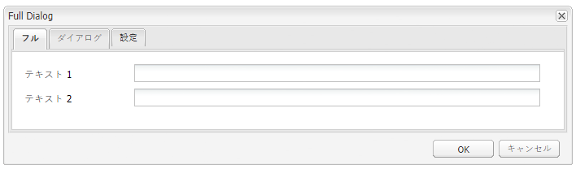

#### 例 2:シングルパネルダイアログ {#example-single-panel-dialog}

この **単一パネル** ダイアログには、2 つのテキストフィールドを持つ 1 つのタブを持つウィンドウが表示されます。 特性は次のとおりです。

* タブ（node type = `cq:Dialog`、xtype = [`panel`](/help/sites-developing/xtypes.md#panel)）を 1 つ表示します

* このタブには、2 つのテキストフィールド（node type = `cq:Widget`、xtype = [`textfield`](/help/sites-developing/xtypes.md#textfield)）があります

* ノードによって定義されます。

   `/apps/extjstraining/components/dialogbasics/singlepanel`

* 次をリクエストすることにより、JSON 形式でレンダリングされます。

   `http://localhost:4502/apps/extjstraining/components/dialogbasics/singlepanel.-1.json`

* より一つの利点 **完全なダイアログ** 必要な設定が少ないということです。
* 推奨される使用例：情報を表示する、または少数のフィールドのみを持つ単純なダイアログの場合。

[ シングルパネル ] ダイアログを使用するには：

1. ダイアログを **ダイアログの基本** コンポーネント **単一パネル** ダイアログ：

   1. **CRXDE Lite** で、次のノードを削除します。`/apps/extjstraining/components/dialogbasics/dialog`
   1. 「**すべて保存**」をクリックして変更を保存します。
   1. 次のノードをコピーします。`/apps/extjstraining/components/dialogbasics/singlepanel`
   1. コピーしたノードを次に貼り付けます。`/apps/extjstraining/components/dialogbasics`
   1. ノード `/apps/extjstraining/components/dialogbasics/Copy of singlepanel` を選択して、名前を `dialog` に変更します。

1. コンポーネントを編集します。次のようなダイアログが表示されます。

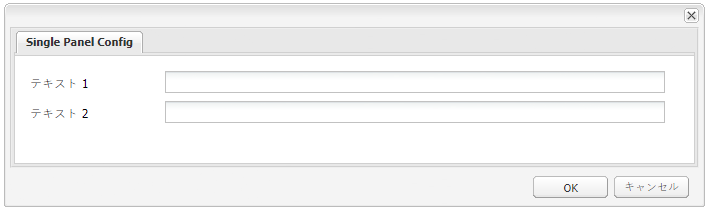

#### 例 3:マルチパネルダイアログ {#example-multi-panel-dialog}

この **マルチパネル** ダイアログは **完全** ダイアログは異なりますが、別の方法で構築されます。 特性は次のとおりです。

* ノード（node type = `cq:Dialog`、xtype = [`tabpanel`](/help/sites-developing/xtypes.md#tabpanel)）によって定義されます。

* 3 つのタブ（node type = `cq:Panel`）が表示されます。
* 各タブには、2 つのテキストフィールド（node type = `cq:Widget`、xtype = [`textfield`](/help/sites-developing/xtypes.md#textfield)）があります。

* ノードによって定義されます。

   `/apps/extjstraining/components/dialogbasics/multipanel`

* 次をリクエストすることにより、JSON 形式でレンダリングされます。

   `http://localhost:4502/apps/extjstraining/components/dialogbasics/multipanel.-1.json`

* **フルダイアログ**&#x200B;より有利な点は、構造が簡単なことです。

* 複数のタブを持つダイアログでの使用を推奨します。

複数パネルダイアログを使用するには：

1. ダイアログを **ダイアログの基本** コンポーネント **マルチパネル** ダイアログ：

   以下の手順に従って、 [例 2:シングルパネルダイアログ](#example-single-panel-dialog)

1. コンポーネントを編集します。次のようなダイアログが表示されます。

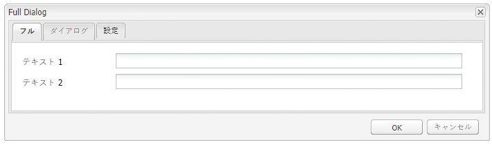

#### 例 4:リッチダイアログ {#example-rich-dialog}

この **リッチ** 2 つのタブを持つウィンドウが表示されます。 最初のタブには、テキストフィールド、ドロップダウンメニューおよび折りたたみ可能なテキスト領域があります。 2 番目のタブには、4 つのテキストフィールドを含むフィールドセットと、2 つのテキストフィールドを含む折りたたみ可能なフィールドセットがあります。 特性は次のとおりです。

* ノード（node type = `cq:Dialog`、xtype = [`dialog`](/help/sites-developing/xtypes.md#dialog)）によって定義されます。

* タブ（node type = `cq:Panel`）が 2 つ表示されます。
* 最初のタブには、[`textfield`](/help/sites-developing/xtypes.md#textfield) を含む [`dialogfieldset`](/help/sites-developing/xtypes.md#dialogfieldset) ウィジェットと 3 つのオプションを含む [`selection`](/help/sites-developing/xtypes.md#selection) ウィジェットに加え、[`textarea`](/help/sites-developing/xtypes.md#textarea) ウィジェットを含む折り畳み可能な [`dialogfieldset`](/help/sites-developing/xtypes.md#dialogfieldset) があります。

* 2 つ目のタブには、4 つの [`textfield`](/help/sites-developing/xtypes.md#textfield) ウィジェットを含む [`dialogfieldset`](/help/sites-developing/xtypes.md#dialogfieldset) ウィジェットと、2 つの [`textfield`](/help/sites-developing/xtypes.md#textfield) ウィジェットを含む折り畳み可能な `dialogfieldset` があります。

* ノードによって定義されます。

   `/apps/extjstraining/components/dialogbasics/rich`

* 次をリクエストすることにより、JSON 形式でレンダリングされます。

   `http://localhost:4502/apps/extjstraining/components/dialogbasics/rich.-1.json`

**リッチ**&#x200B;ダイアログを使用するには：

1. ダイアログを **ダイアログの基本** コンポーネント **リッチ** ダイアログ：

   以下の手順に従って、 [例 2:シングルパネルダイアログ](#example-single-panel-dialog)

1. コンポーネントを編集します。次のようなダイアログが表示されます。

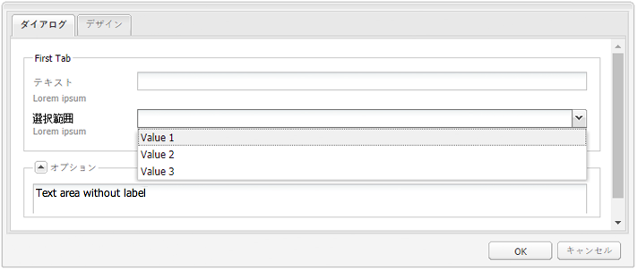 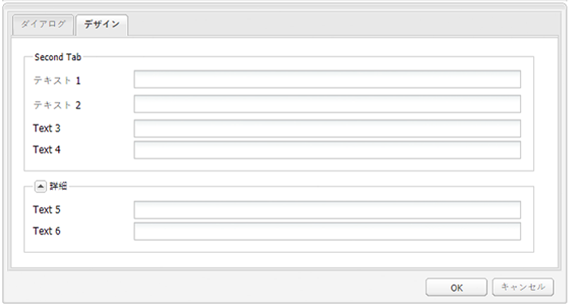

### 動的ダイアログ {#dynamic-dialogs}

の 2 番目の要素 **ExtJS ウィジェットの使用** サイドキックのグループは、 **2. 動的ダイアログ** には、標準のウィジェットで作成された 3 つの動的ダイアログと **カスタマイズされた javascript ロジックを使用**. ダイアログは、`/apps/extjstraining/components/dynamicdialogs` の下に保存されます。動的ダイアログは次のようになります。

* タブ切り換えダイアログ（`switchtabs` ノード）：2 つのタブを持つウィンドウが表示されます。最初のタブには、次の 3 つのオプションを含むラジオが選択されます。オプションを選択すると、そのオプションに関連するタブが表示されます。 2 番目のタブには、2 つのテキストフィールドがあります。
*  任意ダイアログ（`arbitrary` ノード）。タブが 1 つあるウィンドウが表示されます。このタブには、フィールドが 2 つあります。一つは、アセットをドロップまたはアップロードするためのフィールド、もう一つは、コンポーネントを含むページに関する情報とアセットに関する情報（アセットが参照されている場合）を表示するフィールドです。
* フィールド切り換えダイアログ（`togglefield` ノード）：タブが 1 つあるウィンドウが表示されます。このタブには、チェックボックスが 1 つあります。このチェックボックスを選択すると、テキストフィールドを 2 つ含むフィールドセットが表示されます。

**2.動的ダイアログ**&#x200B;コンポーネントをサンプルページに組み込むには：

1. **2.動的ダイアログ** コンポーネントを **ExtJS ウィジェットの使用** 」タブをクリックします。 **サイドキック**.

1. このコンポーネントには、タイトル、テキスト、および **プロパティ** リンク：をクリックして、リポジトリに保存されている段落のプロパティを表示します。 もう一度クリックすると、プロパティが非表示になります。

このコンポーネントは、次のように表示されます。


#### 例 1:タブを切り替えダイアログ {#example-switch-tabs-dialog}

この **タブを切り替え** 2 つのタブを持つウィンドウが表示されます。 最初のタブには、次の 3 つのオプションを含むラジオが選択されます。オプションを選択すると、そのオプションに関連するタブが表示されます。 2 番目のタブには、2 つのテキストフィールドがあります。

このダイアログの主な特徴を次に示します。

* ノード（node type = `cq:Dialog`、xtype = [`dialog`](/help/sites-developing/xtypes.md#dialog)）によって定義されます。

* タブが 2 つ表示されます（node type = `cq:Panel`）。1 つ目は選択タブです。2 つ目のタブは、1 つ目のタブで 3 つのオプションのどれを選択したかによって変わります。
* オプションタブが 3 つあります（node type = `cq:Panel`）。それぞれのオプションタブには、2 つのテキストフィールドがあります（node type = `cq:Widget`、xtype = [`textfield`](/help/sites-developing/xtypes.md#textfield)）。オプションタブは、同時に 1 つしか表示されません。

* 次の場所にある `switchtabs` ノードによって定義されます。

   `/apps/extjstraining/components/dynamicdialogs/switchtabs`

* 次をリクエストすることにより、JSON 形式でレンダリングされます。

   `http://localhost:4502/apps/extjstraining/components/dynamicdialogs/switchtabs.-1.json`

ロジックは、次のようにイベントリスナーと Javascript コードで実装されています。

* ダイアログノードには、ダイアログを表示する前にすべてのオプションタブを非表示にする「`beforeshow`」リスナーがあります。

   `beforeshow="function(dialog){Ejst.x2.manageTabs(dialog.items.get(0));}"`

   `dialog.items.get(0)` は、選択パネルと 3 つのオプションパネルを含むタブパネルを取得します。

* `Ejst.x2` オブジェクトは、次の場所にある `exercises.js` ファイルで定義します。

   `/apps/extjstraining/clientlib/js/exercises.js`

* `Ejst.x2.manageTabs()` メソッドで `index` の値を -1 にすると、すべてのオプションタブが非表示になります（i は 1 から 3 です）。

* 選択タブには、リスナーが 2 つあります。一つは、ダイアログのロード（「`loadcontent`」イベント）時に選択済みのタブを表示するリスナー、もう一つは、選択内容の変更（「`selectionchanged`」イベント）時に選択済みのタブを表示するリスナーです。

   `loadcontent="function(field,rec,path){Ejst.x2.showTab(field);}"`

   `selectionchanged="function(field,value){Ejst.x2.showTab(field);}"`

* `Ejst.x2.showTab()` メソッドで：

   `field.findParentByType('tabpanel')` はすべてのタブを含むタブパネルを取得します（`field` は selection ウィジェットを表します）

   `field.getValue()` は選択の値を取得します。例：tab2

   `Ejst.x2.manageTabs()` は選択したタブを表示します。

* 各オプションタブには、「`render`」イベントでタブを非表示にするリスナーがあります。

   `render="function(tab){Ejst.x2.hideTab(tab);}"`

* `Ejst.x2.hideTab()` メソッドで：

   `tabPanel` はすべてのタブを含むタブパネルです

   `index` はオプションタブのインデックスです

   `tabPanel.hideTabStripItem(index)` はタブを非表示にします

次のように表示されます。

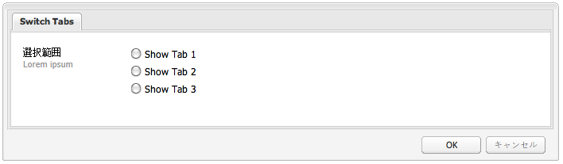

#### 例 2：任意ダイアログ {#example-arbitrary-dialog}

ほとんどの場合、ダイアログには、基になるコンポーネントからのコンテンツが表示されます。ここで説明する&#x200B;**任意**&#x200B;ダイアログは、別のコンポーネントからコンテンツを取り込みます。

この **任意** ダイアログには、1 つのタブを持つウィンドウが表示されます。 「 」タブには、次の 2 つのフィールドがあります。1 つはアセットをドロップまたはアップロードするためのもので、含まれるページとアセット（参照されている場合）に関する情報を表示するものです。

このダイアログの主な特徴を次に示します。

* ノードによって定義されます（node type = `cq:Dialog`、xtype = [`dialog`](/help/sites-developing/xtypes.md#dialog)）。

* 1 つの tabpanel ウィジェット（node type = `cq:Widget`、xtype = [`tabpanel`](/help/sites-developing/xtypes.md#tabpanel)）と 1 つのパネル（node type = `cq:Panel`）を表示

* パネルには、smartfile ウィジェット（node type = `cq:Widget`、xtype = [`smartfile`](/help/sites-developing/xtypes.md#smartfile)）と ownerdraw ウィジェット（node type = `cq:Widget`、xtype = [`ownerdraw`](/help/sites-developing/xtypes.md#ownerdraw)）があります。

* 次の場所にある `arbitrary` ノードによって定義されます。

   `/apps/extjstraining/components/dynamicdialogs/arbitrary`

* 次をリクエストすることにより、JSON 形式でレンダリングされます。

   `http://localhost:4502/apps/extjstraining/components/dynamicdialogs/arbitrary.-1.json`

ロジックは、次のようにイベントリスナーと Javascript コードで実装されています。

* ownerdraw ウィジェットには「`loadcontent`」リスナーがあります。このリスナーは、コンポーネントを含むページに関する情報と、コンテンツのロード時に smartfile ウィジェットが参照するアセットに関する情報を表示します。

   `loadcontent="function(field,rec,path){Ejst.x2.showInfo(field,rec,path);}"`

   `field` は ownerdraw オブジェクトで設定

   `path` はコンポーネントのコンテンツパスで設定（例：/content/geometrixx/en/products/triangle/ui-tutorial/jcr:content/par/dynamicdialogs）

* `Ejst.x2` オブジェクトは、次の場所にある `exercises.js` ファイルで定義します。

   `/apps/extjstraining/clientlib/js/exercises.js`

* `Ejst.x2.showInfo()` メソッドで：

   `pagePath` は、コンポーネントを含むページのパス

   `pageInfo` は、ページプロパティを json 形式で表す

   `reference` は、参照元のアセットのパス

   `metadata` は、アセットのメタデータを json 形式で表す

   `ownerdraw.getEl().update(html);` は、作成した html をダイアログに表示

**任意** ダイアログを使用するには：

1. ダイアログを **動的ダイアログ** コンポーネント **任意** ダイアログ：

   以下の手順に従って、 [例 2:シングルパネルダイアログ](#example-single-panel-dialog)

1. コンポーネントを編集します。次のようなダイアログが表示されます。

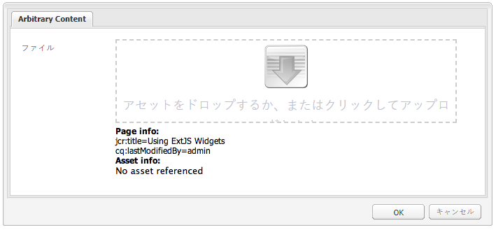

#### 例 3:フィールドを切り替えダイアログ {#example-toggle-fields-dialog}

この **フィールドを切り替え** ダイアログには、1 つのタブを持つウィンドウが表示されます。 このタブには、チェックボックスが 1 つあります。このチェックボックスを選択すると、テキストフィールドを 2 つ含むフィールドセットが表示されます。

このダイアログの主な特徴を次に示します。

* ノードによって定義されます（node type = `cq:Dialog`、xtype = [`dialog`](/help/sites-developing/xtypes.md#dialog)）。

* 1 つの tabpanel ウィジェット（node type = `cq:Widget`、xtype = [`tabpanel`](/help/sites-developing/xtypes.md#textpanel)）と 1 つのパネル（node type = `cq:Panel`）を表示します。

* このパネルには、selection/checkbox ウィジェット（node type = `cq:Widget`、xtype = [`selection`](/help/sites-developing/xtypes.md#selection)、type = [`checkbox`](/help/sites-developing/xtypes.md#checkbox)）、デフォルトでは非表示の折り畳み可能な dialogfieldset ウィジェット（node type = `cq:Widget`、xtype = [`dialogfieldset`](/help/sites-developing/xtypes.md#dialogfieldset)）、2 つの textfield ウィジェット（node type = `cq:Widget`、xtype = [`textfield`](/help/sites-developing/xtypes.md#textfield)）があります。

* 次の場所にある `togglefields` ノードによって定義されます。

   `/apps/extjstraining/components/dynamicdialogs/togglefields`

* 次をリクエストすることにより、JSON 形式でレンダリングされます。

   `http://localhost:4502/apps/extjstraining/components/dynamicdialogs/togglefields.-1.json`

ロジックは、次のようにイベントリスナーと Javascript コードで実装されています。

* 選択タブにはリスナーが 2 つあります。1 つは、コンテンツのロード（「`loadcontent`」イベント）時に dialogfieldset を表示するリスナー、もう 1 つは、選択内容の変更（「`selectionchanged`」イベント）時に dialogfieldset を表示するリスナーです。

   `loadcontent="function(field,rec,path){Ejst.x2.toggleFieldSet(field);}"`

   `selectionchanged="function(field,value){Ejst.x2.toggleFieldSet(field);}"`

* `Ejst.x2` オブジェクトは、次の場所にある `exercises.js` ファイルで定義します。

   `/apps/extjstraining/clientlib/js/exercises.js`

* `Ejst.x2.toggleFieldSet()` メソッドで：

   * `box` は、選択オブジェクトです。
   * `panel` は、選択ウィジェットと dialogfieldset ウィジェットを含むパネルです。
   * `fieldSet` は、dialogfieldset オブジェクトです。
   * `show` は選択範囲の値です（true または false）
   * 「 」に基づく `show`&#39; dialogfieldset が表示されているかどうか

**フィールドを切り替え**&#x200B;ダイアログを使用するには：

1. ダイアログを **動的ダイアログ** コンポーネント **フィールドを切り替え** ダイアログ：

   以下の手順に従って、 [例 2:シングルパネルダイアログ](#example-single-panel-dialog)

1. コンポーネントを編集します。次のようなダイアログが表示されます。

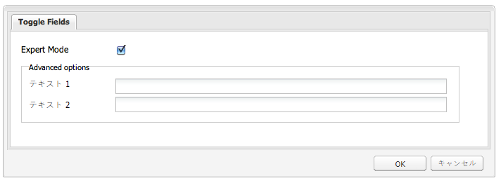

### カスタムウィジェット {#custom-widgets}

AEMに付属しているすぐに使用できるウィジェットは、ほとんどの使用例をカバーする必要があります。 ただし、プロジェクト固有の要件に対応するために、カスタムウィジェットの作成が必要になることもあります。カスタムウィジェットは、既存のウィジェットを拡張して作成できます。 このようなカスタマイズを開始する際に役立つように、 **ExtJS ウィジェットの使用** パッケージには、3 つの異なるカスタムウィジェットを使用する 3 つのダイアログが含まれています。

* 複数フィールドダイアログ（`multifield` ノード）は、タブが 1 つあるウィンドウを表示します。このタブには、カスタマイズされた multifield ウィジェットがあり、2 つのオプションを選択できるドロップダウンメニューとテキストフィールドという 2 つのフィールドが含まれています。このタブは、デフォルトの `multifield` ウィジェット（テキストフィールドのみを持つ）に基づいているので、`multifield` ウィジェットの機能をすべて使用できます。

* ツリー参照ダイアログ（`treebrowse` ノード）。このダイアログに表示されるウィンドウには、パス参照ウィジェットを含む 1 つのタブがあります。矢印をクリックすると、ウィンドウが開き、階層を参照しながら項目を選択できます。項目を選択すると、そのパスがパスフィールドに追加され、ダイアログを閉じても保持され続けます。
* リッチテキストエディタープラグインベースのダイアログ（`rteplugin` ノード）。リッチテキストエディターにカスタムボタンを追加したもので、メインテキストにカスタムテキストを挿入できます。`richtext` ウィジェット（RTE）と、RTE プラグインメカニズムを通じて追加されたカスタム機能から構成されています。

カスタムウィジェットとプラグインは、 **3. カスタムウィジェット** の **ExtJS ウィジェットの使用** パッケージ。 このコンポーネントをサンプルページに含めるには：

1. **3.カスタムウィジェット** コンポーネントを **ExtJS ウィジェットの使用** 」タブをクリックします。 **サイドキック**.

1. このコンポーネントには、タイトルとテキストが表示され、 **プロパティ** リンクとは、リポジトリに保存されている段落のプロパティです。 もう一度クリックすると、プロパティが非表示になります。


   このコンポーネントは、次のように表示されます。


#### 例 1:カスタム Multifield ウィジェット {#example-custom-multifield-widget}

この **カスタムマルチフィールド** ウィジェットベースのダイアログには、1 つのタブを持つウィンドウが表示されます。 このタブにはカスタマイズされた multifield ウィジェットがあり、1 つのフィールドを持つ標準ウィジェットとは異なり、次の 2 つのフィールドを持ちます。2 つのオプションと 1 つのテキストフィールドを含むドロップダウンメニュー。

**カスタムマルチフィールド**&#x200B;ウィジェットベースのダイアログ：

* ノードによって定義されます（node type = `cq:Dialog`、xtype = [`dialog`](/help/sites-developing/xtypes.md#dialog)）。

* 1 つの tabpanel ウィジェット（node type = `cq:Widget`、xtype = [`tabpanel`](/help/sites-developing/xtypes.md#tabpanel)）と 1 つのパネル（node type = `cq:Widget`、xtype = [`panel`](/help/sites-developing/xtypes.md#panel)）を表示します。

* このパネルには、`multifield` ウィジェット（node type = `cq:Widget`、xtype = [`multifield`](/help/sites-developing/xtypes.md#multifield)）があります。

* `multifield` ウィジェットには、カスタム xtype 「`ejstcustom`」に基づく fieldconfig（node type = `nt:unstructured`、xtype = `ejstcustom`、optionsProvider = `Ejst.x3.provideOptions`）があります。

   * 「`fieldconfig`」は、[`CQ.form.MultiField`](https://helpx.adobe.com/experience-manager/6-4/sites/developing/using/reference-materials/widgets-api/index.html?class=CQ.form.MultiField) オブジェクトの設定オプションです。
   * 「`optionsProvider`」は、`ejstcustom` ウィジェットの設定です。`Ejst.x3.provideOptions` メソッドで設定されます。このメソッドは、次の場所にある `exercises.js` で定義されます。

      `/apps/extjstraining/clientlib/js/exercises.js`

      
2 つのオプションを返します。

* 次の場所にある `multifield` ノードによって定義されます。

   `/apps/extjstraining/components/customwidgets/multifield`

* 次をリクエストすることにより、JSON 形式でレンダリングされます。

   `http://localhost:4502/apps/extjstraining/components/customwidgets/multifield.-1.json`

カスタム multifield ウィジェット（xtype = `ejstcustom`）：

* `Ejst.CustomWidget` という名前の Javascript オブジェクトです。

* 次の場所にある `CustomWidget.js` Javascript ファイルで定義されます。

   `/apps/extjstraining/clientlib/js/CustomWidget.js`

* [`CQ.form.CompositeField` ウィジェットを拡張します。](https://helpx.adobe.com/experience-manager/6-4/sites/developing/using/reference-materials/widgets-api/index.html?class=CQ.form.CompositeField)

* `hiddenField`（テキストフィールド）、`allowField`（コンボボックス）および `otherField`（テキストフィールド）という 3 つのフィールドがあります。

* `CQ.Ext.Component#initComponent` を上書きして 3 つのフィールドを追加します。

   * `allowField` は「select」型のオブジェクト [CQ.form.Selection](https://helpx.adobe.com/experience-manager/6-4/sites/developing/using/reference-materials/widgets-api/index.html?class=CQ.form.Selection) です。optionsProvider は、ダイアログで定義された CustomWidget の optionsProvider 設定でインスタンス化される Selection オブジェクトの設定です。
   * `otherField` は、[CQ.Ext.form.TextField](https://helpx.adobe.com/experience-manager/6-4/sites/developing/using/reference-materials/widgets-api/index.html?class=CQ.Ext.form.TextField) オブジェクトです。

* [CQ.form.CompositeField](https://helpx.adobe.com/experience-manager/6-4/sites/developing/using/reference-materials/widgets-api/index.html?class=CQ.form.CompositeField) のメソッド `setValue`、`getValue`、`getRawValue` を上書きして、次の形式の CustomWidget の値を設定および取得します。

   `<allowField value>/<otherField value>, e.g.: 'Bla1/hello'`。

* 自分自身を「`ejstcustom`」 xtype として登録します。

   `CQ.Ext.reg('ejstcustom', Ejst.CustomWidget);`

**Custom Multifield** ウィジェットベースのダイアログは、次のように表示されます。

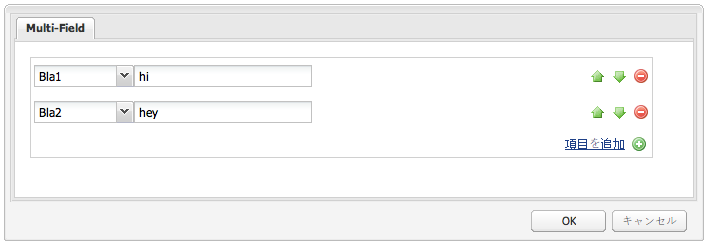

#### 例 2:カスタム Treebrowse ウィジェット {#example-custom-treebrowse-widget}

カスタム **Treebrowse** ウィジェットベースのダイアログには、カスタムパスの参照ウィジェットを含む 1 つのタブを持つウィンドウが表示されます。矢印をクリックすると、ウィンドウが開き、階層を参照して項目を選択できます。 項目を選択すると、そのパスがパスフィールドに追加され、ダイアログを閉じても保持され続けます。

カスタムツリー参照ダイアログ：

* ノードによって定義されます（node type = `cq:Dialog`、xtype = [`dialog`](/help/sites-developing/xtypes.md#dialog)）。

* パネルを 1 つ（node type = `cq:Widget`、xtype = [`panel`](/help/sites-developing/xtypes.md#panel)）を含む、tabpanel ウィジェットを 1 つ（node type = `cq:Widget`、xtype = [`tabpanel`](/help/sites-developing/xtypes.md#tabpanel)）表示します。

* このパネルには、カスタムウィジェット（node type = `cq:Widget`、xtype = `ejstbrowse`）があります。

* 次の場所にある `treebrowse` ノードによって定義されます。

   `/apps/extjstraining/components/customwidgets/treebrowse`

* 次をリクエストすることにより、JSON 形式でレンダリングされます。

   `http://localhost:4502/apps/extjstraining/components/customwidgets/treebrowse.-1.json`

カスタム treebrowse ウィジェット（xtype = `ejstbrowse`）：

* `Ejst.CustomWidget` という名前の Javascript オブジェクトです。
* 次の場所にある `CustomBrowseField.js` Javascript ファイルで定義されます。

   `/apps/extjstraining/clientlib/js/CustomBrowseField.js`

* 拡張 [`CQ.Ext.form.TriggerField`](https://helpx.adobe.com/experience-manager/6-4/sites/developing/using/reference-materials/widgets-api/index.html?class=CQ.Ext.form.TriggerField).
* `browseWindow` という名前の参照ウィンドウを定義します。

* 矢印がクリックされたときに参照ウィンドウを表示するように [`CQ.Ext.form.TriggerField` を上書きします。](https://helpx.adobe.com/experience-manager/6-4/sites/developing/using/reference-materials/widgets-api/index.html?class=CQ.Ext.form.TriggerField#onTriggerClick)
* を定義します。 [`CQ.Ext.tree.TreePanel`](https://helpx.adobe.com/experience-manager/6-4/sites/developing/using/reference-materials/widgets-api/index.html?class=CQ.Ext.tree.TreePanel) オブジェクト：

   * このオブジェクトのデータを取得するには、`/bin/wcm/siteadmin/tree.json` に登録されたサーブレットを呼び出します。
   * このオブジェクトのルートは、「`apps/extjstraining`」です。

* を定義します。 `window` オブジェクト ([`CQ.Ext.Window`](https://helpx.adobe.com/experience-manager/6-4/sites/developing/using/reference-materials/widgets-api/index.html?class=CQ.Ext.Window)):

   * 事前定義済みのパネルに基づいています。
   * 選択されたパスの値を設定し、パネルを非表示にする「**OK**」ボタンを組み込みます。

* ウィンドウは、「**パス**」フィールドの下に固定されます。
* 選択されたパスは、`show` イベントが発生したときに、参照フィールドからウィンドウに渡されます。

* それ自体を「`ejstbrowse`」xtype として登録します。

   `CQ.Ext.reg('ejstbrowse', Ejst.CustomBrowseField);`

**カスタム Treebrowse** ウィジェットベースのダイアログを使用するには：

1. ダイアログを **カスタムウィジェット** コンポーネント **Custom Treebrowse** ダイアログ：

   以下の手順に従って、 [例 2:シングルパネルダイアログ](#example-single-panel-dialog)

1. コンポーネントを編集します。次のようなダイアログが表示されます。

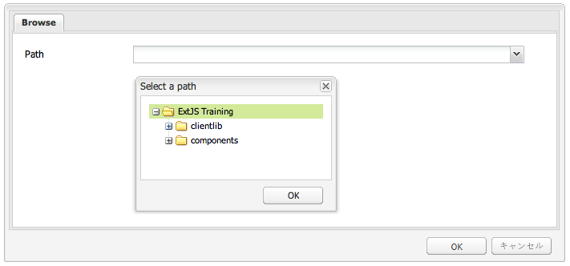

#### 例 3:リッチテキストエディター (RTE) プラグイン {#example-rich-text-editor-rte-plug-in}

この **リッチテキストエディター (RTE) プラグイン** ベースダイアログは、リッチテキストエディターベースのダイアログで、カスタムボタンを持ち、カスタムテキストを角括弧内に挿入します。 カスタムテキストをサーバー側ロジックで解析し、例えば、特定のパスで定義されたテキストを追加することができます（この例では、サーバー側ロジックは実装されていません）。

**RTE プラグイン**&#x200B;ベースのダイアログ：

* 次の場所にある rteplugin ノードによって定義されます。

   `/apps/extjstraining/components/customwidgets/rteplugin`

* 次を要求することにより、JSON 形式でレンダリングされます。

   `http://localhost:4502/apps/extjstraining/components/customwidgets/rteplugin.-1.json`

* `rtePlugins` ノードには、プラグインにちなんで命名された子ノード `inserttext`（ノードタイプ = `nt:unstructured`）があります。このノードには、RTE で使用可能なプラグイン機能を定義する `features` という名前のプロパティがあります。

RTE プラグイン：

* `Ejst.InsertTextPlugin` という名前の Javascript オブジェクトです。

* 次の場所にある `InsertTextPlugin.js` Javascript ファイルで定義されます。

   `/apps/extjstraining/clientlib/js/InsertTextPlugin.js`

* [`CQ.form.rte.plugins.Plugin` オブジェクトを拡張します。](https://helpx.adobe.com/experience-manager/6-4/sites/developing/using/reference-materials/widgets-api/index.html?class=CQ.form.rte.plugins.Plugin)
* 次のメソッドは、[`CQ.form.rte.plugins.Plugin` オブジェクトを定義するもので、プラグインの実装時に上書きされます。](https://helpx.adobe.com/experience-manager/6-4/sites/developing/using/reference-materials/widgets-api/index.html?class=CQ.form.rte.plugins.Plugin)

   * `getFeatures()` は、プラグインによって使用可能になるすべての機能の配列を返します。
   * `initializeUI()` は、RTE ツールバーに新しいボタンを追加します。
   * `notifyPluginConfig()` は、ボタンにマウスポインターが置かれたときにタイトルとテキストを表示します。
   * `execute()` は、ボタンのクリック時に呼び出されるもので、含めるテキストを定義するためのウィンドウを表示するというプラグインのアクションを実行します。

* `insertText()` は、対応するダイアログオブジェクト `Ejst.InsertTextPlugin.Dialog`（後述）を使用してテキストを挿入します。

* `executeInsertText()` は、ダイアログの `apply()` メソッドで呼び出されます。これは「**OK**」ボタンをクリックしたときにトリガーされます。

* それ自体を「`inserttext`」プラグインとして登録します。

   `CQ.form.rte.plugins.PluginRegistry.register("inserttext", Ejst.InsertTextPlugin);`

* `Ejst.InsertTextPlugin.Dialog` オブジェクトは、プラグインのボタンがクリックされたときに開くダイアログを定義します。このダイアログは、1 つのパネル、1 つのフォーム、1 つのテキストフィールドおよび 2 つのボタン（「**OK**」と「**キャンセル**」）から構成されます。

**リッチテキストエディター（RTE）プラグイン**&#x200B;ベースのダイアログを使用するには：

1. ダイアログを **カスタムウィジェット** コンポーネント **リッチテキストエディター (RTE) プラグイン** ベースダイアログ：

   以下の手順に従って、 [例 2:シングルパネルダイアログ](#example-single-panel-dialog)

1. コンポーネントを編集します。
1. 右端のアイコン（4 つの矢印が付いているアイコン）をクリックします。パスを入力し、 **OK**:

   パスは角括弧 (`[]`) をクリックします。

1. クリック **OK** をクリックして、リッチテキストエディターを閉じます。

この **リッチテキストエディター (RTE) プラグイン** ベースのダイアログは次のように表示されます。

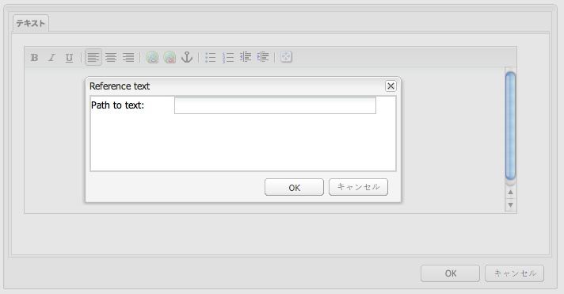

>[!NOTE]
>
>この例は、クライアント側のロジックの実装方法のみを示しています。プレースホルダー（*[text]*）は、サーバー側（コンポーネント JSP など）でも明示的に解析する必要があります。

### Tree Overview {#tree-overview}

すぐに使用できる [`CQ.Ext.tree.TreePanel` オブジェクトは、ツリー構造のデータをツリー構造 UI として表示できます。](https://helpx.adobe.com/experience-manager/6-4/sites/developing/using/reference-materials/widgets-api/index.html?class=CQ.Ext.tree.TreePanel)**Using ExtJS Widgets** パッケージに含まれている Tree Overview コンポーネントを見ると、`TreePanel` オブジェクトを使用して特定のパスの下に JCR ツリーを表示する方法がわかります。このウィンドウ自体は、ドッキングすることも、ドッキング解除することもできます。この例の場合、ウィンドウのロジックは、コンポーネント jsp の &lt;script> タグと &lt;/script> タグの間に埋め込まれています。

**Tree Overview** コンポーネントをサンプルページに組み込むには：

1. **4.Tree Overview** コンポーネントをサンプルページに追加します。これは、**サイドキック**&#x200B;にある「**Using ExtJS Widgets**」タブでおこないます。

1. このコンポーネントには、次のものが表示されます。

   * タイトルとテキスト
   * a **プロパティ** リンク：をクリックして、リポジトリに保存されている段落のプロパティを表示します。 もう一度クリックすると、プロパティが非表示になります。
   * リポジトリのツリー表現を持つフローティングウィンドウ（展開可能）。

このコンポーネントは、次のように表示されます。


Tree Overview コンポーネント：

* 次で定義されます。

   `/apps/extjstraining/components/treeoverview`

* このダイアログボックスでは、ウィンドウのサイズを設定したり、ウィンドウをドッキング/ドッキング解除したりできます（詳細は以下を参照）。

コンポーネント jsp は次のようになります。

* リポジトリから幅、高さ、ドッキングの各プロパティを取得します。
* ツリー概要のデータ形式に関するテキストを表示します。
* ウィンドウのロジックをコンポーネント jsp の Javascript タグの間に埋め込みます。
* 次で定義されます。

   `apps/extjstraining/components/treeoverview/content.jsp`

コンポーネント jsp に埋め込まれた Javascript コード：

* ページからツリーウィンドウの取得を試みることにより、`tree` オブジェクトを定義します。

* ツリーを表示しているウィンドウが存在しない場合は、`treePanel`（[CQ.Ext.tree.TreePanel](https://helpx.adobe.com/experience-manager/6-4/sites/developing/using/reference-materials/widgets-api/index.html?class=CQ.Ext.tree.TreePanel)）が作成されます。

   * `treePanel` には、ウィンドウの作成に使用されるデータが含まれています。
   * データは、次で登録されたサーブレットを呼び出すことにより、取得されます。
      `/bin/wcm/siteadmin/tree.json`

* `beforeload` リスナーにより、クリックされたノードがロードされます。
* `root` オブジェクトは、パス `apps/extjstraining` をツリーのルートとして設定します。
* `tree` ([`CQ.Ext.Window`](https://helpx.adobe.com/experience-manager/6-4/sites/developing/using/reference-materials/widgets-api/index.html?class=CQ.Ext.Window)) は、事前定義された `treePanel`、およびは次の情報と共に表示されます。

   `tree.show();`

* ウィンドウが既に存在する場合、ウィンドウは、リポジトリから取得した幅、高さ、ドッキングの各プロパティに基づいて表示されます。

コンポーネントダイアログ：

* ツリー概要ウィンドウのサイズ（幅と高さ）を設定するための 2 つのフィールドとウィンドウをドッキング、ドッキング解除するための 1 つのフィールドを持つ 1 つのタブを表示
* ノードによって定義されます（node type = `cq:Dialog`、xtype = [`panel`](/help/sites-developing/xtypes.md#panel)）。

* パネルには、サイズフィールドウィジェット（node type = `cq:Widget`、xtype = [`sizefield`](/help/sites-developing/xtypes.md#sizefield)）と選択ウィジェット（node type = `cq:Widget`、xtype = [`selection`](/help/sites-developing/xtypes.md#selection)、type = `radio`）があり、2 つのオプション（true または false）を持ちます。

* 次の場所にあるダイアログノードによって定義されます。

   `/apps/extjstraining/components/treeoverview/dialog`

* 次のことを要求することにより、JSON 形式でレンダリングされます。

   `http://localhost:4502/apps/extjstraining/components/treeoverview/dialog.-1.json`

* 次のように表示されます。

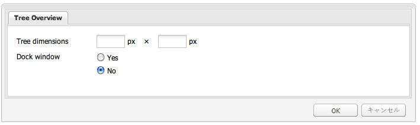

### グリッドの概要 {#grid-overview}

グリッドパネルは、データを行と列の表形式で表します。 これは、次の内容で構成されます。

* ストア：データレコード（行）を保持しているモデル。
* 列モデル：列の構成。
* ビュー：ユーザーインターフェイスが含まれます。
* 選択モデル：選択の動作。

**Using ExtJS Widgets** パッケージに含まれている Grid Overview コンポーネントを見ると、データを表形式で表示する方法がわかります。

* 例 1 では、静的データを使用しています。
* 例 2 では、リポジトリから取得したデータを使用しています。

Grid Overview コンポーネントをサンプルページに組み込むには：

1. **5 を追加します。Grid Overview** コンポーネントを、**サイドキック**&#x200B;の **Using ExtJS Widgets** タブからサンプルページに追加します。

1. このコンポーネントには、次のものが表示されます。

   * タイトルとテキスト
   * a **プロパティ** リンク：をクリックして、リポジトリに保存されている段落のプロパティを表示します。 もう一度クリックすると、プロパティが非表示になります。
   * 表形式のデータを含むフローティングウィンドウ。

このコンポーネントは、次のように表示されます。


#### 例 1:デフォルトのグリッド {#example-default-grid}

標準バージョンでは、 **グリッドの概要** コンポーネントは、静的データが含まれるウィンドウを表形式で表示します。 この例では、ロジックは次の 2 つの方法でコンポーネント jsp に埋め込まれます。

* 汎用論理は &lt;script>&lt;/script> タグ
* 特定のロジックは別の.js ファイルで使用でき、jsp 内でにリンクされます。 この設定により、必要な &lt;script> タグをコメントすることで、2 つのロジック（static/dynamic）を簡単に切り替えることができます。

Grid Overview コンポーネント：

* 次で定義されます。

   `/apps/extjstraining/components/gridoverview`

* このダイアログボックスでは、ウィンドウのサイズを設定したり、ウィンドウをドッキング/ドッキング解除したりできます。

コンポーネント jsp は次のようになります。

* リポジトリから幅、高さ、ドッキングの各プロパティを取得します。
* グリッド概要のデータ形式の紹介としてテキストを表示します。
* GridPanel オブジェクトを定義する Javascript コードを参照します。

   `<script type="text/javascript" src="/apps/extjstraining/components/gridoverview/defaultgrid.js"></script>`

   `defaultgrid.js` では、一部の静的データを GridPanel オブジェクトのベースとして定義します。

* GridPanel オブジェクトを使用して Window オブジェクトを定義する Javascript タグの間に Javascript コードを 埋め込みます。
* 次で定義されます。

   `apps/extjstraining/components/gridoverview/content.jsp`

コンポーネント jsp に埋め込まれた Javascript コード：

* ページからウィンドウコンポーネントの取得を試みることにより、`grid` オブジェクトを定義します。

   `var grid = CQ.Ext.getCmp("<%= node.getName() %>-grid");`

* `grid` が存在しない場合、[CQ.Ext.grid.GridPanel](https://helpx.adobe.com/experience-manager/6-4/sites/developing/using/reference-materials/widgets-api/index.html?class=CQ.Ext.grid.GridPanel) オブジェクト（`gridPanel`）は、`getGridPanel()` メソッド（以下を参照）を呼び出すことにより定義されます。このメソッドは、`defaultgrid.js` で定義されます。

* `grid` は、事前定義済みの GridPanel に基づく [`CQ.Ext.Window`](https://helpx.adobe.com/experience-manager/6-4/sites/developing/using/reference-materials/widgets-api/index.html?class=CQ.Ext.Window) オブジェクトであり、次のように表示されます：`grid.show();`

* If `grid` 既に存在する場合は、リポジトリから取得した幅、高さ、ドッキングの各プロパティに基づいて表示されます。

コンポーネント jsp で参照される Javascript ファイル（`defaultgrid.js`）には、`getGridPanel()` メソッドが定義されています。このメソッドは、JSP に埋め込まれたスクリプトによって呼び出され、静的データに基づいて [`CQ.Ext.grid.GridPanel` オブジェクトを返します。](https://helpx.adobe.com/experience-manager/6-4/sites/developing/using/reference-materials/widgets-api/index.html?class=CQ.Ext.grid.GridPanel)ロジックを次に示します。

* `myData` は、静的データの配列で、5 列 x 4 行の表として書式設定されています。
* `store` は、`myData` を使用する `CQ.Ext.data.Store` オブジェクトです。

* `store` は、メモリにロードされます。

   `store.load();`

* `gridPanel` は、[`CQ.Ext.grid.GridPanel` を使用する ](https://helpx.adobe.com/experience-manager/6-4/sites/developing/using/reference-materials/widgets-api/index.html?class=CQ.Ext.grid.GridPanel)`store` オブジェクトです。

   * 列幅は常に再調整されます。

      `forceFit: true`

   * 選択できる行は一度に 1 つのみです。

      `singleSelect:true`

#### 例 2：参照検索グリッド {#example-reference-search-grid}

パッケージをインストールすると、**Grid Overview** コンポーネントの `content.jsp` により、静的データに基づくグリッドが表示されます。次の特性を持つグリッドを表示するようにコンポーネントを変更できます。

* 3 列あり。
* サーブレットを呼び出してリポジトリから取得したデータに基づきます。
* 最後の列のセルを編集できます。 この値は、先頭の列に表示されたパスで定義されたノードの下にある `test` プロパティに保持されます。

前の節で説明したように、window オブジェクトは、 [`CQ.Ext.grid.GridPanel`](https://helpx.adobe.com/experience-manager/6-4/sites/developing/using/reference-materials/widgets-api/index.html?class=CQ.Ext.grid.GridPanel) オブジェクトを `getGridPanel()` メソッドが `defaultgrid.js` ～にファイルを送る `/apps/extjstraining/components/gridoverview/defaultgrid.js`. この **グリッドの概要** コンポーネントは、 `getGridPanel()` メソッド ( `referencesearch.js` ～にファイルを送る `/apps/extjstraining/components/gridoverview/referencesearch.js`. コンポーネント jsp で参照される .js ファイルを切り替えることにより、グリッドは、リポジトリから取得したデータに基づくようになります。

コンポーネント jsp で参照される .js ファイルを切り替えるには、次の手順を行います。

1. **CRXDE Lite** で、コンポーネントの `content.jsp` ファイル内にある `defaultgrid.js` ファイルを含む行を、次のようにコメント化します。

   `<!-- script type="text/javascript" src="/apps/extjstraining/components/gridoverview/defaultgrid.js"></script-->`

1. `referencesearch.js` ファイルを含む行のコメント化を、次のように解除します。

   `<script type="text/javascript" src="/apps/extjstraining/components/gridoverview/referencesearch.js"></script>`

1. 変更内容を保存します。
1. サンプルページを更新します。

このコンポーネントは、次のように表示されます。


コンポーネント jsp で参照されている Javascript コード（`referencesearch.js`）は、コンポーネント jsp から呼び出される `getGridPanel()` メソッドを定義しており、リポジトリから動的に取得されるデータに基づいて [`CQ.Ext.grid.GridPanel` オブジェクトを返します。](https://helpx.adobe.com/experience-manager/6-4/sites/developing/using/reference-materials/widgets-api/index.html?class=CQ.Ext.grid.GridPanel)`referencesearch.js` のロジックでは、一部の動的データが GridPanel の基礎として定義されています。

* `reader` は、JSON 形式のサーブレット応答を読み取る 3 列用の [`CQ.Ext.data.JsonReader`](https://helpx.adobe.com/experience-manager/6-4/sites/developing/using/reference-materials/widgets-api/index.html?class=CQ.Ext.data.JsonReader) オブジェクトです。

* `cm` は、3 列用の [`CQ.Ext.grid.ColumnModel`](https://helpx.adobe.com/experience-manager/6-4/sites/developing/using/reference-materials/widgets-api/index.html?class=CQ.Ext.grid.ColumnModel) オブジェクトです。


   「テスト」列のセルは、エディターで定義されているので編集することが可能です。

   `editor: new `[`CQ.Ext.form.TextField`](https://helpx.adobe.com/experience-manager/6-4/sites/developing/using/reference-materials/widgets-api/index.html?class=CQ.Ext.form.TextField)`({})`

* 列は並べ替え可能です。

   `cm.defaultSortable = true;`

* `store` は [`CQ.Ext.data.GroupingStore`](https://helpx.adobe.com/experience-manager/6-4/sites/developing/using/reference-materials/widgets-api/index.html?class=CQ.Ext.data.GroupingStore) オブジェクトで、次のような特徴があります。

   * クエリをフィルター処理するためのパラメーターをいくつか指定し、「`/bin/querybuilder.json`」に登録されているサーブレットを呼び出すことで、データを取得します
   * 前に定義した `reader` に基づきます
   * 表は、「**jcr:path**」列に従って、昇順で並べ替えられます。

* `gridPanel` は編集可能な [`CQ.Ext.grid.EditorGridPanel`](https://helpx.adobe.com/experience-manager/6-4/sites/developing/using/reference-materials/widgets-api/index.html?class=CQ.Ext.grid.EditorGridPanel) オブジェクトで、次のような特徴があります。

   * 事前定義済みの `store` と列モデル `cm` に基づいています。
   * 選択できる行は一度に 1 つのみです。

      `sm: new `[`CQ.Ext.grid.RowSelectionModel`](https://helpx.adobe.com/experience-manager/6-4/sites/developing/using/reference-materials/widgets-api/index.html?class=CQ.Ext.grid.RowSelectionModel)`({singleSelect:true})`

   * `afteredit` リスナーは、「**テスト**」列のセルが編集されたことを確認します。

      * 「**jcr:path**」列で定義されたパスにあるノードのプロパティ「`test`」は、セルの値とともにリポジトリに設定されます。
      * POST が成功した場合は、値が `store` オブジェクトに追加されます。POST が失敗した場合は、値が拒否されます。
