# ワークフローモデルの作成{#creating-workflow-models}

>[!CAUTION]
>
>クラシック UI の使用方法については、[AEM 6.3 のドキュメント](https://helpx.adobe.com/experience-manager/6-3/sites-developing/workflows-models.html)を参照してください。

ワークフローを開始したときに実行される一連のステップを定義するには、[ワークフローモデル](/help/sites-developing/workflows.md#model)を作成します。ワークフローを一時的なものにするか、複数のリソースを使用するかなど、モデルのプロパティを定義することもできます。

ユーザーがワークフローを開始すると、インスタンスが開始されます。これは対応するランタイムモデルです。変更内容を[同期](#sync-your-workflow-generate-a-runtime-model)すると作成されます。

## 新しいワークフローの作成 {#creating-a-new-workflow}

初めて作成する新しいワークフローモデルには、次のものが含まれています。

* ステップ **[!UICONTROL フロー開始]** および **[!UICONTROL フロー終了]**.

   これらのステップは、ワークフローの始まりと終わりを表します。これらの手順は必須で、編集または削除できません。

* 例 **参加者** step named **手順 1**.

   このステップは、作業項目をワークフロー開始者に割り当てるように設定されています。このステップを編集または削除し、必要に応じてステップを追加します。

エディターを使用して新しいワークフローを作成するには：

1. を開きます。 **[!UICONTROL ワークフローモデル]** コンソール～の方法で **[!UICONTROL ツール]**, **[!UICONTROL ワークフロー]**, **[!UICONTROL モデル]** 例：

   [http://localhost:4502/aem/workflow](http://localhost:4502/aem/workflow)

1. 「**[!UICONTROL 作成]**」を選択してから、「**[!UICONTROL モデルを作成]**」を選択します。
1. この **[!UICONTROL ワークフローモデルを追加]** ダイアログボックスが表示されます。 「**[!UICONTROL タイトル]**」と「**[!UICONTROL 名前]**」（オプション）を入力してから、「**[!UICONTROL 完了]**」を選択します。
1. 新しいモデルが **[!UICONTROL ワークフローモデル]** コンソール。
1. 新しいワークフローを選択し、[**[!UICONTROL 「編集&#x200B;]**」をクリックすると、ワークフローが設定のために開かれます](#editing-a-workflow)。

   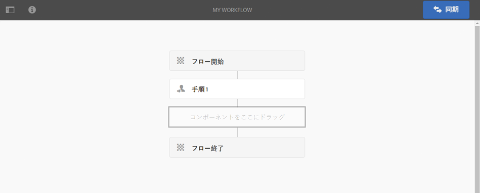

>[!NOTE]
>
>（CRX パッケージを使用して）プログラムによってモデルを作成する場合は、次の場所にサブフォルダーを作成することもできます。
>
>`/var/workflow/models`
>
>例：`/var/workflow/models/prototypes`
>
>このフォルダーは、[そのフォルダー内のモデルへのアクセス権を管理](/help/sites-administering/workflows-managing.md#create-a-subfolder-in-var-workflow-models-and-apply-the-acl-to-that)するために利用できます。

## ワークフローの編集 {#editing-a-workflow}

既存のワークフローモデルを編集して、次のことができます。

* [ステップ](#adding-a-step-to-a-model)と[パラメーター](#configuring-a-workflow-step)を定義する

* [ステージ](#configuring-workflow-stages-that-show-workflow-progress)、[ワークフローを一時的にする](#creating-a-transient-workflow)か、[複数のリソースを使用する](#configuring-a-workflow-for-multi-resource-support)かなど、ワークフロープロパティを設定する

の編集 [**デフォルトまたはレガシー** （標準）ワークフロー](#editing-a-default-or-legacy-workflow-for-the-first-time) には、 [セーフコピー](/help/sites-developing/workflows-best-practices.md#locations-workflow-models) は、変更がおこなわれる前に実行されます。

ワークフローの変更を完了するには、「**[!UICONTROL 同期]**」を使用して、**[!UICONTROL ランタイムモデルを生成]**&#x200B;する必要があります。詳しくは、[ワークフローの同期](#sync-your-workflow-generate-a-runtime-model)を参照してください。

### ワークフローの同期 - ランタイムモデルの生成 {#sync-your-workflow-generate-a-runtime-model}

「**同期**」（エディターのツールバーの右側）をクリックすると、[ランタイムモデル](/help/sites-developing/workflows.md#runtime-model)が生成されます。ランタイムモデルは、ユーザーがワークフローを開始したときに実際に使用されるモデルです。変更内容を&#x200B;**[!UICONTROL 同期]**&#x200B;しない場合は、その変更内容は実行時には反映されません。

ワークフローに変更を加えた場合は、「**[!UICONTROL 同期]**」をクリックしてランタイムモデルを生成する必要があります。個々のダイアログ（ステップなど）に保存オプションがある場合でも同様です。

変更内容がランタイム（保存済み）モデルと同期されると、「**[!UICONTROL 同期済み]**」に表示が変わります。

ステップによっては必須のフィールドや組み込みの検証が含まれている場合があります。こうした条件を満たしていない場合は、モデルの&#x200B;**[!UICONTROL 同期]**&#x200B;をおこなうと、エラーが表示されます。例えば次のように、**[!UICONTROL 参加者]**&#x200B;ステップで参加者が定義されていない場合などです。

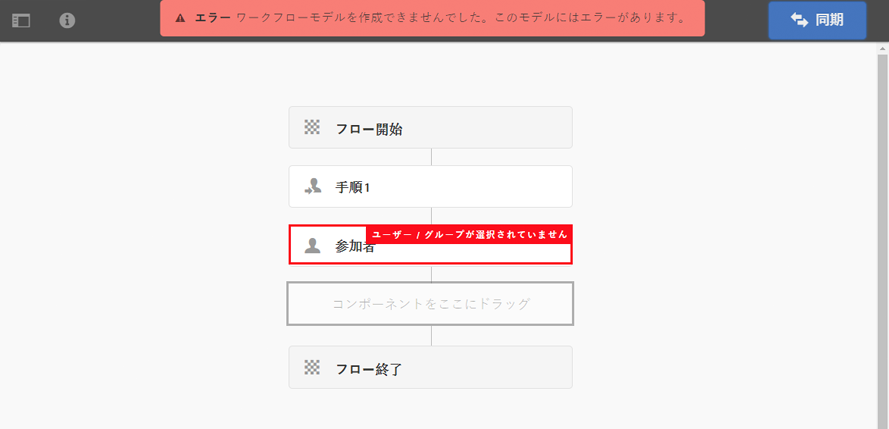

### デフォルトまたはレガシーのワークフローの初回編集時 {#editing-a-default-or-legacy-workflow-for-the-first-time}

[デフォルトまたはレガシーのモデル](/help/sites-developing/workflows.md#workflow-types)を開いて編集する際は、次の点に注意してください。

* この **[!UICONTROL 手順]** ブラウザーを使用できません（左側）。
* ツールバーで「**[!UICONTROL 編集]**」操作を利用できます（右側）。
* 次の理由から、最初はモデルとそのプロパティが読み取り専用モードで開かれます。

   * デフォルトのワークフローは、 `/libs`
   * レガシーワークフローは、 `/etc`

「**[!UICONTROL 編集]**」をクリックすると、次のようになります。

* ワークフローのコピーを次に取り込む `/conf`
* ～を作る **[!UICONTROL 手順]** 使用可能なブラウザー
* 変更を加えられるようになります。

>[!NOTE]
>
>詳しくは、[ワークフローモデルの場所](/help/sites-developing/workflows-best-practices.md#locations-workflow-models)を参照してください。

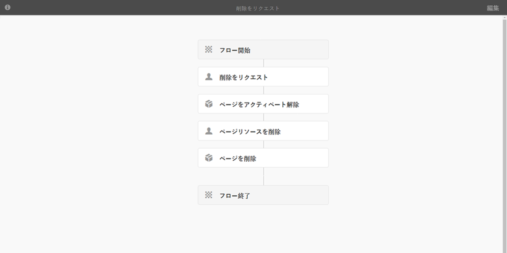

### モデルにステップを追加 {#adding-a-step-to-a-model}

実行するアクティビティを表すために、ステップをモデルに追加する必要があります。各ステップは固有のアクティビティを実行します。標準の AEM インスタンスには、いくつかのステップコンポーネントが用意されています。

モデルを編集すると、使用可能なステップが **[!UICONTROL 手順]** ブラウザー。 次に例を示します。

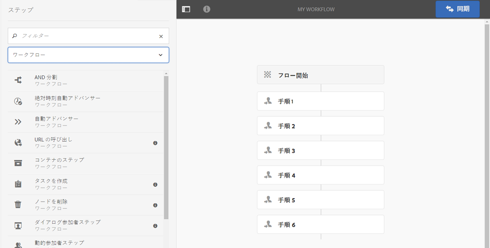

>[!NOTE]
>
>AEM と共にインストールされる主なステップコンポーネントについては、[ワークフローステップのリファレンス](/help/sites-developing/workflows-step-ref.md)を参照してください。

**モデルにステップを追加するには**:

1. 編集する既存のワークフローモデルを開きます。次の **[!UICONTROL ワークフローモデル]** コンソールで、必要なモデルを選択してから、 **[!UICONTROL 編集]**.
1. を開きます。 **[!UICONTROL 手順]** ブラウザ；using **[!UICONTROL サイドパネルを切り替え]**（上部のツールバーの左端） ここでは、以下のことができます。

   * **[!UICONTROL フィルター]**&#x200B;を使用して特定のステップのみを表示する。
   * ドロップダウンセレクターを使用して、選択対象を特定のステップのグループに限定する。
   * 「説明を表示」アイコンを選択します。  をクリックして、適切な手順の詳細を表示します。

   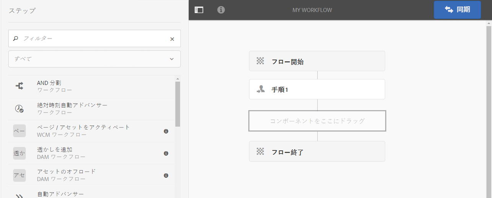

1. 対象のステップをドラッグしてモデル内の目的の場所に移動します。

   **[!UICONTROL 参加者ステップ]**&#x200B;などです。

   フローに追加された後は、次の操作を実行できます。 [ステップの設定](#configuring-a-workflow-step).

   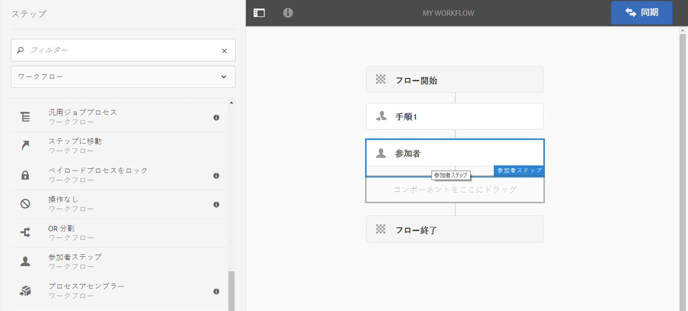

1. 必要に応じてステップを追加したり、変更を加えたりします。

   実行時には、ステップがモデル内に配置されている順序で実行されます。いったん追加したステップコンポーネントを、モデル内の別の場所にドラッグすることもできます。

   [ページエディター](/help/sites-authoring/editing-content.md)と同様に、ステップのコピー、切り取り、貼り付け、グループ分け、削除をおこなうこともできます。

   分割ステップは、ツールバーオプションを使用して折りたたんだり展開したりすることもできます。 

1. 「**[!UICONTROL 同期]**」（エディターツールバー）をクリックして変更内容を確定し、ランタイムモデルを生成します。

   詳しくは、[ワークフローの同期](#sync-your-workflow-generate-a-runtime-model)を参照してください。

### ワークフローステップの設定 {#configuring-a-workflow-step}

以下が可能です。 **設定** をクリックし、 **[!UICONTROL ステップのプロパティ]** ダイアログボックス

1. 次の手順で **[!UICONTROL ステップのプロパティ]** ステップのダイアログボックスは、次のいずれかの方法で表示されます。

   * ワークフローモデルのステップをタップし、「 」を選択します。 **[!UICONTROL 設定]** を選択します。
   * ステップをダブルクリックします。

   >[!NOTE]
   >
   >AEM と共にインストールされる主なステップコンポーネントについては、[ワークフローステップのリファレンス](/help/sites-developing/workflows-step-ref.md)を参照してください。

1. 必要に応じて&#x200B;**[!UICONTROL ステップのプロパティ]**&#x200B;を設定します。利用できるプロパティはステップのタイプによって異なります。複数のタブが表示されることもあります。例えば、デフォルトの **[!UICONTROL 参加者ステップ]**（新しいワークフローに存在） `Step 1`:

   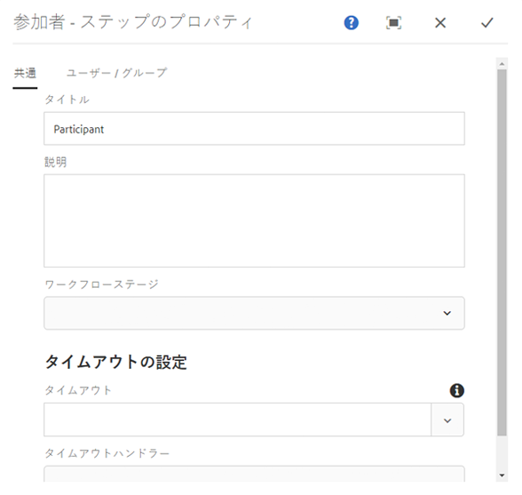

1. チェックマークをクリックして、変更内容を確認します。
1. 「**[!UICONTROL 同期]**」（エディターツールバー）をクリックして変更内容を確定し、ランタイムモデルを生成します。

   詳しくは、[ワークフローの同期](#sync-your-workflow-generate-a-runtime-model)を参照してください。

### 一時的ワークフローの作成 {#creating-a-transient-workflow}

新しいモデルを作成するときに、または既存のモデルに手を加えて、[一時的](/help/sites-developing/workflows.md#transient-workflows)ワークフローモデルを作成することができます。

1. [編集](#editing-a-workflow)するワークフローモデルを開きます。
1. ツールバーから「**[!UICONTROL ワークフローモデルのプロパティ]**」を選択します。
1. ダイアログボックスで、をアクティブにします。 **[!UICONTROL 一時的なワークフロー]** （必要に応じて非アクティブ化）:

   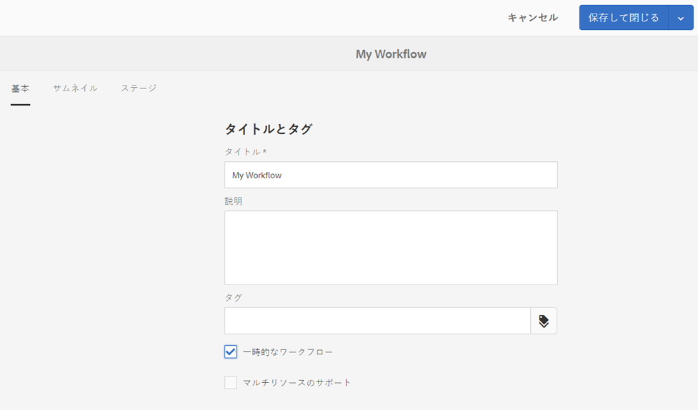

1. 「**[!UICONTROL 保存して閉じる]**」をクリックし、「**[!UICONTROL 同期]**」（エディターツールバー）をクリックして変更内容を確定し、ランタイムモデルを生成します。

   詳しくは、[ワークフローの同期](#sync-your-workflow-generate-a-runtime-model)を参照してください。

>[!NOTE]
>
>ワークフローを[一時的](/help/sites-developing/workflows.md#transient-workflows)モードでした場合は、AEM にはワークフロー履歴が保存されません。したがって、そのワークフローに関連する情報は、[タイムライン](/help/sites-authoring/basic-handling.md#timeline)に表示されません。[](/help/sites-authoring/basic-handling.md#timeline)

### タッチ UI でワークフローモデルを使用可能にする {#make-workflow-models-available-in-touchui}

ワークフローモデルがクラシック UI に存在するが、選択ポップアップメニュー ( **[!UICONTROL タイムライン]** タッチ UI のパネルを表示し、設定に従って使用可能にします。 以下の手順は、 **[!UICONTROL アクティベーションのリクエスト]**.

1. 該当するモデルがタッチ対応 UI で使用できないことを確認します。次を使用したアセットへのアクセス `/assets.html/content/dam` パス。 アセットを選択します。左レールの「**[!UICONTROL タイムライン]**」を開きます。クリック **[!UICONTROL ワークフローを開始]** そして確認し **[!UICONTROL アクティベーションのリクエスト]** モデルがポップアップリストに存在しません。

1. ナビゲーション **[!UICONTROL ツール/一般/タグ付け]**. 「**[!UICONTROL ワークフロー]**」を選択します。

1. 選択 **[!UICONTROL 作成/タグを作成]**. 設定 **[!UICONTROL タイトル]** as `DAM` および **[!UICONTROL 名前]** as `dam`. 「**[!UICONTROL 送信]**」を選択します。
   

1. **[!UICONTROL ツール／ワークフロー／モデル]**&#x200B;に移動します。選択 **[!UICONTROL アクティベーションのリクエスト]**&#x200B;を選択し、「 **[!UICONTROL 編集]**.

1. 選択 **[!UICONTROL 編集]** を開き、 **[!UICONTROL ワークフローモデルのプロパティ]**. 次に移動： **[!UICONTROL 基本]** タブをクリックします。

1. 追加 `Workflow : DAM` から **[!UICONTROL タグ]** フィールドに入力します。 チェック（チェックマーク）で選択を確定します。

1. 次を使用してタグの追加を確定します。 **[!UICONTROL 保存して閉じる]**.
   

1. 次の手順でプロセスを完了します。 **[!UICONTROL 同期]**. これで、タッチ操作対応 UI でワークフローを使用できるようになりました。

### マルチリソースのサポートのためのワークフローの設定 {#configuring-a-workflow-for-multi-resource-support}

新しいモデルを作成するときに、または既存のモデルに手を加えて、[マルチリソースのサポート](/help/sites-developing/workflows.md#multi-resource-support)のためのワークフローモデルを設定できます。

1. [編集](#editing-a-workflow)するワークフローモデルを開きます。
1. ツールバーから「**[!UICONTROL ワークフローモデルのプロパティ]**」を選択します。

1. ダイアログボックスで、をアクティブにします。 **[!UICONTROL マルチリソースのサポート]** （必要に応じて非アクティブ化）:

   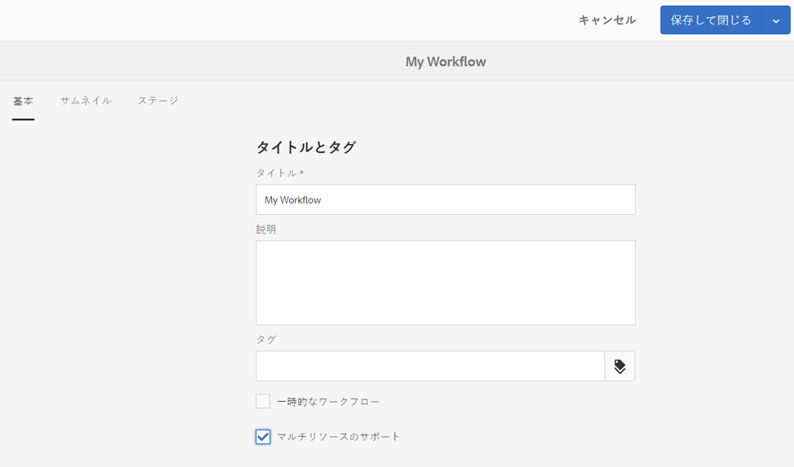

1. 「**[!UICONTROL 保存して閉じる]**」をクリックし、「**[!UICONTROL 同期]**」（エディターツールバー）をクリックして変更内容を確定し、ランタイムモデルを生成します。

   詳しくは、[ワークフローの同期](#sync-your-workflow-generate-a-runtime-model)を参照してください。

### （ワークフローの進行状況を表示する）ワークフローステージの設定 {#configuring-workflow-stages-that-show-workflow-progress}

[ワークフローステージ](/help/sites-developing/workflows.md#workflow-stages)は、タスクを処理するときにワークフローの進行状況を確認するのに役立ちます。

>[!CAUTION]
>
>ワークフローステージが&#x200B;**[!UICONTROL ページのプロパティ]**&#x200B;で定義されていても、いずれのワークフローステップでも使用されない場合は、（現在のワークフローステップに関係なく）進行状況バーに進行状況は表示されません。

使用可能なステージは、ワークフローモデルで定義されます。既存のワークフローモデルを更新すると、ステージの定義を含めることができます。ワークフローモデルに対して任意の数のステージを定義できます。

ワークフローの&#x200B;**[!UICONTROL ステージ]**&#x200B;を定義するには：

1. 編集するワークフローモデルを開きます。
1. ツールバーから「**[!UICONTROL ワークフローモデルのプロパティ]**」を選択します。「**[!UICONTROL ステージ]**」タブを開きます。
1. 必要な&#x200B;**[!UICONTROL ステージ]**&#x200B;を追加（および配置）します。ワークフローモデルに対して任意の数のステージを定義できます。

   次に例を示します。

   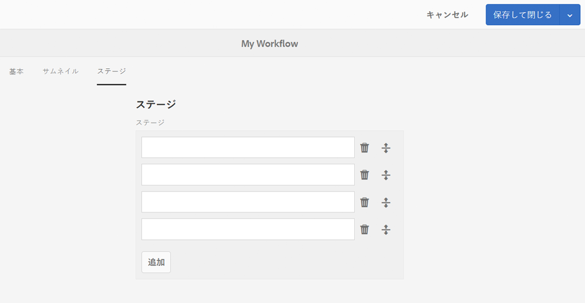

1. 「**[!UICONTROL 保存して閉じる]**」をクリックしてプロパティを保存します。
1. ワークフローモデルの各ステップにステージを割り当てます。次に例を示します。

   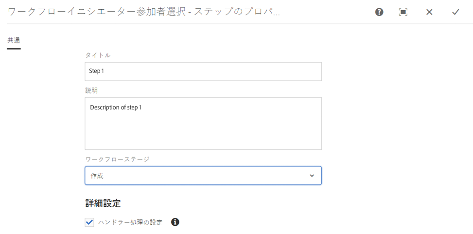

   1 つのステージを複数のステップに割り当てることができます。次に例を示します。

   | **手順** | **ステージ** |
   |---|---|
   | 手順 1 | 作成 |
   | ステップ 2 | 作成 |
   | ステップ 3 | レビュー |
   | ステップ 4 | 承認 |
   | ステップ 5 | 承認 |
   | ステップ 6 | 完了 |

1. 「**[!UICONTROL 同期]**」（エディターツールバー）をクリックして変更内容を確定し、ランタイムモデルを生成します。

   詳しくは、[ワークフローの同期](#sync-your-workflow-generate-a-runtime-model)を参照してください。

## パッケージのワークフローモデルのエクスポート {#exporting-a-workflow-model-in-a-package}

1. [パッケージマネージャー](/help/sites-administering/package-manager.md#package-manager)を使用して新しいパッケージを作成します。

   1. 次の方法でパッケージマネージャーに移動します。 **[!UICONTROL ツール]**, **[!UICONTROL 導入]**, **[!UICONTROL パッケージ]**.
   1. 「**[!UICONTROL パッケージを作成]**」をクリックします。
   1. **[!UICONTROL パッケージ名]**&#x200B;と、その他の必要な情報を指定します。
   1. 「**[!UICONTROL OK]**」をクリックします。

1. 新しいパッケージのツールバーの「**[!UICONTROL 編集]**」をクリックします。

1. 「**[!UICONTROL フィルター]**」タブを開きます。

1. 「**[!UICONTROL フィルターを追加]**」を選択し、ワークフローモデルの設計&#x200B;**&#x200B;のパスを指定します。

   `/conf/global/settings/workflow/models/<*your-model-name*>`

   「**[!UICONTROL 完了]**」をクリックします。

1. 「**[!UICONTROL フィルターを追加]**」を選択し、ランタイムワークフローモデルのパスを指定します。**

   `/var/workflow/models/<*your-model-name*>`

   「**[!UICONTROL 完了]**」をクリックします。

1. モデルで使用されるカスタムスクリプトのフィルターを追加します。
1. 「**[!UICONTROL 保存]**」をクリックしてフィルターの定義を確定します。
1. パッケージ定義のツールバーの「**[!UICONTROL ビルド]**」を選択します。
1. パッケージのツールバーの「**[!UICONTROL ダウンロード]**」を選択します。

## ワークフローを使用したフォーム送信処理 {#using-workflows-to-process-form-submissions}

フォームを特定のワークフローで処理するように設定できます。ユーザーがフォームを送信すると、フォームの送信データをペイロードとして持つ新しいワークフローインスタンスが作成されます。

フォームを使用するためのワークフローの設定手順

1. 新しいページを作成して、編集用に開きます。
1. **[!UICONTROL フォーム]**&#x200B;コンポーネントをページに追加します。
1. ページに表示された&#x200B;**[!UICONTROL フォーム開始]**&#x200B;コンポーネントを設定します。
1. 用途 **[!UICONTROL ワークフローを開始]** をクリックして、使用可能なワークフローの中から目的のワークフローを選択します。

   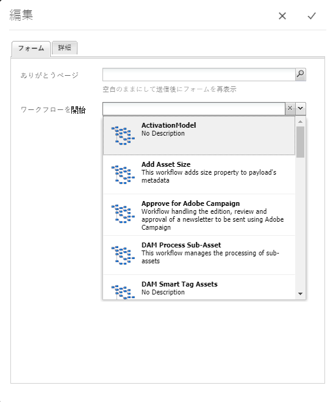

1. チェックマークをクリックして、新しいフォーム設定を確認します。

## ワークフローのテスト {#testing-workflows}

ワークフローのテスト時には、開発時のタイプと異なるものも含め、様々なペイロードタイプを使用してワークフローをテストすることをお勧めします。例えば、アセットを処理するワークフローの場合、ページをペイロードとして設定して、ワークフローでエラーがスローされないことを確認します。

例えば、新しいワークフローを次のようにテストします。

1. [ワークフローモデルを開始](/help/sites-administering/workflows-starting.md) コンソールから。
1. **[!UICONTROL ペイロード]**&#x200B;を定義して確定します。

1. ワークフローが進行するように、必要なアクションを実行します。
1. ワークフローの動作中にログファイルを監視します。

ログファイルに&#x200B;**[!UICONTROL デバッグ]**&#x200B;メッセージを記録するように AEM を設定することもできます。詳しくは、 [ログ](/help/sites-deploying/configure-logging.md) 詳細な情報と開発が完了したら、 **[!UICONTROL ログレベル]** 戻る **[!UICONTROL 情報]**.

## 例 {#examples}

### 例：公開のリクエストを承認／拒否する（単純な）ワークフローの作成 {#example-creating-a-simple-workflow-to-accept-or-reject-a-request-for-publication}

次の例では、ワークフローを作成する方法を説明するために、 `Publish Example` ワークフロー。

1. [新しいワークフローモデルを作成](#creating-a-new-workflow)します。

   新しいワークフローには、次のステップが含まれます。

   * **[!UICONTROL フロー開始]**
   * `Step 1`
   * **[!UICONTROL フロー終了]**

1. `Step 1` を削除します（この例には不適切なステップタイプです）。

   * ステップをクリックし、「 」を選択します。 **[!UICONTROL 削除]** を選択します。 アクションを確定します。

1. 次の **[!UICONTROL ワークフロー]** ステップブラウザーの選択、 **[!UICONTROL 参加者ステップ]** をワークフロー上に配置し、次の間に配置します。 **[!UICONTROL フロー開始]** および**[!UICONTROL フロー終了*]*.
1. プロパティダイアログボックスを開くには、次のいずれかを実行します。

   * 参加者ステップをクリックし、「 」を選択します。 **[!UICONTROL 設定]** を選択します。
   * 参加者ステップをダブルクリックします。

1. 「**[!UICONTROL 共通]**」タブで、「`Validate Content`タイトル&#x200B;**[!UICONTROL 」と「]**&#x200B;説明&#x200B;**[!UICONTROL 」の両方に]** と入力します。
1. 「**[!UICONTROL ユーザー / グループ]**」タブを開きます。

   * 「**[!UICONTROL 電子メールでユーザーに通知します]**」を有効にします。
   * 選択 `Administrator` ( `admin`) **[!UICONTROL ユーザー/グループ]** フィールドに入力します。

   >[!NOTE]
   >
   >電子メールを送信するには、[メールサービスとユーザーアカウントの詳細を設定する必要があります](/help/sites-administering/notification.md)。

1. チェックマークをクリックして、変更内容を確認します。

   ワークフローモデルの概要に戻ります。ここで、参加者ステップの名前が「 `Validate Content`.

1. ドラッグ&amp;ドロップ **[!UICONTROL OR 分割]** をワークフロー上に配置し、次の間に配置します。 `Validate Content` および **[!UICONTROL フロー終了]**.
1. **[!UICONTROL OR 分割]**&#x200B;を設定用に開きます。
1. 設定：

   * **[!UICONTROL 共通]**:選択 **[!UICONTROL 2 ブランチ]**
   * **[!UICONTROL ブランチ 1]**：「**[!UICONTROL デフォルトのルート]**」を選択します。
   * **[!UICONTROL ブランチ 2]**：「**[!UICONTROL デフォルトのルート]**」を選択しません。

1. **[!UICONTROL OR 分割]**&#x200B;の変更内容を確定します。
1. **[!UICONTROL 参加者ステップ]**&#x200B;を左側のブランチにドラッグし、プロパティを開き、次の値を指定してから変更内容を確定します。

   * **[!UICONTROL タイトル]**: `Reject Publish Request`
   * **[!UICONTROL ユーザー / グループ]**：`projects-administrators` など
   * **[!UICONTROL 電子メールでユーザーに通知]**:電子メールでユーザーに通知するには、「 」を有効にします。

1. **[!UICONTROL プロセスステップ]**&#x200B;を右側のブランチにドラッグし、プロパティを開き、次の値を指定してから変更内容を確定します。

   * **[!UICONTROL タイトル]**: `Publish Page as Requested`
   * **[!UICONTROL プロセス]**:選択 `Activate Page`. このプロセスは、選択されているページをパブリッシュインスタンスに公開します。

1. 「**[!UICONTROL 同期]**」（エディターのツールバー）をクリックし、ランタイムモデルを生成します。

   詳しくは、[ワークフローの同期](#sync-your-workflow-generate-a-runtime-model)を参照してください。

   新しいワークフローモデルは次のようになります。

   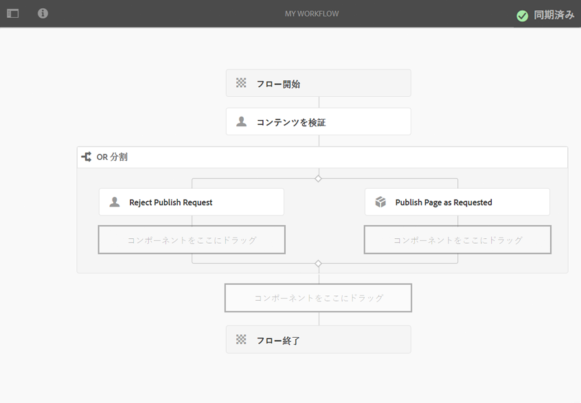

1. このワークフローをページに適用します。その結果、ユーザーが「**[!UICONTROL コンテンツを検証]**」ステップの「**[!UICONTROL 完了]**」に移動すると、「**[!UICONTROL リクエストに応じてページを公開]**」と「**[!UICONTROL 公開リクエストを拒否]**」のどちらを実行するかを選択できます。

   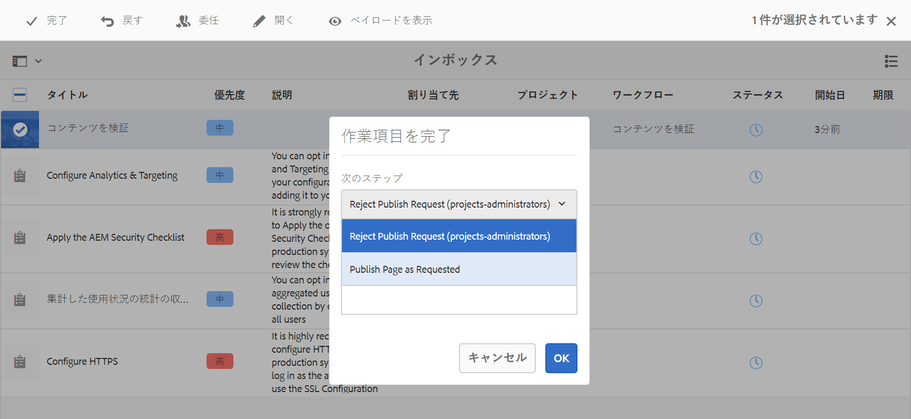

### 例：OR 分割用のルールの定義 {#example-defining-a-rule-for-an-or-split}

**[!UICONTROL OR 分割]**&#x200B;ステップを使用すると、ワークフローに条件分岐の処理パスを導入できます。

OR ルールを定義するには：

1. 2 つのスクリプトを作成して、リポジトリ内の次の場所などに保存します。

   `/apps/myapp/workflow/scripts`

   >[!NOTE]
   >
   >スクリプトには [関数 `check()`](#function-check) ブール値を返します。

1. ワークフローを編集し、**[!UICONTROL OR 分割]**&#x200B;をモデルに追加します。
1. **[!UICONTROL OR 分割]**&#x200B;の&#x200B;**[!UICONTROL ブランチ 1]** のプロパティを編集します。

   * これを **[!UICONTROL デフォルトルート]** 設定 **[!UICONTROL 値]** から `true`.
   * 形式 **[!UICONTROL ルール]**、スクリプトのパスを設定します。 次に例を示します。

      `/apps/myapp/workflow/scripts/myscript1.ecma`
   >[!NOTE]
   >
   >必要に応じて、分岐の順序を切り替えることができます。

1. **[!UICONTROL OR 分割]**&#x200B;の&#x200B;**[!UICONTROL ブランチ 2]** のプロパティを編集します。

   * 形式 **[!UICONTROL ルール]**、他のスクリプトへのパスを設定します。 次に例を示します。

      `/apps/myapp/workflow/scripts/myscript2.ecma`

1. 各ブランチ内の個々のステップのプロパティを設定します。次を確認します。 **[!UICONTROL ユーザー/グループ]** が設定されている。
1. 「**同期**」（エディターのツールバー）をクリックして、ランタイムモデルに対する変更を保持します。

   詳しくは、[ワークフローの同期](#sync-your-workflow-generate-a-runtime-model)を参照してください。

#### 関数 Check() {#function-check}

>[!NOTE]
>
>[ECMAScript の使用](/help/sites-developing/workflows-customizing-extending.md#using-ecmascript)を参照してください。

以下のサンプルスクリプトは `true` ノードが `JCR_PATH` ～の下にある `/content/we-retail/us/en`:

```
function check() {
    if (workflowData.getPayloadType() == "JCR_PATH") {
      var path = workflowData.getPayload().toString();
      var node = jcrSession.getItem(path);

      if (node.getPath().indexOf("/content/we-retail/us/en") >= 0) {
       return true;
      } else {
       return false;
      } 
     } else {
      return false;
     }
}
```

### 例：アクティベーション用にカスタマイズされたリクエスト {#example-customized-request-for-activation}

標準提供のワークフローは、いずれもカスタマイズすることができます。動作をカスタマイズするには、適切なワークフローの詳細をオーバーレイします。

例えば、**[!UICONTROL アクティベーションをリクエスト]**&#x200B;をカスタマイズするとします。このワークフローは、**[!UICONTROL サイト]**&#x200B;内でページを公開するために使用され、コンテンツ作成者が適切なレプリケーション権限を持っていない場合に自動的に実行されます。詳しくは、 [ページオーサリングのカスタマイズ — アクティベーションリクエストワークフローのカスタマイズ](/help/sites-developing/customizing-page-authoring-touch.md#customizing-the-request-for-activation-workflow) 詳しくは、を参照してください。
