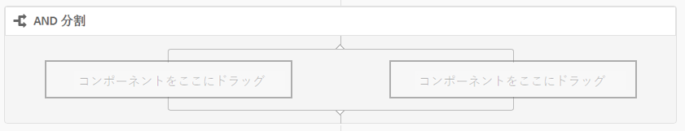
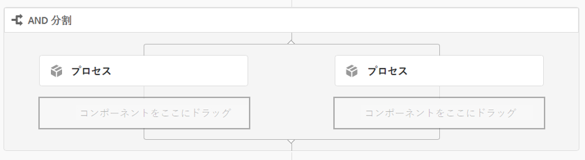
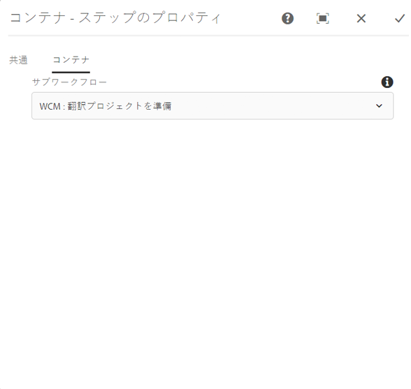
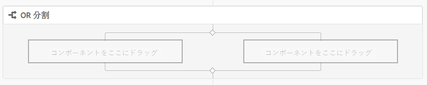
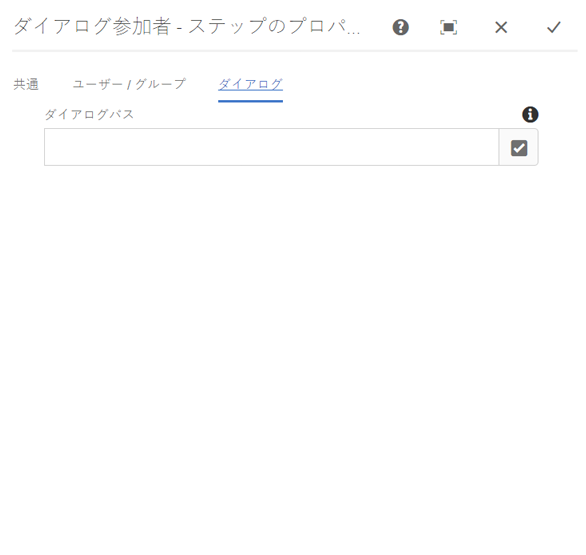
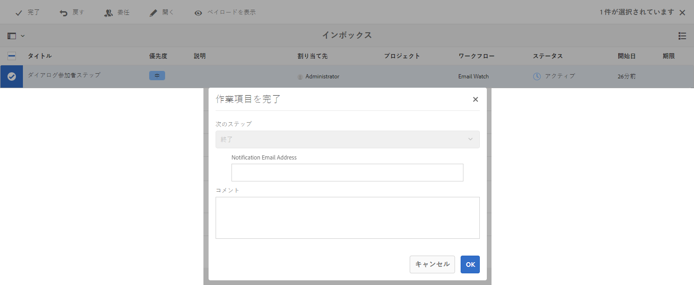
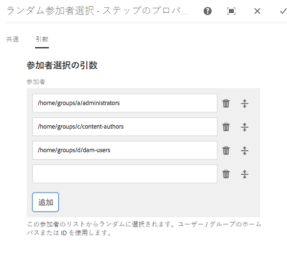
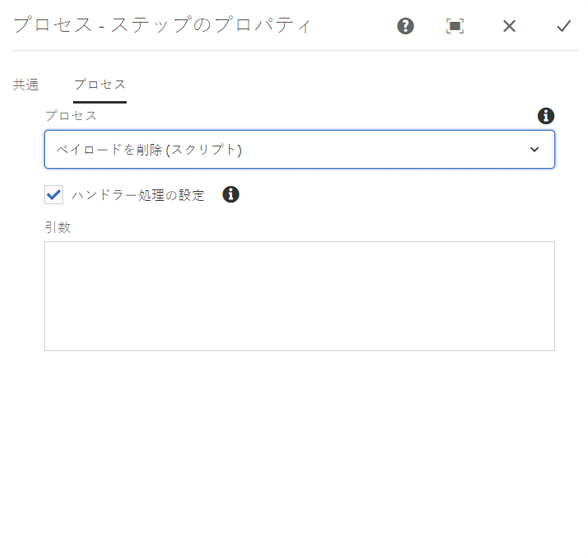

# ワークフローステップのリファレンス{#workflow-step-reference}

ワークフローモデルは、各種タイプの一連のステップで構成されます。これらのステップを、それぞれのタイプに応じてパラメーターやスクリプトで設定および拡張し、必要な機能とコントロールを実現することができます。

>[!NOTE]
>
>この節では、標準ワークフローのステップについて説明します。
>
>モジュール固有のステップについては、次の資料も参照してください。
>
>* [AEM Forms ワークフローステップのリファレンス](/help/forms/using/aem-forms-workflow-step-reference.md)
* [メディアハンドラーとワークフローを使用したアセットの処理](/help/assets/media-handlers.md)


## ステップのプロパティ {#step-properties}

各ステップコンポーネントには、必要なプロパティを定義および編集できる&#x200B;**[!UICONTROL ステップのプロパティ]**&#x200B;ダイアログがあります。

### Step Properties - Common tab {#step-properties-common-tab}

大部分のワークフローステップコンポーネントでは、プロパティダイアログの「**[!UICONTROL 共通]**」タブで、次のプロパティを組み合わせて使用できます。

* **[!UICONTROL タイトル]**

   ステップのタイトル。

* **[!UICONTROL 説明]**

   ステップの説明。

* **[!UICONTROL ワークフローステージ]**

   ステップに[ステージ](/help/sites-developing/workflows.md#workflow-stages)を適用するためのドロップダウンセレクター。

* **[!UICONTROL タイムアウト]**

   ステップが「タイムアウト」になるまでの期間。

   次のいずれかを選択できます。**[!UICONTROL オフ]**、**[!UICONTROL 即時]**、**[!UICONTROL 1h]**、**[!UICONTROL 6h]**、**[!UICONTROL 12h]**、**[!UICONTROL 24h]**。

* **[!UICONTROL タイムアウトハンドラー]**

   ステップがタイムアウトしたときにワークフローを制御するハンドラー。例：

   `Auto Advancer`

* **[!UICONTROL ハンドラー処理の設定]**

   実行後にワークフローを次のステップに自動的に進めるには、このオプションを選択します。 選択しない場合、実装スクリプトでワークフローの進行を処理する必要があります。

#### ステップのプロパティ - 「ユーザー／グループ」タブ  {#step-properties-user-group-tab}

多くのワークフローステップコンポーネントでは、プロパティダイアログの「**[!UICONTROL ユーザー／グループ]**」タブで、次のプロパティを使用できます。

* **[!UICONTROL 電子メールでユーザーに通知します]**

   * ワークフローがステップに到達したときに、参加者に電子メールを送信して通知できます。
   * 有効にすると、**[!UICONTROL User/Group]** プロパティによって定義されたユーザーに、またはグループが定義されている場合はグループの各メンバーに、電子メールが送信されます。

* **[!UICONTROL ユーザー / グループ]**

   * ドロップダウン選択ボックスを使用して、ユーザーやグループ間を移動し、選択することができます
   * 特定のユーザーにステップを割り当てた場合は、そのユーザーだけがステップのアクションを実行できます。
   * グループ全体にステップを割り当てた場合、ワークフローがこのステップに到達すると、このグループ内のすべてのユーザーの&#x200B;**[!UICONTROL Workflow Inbox]**&#x200B;にアクションが表示されます。
   * 詳しくは、[ワークフローへの参加](/help/sites-authoring/workflows-participating.md)を参照してください。

## AND 分割 {#and-split}

**[!UICONTROL AND分割]**&#x200B;は、ワークフローに分割を作成し、その後、両方の分岐がアクティブになります。 必要に応じて、各ブランチにワークフローステップを追加できます。このステップを使用して、ワークフローに複数の処理パスを導入できます。例えば、複数のレビューステップを並列で発生させ、時間を節約することができます。



### AND 分割 - 設定 {#and-split-configuration}

* **[!UICONTROL AND分割]**&#x200B;プロパティを編集します。

   * **[!UICONTROL 分割名]**:説明のために名前を割り当てます。
   * 必要なブランチの数（2、3、4 または 5）を選択します。

* 必要に応じて、各ブランチにワークフローステップを追加します。

   

## コンテナステップ {#container-step}

**[!UICONTROL コンテナ]**&#x200B;ステップは、子ワークフローとして実行される別のワークフローモデルを開始します。

この&#x200B;**[!UICONTROL コンテナ]**&#x200B;を使用すると、ワークフローモデルを再利用して、一般的な手順のシーケンスを実装できます。 例えば、1 つの翻訳ワークフローモデルを複数の編集ワークフローで使用することができます。



### コンテナステップ - 設定 {#container-step-configuration}

このステップを設定するには、次のタブを編集および使用します。

* [**[!UICONTROL 共通]**](#step-properties-common-tab)
* **[!UICONTROL コンテナ]**

   * **[!UICONTROL サブワークフロー]**：開始するワークフローを選択します。

## 移動ステップ  {#goto-step}

**[!UICONTROL 移動ステップ]**&#x200B;を使用すると、ワークフローモデル内で実行する次のステップを ECMAScript の結果に応じて指定できます。

* `true`：**[!UICONTROL 移動ステップ]**&#x200B;が完了すると、ワークフローエンジンが指定のステップを実行します。

* `false`：**[!UICONTROL 移動ステップ]**&#x200B;が完了すると、通常のルーティングロジックが次に実行するステップを決定します。

**[!UICONTROL 移動ステップ]**&#x200B;を使用すると、ワークフローモデル内に詳細なルーティング構造を実装できます。例えば、ループを実装するには、スクリプトでループ条件を評価し、ワークフロー内の前のステップを実行するように&#x200B;**[!UICONTROL 移動ステップ]**&#x200B;を定義します。

### 移動ステップ - 設定 {#goto-step-configuration}

このステップを設定するには、次のタブを編集および使用します。

* [**[!UICONTROL 共通]**](#step-properties-common-tab)
* **[!UICONTROL プロセス]**

   * ****&#x200B;に移動する手順：実行するステップを選択します。
   * **[!UICONTROL スクリプトパス]**:移動ステップを実行するかどうかを決定するECMAScript **[!UICONTROL へのパス]**。
   * **[!UICONTROL スクリプト]**:移動ステップを実行するかどうかを決定す **[!UICONTROL るECMAScript]**。

>[!CAUTION]
「**[!UICONTROL スクリプトのパス]**」または「**[!UICONTROL スクリプト]**」のどちらかを指定してください。両方のオプションを同時に使用することはできません。両方のプロパティの値を指定した場合、手順では&#x200B;**[!UICONTROL スクリプトパス]**&#x200B;が使用されます。

#### ループのシミュレート {#simulating-a-for-loop}

ループをシミュレートするには、発生したループの繰り返し回数を記録する必要があります。

* この回数は、一般的に、アクションの対象となるワークフロー内の項目のインデックスを表します。
* この回数がループの終了基準として評価されます。

例えば、複数の JCR ノードに対してアクションを実行するワークフローを実装するには、ループカウンターをノードのインデックスとして使用できます。回数を保持するには、ワークフローインスタンスのデータマップに `integer` 値を保存します。回数を増分したり、回数を終了基準と比較するには、**[!UICONTROL 移動ステップ]**&#x200B;のスクリプトを使用します。

```
function check(){
   var count=0;
   var keyname="loopcount"
   try{
      if (workflowData.getMetaDataMap().containsKey(keyname)){ 
        log.info("goto script: found loopcount key");
        count= parseInt(workflowData.getMetaDataMap().get(keyname))+1;
      } 
 
     workflowData.getMetaDataMap().put(keyname,count);
 
     }catch(err) {
         log.info(err.message);
         return false;
    }
   if (parseInt(count) <7){
       return true;
   } else {
      return false;
   }
}
```

## OR 分割 {#or-split}

**[!UICONTROL OR 分割]**&#x200B;は、ワークフロー内に分割を作成し、どちらか 1 つのブランチだけをアクティブにします。これを使用すると、ワークフローに条件付き処理パスを導入できます。必要に応じて、各ブランチにワークフローステップを追加できます。

>[!NOTE]
OR分割の作成について詳しくは、次を参照してください。[https://helpx.adobe.com/experience-manager/using/aem64_workflow_servlet.html](https://helpx.adobe.com/experience-manager/using/aem64_workflow_servlet.html)



### OR 分割 - 設定 {#or-split-configuration}

* **[!UICONTROL OR分割]**&#x200B;プロパティを編集します。

   * **[!UICONTROL 共通]**

      * 必要なブランチの数（2、3、4 または 5）を選択します。
   * **[!UICONTROL ブランチ： *x*>]**

      * **[!UICONTROL スクリプトのパス]**：スクリプトが格納されたファイルへのパス。
      * **[!UICONTROL スクリプト]**：スクリプトをボックス内に追加します。
      * **[!UICONTROL デフォルトのルート]**：複数のブランチが true に評価される場合は、デフォルトのブランチが適用されます。デフォルトとして指定できるブランチは 1 つだけです。

   >[!NOTE]
   ブランチごとに別個のタブがあります。
   * 各ブランチのスクリプトは一度に 1 つずつ評価されます。
   * ブランチは左から右の順番で評価されます。
   * trueに評価される最初のスクリプトが実行されます。
   * trueと評価されるブランチがない場合、ワークフローは進みません。


   >[!CAUTION]
   「**[!UICONTROL スクリプトのパス]**」または「**[!UICONTROL スクリプト]**」のどちらかを指定してください。両方のオプションを同時に使用することはできません。両方のプロパティの値を指定した場合、手順では&#x200B;**[!UICONTROL スクリプトパス]**&#x200B;が使用されます。

   >[!NOTE]
   [OR 分割用のルールの定義](/help/sites-developing/workflows-models.md#example-defining-a-rule-for-an-or-split)を参照してください。

* 必要に応じて、各ブランチにワークフローステップを追加します。

## 参加者ステップと参加者選択  {#participant-steps-and-choosers}

### Participant Step {#participant-step}

**[!UICONTROL 参加者ステップ]**&#x200B;では、特定のアクションの所有者を割り当てることができます。ワークフローは、ユーザーが手動で手順を確認した場合にのみ続行されます。 これは、ワークフローに対してアクションを実行する必要がある場合に使用します。例えば、レビュー手順などです。

余談になりますが、アクションを割り当てる際には、ユーザー認証を考慮する必要があります。ユーザーは、ワークフローのペイロードであるページにアクセスする必要があるからです。

#### 参加者ステップ - 設定  {#participant-step-configuration}

このステップを設定するには、次のタブを編集および使用します。

* [**[!UICONTROL 共通]**](#step-properties-common-tab)
* [**[!UICONTROL ユーザー / グループ]**](#step-properties-user-group-tab)

>[!NOTE]
次の場合、ワークフロー開始者には常に通知が送信されます。
* ワークフローが完了（終了）します。
* ワークフローが中止（終了）されます。


>[!NOTE]
一部のプロパティでは、電子メール通知を有効にするように設定する必要があります。電子メールテンプレートをカスタマイズしたり、新しい言語用の電子メールテンプレートを追加することもできます。AEMで電子メール通知を設定するには、[電子メール通知の設定](/help/sites-administering/notification.md)を参照してください。

### ダイアログ参加者ステップ {#dialog-participant-step}

**[!UICONTROL ダイアログ参加者ステップ]**&#x200B;は、作業項目を割り当てられたユーザーから情報を収集するために使用します。このステップは、ワークフロー内で後で使用する少量のデータを収集するのに役立ちます。

ステップの完了時、**[!UICONTROL 作業項目を完了]**&#x200B;ダイアログには、ダイアログで定義したフィールドが表示されます。各フィールドで収集されたデータは、ワークフローペイロードのノードに保存されます。後続のワークフローステップは、この値をリポジトリから読み取ることができます。

このステップを設定するには、作業項目を割り当てるユーザーまたはグループ、およびダイアログへのパスを指定します。

#### ダイアログ参加者ステップ - 設定  {#dialog-participant-step-configuration}

このステップを設定するには、次のタブを編集および使用します。

* [**[!UICONTROL 共通]**](#step-properties-common-tab)
* [**[!UICONTROL ユーザー / グループ]**](#step-properties-user-group-tab)
* **[!UICONTROL ダイアログ]**

   * **[!UICONTROL ダイアログパス**]:作成する[ダイアログの](#dialog-participant-step-creating-a-dialog)ダイアログノードへのパス。

#### ダイアログ参加者ステップ — ダイアログの作成{#dialog-participant-step-creating-a-dialog}

ダイアログを作成するには：

* 収集されたデータを[ペイロード内に保存](#dialog-participant-step-storing-data-in-the-payload)する場所を決定します。
* [ダイアログを定義します。これには、データの収集（および保存）に使用するフィールドの定義が含まれます](#dialog-participant-step-dialog-definition)。

#### ダイアログ参加者ステップ - ペイロードにデータを保存 {#dialog-participant-step-storing-data-in-the-payload}

ウィジェットデータは、ワークフローペイロードまたは作業項目のメタデータに保存できます。widget ノードの `name` プロパティの形式によって、データの保存場所が決定されます。

* **[!UICONTROL データをペイロードと共に保存]**

   * ウィジェットデータをワークフローペイロードのプロパティとして保存するには、次の形式をwidgetノードのnameプロパティの値に使用します。

      `./jcr:content/nodename`

   * データは、ペイロードのノードの `nodename` プロパティに保存されます。ノードにこのプロパティが含まれていない場合は、プロパティが作成されます。
   * ペイロードと共に保存した場合は、後で同じペイロードを持つダイアログを使用したときに、プロパティの値が上書きされます。

* **[!UICONTROL データを作業項目と共に保存]**

   * ウィジェットデータを作業項目メタデータのプロパティとして保存するには、 nameプロパティの値に次の形式を使用します。

      `nodename`

   * データは作業項目`metadata`の`nodename`プロパティに保存されます。 この場合は、同じペイロードを持つダイアログを使用しても、データは保存されます。

#### ダイアログ参加者ステップ - ダイアログ定義  {#dialog-participant-step-dialog-definition}

1. **[!UICONTROL ダイアログ構造]**

   ダイアログ参加者ステップのダイアログは、コンポーネントのオーサリング用に作成するダイアログと似ています。ダイアログは、次の場所に保存されます。

   `/apps/myapp/workflow/dialogs`

   標準のタッチ操作対応 UI 用ダイアログは、次のノード構造を持ちます。

   ```xml
   newComponent (cq:Component)
     |- cq:dialog (nt:unstructured)
       |- content 
         |- layout 
           |- items 
             |- column 
               |- items 
                 |- component0
                 |- component1
                 |- ...
   ```

   >[!NOTE]
   詳しくは、[ダイアログの作成と設定](/help/sites-developing/developing-components.md#creating-and-configuring-a-dialog)を参照してください。

1. **[!UICONTROL ダイアログパスのプロパティ]**

   **[!UICONTROL ダイアログ参加者ステップ]**&#x200B;には、**[!UICONTROL ダイアログパス]**&#x200B;プロパティ（および[参加者ステップ](#participant-step)のプロパティ）があります。 **[!UICONTROL ダイアログパス]**&#x200B;のプロパティの値は、ダイアログの `dialog` ノードへのパスです。

   例えば、ダイアログが、ノードに保存されている `EmailWatch` というコンポーネントに含まれているとします。

   `/apps/myapp/workflows/dialogs`

   タッチ操作対応 UI の場合、**[!UICONTROL ダイアログパス]**&#x200B;のプロパティには次の値を使用します。

   `/apps/myapp/workflow/dialogs/EmailWatch/cq:dialog`

   

1. **ダイアログ定義の例**

   次の XML コードスニペットは、ペイロードコンテンツの `String` ノードに `watchEmail` 値を保存するダイアログを表しています。title ノードは、[TextField](https://helpx.adobe.com/experience-manager/6-4/sites/developing/using/reference-materials/granite-ui/api/jcr_root/libs/granite/ui/components/coral/foundation/form/textfield/index.html) コンポーネントを表します。

   ```xml
   jcr:primaryType="nt:unstructured" 
       jcr:title="Watcher Email Address Dialog" 
       sling:resourceType="cq/gui/components/authoring/dialog">
       <content jcr:primaryType="nt:unstructured"
           sling:resourceType="granite/ui/components/foundation/container">
           <layout jcr:primaryType="nt:unstructured" 
               margin="false" 
               sling:resourceType="granite/ui/components/foundation/layouts/fixedcolumns"
           />
           <items jcr:primaryType="nt:unstructured">
               <column jcr:primaryType="nt:unstructured"
                   sling:resourceType="granite/ui/components/foundation/container">
                   <items jcr:primaryType="nt:unstructured">
                       <title jcr:primaryType="nt:unstructured" 
                           fieldLabel="Notification Email Address" 
                           name="./jcr:content/watchEmails"
                           sling:resourceType="granite/ui/components/foundation/form/textfield"
                       />
                   </items>
               </column>
           </items>
       </content>
   </cq:dialog>
   ```

   タッチ操作対応 UI の場合、この例は次のようなダイアログになります。

   

### 動的参加者ステップ {#dynamic-participant-step}

**[!UICONTROL 動的参加者ステップ]**&#x200B;コンポーネントは&#x200B;**[!UICONTROL 参加者ステップ]**&#x200B;に似ていますが、参加者が実行時に自動的に選択される点が異なります。

このステップを設定するには、ダイアログと、作業項目を割り当てる参加者を識別する&#x200B;**[!UICONTROL 参加者選択]**&#x200B;を選択します。

#### 動的参加者ステップ - 設定  {#dynamic-participant-step-configuration}

このステップを設定するには、次のタブを編集および使用します。

* [**[!UICONTROL 共通]**](#step-properties-common-tab)
* **[!UICONTROL 参加者選択]**

   * **[!UICONTROL 参加者選択]**：[作成する参加者選択](#dynamic-participant-step-developing-the-participant-chooser)の名前。
   * **[!UICONTROL 引数]**：必要なすべての引数。
   * **[!UICONTROL 電子メール]**：電子メール通知をユーザーに送信するかどうか。

* **[!UICONTROL ダイアログ]**

   * **[!UICONTROL ダイアログパス]**：[作成するダイアログ（**ダイアログ参加者ステップ**&#x200B;の場合と同様）の dialog ノードへのパス](#dialog-participant-step-creating-a-dialog)。

#### 動的参加者ステップ - 参加者選択の作成  {#dynamic-participant-step-developing-the-participant-chooser}

参加者選択を作成します。そのために、あらゆる選択ロジックまたは選択条件を使用できます。例えば、参加者選択を使用して、（グループ内で）最も作業項目が少ないユーザーを選択できます。任意の数の参加者選択を作成して、ワークフローモデル内の&#x200B;**動的参加者ステップ**&#x200B;コンポーネントの異なるインスタンスで使用できます。

作業項目を割り当てるユーザーを選択する OSGi サービスまたは ECMAScript を作成します。

* **[!UICONTROL ECMAScript]**

   スクリプトには、ユーザー ID を `String` 値として返す、getParticipant という関数を含める必要があります。カスタムスクリプトを、`/apps/myapp/workflow/scripts`フォルダーやサブフォルダーなどに格納します。

   標準 AEM インスタンスには、次のサンプルスクリプトが付属しています。

   `/libs/workflow/scripts/initiator-participant-chooser.ecma`

   >[!CAUTION]
   `/libs` パス内の設定は&#x200B;*一切*&#x200B;変更しないでください。
   これは、`/libs`のコンテンツが次回インスタンスをアップグレードすると（ホットフィックスまたは機能パックを適用すると上書きされる場合がある）ときに上書きされるからです。

   このスクリプトは、ワークフロー開始者を参加者として選択します。

   ```
   function getParticipant() {
       return workItem.getWorkflow().getInitiator();
   }
   ```

   >[!NOTE]
   **[!UICONTROL ワークフローイニシエーター参加者選択]**&#x200B;コンポーネントは、**[!UICONTROL 動的参加者ステップ]**&#x200B;を拡張し、このスクリプトをステップ実装として使用します。

* **[!UICONTROL OSGi サービス]**

   サービスは、[com.day.cq.workflow.exec.ParticipantStepChooser](https://helpx.adobe.com/experience-manager/6-4/sites/developing/using/reference-materials/javadoc/com/day/cq/workflow/exec/ParticipantStepChooser.html)インターフェイスを実装する必要があります。 このインターフェイスは、次の構成要素を定義します。

   * `SERVICE_PROPERTY_LABEL` フィールド：このフィールドを使用して、参加者選択の名前を指定します。この名前が、**[!UICONTROL 動的参加者ステップ]**&#x200B;のプロパティで使用可能な参加者選択のリストに表示されます。
   * `getParticipant` メソッド：動的に解決されたプリンシパルIDを値として返 `String` します。

   >[!CAUTION]
   `getParticipant`メソッドは、動的に解決されるプリンシパルIDを返します。 この ID は、グループ ID またはユーザー ID のいずれかになります。
   ただし、グループ ID を使用できるのは、**[!UICONTROL 参加者ステップ]**&#x200B;に対してのみです（参加者のリストが返された場合）。**[!UICONTROL 動的参加者ステップ]**&#x200B;の場合は、空のリストが返され、委任に使用できません。

   **[!UICONTROL 動的参加者ステップ]**&#x200B;コンポーネントに対して実装を使用可能にするには、サービスを書き出す OSGi バンドルに Java クラスを追加し、バンドルを AEM サーバーにデプロイします。

   >[!NOTE]
   **[!UICONTROL ランダム参加者選択]**&#x200B;は、ランダムにユーザーを選択するサンプルサービスです（`com.day.cq.workflow.impl.process.RandomParticipantChooser`）。**[!UICONTROL ランダム参加者選択]**&#x200B;ステップコンポーネントのサンプルでは、**[!UICONTROL 動的参加者ステップ]**&#x200B;を拡張し、このサービスをステップ実装として使用します。

#### 動的参加者ステップ - 参加者選択サービスの例 {#dynamic-participant-step-example-participant-chooser-service}

次の Java クラスは、`ParticipantStepChooser` インターフェイスを実装します。このクラスは、ワークフローを開始した参加者の名前を返します。このコードでは、サンプルスクリプト(`initator-participant-chooser.ecma`)と同じロジックを使用します。

`@Property`注釈は、`SERVICE_PROPERTY_LABEL`フィールドの値を`Workflow Initiator Participant Chooser`に設定します。

```java
package com.adobe.example;

import org.apache.felix.scr.annotations.Component;
import org.apache.felix.scr.annotations.Properties;
import org.apache.felix.scr.annotations.Property;
import org.apache.felix.scr.annotations.Service;
import org.osgi.framework.Constants;
import org.slf4j.Logger;
import org.slf4j.LoggerFactory;

import com.adobe.granite.workflow.WorkflowException;
import com.adobe.granite.workflow.WorkflowSession;
import com.adobe.granite.workflow.exec.ParticipantStepChooser;
import com.adobe.granite.workflow.exec.WorkItem;
import com.adobe.granite.workflow.metadata.MetaDataMap;

@Component
@Service
@Properties({
        @Property(name = Constants.SERVICE_DESCRIPTION, value = "An example implementation of a dynamic participant chooser."),
        @Property(name = ParticipantStepChooser.SERVICE_PROPERTY_LABEL, value = "Workflow Initiator Participant Chooser (service)") })
public class InitiatorParticipantChooser implements ParticipantStepChooser {

 private Logger logger = LoggerFactory.getLogger(this.getClass());

 public String getParticipant(WorkItem arg0, WorkflowSession arg1,
   MetaDataMap arg2) throws WorkflowException {

  String initiator = arg0.getWorkflow().getInitiator();
  logger.info("Assigning Dynamic Participant Step work item to {}",initiator);

  return initiator;
 }
}
```

**[!UICONTROL 動的参加者ステップ]**&#x200B;のプロパティダイアログで、**[!UICONTROL 参加者選択]**&#x200B;リストにこのサービスを表す項目`Workflow Initiator Participant Chooser (script)`が含まれます。

「ワークフローモデルが開始されると、ログには、ワークフローを開始し、作業項目を割り当てられたユーザーのIDが示されます。 この例では、`admin` ユーザーがワークフローを開始しています。

`13.09.2015 15:48:53.037 *INFO* [10.176.129.223 [1347565733037] POST /etc/workflow/instances HTTP/1.1] com.adobe.example.InitiatorParticipantChooser Assigning Dynamic Participant Step work item to admin`

### フォーム参加者ステップ {#form-participant-step}

**[!UICONTROL フォーム参加者ステップ]**&#x200B;は、作業項目が開かれるとフォームを表示します。ユーザーがフォームに入力して送信すると、フィールドデータがワークフローペイロードのノードに保存されます。

このステップを設定するには、作業項目を割り当てるユーザーまたはグループ、およびフォームへのパスを指定します。

>[!CAUTION]
この節では、ページオーサリング用の基盤コンポーネントの[Formsの節](/help/sites-authoring/default-components-foundation.md#form)について説明します。

#### フォーム参加者ステップ - 設定 {#form-participant-step-configuration}

このステップを設定するには、次のタブを編集および使用します。

* [**[!UICONTROL 共通]**](#step-properties-common-tab)
* [**[!UICONTROL ユーザー / グループ]**](#step-properties-user-group-tab)
* **[!UICONTROL フォーム]**

   * **[!UICONTROL フォームパス]**:作成するフォ [ームへのパス](#form-participant-step-creating-the-form)。

#### フォーム参加者ステップ - フォームの作成 {#form-participant-step-creating-the-form}

通常どおり、**[!UICONTROL フォーム参加者ステップ]**&#x200B;で使用するフォームを作成します。ただし、フォーム参加者ステップ用のフォームには、次の設定が必要です。

* **[!UICONTROL フォームの開始]**&#x200B;コンポーネントでは、**[!UICONTROL アクションタイプ]**&#x200B;プロパティを`Edit Workflow Controlled Resource(s)`に設定する必要があります。

* **[!UICONTROL フォームの開始]**&#x200B;コンポーネントには、`Form Identifier`プロパティの値が必要です。

* フォームコンポーネントでは、**エレメント名**&#x200B;プロパティを、フィールドデータを保存するノードのパスに設定する必要があります。パスは、ワークフローペイロードコンテンツ内のノードを探す必要があります。 値には次の形式を使用します。

   `./jcr:content/path_to_node`

* フォームには、**[!UICONTROL ワークフロー送信ボタン]**&#x200B;コンポーネントを含める必要があります。 このコンポーネントのプロパティは一切設定しないでください。

ワークフローの要件によって、フィールドデータを保存する場所が決定されます。例えば、フィールドデータを使用して、ページコンテンツのプロパティを設定できます。次の&#x200B;**[!UICONTROL Element Name]**&#x200B;プロパティの値は、フィールドデータを`jcr:content`ノードの`redirectTarget`プロパティの値として格納します。

`./jcr:content/redirectTarget`

次の例では、フィールドデータがペイロードページの&#x200B;**[!UICONTROL Text]**&#x200B;コンポーネントのコンテンツとして使用されます。

`./jcr:content/par/text_3/text`

&quot;最初の例は、`cq:Page`コンポーネントがレンダリングするすべてのページに使用できます。 2 番目の例は、ペイロードページに「**」という ID を持つ**&#x200B;テキスト`text_3`コンポーネントが含まれる場合にのみ使用できます。

フォームは、リポジトリ内のどこにでも配置できますが、ワークフローユーザーにはフォームを読み取るための権限が必要です。

### ランダム参加者選択 {#random-participant-chooser}

**[!UICONTROL ランダム参加者選択]**&#x200B;ステップは、生成された作業項目をリストからランダムに選択されたユーザーに割り当てる参加者選択です。



#### ランダム参加者選択 - 設定 {#random-participant-chooser-configuration}

このステップを設定するには、次のタブを編集および使用します。

* [**[!UICONTROL 共通]**](#step-properties-common-tab)
* **[!UICONTROL 引数]**

   * **[!UICONTROL 参加者]**：選択に使用できるユーザーのリストを指定します。ユーザーをリストに追加するには、「**[!UICONTROL 項目を追加]**」をクリックし、ユーザーノードのホームパスまたはユーザー ID を入力します。ユーザーの順序は、作業項目が割り当てられる可能性に影響を与えません。

### ワークフローイニシエーター参加者選択  {#workflow-initiator-participant-chooser}

**[!UICONTROL ワークフローイニシエーター参加者選択]**&#x200B;ステップは、生成された作業項目を、そのワークフローを開始したユーザーに割り当てる参加者選択です。**[!UICONTROL 共通]**&#x200B;プロパティ以外に、設定するプロパティはありません。

#### ワークフローイニシエーター参加者選択 - 設定  {#workflow-initiator-participant-chooser-configuration}

このステップを設定するには、次のタブを使用して編集します。

* [**[!UICONTROL 共通]**](#step-properties-common-tab)

## プロセスステップ {#process-step}

**[!UICONTROL プロセスステップ]**&#x200B;は、ECMAScriptを実行するか、OSGiサービスを呼び出して自動処理を実行します。



### プロセスステップ - 設定 {#process-step-configuration}

このステップを設定するには、次のタブを編集および使用します。

* [**[!UICONTROL 共通]**](#step-properties-common-tab)
* **[!UICONTROL プロセス]**

   * **[!UICONTROL プロセス]**：実行するプロセス実装。ドロップダウンメニューを使用して、ECMAScriptまたはOSGiサービスを選択します。 参考情報：

      * 標準の ECMAScript および OSGi サービスについては、[プロセスステップ用のビルトインプロセス](/help/sites-developing/workflows-process-ref.md)を参照してください。
      * **[!UICONTROL プロセス]**&#x200B;ステップ用のECMAScriptの作成（[ECMAScript](/help/sites-developing/workflows-customizing-extending.md#using-ecmascript)を使用したプロセスステップの実装を参照）。
      * **[!UICONTROL プロセス]**&#x200B;ステップ用のOSGiサービスの作成については、[Javaクラス](/help/sites-developing/workflows-customizing-extending.md#implementing-a-process-step-with-a-java-class)を使用したプロセスステップの実装を参照してください。
   * **[!UICONTROL ハンドラー処理の設定]**：実行後にワークフローを次のステップに自動的に進めるには、このオプションを選択します。選択しない場合、実装スクリプトでワークフローの進行を処理する必要があります。
   * **[!UICONTROL 引数]**：プロセスに渡される引数。
