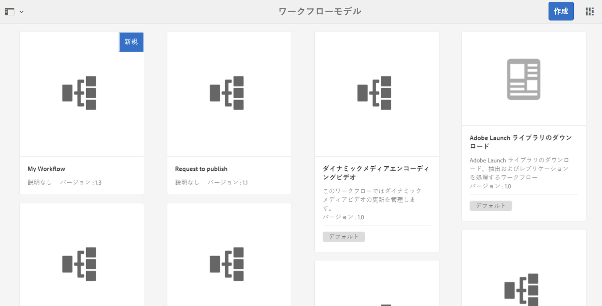

# ワークフローの作成と拡張 {#developing-and-extending-workflows}

AEM には、ワークフローモデルを作成し、ワークフローステップを開発し、プログラムによってワークフローとやり取りするためのツールやリソースが用意されています。

ワークフローを使用すると、AEM環境でリソースを管理したりコンテンツを公開したりするプロセスを自動化できます。 ワークフローは一連のステップで構成され、各ステップで個別のタスクが実行されます。 ロジックとランタイムデータを使用して、プロセスを続行できるタイミングに関する決定を下し、可能な複数のステップの中から次のステップを選択できます。

例えば、Web ページを作成して公開するビジネスプロセスには、様々な参加者による承認およびサインオフタスクが含まれます。 これらのプロセスは、AEMワークフローを使用してモデル化し、特定のコンテンツに適用できます。

主な側面については以下で説明しますが、以下のページで詳しく説明します。

* [ワークフローモデルの作成](/help/sites-developing/workflows-models.md)
* [ワークフロー機能の拡張](/help/sites-developing/workflows-customizing-extending.md)
* [プログラムによるワークフローとのやり取り](/help/sites-developing/workflows-program-interaction.md)
* [ワークフローステップのリファレンス](/help/sites-developing/workflows-step-ref.md)
* [ワークフロープロセスのリファレンス](/help/sites-developing/workflows-process-ref.md)
* [ワークフローのベストプラクティス](/help/sites-developing/workflows-best-practices.md)

>[!NOTE]
>
>参考情報：
>
>* ワークフローへの参加については、[ワークフローの使用](/help/sites-authoring/workflows.md)を参照してください。
>* ワークフローとワークフローインスタンスの管理については、[ワークフローの管理](/help/sites-administering/workflows.md)を参照してください。
>* コミュニティの詳細に関する記事については、[Adobe Experience Manager ワークフローによるデジタルアセットの修正](https://helpx.adobe.com/jp/experience-manager/using/modify_asset_workflow.html)を参照してください。
>* [AEM エキスパートへのワークフローに関する質問のウェビナー](https://bit.ly/ATACE218)を参照してください。
>* コミュニティに関する詳細な記事については、[Adobe Experience Manager 6.3 でのカスタムの動的参加者ステップの作成](https://helpx.adobe.com/jp/experience-manager/using/dynamic-steps-aem63.html)を参照してください。
>* 情報の場所の変更点については、[AEM 6.4 のリポジトリの再構成](/help/sites-deploying/repository-restructuring.md)と[ワークフローに関するベストプラクティス - 場所](/help/sites-developing/workflows-best-practices.md#locations)を参照してください。
>

## モデル {#model}

`WorkflowModel` は、ワークフローの定義（モデル）を表します。これは、`WorkflowNodes` および `WorkflowTransitions` で構成されています。トランジションはノードを結び付け、*フロー*&#x200B;を定義します。モデルには必ず開始ノードと終了ノードがあります。

### ランタイムモデル {#runtime-model}

ワークフローモデルはバージョン管理されます。 ワークフローインスタンスを実行する際には、ワークフローのランタイムモデルを使用（および保持）します（ワークフローの開始時に使用可能）。

ランタイムモデルは、 [次の場合に生成 **同期** ワークフローモデルエディターでトリガーされる](/help/sites-developing/workflows-models.md#sync-your-workflow-generate-a-runtime-model).

特定のインスタンスの開始&#x200B;*後*&#x200B;に、使用されるワークフローモデルと生成された実行時モデルに変更を加えても、そのインスタンスには反映されません。

>[!CAUTION]
>
>実行される手順は、 [ランタイムモデル](/help/sites-developing/workflows-models.md#sync-your-workflow-generate-a-runtime-model);これは、 **同期** ワークフローモデルエディターでアクションがトリガーされます。
>
>この時点以降 ( **同期** を呼び出す ) 場合、ランタイムインスタンスにはそれらの変更が反映されません。 更新後に生成されたランタイムモデルのみが変更を反映します。 例外は基になる ECMA スクリプトで、1 回だけ保持され、変更が加えられます。

### 手順 {#step}

各ステップは、個別のタスクを実行します。 ワークフローステップには、様々なタイプがあります。

* 参加者（ユーザー/グループ）:これらの手順では、作業項目を生成し、ユーザーまたはグループに割り当てます。 ユーザーは作業項目を完了して、ワークフローを進める必要があります。
* プロセス（スクリプト、Java メソッド呼び出し）:これらの手順は、システムによって自動的に実行されます。 ECMA スクリプトまたは Java クラスがこの手順を実装します。 特別なワークフローイベントをリッスンし、ビジネスロジックに従ってタスクを実行するサービスを開発できます。
* コンテナ（サブワークフロー）:このタイプのステップは、別のワークフローモデルを開始します。
* OR 分割/結合：ロジックを使用して、ワークフローの次に実行するステップを決定します。
* AND 分割/結合：複数のステップを同時に実行できます。

すべてのステップは、`Autoadvance` アラートと `Timeout` アラート（スクリプトに対応）という共通のプロパティを共有します。

### トランジション {#transition}

`WorkflowTransition` は、`WorkflowModel` の 2 つの `WorkflowNodes` 間のトランジションを表します。

* 2 つの連続したステップ間のリンクを定義します。
* ルールを適用できます。

### WorkItem {#workitem}

`WorkItem` は、`WorkflowModel` の `Workflow` インスタンスを通じて渡される単位です。WorkItem には、インスタンスが作用する `WorkflowData` と、基になるワークフローステップを記述する `WorkflowNode` への参照が含まれます。

* タスクを識別するために使用され、それぞれのインボックスに入れられます。
* ワークフローインスタンスは、同時に 1 つまたは複数の `WorkItems` を持つことができます（ワークフローモデルによって異なります）。
* `WorkItem` はワークフローインスタンスを参照します。
* リポジトリ内では、`WorkItem` はワークフローインスタンスの下に保存されます。

### ペイロード {#payload}

ワークフローを通じて高度にする必要があるリソースを参照します。

ペイロード実装は、リポジトリ内のリソース（パス、UUID または URL）またはシリアル化された Java オブジェクトを参照します。 リポジトリ内のリソースを参照する際の柔軟性は非常に高く、Sling と組み合わせて非常に生産的です。例えば、参照先のノードをフォームとしてレンダリングできます。

### ライフサイクル {#lifecycle}

新しいワークフローの開始時（それぞれのワークフローモデルを選択し、ペイロードを定義することで）に作成され、終了ノードが処理されたときに終了します。

ワークフローインスタンスでは、次のアクションが可能です。

* 終了
* 休止
* 再開
* 再度開始

完了および終了したインスタンスはアーカイブされます。

### インボックス  {#inbox}

各ユーザーアカウントは、固有のワークフローインボックスを持ち、そこから割り当てられた `WorkItems` にアクセスできます。

`WorkItems` は、ユーザーアカウントに直接、またはユーザーが所属するグループに割り当てられます。

### ワークフロータイプ {#workflow-types}

ワークフローモデルコンソールで示されるように、様々なタイプのワークフローがあります。

* **デフォルト**

   標準の AEM インスタンスに含まれるデフォルトのワークフローです。

* カスタムワークフロー（インジケーターはコンソールに表示されません）

   これらは、新規作成されたワークフロー、または標準のワークフローから作成されたワークフローで、カスタマイズが適用された状態でオーバーレイされています。

* **レガシー**

   AEM の旧バージョンで作成されたワークフローです。これらは、アップグレード時に保持したり、以前のバージョンからワークフローパッケージとしてエクスポートした後、新しいバージョンにインポートしたりできます。

### 一時的ワークフロー {#transient-workflows}

標準ワークフローは、実行時にランタイム（履歴）情報を保存します。 このような履歴を保持したくない場合は、ワークフローモデルを「**一時的**」なものとして定義することができます。これは、情報の保持に使用する時間やリソースを節約または回避するため、パフォーマンスの調整に使用します。

一時的なワークフローは、以下に示すワークフローに使用できます。

* は頻繁に実行されます。
* ワークフローの履歴は不要です。

一時的なワークフローは、多数のアセットを読み込むために導入されました。この場合、アセット情報は重要ですが、ワークフローのランタイム履歴は重要ではありません。

>[!NOTE]
>
>詳しくは、 [一時的なワークフローの作成](/help/sites-developing/workflows-models.md#creating-a-transient-workflow) 詳しくは、を参照してください。

>[!CAUTION]
>
>ワークフローモデルに「一時的」フラグが設定されている場合、ランタイム情報が引き続き保持されるシナリオがいくつかあります。
>
>* ペイロードタイプ（ビデオなど）は、処理に外部の手順を必要とします。この場合、ステータスの確認には実行時履歴が必要です。
>* ワークフローが **AND 分割**;この場合、ステータスの確認には実行時履歴が必要です。
>* 一時的なワークフローが参加者ステップに入ると、（実行時に）モードが一時的でない状態に変更されます。タスクが人物に渡されると、履歴を保持する必要があります
>

>[!CAUTION]
>
>一時的なワークフロー内では、 **ステップに移動**.
>
>これは、**ステップに移動**&#x200B;によって Sling ジョブが作成され、ワークフローが `goto` ポイントで継続されるためです。これにより、ワークフローを一時的にする目的がなくなり、ログファイルにエラーが生成されます。
>
>一時的なワークフローで決定するには、 **OR 分割**.

>[!NOTE]
>
>詳しくは、 [Assets のベストプラクティス](/help/assets/performance-tuning-guidelines.md#transient-workflows) 一時的なワークフローがアセットのパフォーマンスに与える影響について詳しくは、を参照してください。

### マルチリソースのサポート {#multi-resource-support}

ワークフローモデルの&#x200B;**マルチリソースサポート**&#x200B;をアクティベートすると、複数のリソースを選択した場合でも、起動されるワークフローインスタンスは 1 つになります。選択したリソースはパッケージとして付加されます。

If **マルチリソースのサポート** がワークフローモデルに対して有効化されず、複数のリソースが選択された場合、個々のワークフローインスタンスが各リソースに対して開始されます。

>[!NOTE]
>
>詳しくは、 [マルチリソースサポートのためのワークフローの設定](/help/sites-developing/workflows-models.md#configuring-a-workflow-for-multi-resource-support) 詳しくは、を参照してください。

### ワークフローステージ {#workflow-stages}

ワークフローステージは、タスクを処理する際のワークフローの進行状況を視覚化するのに役立ちます。 ワークフローを実行する際に、ユーザーは、 **ステージ** （個々の手順とは異なります）。

個々のステップ名には具体的な名前や技術的な名前を指定できるので、ステージ名はワークフローの進行状況を概念的に示すように定義できます。

例えば、6 つの手順と 4 つのステージを持つワークフローの場合：

1. 以下が可能です。 [（ワークフローの進行状況を表示する）ワークフローステージを設定し、適切なステージをワークフローの各ステップに割り当てます。](/help/sites-developing/workflows-models.md#configuring-workflow-stages-that-show-workflow-progress):

   * 複数のステージ名を作成できます。
   * 次に、各ステップに個別のステージ名を割り当てます（1 つのステージ名を 1 つ以上のステップに割り当てることができます）。

   | **ステップ名** | **ステージ（ステップに割り当て済み）** |
   |---|---|
   | 手順 1 | 作成 |
   | 手順 2 | 作成 |
   | 手順 3 | レビュー |
   | 手順 4 | 承認 |
   | 手順 5 | 完了 |
   | 手順 6 | 完了 |

1. ワークフローが実行されると、ユーザーは進行状況を（ステップ名ではなく）ステージ名に照らして確認できます。ワークフローの進行状況は、[インボックス](/help/sites-authoring/inbox.md)に表示される[作業項目のタスクの詳細ウィンドウにある「ワークフロー情報」タブ](/help/sites-authoring/workflows-participating.md#opening-a-workflow-item-to-view-details-and-take-actions)に表示されます。

### ワークフローおよびフォーム {#workflows-and-forms}

通常、ワークフローはAEMでのフォーム送信の処理に使用されます。 これは、標準 AEM インスタンスで使用できる[コアコンポーネントフォームコンポーネント](https://helpx.adobe.com/jp/experience-manager/core-components/using/form-container.html)、または [AEM Forms ソリューション](/help/forms/using/aem-forms-workflow.md)を使用しておこなわれます。

新しいフォームを作成する場合、フォーム送信をワークフローモデルに簡単に関連付けることができます。例えば、リポジトリの特定の場所にコンテンツを保存したり、フォームの送信とそのコンテンツについてユーザーに通知したりする場合です。

### ワークフローと翻訳 {#workflows-and-translation}

ワークフローは、[翻訳](/help/sites-administering/translation.md)プロセスの重要な要素でもあります。
